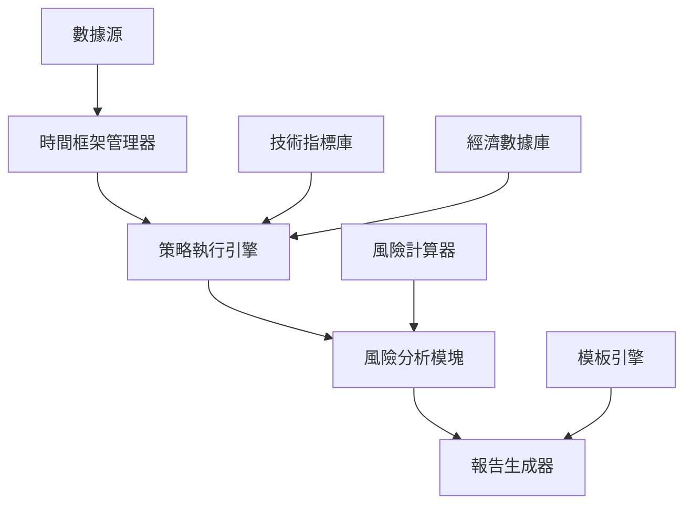

# Epic: CBSC量化交易策略回測系統增強

## 概述

基於現有的CBSC量化交易策略管理系統，增強回測系統功能，從基礎版本升級為專業級量化分析平台。為個人投資者提供機構級的分析工具。

## 問題陳述

現有回測系統已具備基礎功能，但在以下方面有待提升：
1. 僅支持3種基礎策略，無法滿足多樣化需求
2. 風險指標有限，缺少專業級分析工具
3. 無專業報告生成功能，不便於策略評估
4. 不支持多時間框架分析

## 解決方案

### 1. 多時間框架支持 📅
- 實現分鐘、小時、日、週、月級回測
- 自動時間框架對齊機制
- 多時間框架策略組合功能

### 2. 風險分析模塊增強 📊
**新增5種專業風險指標：**
- 卡爾瑪比率（Calmar Ratio）
- 詹森指數（Jensen's Alpha）
- 特雷諾比率（Treynor Ratio）
- 索提諾比率（Sortino Ratio）
- 最大回撤期分析

### 3. 性能報告生成器 📈
- 執行摘要與績效統計
- 風險分析與交易記錄
- 月度表現與資產曲線
- 支持PDF、Excel、HTML多格式輸出

### 4. 策略庫擴展 🧩
**擴展策略至21種：**
- 技術指標策略：11種（MA、RSI、布林帶、MACD、KDJ等）
- 非價格數據策略：7種（HIBOR、GDP、訪客量、PMI等）
- 組合策略：3種（多因子、風險平價、動量均值）

## 技術架構

### 核心組件


### API設計
```
POST /api/backtest/enhanced     # 增強回測
GET  /api/backtest/timeframes   # 時間框架列表
POST /api/backtest/report       # 生成報告
GET  /api/backtest/strategies   # 策略庫
```

## 實施計劃

### Phase 1: 核心增強（2週）
- [x] 分析現有回測系統架構
- [x] 設計增強的回測功能規格
- [ ] 實現TimeframeManager類
- [ ] 添加多時間框架數據重採樣
- [ ] 實現5種新風險指標
- [ ] 優化夏普比率基准對比
- [ ] 添加MA Crossover和RSI策略

**交付物：**
- `src/backtest/timeframe_manager.py`
- `src/backtest/enhanced_risk_metrics.py`
- 更新的回測API端點

### Phase 2: 功能擴展（2週）
- [ ] 實現ReportGenerator類
- [ ] 集成reportlab生成PDF報告
- [ ] 添加剩餘9種技術指標策略
- [ ] 實現7種非價格數據策略
- [ ] 優化前端策略編輯器
- [ ] 添加報告查看組件

**交付物：**
- `src/backtest/report_generator.py`
- `src/strategies/technical_indicators.py`
- `src/strategies/fundamental_strategies.py`
- `frontend/src/components/ReportViewer.vue`

### Phase 3: 高級功能（2週）
- [ ] 實現3種組合策略
- [ ] 添加蒙特卡羅模擬功能
- [ ] 實現壓力測試模塊
- [ ] 性能優化（並行處理）
- [ ] 完善文檔和測試

**交付物：**
- `src/backtest/monte_carlo.py`
- `src/backtest/stress_testing.py`
- `src/strategies/portfolio_strategies.py`
- 性能基準測試報告

## 技術要求

### 依賴項
```python
# 新增依賴
reportlab>=4.0.0      # PDF生成
openpyxl>=3.1.0       # Excel處理
jinja2>=3.1.0         # HTML模板
scipy>=1.10.0         # 統計計算
arch>=6.0.0           # 時間序列分析
```

### 數據庫變更
```sql
-- 新增回測報告表
CREATE TABLE backtest_reports (
    id SERIAL PRIMARY KEY,
    backtest_id INTEGER REFERENCES backtests(id),
    report_type VARCHAR(20) NOT NULL,
    file_path VARCHAR(255),
    generated_at TIMESTAMP DEFAULT NOW()
);

-- 新增時間框架配置表
CREATE TABLE timeframe_configs (
    id SERIAL PRIMARY KEY,
    name VARCHAR(10) UNIQUE NOT NULL,
    seconds INTEGER NOT NULL,
    description TEXT
);
```

## 驗收標準

### 功能指標
- ✅ 支持至少10種時間框架
- ✅ 實現21種交易策略
- ✅ 計算至少8種風險指標
- ✅ 報告生成時間<10秒
- ✅ 支持至少3種輸出格式

### 性能指標
- 回測處理速度提升50%
- 並發處理能力：最多10個回測任務
- 內存使用優化：支持5年歷史數據
- 系統穩定性：99.9%可用性

### 質量指標
- 代碼覆蓋率>90%
- 文檔完整性100%
- 測試通過率100%
- 代碼評分A級以上

## 風險與緩解

### 技術風險
1. **數據處理性能**
   - 風險：大數據量處理可能導致超時
   - 緩解：實現並行處理和數據分片

2. **策略實現複雜度**
   - 風險：部分策略計算複雜
   - 緩解：分階段實施，優先簡單策略

3. **報告生成時間**
   - 風險：PDF生成可能較慢
   - 緩解：異步生成，進度提示

### 業務風險
1. **回測準確性**
   - 風險：新功能可能影響現有準確性
   - 緩解：保留原有邏輯，A/B測試驗證

2. **用戶學習成本**
   - 風險：功能增加導致使用複雜
   - 緩解：提供向導和模板

## 資源需求

### 開發資源
- 后端開發：1人 × 6週
- 前端開發：0.5人 × 4週
- 測試工程師：0.5人 × 6週

### 基礎設施
- 開發環境：現有
- 測試環境：現有
- 額外存儲：50GB（報告存儲）

## 成功標準

1. **功能完整性**
   - 所有設計功能正常運行
   - 21種策略全部可用
   - 報告生成穩定可靠

2. **用戶滿意度**
   - 策略回測時間縮短50%
   - 報告專業度達到機構級
   - 用戶操作便捷性提升

3. **技術指標達成**
   - 所有性能指標達標
   - 系統穩定性滿足要求
   - 代碼質量達到標準

## 後續優化

### 短期（3個月）
- 添加機器學習策略
- 實現實時回測功能
- 優化用戶界面

### 中期（6個月）
- 支持加密貨幣回測
- 實現策略競賽功能
- 添加社交分享

### 長期（1年）
- AI策略推薦
- 雲端回測服務
- API開放平台

## 相關文檔

- [策略回測系統增強方案](../docs/策略回測系統增強方案.md)
- [現有回測系統架構](../docs/回測系統分析.md)
- [API文檔](http://localhost:3004/docs)