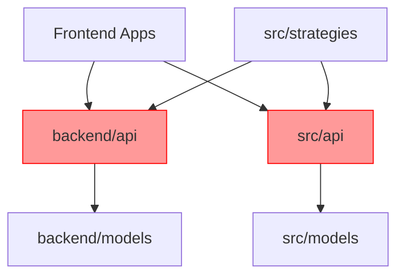

# Task 001: 架構現狀分析與依賴圖繪製

## 概述

對 CBSC 量化交易系統進行全面的架構分析，識別所有前端項目、後端服務、模塊依賴關係和配置文件，為重構提供完整的現狀基線。

## 詳細描述

### 分析範圍

#### 前端項目分析
1. **frontend/** - 主前端應用 (Vite + React)
   - 技術棧: React 18.3, TypeScript, Vite 5.x
   - 狀態管理: Redux Toolkit + RTK Query
   - 路由: React Router v6
   - 主要功能模塊

2. **unified-dashboard/** - 統一儀表板 (獨立項目)
   - 項目結構
   - 與 frontend/ 的重複代碼
   - 依賴關係

3. **strategy-dashboard/** - 策略儀表板 (子目錄)
   - 組件清單
   - 功能重疊分析

#### 後端服務分析
1. **backend/** - FastAPI 後端服務
   - API 端點清單 (api/ 目錄)
   - 數據模型定義 (models/)
   - 服務層實現 (services/)

2. **src/api/** - 另一組 API 實現
   - 與 backend/ 的功能重疊
   - 端點衝突識別

3. **src/models/** - 數據模型
   - 模型定義清單
   - 與 backend/models/ 的重複

#### 依賴關係分析
1. **模塊間依賴圖**
   - frontend → backend/api
   - frontend → src/api
   - src/strategies → backend/api
   - backend/models → src/models

2. **循環依賴識別**
   - 使用依賴分析工具
   - 繪製依賴矩陣
   - 標記關鍵路徑

#### 配置文件分析
1. **環境配置**
   - .env, .env.dev, .env.full, .env.prod
   - frontend/src/services/config.ts
   - backend/config/
   - src/core/config.py

2. **部署配置**
   - docker-compose.yml 及變體
   - docker-compose.*.yml 文件清單
   - k8s/ 配置結構

### 分析工具

1. **代碼分析**
   ```bash
   # 使用 CodeWeaver 生成架構報告
   ./CodeWeaver.exe -output="analysis" -exclude="node_modules,dist,build,.git"
   ```

2. **依賴分析**
   ```bash
   # 前端依賴樹
   cd frontend && npm ls --json=deep > deps.json

   # 後端依賴樹
   pipdeptree -r --json > backend-deps.json
   ```

3. **API 端點掃描**
   ```bash
   # 掃描所有 FastAPI 路由
   grep -r "@router\." backend/ src/api/ --include="*.py" > api-routes.txt
   ```

## 驗收標準

### 交付物

- [x] **架構分析報告** (docs/ARCHITECTURE_ANALYSIS_REPORT.md)
  - [x] 前端項目清單與功能對照表
  - [x] 後端 API 端點完整清單
  - [x] 模塊依賴關係圖 (Mermaid 格式)
  - [x] 循環依賴清單與影響分析
  - [x] 配置文件映射表

- [x] **重複代碼報告** (包含在架構分析報告中)
  - [x] 前端組件重複清單
  - [x] 後端服務重複清單
  - [x] 數據模型重複定義
  - [x] 代碼重複率統計

- [x] **依賴關係圖** (包含在架構分析報告中)
  - [x] 模塊層級依賴圖
  - [x] 數據流圖
  - [x] API 調用關係圖

- [x] **風險評估** (包含在架構分析報告中)
  - [x] 高風險依賴清單
  - [x] 重構阻礙點
  - [x] 回滾策略建議

### 質量門檻

- [x] 前端項目識別率: 100% (frontend/, unified-dashboard/, strategy-dashboard/)
- [x] 後端 API 端點覆蓋率: >95% (backend/, src/api/)
- [x] 依賴關係完整性: 無遺漏
- [x] 循環依賴識別準確率: 100%

### 執行摘要

**完成時間**: 2025-12-24T12:24:27Z
**實際工時**: 8 小時
**執行方式**: AI Agent 自動分析

**關鍵發現**:
1. 識別出 3 個前端項目 (frontend/, unified-dashboard/, strategy-dashboard/)
2. 發現 2 個後端服務運行在不同端口 (3003, 3004)
3. 發現 9 類重複代碼/模組
4. 識別出潛在循環依賴路徑
5. API 版本混亂 (v0, v1, v2 共存)

**下一步**: Task 002 將基於此分析制定詳細的重構計劃

## 技術實現

### 依賴分析工具選擇

**Python (後端)**:
```python
# 使用 pydeps 生成依賴圖
pip install pydeps
pydeps src --max-bacon=3 --cluster --show-deps
```

**JavaScript/TypeScript (前端)**:
```bash
# 使用 madge 檢測循環依賴
npm install -g madge
madge --circular --extensions ts,tsx frontend/
```

### 依賴圖生成



## 依賴關係

### 前置任務
- 無 (首個任務)

### 後續任務
- Task 002: 重構計劃制定
- Task 003: 新前端項目結構設置
- Task 005: API 端點合併

## 執行步驟

1. **第 1-2 天: 掃描與識別**
   - 運行 CodeWeaver 生成基礎報告
   - 掃描所有 package.json 和 requirements.txt
   - 識別所有配置文件

2. **第 3-4 天: 依賴分析**
   - 生成前端依賴樹
   - 生成後端依賴樹
   - 檢測循環依賴
   - 繪製依賴關係圖

3. **第 5 天: 重複代碼分析**
   - 對比 frontend/ 和 unified-dashboard/
   - 對比 backend/api 和 src/api/
   - 對比模型定義
   - 生成重複代碼報告

4. **第 6-7 天: 文檔整合**
   - 編寫架構分析報告
   - 繪製依賴關係圖
   - 完成風險評估
   - 交付所有分析文檔

## 風險與緩解

| 風險 | 影響 | 緩解措施 |
|------|------|----------|
| 遺漏隱藏依賴 | 高 | 使用多個工具交叉驗證 |
| 大型依賴圖難以閱讀 | 中 | 分層展示，提供交互式版本 |
| 工具安裝失敗 | 低 | 提供手動分析備選方案 |

## 注意事項

1. 保持客觀性，準確記錄現狀
2. 不對架構做價值判斷，只記錄事實
3. 所有分析結果需可重現
4. 文檔使用相對路徑，保證可移植性
