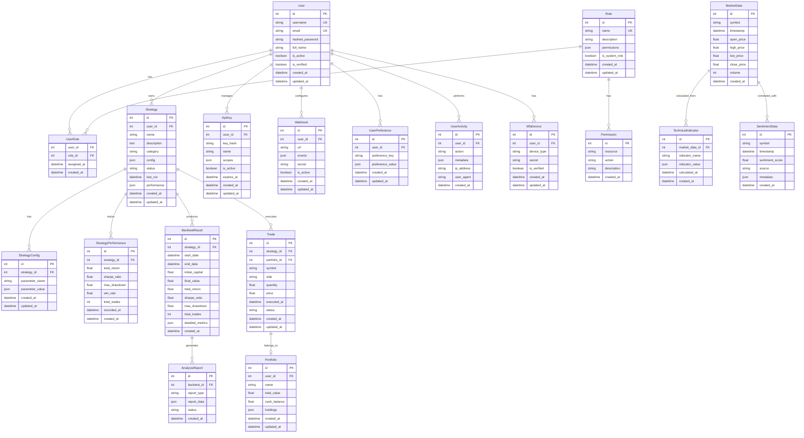

# CBSC System Unified Database Schema Design

## Overview

This document defines the unified database schema for the CBSC quantitative trading system, integrating all data models into a coherent PostgreSQL database structure.

## Entity Relationship Diagram



## Schema Details

### Core Tables

#### 1. Users & Authentication

**users**
```sql
CREATE TABLE users (
    id SERIAL PRIMARY KEY,
    username VARCHAR(50) UNIQUE NOT NULL,
    email VARCHAR(255) UNIQUE NOT NULL,
    hashed_password VARCHAR(255) NOT NULL,
    full_name VARCHAR(100),
    is_active BOOLEAN DEFAULT TRUE NOT NULL,
    is_verified BOOLEAN DEFAULT FALSE NOT NULL,
    created_at TIMESTAMP WITH TIME ZONE DEFAULT NOW() NOT NULL,
    updated_at TIMESTAMP WITH TIME ZONE DEFAULT NOW() NOT NULL
);

CREATE INDEX idx_users_username ON users(username);
CREATE INDEX idx_users_email ON users(email);
CREATE INDEX idx_users_is_active ON users(is_active);
```

**roles**
```sql
CREATE TABLE roles (
    id SERIAL PRIMARY KEY,
    name VARCHAR(50) UNIQUE NOT NULL,
    description TEXT,
    permissions JSON,
    is_system_role BOOLEAN DEFAULT FALSE NOT NULL,
    created_at TIMESTAMP WITH TIME ZONE DEFAULT NOW() NOT NULL,
    updated_at TIMESTAMP WITH TIME ZONE DEFAULT NOW() NOT NULL
);

CREATE INDEX idx_roles_name ON roles(name);
```

**user_roles**
```sql
CREATE TABLE user_roles (
    user_id INTEGER REFERENCES users(id) ON DELETE CASCADE,
    role_id INTEGER REFERENCES roles(id) ON DELETE CASCADE,
    assigned_at TIMESTAMP WITH TIME ZONE DEFAULT NOW() NOT NULL,
    created_at TIMESTAMP WITH TIME ZONE DEFAULT NOW() NOT NULL,
    PRIMARY KEY (user_id, role_id)
);

CREATE INDEX idx_user_roles_user_id ON user_roles(user_id);
CREATE INDEX idx_user_roles_role_id ON user_roles(role_id);
```

**mfa_devices**
```sql
CREATE TABLE mfa_devices (
    id SERIAL PRIMARY KEY,
    user_id INTEGER REFERENCES users(id) ON DELETE CASCADE,
    device_type VARCHAR(50) NOT NULL,
    secret VARCHAR(255) NOT NULL,
    is_verified BOOLEAN DEFAULT FALSE NOT NULL,
    created_at TIMESTAMP WITH TIME ZONE DEFAULT NOW() NOT NULL,
    updated_at TIMESTAMP WITH TIME ZONE DEFAULT NOW() NOT NULL
);

CREATE INDEX idx_mfa_devices_user_id ON mfa_devices(user_id);
```

#### 2. Strategy Management

**strategies**
```sql
CREATE TABLE strategies (
    id SERIAL PRIMARY KEY,
    user_id INTEGER REFERENCES users(id) ON DELETE CASCADE,
    name VARCHAR(255) NOT NULL,
    description TEXT,
    category VARCHAR(50) DEFAULT 'custom' NOT NULL,
    config JSON NOT NULL DEFAULT '{}',
    status VARCHAR(20) DEFAULT 'draft' NOT NULL,
    last_run TIMESTAMP WITH TIME ZONE,
    performance JSON,
    created_at TIMESTAMP WITH TIME ZONE DEFAULT NOW() NOT NULL,
    updated_at TIMESTAMP WITH TIME ZONE DEFAULT NOW() NOT NULL
);

CREATE INDEX idx_strategies_user_id ON strategies(user_id);
CREATE INDEX idx_strategies_status ON strategies(status);
CREATE INDEX idx_strategies_category ON strategies(category);
```

**strategy_configs**
```sql
CREATE TABLE strategy_configs (
    id SERIAL PRIMARY KEY,
    strategy_id INTEGER REFERENCES strategies(id) ON DELETE CASCADE,
    parameter_name VARCHAR(100) NOT NULL,
    parameter_value JSON NOT NULL,
    created_at TIMESTAMP WITH TIME ZONE DEFAULT NOW() NOT NULL,
    updated_at TIMESTAMP WITH TIME ZONE DEFAULT NOW() NOT NULL
);

CREATE INDEX idx_strategy_configs_strategy_id ON strategy_configs(strategy_id);
```

**strategy_performance**
```sql
CREATE TABLE strategy_performance (
    id SERIAL PRIMARY KEY,
    strategy_id INTEGER REFERENCES strategies(id) ON DELETE CASCADE,
    total_return DECIMAL(10, 4),
    sharpe_ratio DECIMAL(10, 4),
    max_drawdown DECIMAL(10, 4),
    win_rate DECIMAL(5, 4),
    total_trades INTEGER DEFAULT 0,
    recorded_at TIMESTAMP WITH TIME ZONE DEFAULT NOW() NOT NULL,
    created_at TIMESTAMP WITH TIME ZONE DEFAULT NOW() NOT NULL
);

CREATE INDEX idx_strategy_performance_strategy_id ON strategy_performance(strategy_id);
CREATE INDEX idx_strategy_performance_recorded_at ON strategy_performance(recorded_at);
```

#### 3. Trading & Portfolio

**trades**
```sql
CREATE TABLE trades (
    id SERIAL PRIMARY KEY,
    strategy_id INTEGER REFERENCES strategies(id) ON DELETE SET NULL,
    portfolio_id INTEGER REFERENCES portfolios(id) ON DELETE CASCADE,
    symbol VARCHAR(20) NOT NULL,
    side VARCHAR(10) NOT NULL,
    quantity DECIMAL(18, 8) NOT NULL,
    price DECIMAL(18, 8) NOT NULL,
    executed_at TIMESTAMP WITH TIME ZONE NOT NULL,
    status VARCHAR(20) DEFAULT 'pending' NOT NULL,
    created_at TIMESTAMP WITH TIME ZONE DEFAULT NOW() NOT NULL,
    updated_at TIMESTAMP WITH TIME ZONE DEFAULT NOW() NOT NULL
);

CREATE INDEX idx_trades_strategy_id ON trades(strategy_id);
CREATE INDEX idx_trades_portfolio_id ON trades(portfolio_id);
CREATE INDEX idx_trades_symbol ON trades(symbol);
CREATE INDEX idx_trades_executed_at ON trades(executed_at);
```

**portfolios**
```sql
CREATE TABLE portfolios (
    id SERIAL PRIMARY KEY,
    user_id INTEGER REFERENCES users(id) ON DELETE CASCADE,
    name VARCHAR(255) NOT NULL,
    total_value DECIMAL(18, 8) DEFAULT 0,
    cash_balance DECIMAL(18, 8) DEFAULT 0,
    holdings JSON DEFAULT '{}',
    created_at TIMESTAMP WITH TIME ZONE DEFAULT NOW() NOT NULL,
    updated_at TIMESTAMP WITH TIME ZONE DEFAULT NOW() NOT NULL
);

CREATE INDEX idx_portfolios_user_id ON portfolios(user_id);
```

#### 4. Market Data

**market_data**
```sql
CREATE TABLE market_data (
    id SERIAL PRIMARY KEY,
    symbol VARCHAR(20) NOT NULL,
    timestamp TIMESTAMP WITH TIME ZONE NOT NULL,
    open_price DECIMAL(18, 8),
    high_price DECIMAL(18, 8),
    low_price DECIMAL(18, 8),
    close_price DECIMAL(18, 8),
    volume BIGINT,
    created_at TIMESTAMP WITH TIME ZONE DEFAULT NOW() NOT NULL
);

CREATE INDEX idx_market_data_symbol ON market_data(symbol);
CREATE INDEX idx_market_data_timestamp ON market_data(timestamp);
CREATE INDEX idx_market_data_symbol_timestamp ON market_data(symbol, timestamp);
```

**technical_indicators**
```sql
CREATE TABLE technical_indicators (
    id SERIAL PRIMARY KEY,
    market_data_id INTEGER REFERENCES market_data(id) ON DELETE CASCADE,
    indicator_name VARCHAR(50) NOT NULL,
    indicator_value JSON NOT NULL,
    calculated_at TIMESTAMP WITH TIME ZONE DEFAULT NOW() NOT NULL,
    created_at TIMESTAMP WITH TIME ZONE DEFAULT NOW() NOT NULL
);

CREATE INDEX idx_technical_indicators_market_data_id ON technical_indicators(market_data_id);
CREATE INDEX idx_technical_indicators_name ON technical_indicators(indicator_name);
```

**sentiment_data**
```sql
CREATE TABLE sentiment_data (
    id SERIAL PRIMARY KEY,
    symbol VARCHAR(20) NOT NULL,
    timestamp TIMESTAMP WITH TIME ZONE NOT NULL,
    sentiment_score DECIMAL(5, 4),
    source VARCHAR(100),
    metadata JSON,
    created_at TIMESTAMP WITH TIME ZONE DEFAULT NOW() NOT NULL
);

CREATE INDEX idx_sentiment_data_symbol ON sentiment_data(symbol);
CREATE INDEX idx_sentiment_data_timestamp ON sentiment_data(timestamp);
```

#### 5. Analytics & Backtesting

**backtest_results**
```sql
CREATE TABLE backtest_results (
    id SERIAL PRIMARY KEY,
    strategy_id INTEGER REFERENCES strategies(id) ON DELETE CASCADE,
    start_date TIMESTAMP WITH TIME ZONE NOT NULL,
    end_date TIMESTAMP WITH TIME ZONE NOT NULL,
    initial_capital DECIMAL(18, 8) NOT NULL,
    final_value DECIMAL(18, 8) NOT NULL,
    total_return DECIMAL(10, 4),
    sharpe_ratio DECIMAL(10, 4),
    max_drawdown DECIMAL(10, 4),
    total_trades INTEGER DEFAULT 0,
    detailed_metrics JSON,
    created_at TIMESTAMP WITH TIME ZONE DEFAULT NOW() NOT NULL
);

CREATE INDEX idx_backtest_results_strategy_id ON backtest_results(strategy_id);
CREATE INDEX idx_backtest_results_start_date ON backtest_results(start_date);
```

**analysis_reports**
```sql
CREATE TABLE analysis_reports (
    id SERIAL PRIMARY KEY,
    backtest_id INTEGER REFERENCES backtest_results(id) ON DELETE CASCADE,
    report_type VARCHAR(50) NOT NULL,
    report_data JSON NOT NULL,
    status VARCHAR(20) DEFAULT 'pending' NOT NULL,
    created_at TIMESTAMP WITH TIME ZONE DEFAULT NOW() NOT NULL
);

CREATE INDEX idx_analysis_reports_backtest_id ON analysis_reports(backtest_id);
```

#### 6. API & Security

**api_keys**
```sql
CREATE TABLE api_keys (
    id SERIAL PRIMARY KEY,
    user_id INTEGER REFERENCES users(id) ON DELETE CASCADE,
    key_hash VARCHAR(255) UNIQUE NOT NULL,
    name VARCHAR(255) NOT NULL,
    scopes JSON DEFAULT '[]',
    is_active BOOLEAN DEFAULT TRUE NOT NULL,
    expires_at TIMESTAMP WITH TIME ZONE,
    created_at TIMESTAMP WITH TIME ZONE DEFAULT NOW() NOT NULL,
    updated_at TIMESTAMP WITH TIME ZONE DEFAULT NOW() NOT NULL
);

CREATE INDEX idx_api_keys_user_id ON api_keys(user_id);
CREATE INDEX idx_api_keys_key_hash ON api_keys(key_hash);
CREATE INDEX idx_api_keys_is_active ON api_keys(is_active);
```

**webhooks**
```sql
CREATE TABLE webhooks (
    id SERIAL PRIMARY KEY,
    user_id INTEGER REFERENCES users(id) ON DELETE CASCADE,
    url TEXT NOT NULL,
    events JSON DEFAULT '[]',
    secret VARCHAR(255),
    is_active BOOLEAN DEFAULT TRUE NOT NULL,
    created_at TIMESTAMP WITH TIME ZONE DEFAULT NOW() NOT NULL,
    updated_at TIMESTAMP WITH TIME ZONE DEFAULT NOW() NOT NULL
);

CREATE INDEX idx_webhooks_user_id ON webhooks(user_id);
CREATE INDEX idx_webhooks_is_active ON webhooks(is_active);
```

#### 7. User Preferences & Activity

**user_preferences**
```sql
CREATE TABLE user_preferences (
    id SERIAL PRIMARY KEY,
    user_id INTEGER REFERENCES users(id) ON DELETE CASCADE,
    preference_key VARCHAR(100) NOT NULL,
    preference_value JSON NOT NULL,
    created_at TIMESTAMP WITH TIME ZONE DEFAULT NOW() NOT NULL,
    updated_at TIMESTAMP WITH TIME ZONE DEFAULT NOW() NOT NULL,
    UNIQUE(user_id, preference_key)
);

CREATE INDEX idx_user_preferences_user_id ON user_preferences(user_id);
```

**user_activities**
```sql
CREATE TABLE user_activities (
    id SERIAL PRIMARY KEY,
    user_id INTEGER REFERENCES users(id) ON DELETE CASCADE,
    action VARCHAR(100) NOT NULL,
    metadata JSON,
    ip_address INET,
    user_agent TEXT,
    created_at TIMESTAMP WITH TIME ZONE DEFAULT NOW() NOT NULL
);

CREATE INDEX idx_user_activities_user_id ON user_activities(user_id);
CREATE INDEX idx_user_activities_action ON user_activities(action);
CREATE INDEX idx_user_activities_created_at ON user_activities(created_at);
```

## Data Integrity

### Foreign Key Constraints
All foreign keys have appropriate ON DELETE clauses:
- CASCADE: Automatically delete dependent records
- SET NULL: Set foreign key to NULL (for trades when strategy is deleted)

### Indexes
Indexes are created on:
- Primary keys (automatic)
- Foreign keys (for JOIN performance)
- Frequently queried columns (username, email, status, timestamps)
- Composite indexes for common query patterns (symbol + timestamp)

### JSON Fields
JSON fields are used for:
- Flexible configuration storage (strategy config, permissions)
- Dynamic metadata (sentiment metadata, detailed metrics)
- Array-like data (holdings, scopes, events)

## Migration Strategy

### Phase 1: Create Base Tables
```sql
-- Execute in order:
1. users, roles, permissions
2. user_roles, mfa_devices
3. strategies, strategy_configs, strategy_performance
4. portfolios, trades
5. market_data, technical_indicators, sentiment_data
6. backtest_results, analysis_reports
7. api_keys, webhooks
8. user_preferences, user_activities
```

### Phase 2: Migrate Existing Data
- Export existing file-based data to CSV/JSON
- Transform and load into PostgreSQL
- Validate data integrity
- Create backup before migration

### Phase 3: Update Application
- Switch from file storage to database queries
- Update SQLAlchemy models
- Add Alembic migrations for schema changes

## Performance Considerations

### Partitioning
Consider partitioning large tables:
- market_data by symbol or date range
- user_activities by created_at (monthly partitions)

### Archiving
Implement archival strategy:
- Move old market_data to archive tables
- Archive completed backtest_results after 6 months
- Keep user_activities for 1 year

### Connection Pooling
Configure SQLAlchemy connection pool:
```python
engine = create_async_engine(
    DATABASE_URL,
    pool_size=20,
    max_overflow=10,
    pool_pre_ping=True,
    echo=False
)
```

## Security

### Data Encryption
- Hash passwords using Argon2id
- Encrypt sensitive data in JSON fields (API keys secrets)
- Use SSL/TLS for database connections

### Row-Level Security
Consider PostgreSQL RLS for:
- Multi-tenant data isolation
- User-specific data access control
- Audit trail requirements

---
*Document Version: 1.0*
*Created: 2025-12-25*
*Author: CBSC System Unification Team*
