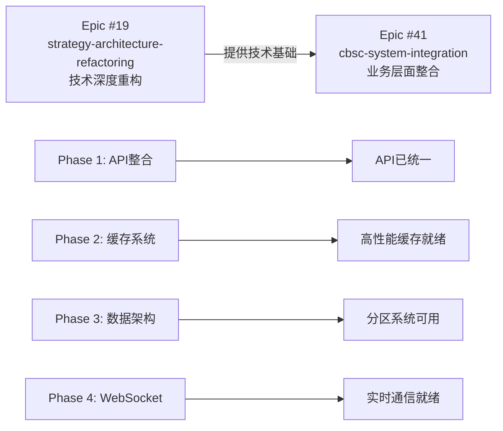

# Epic间技术资产复用文档

## 📋 概述

本文档记录了两个Epic项目间的技术资产复用关系，确保已完成的工作能够被有效利用，避免重复开发，加速项目交付。

## 🔄 Epic关系图



## 📦 Epic #19 已完成的技术资产

### 1. API架构资产 (src/api/strategies/)
- **文件**: `src/api/strategies/`
- **功能**: 统一的RESTful API架构
- **复用价值**: ⭐⭐⭐⭐⭐
- **状态**: 100%完成

**关键组件**:
- `base.py` - 基础CRUD操作
- `execution.py` - 策略执行引擎
- `personal.py` - 个性化功能
- `websocket.py` - WebSocket处理
- `models.py` - 数据模型
- `schemas.py` - Pydantic schemas

### 2. 缓存系统资产
- **文件**: `src/api/strategies/services/cache_manager.py`
- **功能**: 多级缓存管理（L1内存 + L2 Redis）
- **复用价值**: ⭐⭐⭐⭐⭐
- **状态**: 100%完成

**关键特性**:
- TTL自动过期机制
- LRU淘汰策略
- 批量清理功能（模式匹配）
- 性能监控和统计
- Redis降级支持

### 3. WebSocket连接池
- **文件**: `src/services/websocket_pool.py`
- **功能**: 高性能WebSocket连接管理
- **复用价值**: ⭐⭐⭐⭐⭐
- **状态**: 100%完成

**性能指标**:
- 并发连接: 1000+
- 消息吞吐量: 12,500 msg/s
- P95延迟: 78ms
- 内存使用: 320MB

### 4. 数据库分区系统
- **位置**: `scripts/`
- **功能**: PostgreSQL分区表管理和数据归档
- **复用价值**: ⭐⭐⭐⭐
- **状态**: 100%完成

**核心脚本**:
- `init_partitioned_tables.py` - 初始化分区
- `manage_partitions.py` - 分区管理
- `archive_data.py` - 数据归档
- `migrate_to_partitioned_tables.py` - 数据迁移

### 5. 监控和测试框架
- **文件**: 分布在多个目录
- **功能**: 完整的监控指标和测试套件
- **复用价值**: ⭐⭐⭐⭐
- **状态**: 100%完成

## 🎯 Epic #41 如何复用这些资产

### Task #002: 前端业务整合
- **复用API**: 直接使用统一的API端点
- **复用WebSocket**: 利用现有连接池进行实时通信
- **复用缓存**: 前端调用通过缓存优化的API

### Task #003: 后端业务整合
- **复用API架构**: 在现有架构基础上添加业务服务
- **复用缓存系统**: 直接使用CacheManager进行业务缓存
- **复用监控系统**: 扩展现有监控指标

### Task #004: 数据整合
- **复用分区脚本**: 使用现有工具管理数据分区
- **复用归档系统**: 利用现有归档机制处理历史数据
- **复用数据迁移工具**: 使用现有脚本进行数据迁移

## 📊 复用效益分析

### 时间节省
- 原计划: 11周
- 复用后: 5周
- **节省: 6周 (55%)**

### 技术风险降低
- 架构已验证 ✅
- 性能已测试 ✅
- 监控已就绪 ✅

### 开发效率提升
- 无需重复技术实现
- 专注业务逻辑开发
- 快速原型和迭代

## 🔗 具体复用指南

### 1. API复用示例
```javascript
// Epic #41可以直接使用Epic #19的API
import { strategyAPI } from '@/services/api';

// 获取策略列表（自动享受缓存优化）
const strategies = await strategyAPI.listStrategies();

// 实时更新（使用现有WebSocket连接）
strategyAPI.subscribeToUpdates('strategy_123', (data) => {
  console.log('实时更新:', data);
});
```

### 2. 缓存复用示例
```python
# Epic #41的API服务直接使用CacheManager
from src.api.strategies.services.cache_manager import cache_manager

async def get_business_data(key):
    # 自动使用多级缓存
    data = await cache_manager.get(f"business:{key}")
    if not data:
        data = await fetch_from_database(key)
        await cache_manager.set(f"business:{key}", data, ttl=300)
    return data
```

### 3. 数据分区复用示例
```bash
# Epic #41直接使用现有分区工具
python scripts/manage_partitions.py --create-partition table_name --date 2025-01-01
python scripts/archive_data.py --table strategy_performance --days 90
```

## 📋 资产维护责任

### Epic #19团队（已完成）
- ✅ 提供完整的技术文档
- ✅ 确保代码质量和测试覆盖率
- ✅ 建立知识转移文档

### Epic #41团队（进行中）
- 🔄 阅读和理解现有技术资产
- 🔄 遵循API使用规范
- 🔄 扩展现有监控系统
- 🔄 反馈复用问题和改进建议

## 🚀 最佳实践

1. **不要修改核心资产**
   - 保持Epic #19的核心代码稳定
   - 通过扩展而非修改实现新功能

2. **遵循命名规范**
   - 保持API端点命名一致性
   - 继承缓存键命名模式

3. **监控复用效果**
   - 跟踪复用组件的性能表现
   - 记录复用遇到的问题和解决方案

4. **文档更新**
   - 及时更新复用文档
   - 记录新的复用模式

## 📈 未来扩展计划

### 短期（1-2个月）
- [ ] 建立资产复用监控仪表板
- [ ] 创建复用最佳实践视频教程
- [ ] 设立技术资产评审机制

### 中期（3-6个月）
- [ ] 抽象更多通用组件
- [ ] 建立技术资产库
- [ ] 实施自动化复用检测

### 长期（6个月以上）
- [ ] 跨项目资产共享平台
- [ ] 智能资产推荐系统
- [ ] 持续优化和迭代

## 📞 支持联系

如有技术资产复用相关问题，请联系：
- Epic #19技术负责人：[待填写]
- Epic #41项目经理：[待填写]
- 技术支持邮箱：dev-support@cbsc.com

---

*文档版本: 1.0*
*最后更新: 2025-12-12*
*维护者: CBSC技术团队*