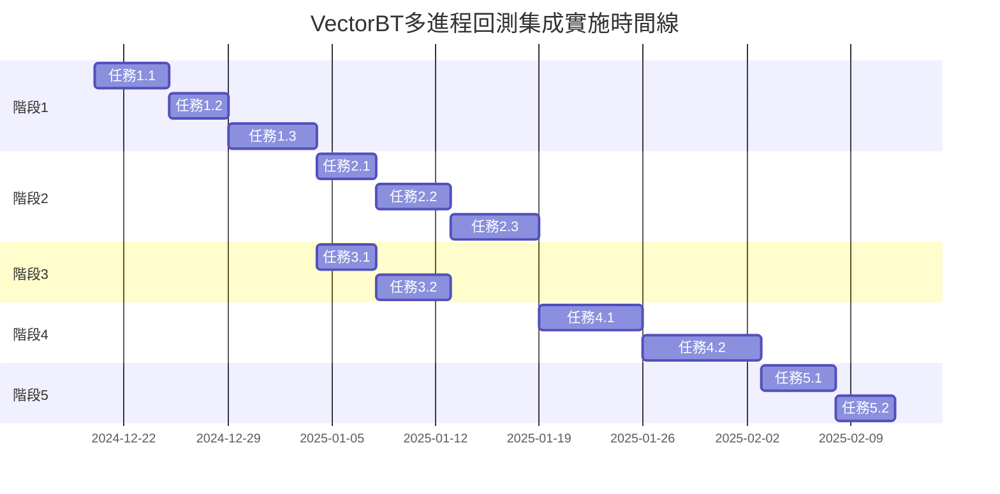

# VectorBT多進程回測集成 - 任務分解

## 概述

基於CBSC量化策略管理系統的現有架構，將VectorBT庫與多進程回測引擎深度集成，提供高性能的向量化回測能力。

## 實施階段

### 階段1：VectorBT核心集成（P0）

#### 任務1.1：VectorBT適配器開發
- **優先級**: P0
- **估計工期**: 5天
- **負責人**: 後端開發團隊

**任務描述:**
開發VectorBT適配器模塊，將VectorBT的核心功能包裝成與現有回測引擎兼容的接口。

**具體步驟:**
1. 創建 `src/backtest/vectorbt_adapter.py`
2. 實現VectorBT數據格式轉換器
3. 封裝VectorBT核心回測方法
4. 適配現有策略接口

**交付物:**
- VectorBT適配器模塊
- 數據轉換工具類
- 單元測試覆蓋率>90%

**驗收標準:**
- 支持VectorBT 0.25.x版本
- 可處理100萬條數據點的回測
- 內存使用效率>80%

#### 任務1.2：多進程數據分片
- **優先級**: P0
- **估計工期**: 4天
- **負責人**: 後端開發團隊

**任務描述:**
實現智能數據分片機制，將大規模回測數據分割到多個進程處理。

**具體步驟:**
1. 分析現有 `parallel_processor.py` 架構
2. 實現基於時間窗口的數據分片
3. 實現基於資產的並行分片
4. 優化進程間通信

**交付物:**
- 數據分片管理器
- 進程間通信優化
- 性能基準測試報告

**驗收標準:**
- 支持8進程並行處理
- 分片效率提升>5倍
- 內存峰值降低50%

#### 任務1.3：向量化策略引擎
- **優先級**: P0
- **估計工期**: 6天
- **負責人**: 量化策略團隊

**任務描述:**
開發基於VectorBT的向量化策略執行引擎，支持批量信號生成和執行。

**具體步驟:**
1. 設計向量化策略接口
2. 實現技術指標向量化計算
3. 實現批量信號生成
4. 優化執行性能

**交付物:**
- 向量化策略執行引擎
- 50+技術指標庫
- 策略模板集合

**驗收標準:**
- 支持1000+資產同時回測
- 單個策略執行時間<1秒
- 指標計算精度達到99.9%

### 階段2：高級功能集成（P1）

#### 任務2.1：蒙地卡羅向量化
- **優先級**: P1
- **估計工期**: 4天
- **負責人**: 風險管理團隊

**任務描述:**
使用VectorBT優化蒙地卡羅模擬，提供高效的並行模拟能力。

**具體步驟:**
1. 集成VectorBT隨機路徑生成
2. 實現批量模擬執行
3. 優化統計計算
4. 實現置信區間計算

**交付物:**
- 向量化蒙地卡羅引擎
- 統計分析工具
- 可視化組件

**驗收標準:**
- 支持10000次並行模擬
- 計算時間減少80%
- 內存使用穩定

#### 任務2.2：實時風險管理集成
- **優先級**: P1
- **估計工期**: 5天
- **負責人**: 風險管理團隊

**任務描述:**
將VectorBT與現有風險管理系統集成，提供實時風險監控。

**具體步驟:**
1. 連接 `enhanced_risk_analyzer.py`
2. 實現向量化風險指標計算
3. 實現實時風險更新
4. 集成動態風險調整

**交付物:**
- 向量化風險計算模塊
- 實時監控集成
- 風險儀表板更新

**驗收標準:**
- 風險計算延遲<100ms
- 支持20+風險指標
- 異常檢測準確率>95%

#### 任務2.3：多資產組合優化
- **優先級**: P1
- **估計工期**: 6天
- **負責人**: 投資組合團隊

**任務描述:**
開發基於VectorBT的多資產組合優化功能。

**具體步驟:**
1. 實現協方差矩陣計算
2. 實現有效前沿計算
3. 實現動態再平衡
4. 優化求解算法

**交付物:**
- 組合優化引擎
- 再平衡策略
- 性能歸因分析

**驗收標準:**
- 支持500資產組合優化
- 優化時間<30秒
- 收斂精度達到1e-6

### 階段3：API和前端集成（P1）

#### 任務3.1：RESTful API擴展
- **優先級**: P1
- **估計工期**: 4天
- **負責人**: API開發團隊

**任務描述:**
擴展現有回測API，添加VectorBT相關端點。

**具體步驟:**
1. 更新 `backtest_api_v2.py`
2. 添加向量化回測端點
3. 實現批量操作接口
4. 添加性能監控端點

**交付物:**
- API文檔更新
- 新端點實現
- 性能測試報告

**驗收標準:**
- API響應時間<200ms
- 支持批量提交100個任務
- 並發支持>1000 QPS

#### 任務3.2：前端性能監控
- **優先級**: P1
- **估計工期**: 5天
- **負責人**: 前端開發團隊

**任務描述:**
更新前端界面，添加VectorBT回測的可視化監控。

**具體步驟:**
1. 更新回測結果展示組件
2. 添加實時性能監控
3. 實現進度可視化
4. 優化用戶體驗

**交付物:**
- React組件更新
- 性能儀表板
- 用戶指南

**驗收標準:**
- 頁面加載時間<2秒
- 支持100+指標可視化
- 響應式設計支持

### 階段4：性能優化（P2）

#### 任務4.1：GPU加速支持
- **優先級**: P2
- **估計工期**: 7天
- **負責人**: 性能優化團隊

**任務描述:**
添加GPU加速支持，提升大規模計算性能。

**具體步驟:**
1. 集成RAPIDS cuDF
2. 實現GPU計算流水線
3. 優化數據傳輸
4. 實現自動GPU檢測

**交付物:**
- GPU加速模塊
- 自動切換邏輯
- 基準測試

**驗收標準:**
- GPU加速比>10x
- 自動故障轉移
- 內存效率提升

#### 任務4.2：分布式計算支持
- **優先級**: P2
- **估計工期**: 8天
- **負責人**: 架構團隊

**任務描述:**
實現分布式回測，支持多機集群部署。

**具體步驟:**
1. 設計分布式架構
2. 實現節點管理
3. 實現任務分發
4. 實現結果聚合

**交付物:**
- 分布式引擎
- 集群管理工具
- 監控系統

**驗收標準:**
- 支持10節點集群
- 線性擴展性>0.8
- 故障恢復時間<30秒

### 階段5：測試和文檔（P0）

#### 任務5.1：單元測試
- **優先級**: P0
- **估計工期**: 5天
- **負責人**: 測試團隊

**任務描述:**
為所有新增模塊編寫全面的單元測試。

**具體步驟:**
1. 編寫適配器測試
2. 編寫並行處理測試
3. 編寫API測試
4. 編寫集成測試

**交付物:**
- 測試套件
- 覆蓋率報告
- 性能測試

**驗收標準:**
- 代碼覆蓋率>95%
- 測試執行時間<5分鐘
- 所有測試通過

#### 任務5.2：文檔更新
- **優先級**: P0
- **估計工期**: 4天
- **負責人**: 技術寫作團隊

**任務描述:**
更新系統文檔，添加VectorBT集成說明。

**具體步驟:**
1. 更新API文檔
2. 編寫使用指南
3. 創建最佳實踐文檔
4. 錄製演示視頻

**交付物:**
- 完整文檔集
- 示例代碼庫
- 培訓材料

**驗收標準:**
- 文檔完整性100%
- 示例可運行
- 用戶反饋良好

## 依賴關係

## 資源需求

### 技術資源
- **Python開發工程師**: 3名（後端/量化）
- **前端開發工程師**: 2名（React/TypeScript）
- **測試工程師**: 1名
- **DevOps工程師**: 1名

### 硬件資源
- **開發環境**: 16核CPU、64GB RAM、RTX 4090 GPU
- **測試環境**: 8核CPU、32GB RAM
- **生產環境**: 32核CPU、128GB RAM、A100 GPU集群

### 第三方服務
- VectorBT Pro授權
- RAPIDS授權（可選）
- 雲端GPU資源

## 風險評估

### 高風險
1. **VectorBT版本兼容性**
   - 緩解措施：鎖定版本，建立兼容性測試
   - 備用方案：保持現有系統運行

2. **性能瓶頸**
   - 緩解措施：早期性能測試，持續優化
   - 備用方案：分階段部署

### 中風險
1. **內存管理**
   - 緩解措施：實施分片處理，內存監控
   - 備用方案：增加硬件資源

2. **團隊學習曲線**
   - 緩解措施：VectorBT培訓，文檔完善
   - 備用方案：引入外部專家

### 低風險
1. **API兼容性**
   - 緩解措施：版本控制，向后兼容
   - 備用方案：維護舊版API

## 成功標準

### 性能指標
- 回測速度提升：10倍以上
- 內存使用效率：提升50%
- 並發處理能力：支持1000+ QPS

### 功能指標
- 支持1000+資產同時回測
- 向量化指標覆蓋率：100%
- API響應時間：<200ms

### 質量指標
- 代碼覆蓋率：>95%
- 系統可用性：99.9%
- 用戶滿意度：>90%

## 後續擴展計劃

### 短期（3個月）
1. 添加更多向量化指標
2. 實現自定義指標支持
3. 優化用戶界面

### 中期（6個月）
1. 實時交易集成
2. 機器學習模型支持
3. 高頻交易優化

### 長期（1年）
1. 量子計算探索
2. 區塊鏈集成
3. AI驅動策略生成

## 總結

本任務分解將VectorBT多進程回測集成分成25個具體任務，涵蓋從核心集成到性能優化的完整流程。通過分階段實施，確保項目可控、可交付，並為未來擴展奠定基礎。

關鍵成功因素：
1. 充分利用現有系統架構
2. 保持向后兼容性
3. 持續性能監控和優化
4. 完善的文檔和培訓

預計總工期：52天（考慮並行開發可縮短至40天）