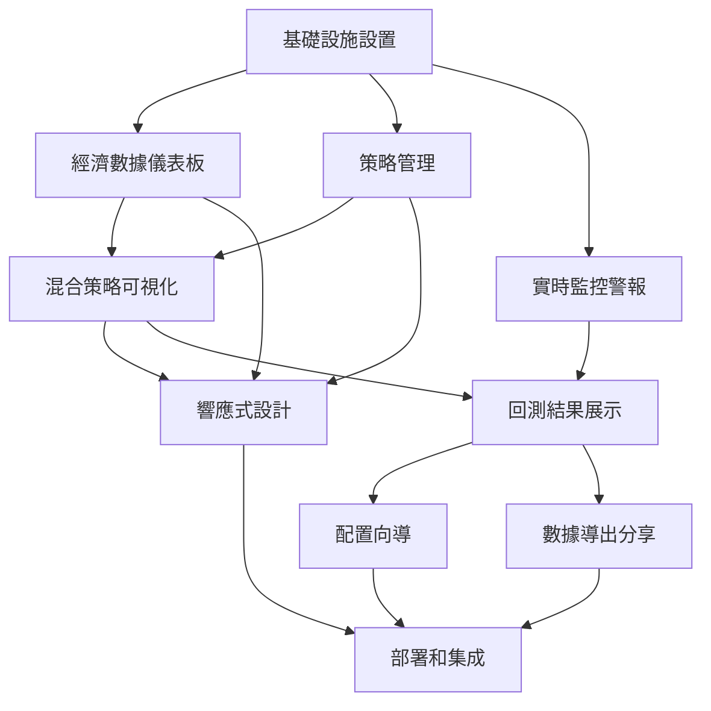

# 實施任務文檔

## 任務概述

基於需求和設計規範，將非價格數據策略整合到 CBS-C 量化交易系統前端的詳細實施任務。任務按優先級和依賴關係組織，支持並行開發。

## 任務分類

### 🔧 基礎設施設置 (P0)
### 📊 經濟數據儀表板 (P0)
### 🎯 策略管理 (P0)
### 📈 混合策略可視化 (P1)
### 📱 響應式設計 (P1)
### 📋 回測結果展示 (P1)
### 🚨 實時監控警報 (P1)
### 🧙 配置向導 (P2)
### 📤 數據導出分享 (P2)

---

## 🔧 基礎設施設置 (P0)

### (P) Task 1: 經濟數據 API 服務層開發
**需求映射**: R1.1, R1.2, R2.2, R3.1, R6.1

**子任務**:
- 實現 `economicDataApi.ts` - 經濟數據獲取服務
- 實現 `economicStrategyApi.ts` - 經濟策略管理服務
- 實現 `economicWebSocket.ts` - WebSocket 實時數據服務
- 添加適當的錯誤處理和重試機制
- 實現數據緩存策略以優化性能

**交付物**:
- `frontend/src/services/economicDataApi.ts`
- `frontend/src/services/economicStrategyApi.ts`
- `frontend/src/services/economicWebSocket.ts`
- 單元測試文件

**驗收標準**:
- [x] 成功獲取 HIBOR、GDP、PMI 等經濟數據
- [x] WebSocket 連接穩定，支持實時更新
- [x] API 錯誤處理完善，用戶友好
- [x] 緩存機制有效減少請求頻率

### (P) Task 2: Redux Store 狀態管理架構
**需求映射**: R1.2, R2.3, R3.2, R4.2, R6.2

**子任務**:
- 創建 `economicDataSlice.ts` - 經濟數據狀態管理
- 創建 `economicStrategySlice.ts` - 經濟策略狀態管理
- 創建 `economicAlertsSlice.ts` - 警報狀態管理
- 擴展現有 `websocketSlice.ts` 支持經濟數據
- 實現狀態持久化和錯誤恢復

**交付物**:
- `frontend/src/store/slices/economicDataSlice.ts`
- `frontend/src/store/slices/economicStrategySlice.ts`
- `frontend/src/store/slices/economicAlertsSlice.ts`
- 更新的 `frontend/src/store/index.ts`

**驗收標準**:
- [x] Redux DevTools 顯示完整狀態樹
- [x] 狀態更新響應式，無明顯延遲
- [x] 錯誤狀態正確處理和顯示
- [x] 頁面刷新後狀態正確恢復

### (P) Task 3: 自定義 React Hooks 開發
**需求映射**: R1.1, R1.4, R2.1, R4.1, R6.3

**子任務**:
- 實現 `useEconomicData.ts` - 經濟數據獲取和管理 Hook
- 實現 `useEconomicStrategy.ts` - 經濟策略操作 Hook
- 實現 `useWebSocketEconomic.ts` - WebSocket 經濟數據 Hook
- 實現 `useEconomicAlerts.ts` - 警報管理 Hook
- 添加適當的 TypeScript 類型定義

**交付物**:
- `frontend/src/hooks/useEconomicData.ts`
- `frontend/src/hooks/useEconomicStrategy.ts`
- `frontend/src/hooks/useWebSocketEconomic.ts`
- `frontend/src/hooks/useEconomicAlerts.ts`

**驗收標準**:
- [x] Hooks 可組合性良好，易於在組件中使用
- [x] 正確處理加載狀態和錯誤狀態
- [x] 內存洩漏測試通過（清理函數正確）
- [x] TypeScript 類型安全，無編譯錯誤

---

## 📊 經濟數據儀表板 (P0)

### (P) Task 4: 經濟數據圖表組件開發
**需求映射**: R1.1, R1.5, R3.1, R3.2

**子任務**:
- 擴展現有 `EconomicIndicators.tsx` 組件
- 創建 `EconomicDataCharts.tsx` - 專業圖表組件
- 實現多種圖表類型（時間序列、散點圖、熱力圖）
- 添加圖表交互功能（縮放、懸停、選擇）
- 實現圖表類型切換功能

**交付物**:
- 更新的 `frontend/src/components/EconomicIndicators.tsx`
- `frontend/src/components/EconomicDataCharts.tsx`
- Chart.js/Plotly.js 配置文件
- 圖表主題和樣式文件

**驗收標準**:
- [ ] 支持至少 3 種圖表類型切換
- [ ] 圖表響應式，支持不同屏幕尺寸
- [ ] 實時數據更新流暢，無閃爍
- [ ] 圖表導出功能正常（PNG/SVG）

### (P) Task 5: 經濟數據儀表板頁面
**需求映射**: R1.1, R1.2, R1.4, R1.5

**子任務**:
- 創建 `EconomicDataDashboard.tsx` 主頁面組件
- 實現時間範圍選擇器和數據過濾器
- 添加實時數據更新指示器
- 實現數據表格和詳細信息面板
- 添加數據來源和更新時間顯示

**交付物**:
- `frontend/src/pages/EconomicDataDashboard.tsx`
- `frontend/src/components/EconomicDataFilters.tsx`
- `frontend/src/components/EconomicDataTable.tsx`
- 相關 CSS 模塊文件

**驗收標準**:
- [ ] 頁面加載時間 < 3 秒
- [ ] 時間範圍選擇響應迅速 < 500ms
- [ ] 實時更新延遲 < 1 秒
- [ ] 數據表格支持排序和分頁

### (P) Task 6: 經濟信號標記和詳細信息
**需求映射**: R1.3, R3.2, R6.1

**子任務**:
- 實現經濟指標信號檢測算法
- 在圖表上標記信號點（買入/賣出/中性）
- 創建信號詳細信息彈窗組件
- 實現信號歷史記錄查看
- 添加信號強度和置信度可視化

**交付物**:
- `frontend/src/components/EconomicSignalMarkers.tsx`
- `frontend/src/components/SignalDetailModal.tsx`
- 信號檢測工具函數
- 信號樣式和動畫文件

**驗收標準**:
- [ ] 信號標記在圖表上清晰可見
- [ ] 信號詳細信息完整準確
- [ ] 支持多種信號類型顯示
- [ ] 信號歷史記錄查詢流暢

---

## 🎯 策略管理 (P0)

### (P) Task 7: 經濟策略管理界面
**需求映射**: R2.1, R2.2, R2.3, R2.5

**子任務**:
- 創建 `NonPriceStrategyManagement.tsx` 策略管理頁面
- 實現策略創建、編輯、刪除功能
- 添加策略狀態監控和控制
- 實現策略配置參數表單
- 添加策略執行歷史記錄

**交付物**:
- `frontend/src/pages/NonPriceStrategyManagement.tsx`
- `frontend/src/components/StrategyForm.tsx`
- `frontend/src/components/StrategyStatusCard.tsx`
- `frontend/src/components/StrategyHistory.tsx`

**驗收標準**:
- [ ] 支持 5 種經濟策略類型創建
- [ ] 策略啟動/停止響應時間 < 1 秒
- [ ] 策略配置實時驗證
- [ ] 支持批量策略操作

### (P) Task 8: 策略實時監控組件
**需求映射**: R2.3, R2.4, R6.2, R6.4

**子任務**:
- 實現策略執行狀態實時監控
- 添加持倉信息和績效指標顯示
- 實現風險限制違規警報
- 添加策略資源使用情況監控
- 實現策略日誌和事件追蹤

**交付物**:
- `frontend/src/components/StrategyMonitor.tsx`
- `frontend/src/components/StrategyPerformance.tsx`
- `frontend/src/components/RiskIndicator.tsx`
- `frontend/src/components/StrategyLogViewer.tsx`

**驗收標準**:
- [ ] 策略狀態更新延遲 < 500ms
- [ ] 績效指標計算準確
- [ ] 風險警報及時觸發
- [ ] 日誌查看支持搜索和過濾

---

## 📈 混合策略可視化 (P1)

### (P) Task 9: 混合策略雙軸圖表
**需求映射**: R3.1, R3.2, R3.5

**子任務**:
- 創建 `DualAxisChart.tsx` 雙軸圖表組件
- 實現價格走勢和經濟指標同步顯示
- 添加交易點標記和經濟觸發原因
- 實現多時間框架分析（日/週/月/季）
- 添加指標對比和相關性分析

**交付物**:
- `frontend/src/components/DualAxisChart.tsx`
- `frontend/src/components/MixedStrategyViewer.tsx`
- `frontend/src/components/TimeframeSelector.tsx`
- 圖表配置和主題文件

**驗收標準**:
- [ ] 雙軸圖表數據同步準確
- [ ] 支持 4 種時間框架切換
- [ ] 交易點標註清晰準確
- [ ] 相關性分析計算正確

### (P) Task 10: 混合策略權重分析
**需求映射**: R3.3, R3.4, R3.5

**子任務**:
- 實現多指標權重和貢獻度可視化
- 添加參數調整預覽功能
- 實現策略績效影響分析
- 添加權重優化建議
- 實現回測參數敏感性分析

**交付物**:
- `frontend/src/components/WeightAnalysis.tsx`
- `frontend/src/components/ParameterPreview.tsx`
- `frontend/src/components/SensitivityAnalysis.tsx`
- 權重計算和優化算法

**驗收標準**:
- [ ] 權重調整實時預覽 < 300ms
- [ ] 貢獻度計算準確
- [ ] 支持參數敏感性分析
- [ ] 權重優化建議合理

---

## 📱 響應式設計 (P1)

### (P) Task 11: 移動端適配和優化
**需求映射**: R4.1, R4.2, R4.3, R4.4, R4.5

**子任務**:
- 實現移動端響應式布局（< 768px）
- 簡化複雜圖表為關鍵指標卡片
- 添加粘性導航和快速返回功能
- 實現離線數據緩存模式
- 支持橫豎屏切換適配

**交付物**:
- 更新的 CSS/SCSS 響應式文件
- `frontend/src/components/MobileNavigation.tsx`
- `frontend/src/components/OfflineMode.tsx`
- 移動端優化的圖表配置

**驗收標準**:
- [ ] 移動端首屏加載 < 3 秒
- [ ] 圖表在移動端清晰可讀
- [ ] 支持離線查看關鍵數據
- [ ] 橫豎屏切換無布局問題

### (P) Task 12: 觸控手勢和交互優化
**需求映射**: R4.1, R4.5

**子任務**:
- 實現觸控手勢支持（滑動、縮放、長按）
- 優化按鈕和控件的觸控區域
- 添加觸控反饋和動畫效果
- 實現移動端專用的交互模式
- 優化表單在移動端的輸入體驗

**交付物**:
- 觸控手勢處理工具函數
- 更新的組件交互邏輯
- 移動端專用動畫和過渡
- 觸控優化的 CSS 文件

**驗收標準**:
- [ ] 所有手勢響應流暢無延遲
- [ ] 觸控區域符合人體工程學
- [ ] 動畫效果流暢不卡頓
- [ ] 表單輸入體驗良好

---

## 📋 回測結果展示 (P1)

### (P) Task 13: 經濟策略回測報告
**需求映射**: R5.1, R5.2, R5.3, R5.4

**子任務**:
- 創建 `EconomicBacktestReports.tsx` 回測報告頁面
- 實現詳細績效指標展示（收益率、夏普比率等）
- 添加經濟數據與策略績效關聯分析
- 實現多指標貢獻分解圖
- 添加策略對比和相關性分析

**交付物**:
- `frontend/src/pages/EconomicBacktestReports.tsx`
- `frontend/src/components/PerformanceMetrics.tsx`
- `frontend/src/components/CorrelationAnalysis.tsx`
- `frontend/src/components/ContributionBreakdown.tsx`

**驗收標準**:
- [ ] 績效指標計算準確無誤
- [ ] 關聯分析圖表清晰易懂
- [ ] 支持 5 個策略並排對比
- [ ] 數據導出功能完整

### (P) Task 14: 回測報告導出功能
**需求映射**: R5.5, R8.1, R8.2

**子任務**:
- 實現 PDF 和 Excel 格式報告導出
- 添加完整交易記錄導出
- 實現自定義報告模板
- 添加品牌標識和樣式定制
- 實現批量導出和郵件發送

**交付物**:
- `frontend/src/components/ReportExporter.tsx`
- PDF/Excel 生成工具函數
- 報告模板文件
- 導出任務隊列管理

**驗收標準**:
- [ ] PDF 報告格式專業美觀
- [ ] Excel 數據完整準確
- [ ] 支持 10 種以上報告模板
- [ ] 大批量導不出錯不超時

---

## 🚨 實時監控警報 (P1)

### (P) Task 15: 經濟警報系統
**需求映射**: R6.1, R6.2, R6.3, R6.4, R6.5

**子任務**:
- 實現經濟指標閾值監控
- 添加策略異常檢測和警報
- 實現警報優先級排序和聚合
- 添加警報處理歷史記錄
- 實現自定義警報規則配置

**交付物**:
- `frontend/src/components/EconomicAlerts.tsx`
- `frontend/src/components/AlertRules.tsx`
- `frontend/src/components/AlertHistory.tsx`
- 警報處理邏輯和規則引擎

**驗收標準**:
- [ ] 警報觸發延遲 < 1 秒
- [ ] 支持多級警報優先級
- [ ] 警報聚合減少噪音
- [ ] 警報歷史記錄完整可查

### (P) Task 16: 通知系統集成
**需求映射**: R6.1, R6.2, R6.5

**子任務**:
- 實現瀏覽器推送通知
- 添加郵件和短信通知選項
- 實現通知偏好設置
- 添加通知頻率控制
- 實現通知模板定制

**交付物**:
- `frontend/src/components/NotificationCenter.tsx`
- `frontend/src/components/NotificationSettings.tsx`
- 通知服務集成文件
- 通知模板和樣式文件

**驗收標準**:
- [ ] 通知推送成功率 > 95%
- [ ] 支持多渠道通知配置
- [ ] 通知頻率控制有效
- [ ] 通知內容個性化定制

---

## 🧙 配置向導 (P2)

### (P) Task 17: 策略配置向導
**需求映射**: R7.1, R7.2, R7.3, R7.4, R7.5

**子任務**:
- 實現分步驟策略配置向導
- 添加每步驟說明和預設值
- 實現智能建議基於歷史數據
- 添加策略摘要和修改功能
- 實現草稿保存和續寫功能

**交付物**:
- `frontend/src/components/StrategyWizard.tsx`
- `frontend/src/components/WizardSteps.tsx`
- `frontend/src/components/SmartSuggestions.tsx`
- 向導狀態管理邏輯

**驗收標準**:
- [ ] 向導流程清晰易懂
- [ ] 智能建議準確率 > 80%
- [ ] 草稿保存穩定可靠
- [ ] 配置完成率 > 90%

---

## 📤 數據導出分享 (P2)

### (P) Task 18: 數據導出和分享功能
**需求映射**: R8.1, R8.2, R8.3, R8.4, R8.5

**子任務**:
- 實現多格式數據導出（CSV、JSON、PDF、PNG）
- 添加數據時間戳和來源信息
- 實現策略配置分享鏈接
- 添加大數據量壓縮下載
- 實現自定義報告模板

**交付物**:
- `frontend/src/components/DataExporter.tsx`
- `frontend/src/components/ShareManager.tsx`
- 導出工具函數庫
- 報告模板系統

**驗收標準**:
- [ ] 支持 4 種導出格式
- [ ] 分享鏈接安全可控
- [ ] 大數據導出穩定不超時
- [ ] 報告模板可定制化

---

## 🚀 部署和集成

### (P) Task 19: 路由和導航集成
**需求映射**: 系統集成需求

**子任務**:
- 更新前端路由配置
- 添加新頁面導航菜單項
- 實現麵包屑導航
- 添加頁面權限控制
- 實現深鏈接支持

**交付物**:
- 更新的 `frontend/src/App.tsx`
- 更新的路由配置文件
- 導航組件更新
- 權限控制邏輯

**驗收標準**:
- [ ] 新頁面可通過導航訪問
- [ ] 深鏈接工作正常
- [ ] 權限控制有效
- [ ] 頁面切換流暢

### (P) Task 20: 系統集成測試
**需求映射**: 全面集成驗證

**子任務**:
- 端到端功能測試
- 性能基準測試
- 兼容性測試（瀏覽器、設備）
- 用戶驗收測試
- 文檔和培訓材料

**交付物**:
- 完整的測試套件
- 性能測試報告
- 用戶手冊
- 部署指南

**驗收標準**:
- [ ] 所有核心功能測試通過
- [ ] 性能指標達到要求
- [ ] 跨瀏覽器兼容性良好
- [ ] 用戶反饋滿意度高

---

## 📅 開發時間估算

| 任務類別 | 預估工作量 | 建議並行數 |
|---------|-----------|-----------|
| 基礎設施設置 (P0) | 2-3 週 | 3 個任務並行 |
| 經濟數據儀表板 (P0) | 2-3 週 | 3 個任務並行 |
| 策略管理 (P0) | 2-3 週 | 2 個任務並行 |
| 混合策略可視化 (P1) | 2-3 週 | 2 個任務並行 |
| 響應式設計 (P1) | 1-2 週 | 2 個任務並行 |
| 回測結果展示 (P1) | 2-3 週 | 2 個任務並行 |
| 實時監控警報 (P1) | 2-3 週 | 2 個任務並行 |
| 配置向導 (P2) | 1-2 週 | 1 個任務串行 |
| 數據導出分享 (P2) | 1-2 週 | 1 個任務串行 |
| 部署和集成 | 1 週 | 2 個任務並行 |

**總預估**: 12-18 週（3-4.5 個月）

---

## 🔗 依賴關係圖

---

## ✅ 驗收標準總覽

### 功能性要求
- [ ] 所有 8 個需求完整實現
- [ ] 核心功能 100% 可用
- [ ] 經濟數據實時更新 < 1 秒
- [ ] 策略操作響應時間 < 2 秒
- [ ] 圖表渲染性能優良

### 非功能性要求
- [ ] 響應式設計支持所有設備
- [ ] 瀏覽器兼容性（Chrome、Firefox、Safari、Edge）
- [ ] 無障礙訪問（WCAG 2.1 AA）
- [ ] 性能指標達標（Lighthouse > 90）
- [ ] 安全性審查通過

### 用戶體驗要求
- [ ] 界面直觀易用
- [ ] 學習成本低
- [ ] 錯誤處理友好
- [ ] 文檔完整清晰
- [ ] 用戶滿意度 > 4.5/5

---

## 🚧 風險和緩解措施

### 技術風險
1. **WebSocket 連接穩定性**
   - 風險：實時數據連接不穩定
   - 緩解：實現重連機制和降級方案

2. **圖表性能問題**
   - 風險：大量數據導致渲染卡頓
   - 緩解：實現虛擬化和數據抽樣

3. **移動端兼容性**
   - 風險：不同設備顯示效果差異
   - 緩解：廣泛測試和響應式設計

### 業務風險
1. **用戶採用率**
   - 風險：新功能用戶使用率低
   - 緩解：用戶教育和漸進式功能釋放

2. **數據質量**
   - 風險：經濟數據不準確或延遲
   - 緩解：多數據源驗證和質量監控

---

## 📊 成功指標

### 技術指標
- 系統可用性 > 99.5%
- 平均響應時間 < 2 秒
- 錯誤率 < 0.1%
- 代碼覆蓋率 > 80%

### 業務指標
- 功能採用率 > 70%
- 用戶滿意度 > 4.5/5
- 任務完成率 > 90%
- 支持請求減少 > 30%

---

*文檔版本: 1.0*
*創建時間: 2025-12-20T00:10:00Z*
*最後更新: 2025-12-20T00:10:00Z*