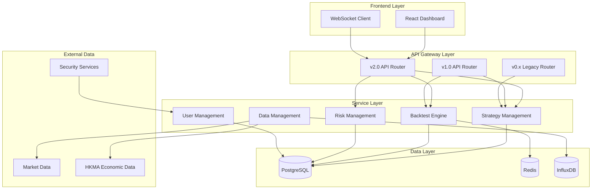
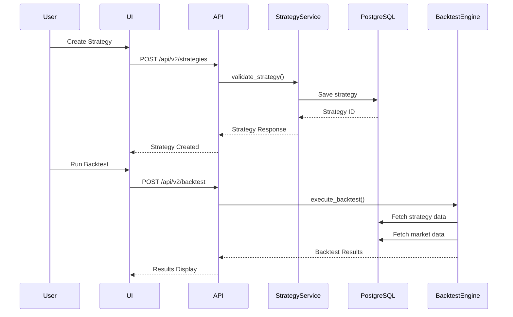
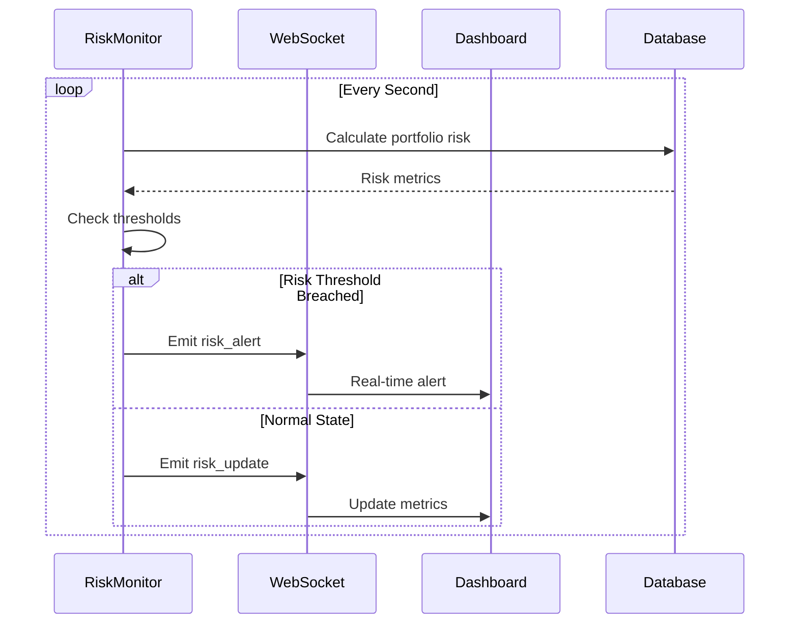
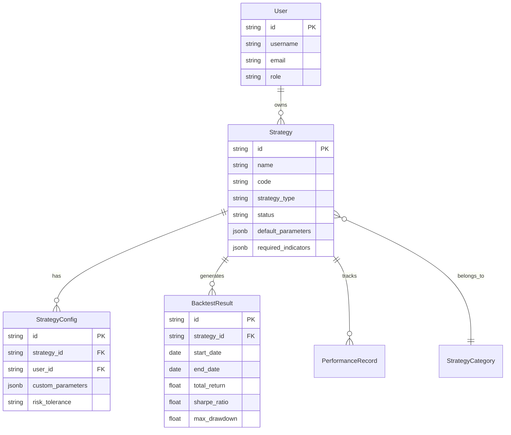

# Design Document - 量化策略管理系統

---

**Purpose**: 提供詳細技術設計以確保實現一致性，避免不同開發者的解釋偏差。

**Approach**:
- 包含關鍵章節以直接指導實現決策
- 省略可選章節除非對防止實現錯誤至關重要
- 根據功能複雜度匹配詳細程度
- 使用圖表和表格而非冗長文字描述

## Overview

量化策略管理系統為企業級CBSC平台提供完整的策略開發、回測、風險管理和實時監控解決方案。系統採用微服務架構，支持從個人獨立使用到團隊協作的無縫擴展。

**Purpose**: 該功能為量化交易者和投資團隊提供統一的策略管理平台，支援多元策略開發和專業級風險管理。

**Users**: 個人量化交易者、小型投資團隊、投資分析師將使用此系統進行策略開發、回測驗證和實時監控。

**Impact**: 改變現有分散的策略管理模式，通過統一平台提升開發效率和風險控制能力。

### Goals
- 建立統一的策略開發和管理框架
- 提供專業級回測和風險分析能力
- 實現實時監控和動態風險調整
- 支持多版本API以確保向後兼容

### Non-Goals
- 實時交易執行功能（僅模擬環境）
- 外部第三方數據供應商直接整合
- 機器學習模型訓練平台
- 高頻交易支援

## Architecture

### Existing Architecture Analysis

當前CBSC系統已建立：
- FastAPI + PostgreSQL + Redis 的技術棧
- 基於JWT的認證系統
- 版本化API架構（v0.x向後兼容、v1.0穩定、v2.0新架構）
- WebSocket實時通信框架
- 策略註冊表和執行引擎

### Architecture Pattern & Boundary Map



**Architecture Integration**:
- **Selected pattern**: 分層微服務架構 + API版本化管理
- **Domain/feature boundaries**: 策略管理、回測引擎、風險管理、數據管理、用戶系統各自獨立
- **Existing patterns preserved**: JWT認證、RESTful API、WebSocket通信
- **New components rationale**: v2統一架構提供更好的擴展性和維護性
- **Steering compliance**: 遵循API版本化、類型安全、測試覆蓋原則

### Technology Stack

| Layer | Choice / Version | Role in Feature | Notes |
|-------|------------------|-----------------|-------|
| Frontend | React 18 + TypeScript | 策略儀表板、圖表組件 | Ant Design + Tailwind CSS |
| Backend | FastAPI 0.104+ | v2統一架構API | Python 3.10+ |
| Database | PostgreSQL 15 | 主數據存儲 | 策略、用戶、配置 |
| Cache | Redis 7 | 即時數據、會話 | API響應、WebSocket狀態 |
| Time Series | InfluxDB | 市場數據、性能指標 | 時序數據優化 |
| Charts | Chart.js 4.5 + Plotly.js | 可視化引擎 | 雙引擎支持 |
| State Mgmt | Redux Toolkit | 前端狀態管理 | RTK Query數據獲取 |

## System Flows

### Strategy Development Flow


### Real-time Risk Monitoring Flow


## Requirements Traceability

| Requirement | Summary | Components | Interfaces | Flows |
|-------------|---------|------------|------------|-------|
| 1.1 | 多元策略支持 | StrategyService, StrategyRegistry | REST API, WebSocket | Strategy Development |
| 1.2 | 策略生命週期管理 | StrategyService, ConfigService | REST API | Strategy Lifecycle |
| 2.1 | 回測模式 | BacktestEngine, RiskManager | REST API, Batch Jobs | Backtest Execution |
| 3.1 | 實時風險監控 | RiskMonitor, WebSocket | WebSocket, Alerts | Risk Monitoring |
| 4.1 | 市場數據管理 | DataService, CacheService | REST API, External APIs | Data Pipeline |
| 5.1 | API版本管理 | APIGateway, Router | REST API | Request Routing |
| 6.1 | 用戶認證系統 | AuthService, UserService | JWT, OAuth 2.0 | Authentication |

## Components and Interfaces

### API Gateway Layer

| Component | Domain/Layer | Intent | Req Coverage | Key Dependencies | Contracts |
|-----------|--------------|--------|--------------|------------------|-----------|
| v2Router | API Gateway | 統一v2架構入口 | 5.1, 1.1 | FastAPI, Uvicorn | HTTP, WebSocket |
| v1Router | API Gateway | v1穩定版兼容 | 5.1 | FastAPI | HTTP |
| v0Router | API Gateway | v0向後兼容 | 5.1 | FastAPI | HTTP |

### Service Layer

#### Strategy Management Service

| Field | Detail |
|-------|--------|
| Intent | 策略生命週期管理和配置 |
| Requirements | 1.1, 1.2, 6.2 |
| Owner / Reviewers | Backend Team |

**Responsibilities & Constraints**
- 策略創建、更新、刪除的CRUD操作
- 策略參數驗證和配置管理
- 策略版本控制和歷史追蹤
- 業務規則：策略唯一性、參數有效性檢查

**Dependencies**
- Inbound: API Gateway — HTTP請求路由 (Critical)
- Outbound: PostgreSQL — 策略數據持久化 (Critical)
- Outbound: Redis — 策略配置快取 (P1)
- External: Python Strategy Registry — 策略實例化 (Critical)

**Contracts**: Service [✓] / API [✓] / Event [✓] / Batch [✓] / State [ ]

##### Service Interface
```python
class StrategyService:
    async def create_strategy(self, strategy: StrategyCreate) -> StrategyResponse
    async def get_strategy(self, strategy_id: str) -> Optional[StrategyResponse]
    async def update_strategy(self, strategy_id: str, update: StrategyUpdate) -> StrategyResponse
    async def delete_strategy(self, strategy_id: str) -> bool
    async def list_strategies(self, filters: StrategyFilters) -> List[StrategyResponse]
    async def execute_strategy(self, strategy_id: str, config: ExecutionConfig) -> ExecutionResult
```

##### API Contract
| Method | Endpoint | Request | Response | Errors |
|--------|----------|---------|----------|--------|
| POST | /api/v2/strategies | StrategyCreate | StrategyResponse | 400, 409, 500 |
| GET | /api/v2/strategies | - | StrategyList | 500 |
| GET | /api/v2/strategies/{id} | - | StrategyResponse | 404, 500 |
| PUT | /api/v2/strategies/{id} | StrategyUpdate | StrategyResponse | 400, 404, 500 |
| DELETE | /api/v2/strategies/{id} | - | SuccessResponse | 404, 500 |

##### Event Contract
- Published events: strategy.created, strategy.updated, strategy.deleted, strategy.executed
- Subscribed events: risk.threshold_breached, market.data_updated
- Ordering: At-least-once delivery, FIFO queue

##### Batch / Job Contract
- Trigger: Scheduled backtest jobs, batch strategy optimization
- Input: Strategy configurations, market data ranges
- Output: Backtest results, performance reports
- Idempotency: Job ID based deduplication

### Backtest Engine

| Field | Detail |
|-------|--------|
| Intent | 高性能回測執行和結果分析 |
| Requirements | 2.1, 2.2, 3.2 |
| Owner / Reviewers | Quant Team |

**Responsibilities & Constraints**
- 支持多種回測模式（標準、風險管理、壓力測試、蒙地卡羅）
- 30+風險指標計算
- 大數據處理能力（10年歷史數據）
- 性能約束：單策略回測 < 30秒

**Dependencies**
- Inbound: StrategyService — 回測請求 (Critical)
- Inbound: RiskMonitor — 風險數據 (P1)
- Outbound: PostgreSQL — 回測結果存儲 (Critical)
- Outbound: InfluxDB — 性能指標存儲 (P1)

**Contracts**: Service [✓] / API [✓] / Event [ ] / Batch [✓] / State [ ]

### Risk Management System

| Field | Detail |
|-------|--------|
| Intent | 實時風險監控和動態調整 |
| Requirements | 3.1, 3.2, 8.2 |
| Owner / Reviewers | Risk Team |

**Responsibilities & Constraints**
- 連續投資組合風險監控
- VaR、ES、回撤等風險指標計算
- 動態倉位調整和再平衡
- 實時性能：計算週期 < 1秒

**Dependencies**
- Inbound: BacktestEngine — 策略執行數據 (Critical)
- Inbound: WebSocket — 即時更新請求 (P1)
- Outbound: WebSocket — 風險警報推送 (Critical)
- Outbound: PostgreSQL — 風險數據存儲 (Critical)

**Contracts**: Service [✓] / API [✓] / Event [✓] / Batch [ ] / State [✓]

## Data Models

### Domain Model



### Logical Data Model

**Structure Definition**:
- **Users**: 用戶基礎信息和角色權限
- **StrategyCategories**: 策略分類層級結構
- **Strategies**: 策略定義和元數據
- **StrategyConfigs**: 用戶個人化策略配置
- **BacktestResults**: 回測執行結果和性能指標
- **PerformanceRecords**: 策略實時性能追蹤

**Consistency & Integrity**:
- 事務邊界：策略配置更新採用樂觀鎖
- 級聯規則：刪除策略時歸檔相關配置和結果
- 時態方面：保留策略版本歷史和配置變更記錄

### Physical Data Model

**For Relational Databases**:
```sql
-- Strategies table
CREATE TABLE strategies (
    id UUID PRIMARY KEY DEFAULT gen_random_uuid(),
    name VARCHAR(200) NOT NULL,
    code VARCHAR(100) UNIQUE NOT NULL,
    strategy_type VARCHAR(50) NOT NULL,
    category_id UUID REFERENCES strategy_categories(id),
    status VARCHAR(20) DEFAULT 'inactive',
    default_parameters JSONB,
    required_indicators JSONB[],
    created_at TIMESTAMP WITH TIME ZONE DEFAULT NOW(),
    updated_at TIMESTAMP WITH TIME ZONE DEFAULT NOW()
);

-- Indexes for performance
CREATE INDEX idx_strategies_type_status ON strategies(strategy_type, status);
CREATE INDEX idx_strategies_category ON strategies(category_id);
CREATE INDEX idx_strategies_code ON strategies(code);
```

**For Time Series Data**:
```sql
-- InfluxDB: strategy_performance measurement
MEASUREMENT strategy_performance
TAGS strategy_id, user_id, timeframe
FIELDS total_return, sharpe_ratio, max_drawdown, volatility
TIMESTAMP timestamp
```

### Data Contracts & Integration

**API Data Transfer**
```typescript
// Strategy creation request
interface StrategyCreateRequest {
  name: string;
  code: string;
  strategy_type: 'technical' | 'fundamental' | 'momentum' | 'volume' | 'portfolio';
  category_id?: string;
  default_parameters: Record<string, any>;
  required_indicators: string[];
  supported_timeframes: string[];
}
```

**Event Schemas**
```typescript
// Strategy execution event
interface StrategyExecutionEvent {
  event_type: 'strategy.executed';
  strategy_id: string;
  user_id: string;
  timestamp: string;
  execution_result: {
    signals: Signal[];
    performance: PerformanceMetrics;
  };
}
```

## Error Handling

### Error Strategy
採用分層錯誤處理：網關層統一錯誤格式、服務層業務邏輯錯誤、數據層持久化錯誤。

### Error Categories and Responses
**User Errors** (4xx):
- Invalid input → 詳細字段驗證錯誤信息
- Unauthorized → 認證失敗，引導登錄
- Not found → 資源不存在，提供搜索建議

**System Errors** (5xx):
- Infrastructure failures → 優雅降級，緩存數據回退
- Timeouts → 熔斷器保護，重試機制
- Exhaustion → 速率限制，請求排隊

**Business Logic Errors** (422):
- Rule violations → 具體規則違反說明
- State conflicts → 狀態轉換指引

### Monitoring
- 錯誤追蹤：Sentry集成
- 日誌聚合：ELK Stack
- 健康監控：Prometheus + Grafana

## Testing Strategy

### Unit Tests
- 策略服務CRUD操作
- 回測引擎核心算法
- 風險指標計算邏輯
- 認證授權模塊

### Integration Tests
- API端點完整流程
- 數據庫事務一致性
- WebSocket通信協議
- 外部數據源整合

### E2E/UI Tests
- 策略創建和配置流程
- 回測執行和結果查看
- 實時監控面板更新
- 用戶註冊登錄流程

### Performance/Load
- 併發用戶回測執行
- WebSocket連接數限制測試
- 大數據量回測性能
- 數據庫查詢優化驗證

## Security Considerations

### Authentication & Authorization
- JWT + RS256簽名令牌
- 基於角色的訪問控制(RBAC)
- API速率限制和防護
- HTTPS強制加密通信

### Data Protection
- 敏感數據AES加密存儲
- 個人信息脫敏處理
- 數據備份加密保護
- GDPR合規性考慮

### Input Validation
- 所有API輸入嚴格驗證
- SQL注入防護
- XSS攻擊防護
- 文件上傳安全檢查

## Performance & Scalability

### Target Metrics
- API響應時間 < 100ms (95th percentile)
- WebSocket延遲 < 50ms
- 支持100併發用戶
- 10年歷史數據回測 < 30秒

### Scaling Approaches
- 水平擴展：無狀態API服務
- 數據庫：讀寫分離，連接池優化
- 緩存：多層級緩存策略
- 異步處理：回測任務隊列

### Caching Strategies
- Redis：策略配置、會話數據
- 應用層：計算結果緩存
- CDN：靜態資源加速
- 數據庫：查詢結果緩存

## Migration Strategy

### Phase 1: Foundation (Week 1-2)
- 數據庫schema遷移
- v2 API基礎框架
- 認證系統升級

### Phase 2: Core Features (Week 3-4)
- 策略管理v2 API
- 基礎回測引擎
- 前端核心組件

### Phase 3: Advanced Features (Week 5-6)
- 風險管理系統
- 實時監控功能
- 性能優化

### Phase 4: Integration & Testing (Week 7-8)
- 端到端測試
- 性能壓力測試
- 文檔完善