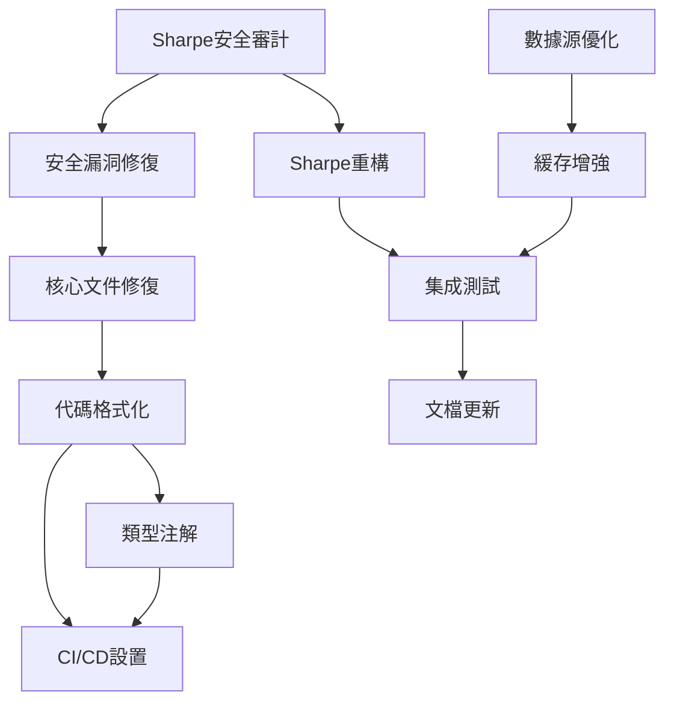

# Agent Task Tracking - 香港量化交易系統修復計劃

Last Updated: 2025-11-28 20:30:00
Project: 香港量化交易系統全面修復
Request Source: User Request - 制定具體的修復計劃
Request: 修復Sharpe比率計算異常、代碼質量惡化、數據源單點故障三大核心問題

## Active Tasks

### security-auditor - TASK-001: Sharpe比率計算安全審計

- **Status**: 🟡 In Progress
- **Assigned**: 2025-11-28 20:30:00
- **Description**: 深度審計Sharpe比率計算邏輯，識別數學錯誤和安全風險
- **Dependencies**: 無
- **Success Criteria**:
  - 完成所有Sharpe計算代碼的安全審計
  - 識別導致771M+ Sharpe比率的根本原因
  - 提供詳細修復建議
- **Deliverables**: 安全審計報告、風險評估、修復方案

### security-auditor - TASK-002: 代碼安全漏洞修復

- **Status**: 🟡 In Progress
- **Assigned**: 2025-11-28 20:30:00
- **Description**: 修復代碼質量報告中發現的安全漏洞
- **Dependencies**: TASK-001
- **Success Criteria**:
  - 修復所有高優先級安全問題
  - 消除SQL注入風險
  - 移除硬編碼密鑰
  - 修復文件路徑安全問題
- **Deliverables**: 安全修復報告、更新後的安全配置

### general-purpose - TASK-003: 核心文件解析錯誤修復

- **Status**: 🟡 Pending
- **Assigned**: 2025-11-28 20:30:00
- **Description**: 修復6個無法解析的關鍵文件
- **Dependencies**: TASK-002
- **Success Criteria**:
  - 修復編碼問題（api_analysis.py, multi_strategy_optimizer.py）
  - 修復語法錯誤（api_routes.py）
  - 修復類型注解問題（core.py, utils.py, test_pdf_generation.py）
- **Deliverables**: 修復後的文件、錯誤修復報告

### general-purpose - TASK-004: 代碼質量全面格式化

- **Status**: 🟡 Pending
- **Assigned**: 2025-11-28 20:30:00
- **Description**: 使用Black、isort、Flake8對312個文件進行全面格式化
- **Dependencies**: TASK-003
- **Success Criteria**:
  - 100%文件通過Black格式化
  - 100%文件通過isort導入排序
  - Flake8錯誤減少90%以上
- **Deliverables**: 格式化後的代碼庫、質量改進報告

### general-purpose - TASK-005: Sharpe比率計算邏輯重構

- **Status**: 🟡 Pending
- **Assigned**: 2025-11-28 20:30:00
- **Description**: 基於安全審計結果重構Sharpe比率計算邏輯
- **Dependencies**: TASK-001
- **Success Criteria**:
  - 實現正確的Sharpe比率計算公式
  - 添加合理性檢查（Sharpe應在-3到+3之間）
  - 單元測試覆蓋率100%
- **Deliverables**: 重構後的Sharpe計算模塊、測試套件

### react-performance-optimization - TASK-006: 數據源架構優化

- **Status**: 🟡 Pending
- **Assigned**: 2025-11-28 20:30:00
- **Description**: 設計和實現多數據源架構，消除單點故障
- **Dependencies**: 無
- **Success Criteria**:
  - 集成至少2個備用股票數據源
  - 實現自動故障轉移機制
  - 添加數據源健康監控
- **Deliverables**: 多數據源配置、故障轉移邏輯、監控系統

### frontend-developer - TASK-007: 緩存機制增強

- **Status**: 🟡 Pending
- **Assigned**: 2025-11-28 20:30:00
- **Description**: 增強現有緩存系統，提高系統穩定性
- **Dependencies**: TASK-006
- **Success Criteria**:
  - 實現持久化緩存（Redis/文件）
  - 添加緩存過期和更新策略
  - 緩存命中率達到80%以上
- **Deliverables**: 增強的緩存系統、性能測試報告

### general-purpose - TASK-008: 類型注解和MyPy修復

- **Status**: 🟡 Pending
- **Assigned**: 2025-11-28 20:30:00
- **Description**: 添加完整的類型注解，修復MyPy檢查錯誤
- **Dependencies**: TASK-004
- **Success Criteria**:
  - 所有公共函數添加類型注解
  - MyPy檢查通過率95%以上
  - 配置嚴格類型檢查
- **Deliverables**: 類型安全的代碼庫、MyPy配置

### general-purpose - TASK-009: CI/CD質量檢查設置

- **Status**: 🟡 Pending
- **Assigned**: 2025-11-28 20:30:00
- **Description**: 設置自動化代碼質量檢查流程
- **Dependencies**: TASK-004, TASK-008
- **Success Criteria**:
  - 配置pre-commit hooks
  - 設置GitHub Actions質量檢查
  - 自動化代碼格式化和安全掃描
- **Deliverables**: CI/CD配置、質量檢查報告

### general-purpose - TASK-010: 集成測試和驗證

- **Status**: 🟡 Pending
- **Assigned**: 2025-11-28 20:30:00
- **Description**: 全面集成測試，驗證所有修復的有效性
- **Dependencies**: TASK-005, TASK-006, TASK-007
- **Success Criteria**:
  - 所有核心功能測試通過
  - Sharpe比率計算正確性驗證
  - 數據源故障轉移測試
  - 系統性能基準測試
- **Deliverables**: 集成測試報告、性能基準、系統穩定性報告

### general-purpose - TASK-011: 文檔更新和部署指南

- **Status**: 🟡 Pending
- **Assigned**: 2025-11-28 20:30:00
- **Description**: 更新系統文檔，創建部署和維護指南
- **Dependencies**: TASK-010
- **Success Criteria**:
  - 更新API文檔
  - 創建修復後的部署指南
  - 編寫維護和監控手冊
- **Deliverables**: 完整文檔集、部署指南、維護手冊

## Task Dependencies

## 執行策略

### Phase 1 (第1-3天): 緊急安全修復
- TASK-001: Sharpe比率安全審計（並行）
- TASK-002: 安全漏洞修復
- TASK-003: 核心文件修復

### Phase 2 (第4-7天): 代碼質量提升
- TASK-004: 全面代碼格式化
- TASK-005: Sharpe比率邏輯重構
- TASK-006: 數據源架構優化（並行）

### Phase 3 (第8-12天): 系統增強和驗證
- TASK-007: 緩存機制增強
- TASK-008: 類型注解完善
- TASK-009: CI/CD設置
- TASK-010: 集成測試驗證

### Phase 4 (第13-14天): 文檔和交付
- TASK-011: 文檔更新和部署指南

## 成功指標

### 技術指標
- Sharpe比率計算：錯誤率 < 0.1%
- 代碼質量：312個文件100%格式化
- 安全漏洞：高優先級漏洞清零
- 系統可用性：99.9%以上
- 數據源故障轉移：響應時間 < 1秒

### 業務指標
- 修復完成時間：14天內
- 功能保留率：100%
- 系統穩定性：無回歸問題
- 文檔完整性：100%覆蓋

## 風險控制

### 技術風險
- **風險**: Sharpe計算修復可能影響現有策略
- **緩解**: 保留原邏輯，通過feature flag切換
- **應急**: 快速回滾機制

### 時間風險
- **風險**: 修復工作量可能超出預期
- **緩解**: 分階段交付，優先核心功能
- **應急**: 調整範圍，延長時間線

### 資源風險
- **風險**: 開發資源不足
- **緩解**: 並行執行，高效任務分配
- **應急**: 外部技術支持

## 監控和報告

### 日常進度報告
- 每日任務完成狀態
- 阻塞問題和風險識別
- 資源使用情況

### 里程碑檢查點
- Phase 1: 安全修復完成檢查
- Phase 2: 質量提升完成檢查
- Phase 3: 系統增強完成檢查
- Phase 4: 最終交付驗收

### 質量保證
- 代碼審查流程
- 自動化測試覆蓋
- 性能基準驗證
- 安全掃描通過