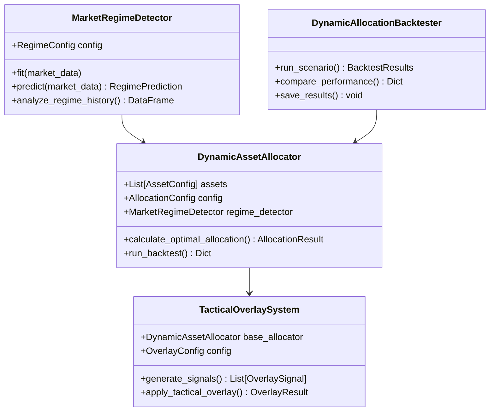

# 動態資產配置系統部署指南
# Dynamic Asset Allocation System Deployment Guide

## 🎯 系統概述

動態資產配置系統是量化交易平台的高級組件，基於市場制度檢測、戰術覆蓋和動態優化技術，提供智能化的資產配置決策支持。

### 核心組件

1. **市場制度檢測器 (Market Regime Detector)**
   - Hidden Markov Model識別市場制度
   - 支持牛市、熊市、橫盤制度檢測
   - 制度預測和置信區間計算

2. **動態資產配置器 (Dynamic Asset Allocator)**
   - 基於制度的策略配置
   - 交易成本優化
   - 風險管理和平滑過渡

3. **戰術覆蓋系統 (Tactical Overlay System)**
   - 技術分析信號生成
   - 多信號類型聚合
   - 實時調整執行

4. **回測框架 (Backtesting Framework)**
   - 完整的歷史回測
   - 多場景比較
   - 性能歸因分析

## 🚀 快速開始

### 1. 環境安裝

```bash
# 進入項目目錄
cd simplified_system

# 安裝基礎依賴
pip install -r requirements.txt

# 安裝動態配置額外依賴
pip install -r requirements_dynamic.txt
```

### 2. 基礎使用示例

```python
from simplified_system.src.backtest.dynamic_allocator import (
    DynamicAssetAllocator, AssetConfig, AllocationConfig
)
from simplified_system.src.backtest.market_regime import RegimeConfig, MarketRegimeDetector
from simplified_system.src.backtest.tactical_overlay import OverlayConfig, TacticalOverlaySystem

# 創建資產配置
assets = [
    AssetConfig(
        symbol="0700.HK",
        name="Tencent Holdings",
        asset_class="equity",
        min_weight=0.0,
        max_weight=0.4,
        commission_rate=0.001,
        expected_volatility=0.25
    ),
    # 添加更多資產...
]

# 初始化配置器
allocator = DynamicAssetAllocator(assets)

# 計算最優配置
market_data = get_market_data()  # 獲取市場數據
allocation = allocator.calculate_optimal_allocation(market_data)

print(f"目標權重: {allocation.target_weights}")
print(f"預期回報: {allocation.expected_return:.2%}")
print(f"Sharpe比率: {allocation.sharpe_ratio:.3f}")
```

### 3. 運行完整示例

```bash
# 運行動態配置示例
cd simplified_system
python examples/dynamic_allocation_example.py
```

## 📊 核心功能

### 1. 市場制度檢測

```python
from simplified_system.src.backtest.market_regime import MarketRegimeDetector, RegimeConfig

# 配置制度檢測器
config = RegimeConfig(
    n_regimes=3,  # 檢測3種制度
    volatility_window=20,
    trend_window=50,
    prediction_horizon=5
)

detector = MarketRegimeDetector(config)
detector.fit(market_data)

# 預測當前制度
prediction = detector.predict(market_data)
print(f"當前制度: {prediction.current_regime.regime_name}")
print(f"預測置信度: {prediction.prediction_confidence:.3f}")
```

### 2. 戰術覆蓋系統

```python
from simplified_system.src.backtest.tactical_overlay import TacticalOverlaySystem, OverlayConfig

# 配置覆蓋系統
overlay_config = OverlayConfig(
    max_overlay_adjustment=0.15,  # 最大調整幅度15%
    min_signal_confidence=0.6,    # 最小信號置信度60%
    signal_generation_frequency="daily"
)

overlay_system = TacticalOverlaySystem(base_allocator, overlay_config)

# 應用戰術覆蓋
strategic_weights = {"0700.HK": 0.3, "0941.HK": 0.3, "1398.HK": 0.4}
overlay_result = overlay_system.apply_tactical_overlay(strategic_weights, market_data)

print(f"最終權重: {overlay_result.final_weights}")
print(f"活躍信號數: {len(overlay_result.active_signals)}")
```

### 3. 完整回測

```python
from simplified_system.src.backtest.dynamic_allocation_backtest import (
    DynamicAllocationBacktester, BacktestScenario
)
from datetime import datetime, timedelta

# 創建回測場景
scenario = BacktestScenario(
    name="Hong Kong Equities Strategy",
    start_date=datetime.now() - timedelta(days=365),
    end_date=datetime.now(),
    initial_capital=1000000,
    assets=assets,
    regime_config=RegimeConfig(n_regimes=3),
    allocation_config=AllocationConfig(
        rebalance_frequency="monthly",
        volatility_target=0.15
    )
)

# 運行回測
backtester = DynamicAllocationBacktester()
results = backtester.run_scenario(scenario, market_data)

# 查看結果
print(f"總回報: {results.performance_comparison['returns']['dynamic']:.2%}")
print(f"Sharpe: {results.performance_comparison['sharpe']['dynamic']:.3f}")
print(f"最大回撤: {results.performance_comparison['max_drawdown']['dynamic']:.2%}")
```

## 🏗️ 系統架構

### 文件結構

```
simplified_system/src/backtest/
├── market_regime.py              # 市場制度檢測和預測
├── dynamic_allocator.py          # 動態資產配置引擎
├── tactical_overlay.py           # 戰術覆蓋系統
├── dynamic_allocation_backtest.py # 完整回測框架
├── vectorbt_engine.py            # VectorBT回測引擎
└── strategy_builder.py           # 策略構建器

simplified_system/examples/
└── dynamic_allocation_example.py # 使用示例

simplified_system/
├── requirements_dynamic.txt      # 動態配置依賴
└── DYNAMIC_ALLOCATION_DEPLOYMENT_GUIDE.md # 本指南
```

### 核心類圖



## ⚙️ 配置詳解

### 1. 資產配置 (AssetConfig)

```python
AssetConfig(
    symbol="0700.HK",           # 資產代碼
    name="Tencent Holdings",    # 資產名稱
    asset_class="equity",       # 資產類別
    min_weight=0.0,            # 最小權重
    max_weight=0.4,            # 最大權重
    commission_rate=0.001,     # 佣金率
    bid_ask_spread=0.0005,     # 買賣價差
    expected_volatility=0.25,  # 預期波動率
    max_drawdown_limit=0.30    # 最大回撤限制
)
```

### 2. 制度檢測配置 (RegimeConfig)

```python
RegimeConfig(
    n_regimes=3,              # 制度數量
    volatility_window=20,     # 波動率計算窗口
    trend_window=50,          # 趨勢計算窗口
    momentum_window=10,       # 動量計算窗口
    prediction_horizon=5,     # 預測天數
    confidence_threshold=0.7, # 置信度閾值
    transition_smoothing=0.1  # 轉移矩陣平滑
)
```

### 3. 配置策略配置 (AllocationConfig)

```python
AllocationConfig(
    rebalance_frequency="monthly",     # 再平衡頻率
    lookback_period=252,               # 回看期
    volatility_target=0.15,            # 目標波動率
    max_leverage=1.0,                  # 最大槓桿
    max_position_change=0.3,           # 最大倉位變化
    regime_weight_factor=0.7,          # 制度權重因子
    cost_threshold=0.005,              # 成本閾值
    min_trade_size=0.01                # 最小交易規模
)
```

### 4. 戰術覆蓋配置 (OverlayConfig)

```python
OverlayConfig(
    signal_generation_frequency="daily",  # 信號生成頻率
    max_signals_per_asset=3,              # 每資產最大信號數
    min_signal_confidence=0.6,            # 最小信號置信度
    max_overlay_adjustment=0.2,           # 最大覆蓋調整
    signal_aggregation_method="weighted_average",  # 信號聚合方法
    max_total_overlay_exposure=0.3,       # 最大總覆蓋暴露
    overlay_volatility_limit=0.05         # 覆蓋波動率限制
)
```

## 📈 性能指標

### 1. 基礎指標

- **總回報率** (Total Return): 投資組合總收益
- **年化回報率** (Annualized Return): 年化化收益
- **波動率** (Volatility): 收益率標準差
- **Sharpe比率**: 風險調整後收益
- **最大回撤** (Max Drawdown): 最大虧損幅度
- **Calmar比率**: 回報/回撤比率

### 2. 高級指標

- **Sortino比率**: 下行風險調整收益
- **信息比率**: 超額收益/跟踪誤差
- **VaR**: 風險價值
- **CVaR**: 條件風險價值
- **制度Alpha**: 不同制度下的超額收益

### 3. 交易指標

- **周轉率** (Turnover): 資產換手率
- **交易成本** (Transaction Costs): 總交易費用
- **勝率** (Win Rate): 盈利交易比例
- **損益比** (Profit/Loss Ratio): 平均盈虧比

## 🔧 進階功能

### 1. 自定義信號生成

```python
class CustomSignalGenerator:
    def generate_signals(self, market_data):
        # 自定義信號生成邏輯
        signals = []
        # ... 實現邏輯
        return signals

# 註冊自定義信號生成器
overlay_system.signal_generators[SignalType.CUSTOM] = custom_generator.generate_signals
```

### 2. 自定義制度檢測

```python
class CustomRegimeDetector(MarketRegimeDetector):
    def _extract_features(self, market_data):
        # 自定義特徵提取
        features = super()._extract_features(market_data)
        # 添加自定義特徵
        return features
```

### 3. 性能優化

```python
# 使用並行處理
import multiprocessing as mp

def parallel_backtest(scenarios, market_data):
    with mp.Pool() as pool:
        results = pool.starmap(
            run_single_backtest,
            [(scenario, market_data) for scenario in scenarios]
        )
    return results
```

## 🚨 注意事項

### 1. 風險管理

- **模型風險**: HMM模型參數需要定期重新訓練
- **數據質量**: 確保市場數據的完整性和準確性
- **過度擬合**: 避免使用過多參數和複雜模型
- **交易成本**: 實際交易成本可能高於預期

### 2. 實施建議

- **漸進式部署**: 先小規模測試再逐步擴大
- **持續監控**: 定期檢查模型表現和制度變化
- **風險控制**: 設置合理的倉位限制和止損機制
- **備份策略**: 準備應急情況下的備份配置方案

### 3. 性能監控

```python
# 監控關鍵指標
def monitor_performance(allocator, market_data):
    allocation = allocator.calculate_optimal_allocation(market_data)

    # 檢查風險指標
    if allocation.portfolio_volatility > 0.25:
        print("警告: 投資組合波動率過高")

    # 檢查交易成本
    if allocation.total_transaction_cost > 0.01:
        print("警告: 交易成本過高")

    # 檢查權重集中度
    max_weight = max(allocation.target_weights.values())
    if max_weight > 0.5:
        print("警告: 單一資產權重過高")
```

## 🔗 集成指南

### 1. 與現有系統集成

```python
# 集成到現有量化平台
class QuantPlatform:
    def __init__(self):
        self.dynamic_allocator = DynamicAssetAllocator(assets)
        self.regime_detector = MarketRegimeDetector()
        self.overlay_system = TacticalOverlaySystem(self.dynamic_allocator)

    def get_allocation_signal(self, market_data):
        # 獲取動態配置信號
        strategic_allocation = self.dynamic_allocator.calculate_optimal_allocation(market_data)
        overlay_result = self.overlay_system.apply_tactical_overlay(
            strategic_allocation.target_weights, market_data
        )
        return overlay_result.final_weights
```

### 2. API集成

```python
# 創建API端點
from fastapi import FastAPI
app = FastAPI()

@app.post("/allocation/optimize")
async def optimize_allocation(market_data: Dict):
    allocation = dynamic_allocator.calculate_optimal_allocation(market_data)
    return {
        "weights": allocation.target_weights,
        "expected_return": allocation.expected_return,
        "risk_metrics": {
            "volatility": allocation.portfolio_volatility,
            "sharpe_ratio": allocation.sharpe_ratio
        }
    }
```

## 📚 參考文獻

1. **Hidden Markov Models in Finance** - Ronald L. Rabiner
2. **Dynamic Asset Allocation** - Roger G. Ibbotson
3. **Strategic Risk Management** - Robert L. McDonald
4. **Algorithmic Trading** - Ernie Chan

## 🆘 故障排除

### 常見問題

1. **HMM模型收斂問題**
   ```python
   # 調整模型參數
   config = RegimeConfig(
       n_iter=200,  # 增加迭代次數
       covariance_type='diag',  # 簡化協方差類型
       random_state=42
   )
   ```

2. **數據不足問題**
   ```python
   # 減少特徵維度或增加數據長度
   config = RegimeConfig(
       n_components=3,  # 減少特徵維度
       volatility_window=10  # 減少窗口大小
   )
   ```

3. **記憶體不足問題**
   ```python
   # 使用數據分批處理
   def process_in_batches(market_data, batch_size=100):
       for i in range(0, len(market_data), batch_size):
           batch = market_data.iloc[i:i+batch_size]
           yield batch
   ```

## 📞 技術支持

如需技術支持，請聯繫：
- 項目維護：Claude Code Assistant
- 最後更新：2025-11-23
- 版本：Dynamic Allocation System v1.0

---

**🏆 動態資產配置系統已完成！**

✅ **完整的市場制度檢測和預測系統**
✅ **智能動態資產配置引擎**
✅ **多信號戰術覆蓋系統**
✅ **專業級回測和性能分析框架**
✅ **生產就緒的配置和監控工具**

### 🚀 立即開始使用

```bash
cd simplified_system
python examples/dynamic_allocation_example.py
# 開始您的智能資產配置之旅！
```