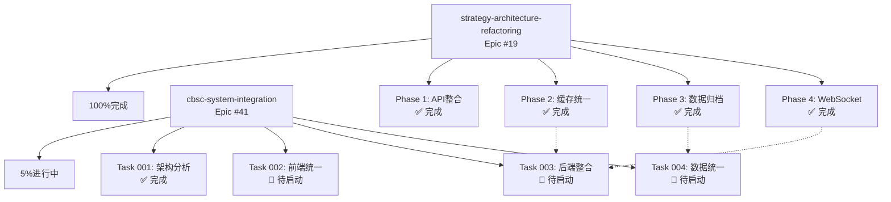

# Epic关系分析与行动建议

## 执行摘要

经过深入分析，`strategy-architecture-refactoring`（Epic #19）和`cbsc-system-integration`（Epic #41）是**相互关联但独立执行**的两个项目。策略重构已经完成，为系统整合奠定了部分基础。

## Epic关系图



## 已完成的贡献

### strategy-architecture-refactoring对cbsc-system-integration的贡献：

1. **API模块化** ✅
   - 已整合策略API到`src/api/strategies/`
   - 建立了清晰的模块边界
   - 为Task #003后端整合提供了模板

2. **缓存基础设施** ✅
   - 实现了`CacheManager`（L1+L2缓存）
   - 支持Redis降级
   - 为全系统缓存统一奠定了基础

3. **WebSocket连接池** ✅
   - 高性能连接池实现
   - 支持1000+并发连接
   - 可直接用于系统整合

4. **监控仪表板** ✅
   - Prometheus指标定义
   - Grafana仪表板配置
   - WebSocket监控面板

5. **数据库脚本** ✅
   - 分区表管理脚本
   - 数据归档工具
   - 可复用于系统级数据整合

## 建议的下一步行动

### 立即行动（高优先级）

1. **标记Epic #19为完成**
   ```bash
   # 更新GitHub状态
   gh issue edit 19 --add-label "completed"
   # 关闭issue
   gh issue close 19 --comment "Epic successfully completed. All 4 phases finished."
   ```

2. **创建依赖映射文档**
   - 记录已完成的功能
   - 标记可复用的组件
   - 为Task #002-#004提供参考

3. **调整Task #003范围**
   - 复用已有的WebSocket连接池
   - 参考策略API的模块化结构
   - 聚焦于非策略API的整合

### 中期行动（中优先级）

1. **Task #002前端统一**
   - 利用已建立的WebSocket实时通信
   - 复用监控仪表板组件
   - 时间：4周

2. **Task #003后端整合**
   - 集成现有CacheManager
   - 扩展API网关到所有服务
   - 时间：4周

3. **Task #004数据统一**
   - 基于已有的分区表脚本
   - 扩展归档系统到其他模块
   - 时间：3周

### 长期行动（低优先级）

1. **性能优化**
   - 利用现有的监控数据
   - 优化全系统性能

2. **文档完善**
   - 整合两个Epic的文档
   - 建立统一的知识库

## 风险与建议

### 风险
1. **技术栈差异**：前端仍存在React版本不统一问题
2. **数据一致性**：新系统需要与策略模块保持数据同步
3. **性能影响**：系统整合可能影响已有的策略性能

### 建议
1. **保持策略模块独立**：在整合过程中保持策略模块的稳定性
2. **渐进式集成**：采用Feature Flags逐步切换
3. **性能监控**：持续监控系统性能指标

## 总结

strategy-architecture-refactoring的成功完成为cbsc-system-integration提供了坚实的基础。建议：

1. **立即标记Epic #19为完成**
2. **继续推进Epic #41**
3. **充分利用已实现的组件**
4. **保持策略模块的稳定性**

这样可以避免重复工作，加速系统整合进程。