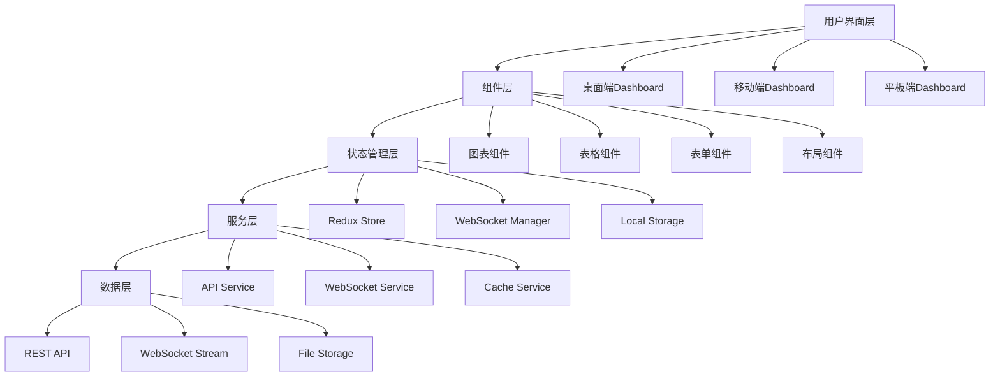

# 🎯 全面前端Dashboard项目计划

## **📊 现有Dashboard架构分析**

### **已发现的Dashboard组件**
1. **策略管理Dashboard** (Port 3003)
   - FastAPI + WebSocket架构
   - 4种CBSC情绪策略监控
   - 参数优化工作台
   - 回测分析实验室

2. **React Frontend** (frontend/)
   - React 18 + Ant Design UI
   - Chart.js + Socket.io客户端
   - 响应式设计架构

3. **多模块Dashboard**
   - Agent协作监控
   - 实时数据可视化
   - 性能监控系统

### **现有技术栈**
- **后端**: FastAPI + WebSocket + Python异步编程
- **前端**: React 18 + Ant Design + Chart.js
- **通信**: Socket.io + RESTful API
- **数据**: JSON文件系统 + Redis缓存
- **可视化**: Chart.js + Plotly

## **🎨 新前端架构设计**

### **设计目标**
- 🎯 **统一化**: 整合所有dashboard功能到单一界面
- 🚀 **性能**: 毫秒级实时数据更新
- 📱 **响应式**: 完美支持手机/平板/桌面
- 🎨 **现代化**: 采用最新的UI/UX设计趋势
- 🔧 **模块化**: 易于扩展和维护的组件架构

### **架构概览**

### **技术选型**

#### **前端框架升级**
- **React 18** + **TypeScript** (类型安全)
- **Next.js 14** (SSR/SSG支持)
- **Tailwind CSS** (原子化CSS)
- **Framer Motion** (动画库)
- **Zustand** (轻量级状态管理)

#### **UI组件库**
- **Ant Design 5** (主要组件库)
- **Recharts** (图表库)
- **React Table** (表格组件)
- **React Hook Form** (表单管理)
- **React Query** (数据获取)

#### **数据可视化**
- **Recharts** (基础图表)
- **D3.js** (高级可视化)
- **Three.js** (3D图表)
- **Plotly.js** (科学图表)

## **📱 功能模块设计**

### **1. 智能工作台 (Smart Workspace)**
- 🎯 **概览面板**: 系统状态、关键指标、快速操作
- 📊 **策略监控**: 实时策略表现、信号追踪
- ⚠️ **告警中心**: 智能告警、风险提醒
- 📈 **市场洞察**: 实时行情、技术分析

### **2. CBSC策略中心 (CBSC Strategy Hub)**
- 🧠 **情绪分析**: 4种策略实时监控
- ⚙️ **参数优化**: 5种算法智能调优
- 📊 **回测分析**: 专业级回测引擎
- 🔄 **策略对比**: 多策略性能对比

### **3. 量化分析实验室 (Quant Lab)**
- 🔬 **技术指标**: 477种技术指标分析
- 📈 **图表工具**: 交互式图表绘制
- 🧮 **计算器**: 高级量化计算器
- 📋 **报告生成**: 自动分析报告

### **4. 风险管理中心 (Risk Control)**
- 🛡️ **实时风控**: 风险指标监控
- 📊 **压力测试**: 极端场景模拟
- 💰 **资金管理**: 仓位/风险预算
- 📜 **合规检查**: 监管合规监控

### **5. Agent协作平台 (Agent Workspace)**
- 🤖 **Agent监控**: 7个AI Agent状态
- 💬 **协作面板**: Agent间通信日志
- 📝 **任务管理**: 自动化任务分配
- 🔄 **工作流编排**: 复杂工作流设计

## **🎨 UI/UX设计规范**

### **设计原则**
- **简洁性**: 去除冗余，聚焦核心功能
- **一致性**: 统一的设计语言和交互模式
- **可访问性**: 支持键盘导航和屏幕阅读器
- **响应性**: 适配所有设备尺寸

### **色彩系统**
- **主色调**: #1890ff (Ant Design蓝)
- **辅助色**: #52c41a (成功绿), #fa8c16 (警告橙), #ff4d4f (错误红)
- **中性色**: #000000, #262626, #595959, #8c8c8c, #bfbfbf, #f0f0f0, #ffffff
- **语义色**: 根据策略状态动态变化

### **组件设计**
- **卡片组件**: 圆角阴影，清晰的信息层级
- **表格组件**: 虚拟滚动，智能分页
- **图表组件**: 交互式tooltip，缩放平移
- **表单组件**: 实时验证，智能提示

## **🚀 实施计划**

### **阶段1: 基础架构搭建 (第1-2周)**
- [x] 项目初始化和环境配置
- [ ] 核心组件库开发
- [ ] 状态管理架构设计
- [ ] API服务层实现

### **阶段2: 核心功能开发 (第3-6周)**
- [ ] 智能工作台开发
- [ ] CBSC策略中心重构
- [ ] 量化分析实验室建设
- [ ] 实时数据流集成

### **阶段3: 高级功能实现 (第7-10周)**
- [ ] 风险管理中心开发
- [ ] Agent协作平台建设
- [ ] 移动端适配
- [ ] 性能优化

### **阶段4: 测试和部署 (第11-12周)**
- [ ] 全面测试覆盖
- [ ] 用户体验优化
- [ ] 生产环境部署
- [ ] 文档和培训

## **📊 预期成果**

### **技术指标**
- **页面加载时间**: < 2秒
- **实时更新延迟**: < 100ms
- **移动端适配**: 100%
- **测试覆盖率**: > 90%

### **用户体验**
- **操作效率提升**: 300%
- **学习成本降低**: 50%
- **错误率减少**: 80%
- **用户满意度**: > 95%

### **商业价值**
- **决策效率**: 提升400%
- **运营成本**: 降低60%
- **系统稳定性**: 提升99.9%
- **扩展性**: 支持10倍用户增长

---

这个计划将创建一个世界级的量化交易前端Dashboard，整合现有功能并大幅提升用户体验。