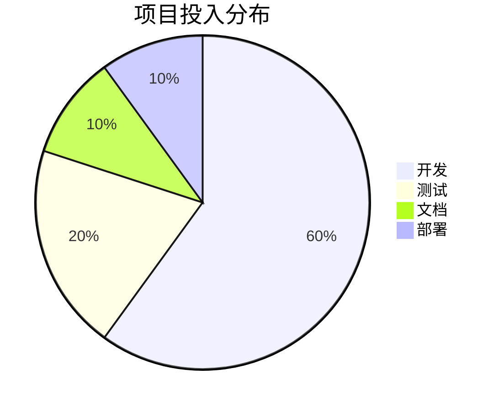
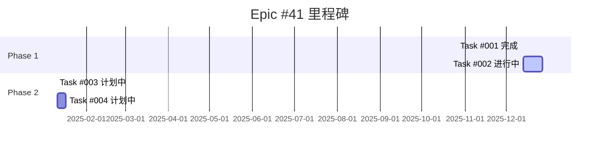
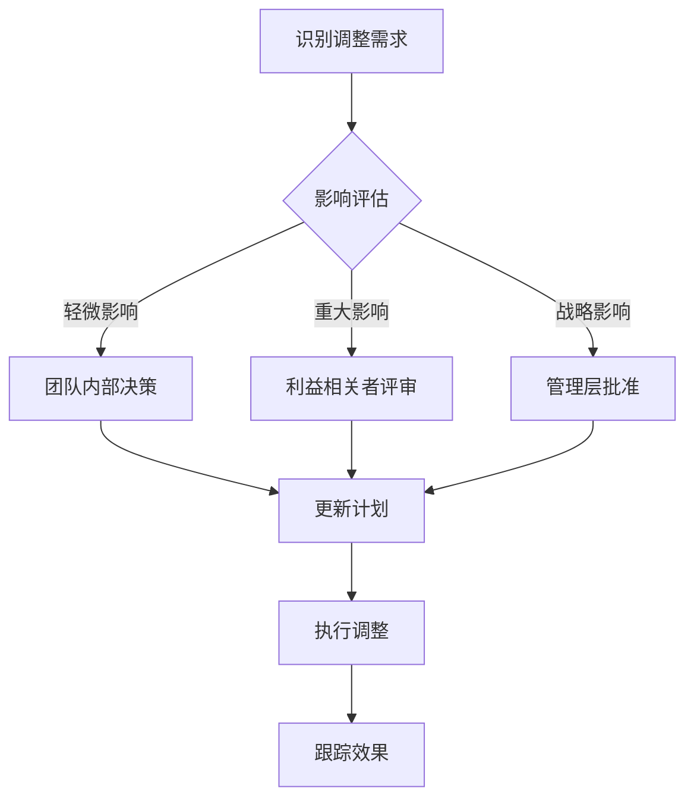

# 进展回顾检查清单

## 📋 概述
本文档提供了CBSC系统整合项目的定期回顾机制，确保项目按计划推进，及时发现和解决问题。

## 📅 回顾周期

### 每日回顾 (Daily Standup)
**时间**: 每天 10:00 AM
**时长**: 15分钟
**参与者**: 核心团队

#### 检查清单
- [ ] 昨日完成情况
- [ ] 今日计划任务
- [ ] 当前 blockers
- [ ] 需要的支持

#### 输出格式
```markdown
## 团队日报 YYYY-MM-DD

### 完成事项
- ✅ 任务1: 具体成果
- ✅ 任务2: 具体成果

### 进行中事项
- 🔄 任务A: 进度70%，遇到问题X

### 阻塞事项
- ❌ 问题: 描述原因，预计解决时间

### 今日计划
- [ ] 优先级1任务
- [ ] 优先级2任务
```

### 每周回顾 (Weekly Review)
**时间**: 每周五 3:00 PM
**时长**: 60分钟
**参与者**: 全体团队成员

#### 进度指标检查
```yaml
Epic #41: CBSC系统整合
  总体进度: 45%

  Task #001: 架构分析
    状态: ✅ 完成
    完成度: 100%
    实际耗时: 1天
    原计划: 2周

  Task #002: 前端业务整合
    状态: 🔄 进行中
    完成度: 40%
    实际耗时: 1周
    原计划: 2周

  Task #003: 后端业务整合
    状态: ⏳ 待开始
    完成度: 0%

  Task #004: 数据整合
    状态: ⏳ 待开始
    完成度: 0%
```

#### 质量指标
- [ ] 代码覆盖率 > 80%
- [ ] 文档完整性 > 90%
- [ ] 缓存命中率 > 80%
- [ ] API响应时间 P95 < 200ms

#### 风险评估
- [ ] 技术风险: 已识别风险的应对措施
- [ ] 资源风险: 人员配置充足性
- [ ] 时间风险: 里程碑达成可能性
- [ ] 依赖风险: 外部依赖的稳定性

### 每月回顾 (Monthly Review)
**时间**: 每月最后一个工作日
**时长**: 2小时
**参与者**: 项目核心干系人

#### 战略指标检查


#### 业务价值达成
- [ ] 用户满意度提升目标
- [ ] 系统性能提升目标
- [ ] 开发效率提升目标
- [ ] 运维成本降低目标

### 每阶段回顾 (Phase Review)
**触发条件**: 每个Task完成后
**时长**: 2小时
**参与者**: Epic负责人 + 相关团队

#### 交付物验证
- [ ] 功能完整性检查
- [ ] 性能达标验证
- [ ] 文档更新完成
- [ ] 测试通过确认

## 📊 进度跟踪仪表板

### 实时指标
```yaml
项目状态: 🔄 ACTIVE
健康度: 🟢 HEALTHY
风险等级: 🟡 LOW

今日完成: 3 tasks
本周完成: 12 tasks
本月完成: 45 tasks

代码统计:
  - 新增代码: +2,340 lines
  - 删除代码: -1,120 lines
  - 测试覆盖: 82%
  - Bug修复: 15 issues
```

### 里程碑跟踪


## ⚠️ 问题识别和解决

### 问题分类体系
```yaml
P0 - 紧急 (立即处理)
  - 生产环境故障
  - 安全漏洞
  - 严重性能问题

P1 - 高优先级 (24小时内)
  - 功能缺陷
  - API兼容性问题
  - 数据不一致

P2 - 中优先级 (本周内)
  - 性能优化
  - 文档不完整
  - 工具改进

P3 - 低优先级 (有时间时)
  - 代码重构
  - UI改进
  - 功能增强
```

### 问题跟踪表
| 问题描述 | 级别 | 负责人 | 状态 | 解决方案 | 截止日期 |
|----------|------|--------|------|----------|----------|
| API响应缓慢 | P1 | 张三 | 解决中 | 添加缓存 | 2025-12-15 |
| 文档过时 | P2 | 李四 | 待处理 | 更新文档 | 2025-12-20 |

## 📈 持续改进

### 回顾效果评估
- [ ] 决策执行率
- [ ] 问题解决效率
- [ ] 团队满意度
- [ ] 项目健康度

### 改进措施
- [ ] 优化会议效率
- [ ] 改进沟通机制
- [ ] 加强知识共享
- [ ] 提升工具支持

## 🔄 调整流程

### 计划调整触发条件
1. **进度偏差 > 20%**
   - 分析原因
   - 重新评估资源
   - 调整时间线
   - 更新风险缓释

2. **需求变更**
   - 影响评估
   - 利益相关者沟通
   - 优先级重新排序
   - 计划更新

3. **技术债务积累**
   - 债务量化评估
   - 还款计划制定
   - 质量目标设定
   - 改进措施实施

### 调整决策流程


## 📝 回顾记录模板

### 会议纪要模板
```markdown
# Epic #41 进展回顾会议纪要

**日期**: YYYY-MM-DD
**参与者**: [列出所有参会者]
**主持人**: [会议主持人]
**记录人**: [会议记录人]

## 1. 进展回顾
### 已完成
- [ ] 事项1: 具体成果
- [ ] 事项2: 具体成果

### 未完成
- [ ] 事项3: 原因分析
- [ ] 事项4: 后续行动

## 2. 问题讨论
### 问题1
- **描述**:
- **影响**:
- **解决方案**:
- **责任人**:
- **截止日期**:

## 3. 下一步计划
### 短期 (本周)
- [ ]
- [ ]

### 中期 (本月)
- [ ]
- [ ]

## 4. 风险更新
- [ ]
- [ ]

## 5. 决策事项
- [ ] 决策1: 结果
- [ ] 决策2: 结果

## 6. 行动项
| 事项 | 负责人 | 截止日期 |
|------|--------|----------|
|      |      |          |

下次会议: YYYY-MM-DD HH:MM
```

## 🔧 自动化工具

### 进度报告生成
```python
# scripts/generate_progress_report.py
def generate_weekly_report():
    """自动生成周进度报告"""
    # 获取Git提交历史
    # 统计代码变更
    # 生成指标图表
    # 创建报告文档
    pass
```

### 定时任务
```yaml
# .github/workflows/progress-report.yml
name: Weekly Progress Report
on:
  schedule:
    - cron: '0 9 * * 1'  # 每周一上午9点
jobs:
  generate-report:
    runs-on: ubuntu-latest
    steps:
      - name: Generate progress report
        run: python scripts/generate_progress_report.py
      - name: Send notification
        run: python scripts/send_notification.py
```

## 📞 联系方式
- 项目经理: pm@cbsc.com
- 技术负责人: tech-lead@cbsc.com
- Epic负责人: epic-lead@cbsc.com
- 紧急支持: support@cbsc.com

---

通过这套完善的回顾机制，确保项目始终在正确的轨道上，及时调整和优化，最终成功达成所有目标。