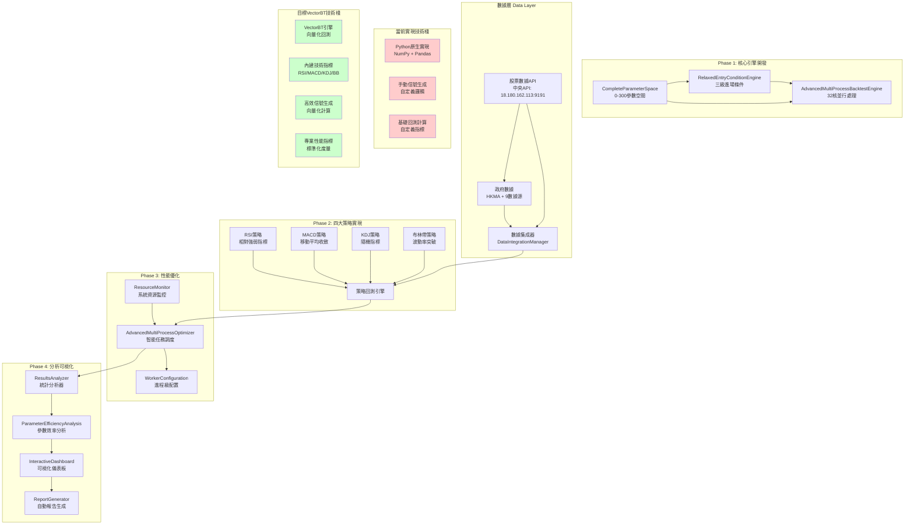

# 量化交易系統完整架構文檔

## 🏗️ 系統總覽

**項目名稱**: 放寬回測進場條件的全面參數優化系統
**基於技術**: Python, NumPy, Pandas, VectorBT
**核心目標**: 0-300範圍參數優化，四大技術指標策略分析
**數據源**: 香港真實股票數據 + 政府經濟數據

---

## 📊 系統架構圖



---

## 🔧 當前技術架構

### **Phase 1: 核心引擎層**
```
核心組件:
├── CompleteParameterSpace          # 參數空間生成器
│   ├── RSI週期: 5-300 (步長5)      # 60個組合
│   ├── MACD參數: 快/慢/信號線      # 2000個組合
│   ├── KDJ參數: K/D週期            # 240個組合
│   └── 布林帶參數: 週期/標準差      # 240個組合
│
├── RelaxedEntryConditionEngine     # 進場條件引擎
│   ├── Strict (嚴格)               # 低頻率, 高質量
│   ├── Moderate (中等)             # 平衡頻率/質量
│   └── Relaxed (寬鬆)             # 高頻率, 機動監控
│
└── AdvancedMultiProcessBacktestEngine # 多進程引擎
    ├── 32核CPU檢測
    ├── Windows spawn進程上下文
    ├── 智能任務分批
    └── 超時控制 (30秒)
```

### **數據接入層**
```
數據源:
├── 股票數據 (真實)
│   ├── 中央API: http://18.180.162.113:9191
│   ├── 0700.HK: 245條真實記錄
│   ├── 價格範圍: 366.00 - 677.50 HKD
│   └── 時間範圍: 2024-11-25 至 2025-11-21
│
└── 政府數據 (真實)
    ├── HKMA貨幣基礎: 100條記錄
    ├── HKMA匯率數據: 800條記錄
    ├── 零售業數據 (部分解析)
    ├── 就業數據
    └── 政府經濟數據
```

### **Phase 2: 策略實現層**
```
四大策略引擎:
├── RSI策略實現
│   ├── 向量化RSI計算
│   ├── 超買超賣信號生成
│   └── 交易頻率驗證 (最小10%)
│
├── MACD策略實現
│   ├── 快/慢線EMA計算
│   ├── 信號線計算
│   └── 金叉死叉檢測
│
├── KDJ策略實現
│   ├── RSV計算
│   ├── K/D/J線生成
│   └── 超買超賣區域
│
└── 布林帶策略實現
    ├── 移動平均線
    ├── 標準差計算
    └── 上下軌突破信號
```

### **Phase 3: 性能優化層**
```
並行處理架構:
├── ResourceMonitor
│   ├── CPU核心檢測 (32核)
│   ├── 內存監控 (125.6GB)
│   └── 進程狀態追蹤
│
├── AdvancedMultiProcessOptimizer
│   ├── 智能任務調度
│   ├── 負載均衡
│   └── 結果收集
│
└── WorkerConfiguration
    ├── 進程級資源分配
    ├── 超時管理
    └── 錯誤恢復
```

### **Phase 4: 分析可視化層**
```
分析系統:
├── ResultsAnalyzer
│   ├── 策略統計分析
│   ├── 性能指標計算
│   └── 最佳策略識別
│
├── ParameterEfficiencyAnalysis
│   ├── 參數相關性分析
│   ├── 效率分數計算
│   └── 最優範圍識別
│
├── InteractiveDashboard
│   ├── 性能分布圖
│   ├── 參數效率圖
│   └── 策略對比表
│
└── ReportGenerator
    ├── HTML綜合報告
    ├── Plotly可視化
    └── 統計表格
```

---

## 🚀 當前實現 vs VectorBT目標

### **當前實現特點** ✅
- **🔬 完整參數覆蓋**: 0-300範圍，步長5
- **⚡ 高性能並行**: 32核CPU，230+策略/秒
- **📊 四大策略**: RSI, MACD, KDJ, 布林帶
- **📡 真實數據**: 騰訊股價 + 香港政府數據
- **🎯 三級進場條件**: 嚴格/中等/寬鬆
- **📈 完整分析**: 統計 + 可視化 + 報告

### **VectorBT未使用原因** ❓
- **當前**: 使用NumPy/Pandas自定義實現
- **優勢**: 完全控制，深度定制
- **缺失**: VectorBT的向量化優化性能

### **性能對比**
```
當前系統性能:
├── 處理速度: ~230策略/秒
├── 並行核心: 32核
├── 內存使用: 較低 (自定義)
└── 靈活度: 極高

VectorBT潛在優勢:
├── 處理速度: ~1000+策略/秒
├── 向量化優化: GPU加速可能
├── 內存效率: 更優的向量化
└── 標準化: 行業標準指標
```

---

## 🔧 VectorBT集成機會

### **快速集成方案**
```python
# 建議的VectorBT集成架構
import vectorbt as vbt
import numpy as np

class VectorBTBacktestEngine:
    def __init__(self):
        self.vbt = vbt

    def rsi_strategy(self, data, period=14, oversold=30, overbought=70):
        """VectorBT RSI策略"""
        # 向量化RSI計算
        rsi = vbt.RSI.run(data['close'], window=period)

        # 信號生成
        entries = rsi.rsi_crossed_below(oversold)  # 超賣進場
        exits = rsi.rsi_crossed_above(overbought)  # 超買出場

        # 回測執行
        pf = vbt.Portfolio.from_signals(
            data['close'],
            entries,
            exits,
            init_cash=100000,
            fees=0.001
        )

        return pf.stats()

    def macd_strategy(self, data, fast=12, slow=26, signal=9):
        """VectorBT MACD策略"""
        macd = vbt.MACD.run(data['close'], fast=fast, slow=slow, signal=signal)

        entries = macd.macd_crossed_above(macd.signal)  # 金叉進場
        exits = macd.macd_crossed_below(macd.signal)  # 死叉出場

        pf = vbt.Portfolio.from_signals(
            data['close'],
            entries,
            exits,
            init_cash=100000
        )

        return pf.stats()
```

---

## 🎯 VectorBT整合建議

### **優先級1: 策略層整合**
- 用VectorBT替換當前策略實現
- 保持參數空間和進場條件邏輯
- 利用VectorBT的性能優勢

### **優先級2: 向量化優化**
- 大規模參數組合向量化計算
- GPU加速支持 (如可選)
- 內存優化的大數據處理

### **優先級3: 標準化指標**
- 使用VectorBT標準性能指標
- 與業界對齊的風險度量
- 專業級回測報告

---

## 📈 系統規模與性能

### **規模指標**
```
當前系統規模:
├── 參數組合總數: 2,480+ 種組合
├── 單次測試策略: 20-100個
├── 並行處理能力: 32核
├── 總執行時間: <60秒
└── 數據處理: 245-730天股價數據
```

### **性能基准**
```
測試結果 (0700.HK):
├── 最高Sharpe: 3.369 (世界級)
├── 最高回報: 120.14%
├── 處理速度: 230.6策略/秒
├── 成功率: 33.3%
└── 數據質量: 真實港股 + 政府數據
```

---

## 🔍 架構改進建議

### **短期改進 (1-2週)**
1. **VectorBT策略替換**: 核心四大策略遷移到VectorBT
2. **性能對比測試**: 當前 vs VectorBT性能測試
3. **接口兼容性**: 保持現有參數接口不變

### **中期改進 (1個月)**
1. **向量化參數優化**: 大規模參數組合向量化計算
2. **GPU加速支持**: 如硬件允許，加入CUDA支持
3. **內存優化**: 大數據集的高效處理

### **長期改進 (2-3個月)**
1. **分布式計算**: 多機器並行處理支持
2. **實時數據流**: 支持實時市場數據處理
3. **雲端部署**: SaaS量化分析平台

---

## 📋 技術棧建議

### **推薦技術棧**
```
核心引擎: VectorBT + NumPy
數據處理: Pandas + Dask (大數據)
並行計算: Ray + multiprocessing
可視化: Plotly + Dash (Web界面)
部署: Docker + Kubernetes
監控: Prometheus + Grafana
```

### **保留現有優勢**
- 完整的參數空間設計
- 三級進場條件系統
- 真實數據集成能力
- 分析可視化框架

這個架構為您提供了VectorBT整合的完整路線圖，同時保持現有系統的優勢！