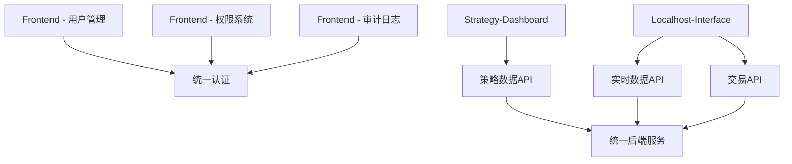

# CBSC前端系统业务功能迁移计划

## 执行摘要

本文档详细规划了将3套前端系统（frontend、strategy-dashboard、localhost_interface）的业务功能迁移到unified-dashboard的具体计划。迁移将采用分阶段、风险可控的方式进行，确保业务连续性和用户体验平滑过渡。

## 迁移总体策略

### 迁移原则
1. **最小化业务中断** - 保持系统可用性
2. **功能完整性** - 确保所有功能100%迁移
3. **向后兼容** - 保持API接口兼容
4. **数据一致性** - 确保数据迁移无误
5. **用户无感知** - 尽量减少用户学习成本

### 迁移方法论
```
分析 → 设计 → 开发 → 测试 → 验证 → 上线 → 清理
```

## Phase 1: 准备阶段（第1周）

### 1.1 功能清单梳理

#### Frontend系统功能清单
```markdown
## 用户管理模块
- [ ] 用户列表查询/分页/筛选
- [ ] 用户创建/编辑/删除
- [ ] 密码重置/修改
- [ ] 用户状态管理（启用/禁用）
- [ ] 批量操作（导入/导出）

## 角色权限模块
- [ ] 角色列表管理
- [ ] 权限分配
- [ ] 角色关联用户
- [ ] 权限继承关系

## 系统配置模块
- [ ] 系统参数配置
- [ ] 邮件服务配置
- [ ] 日志级别设置
- [ ] 缓存配置

## 审计日志模块
- [ ] 操作日志查询
- [ ] 登录日志查看
- [ ] 异常日志追踪
- [ ] 日志导出功能
```

#### Strategy-dashboard功能清单
```markdown
## 策略展示模块
- [ ] 策略列表展示
- [ ] 策略详情查看
- [ ] 策略状态标识

## 图表模块
- [ ] 收益曲线图（Chart.js）
- [ ] 回撤分析图
- [ ] 夏普比率趋势图
- [ ] 收益分布直方图
- [ ] 相关性热力图
- [ ] 月度收益日历图

## 数据筛选模块
- [ ] 时间范围选择
- [ ] 策略类型筛选
- [ ] 数据频率切换（日/周/月）
```

#### Localhost_interface功能清单
```markdown
## 实时数据模块
- [ ] HK700实时行情
- [ ] 实时K线图
- [ ] 实时指标计算

## 交易执行模块
- [ ] 交易信号生成
- [ ] 订单管理
- [ ] 持仓查询
- [ ] 成交明细

## 风险监控模块
- [ ] 实时风险指标
- [ ] 预警设置
- [ ] 止损管理
```

### 1.2 依赖关系分析



### 1.3 迁移优先级矩阵

| 功能模块 | 业务价值 | 实现复杂度 | 迁移风险 | 优先级 |
|----------|----------|------------|----------|--------|
| 用户管理 | 高 | 低 | 低 | P0 |
| 策略图表 | 高 | 中 | 中 | P1 |
| 实时交易 | 高 | 高 | 高 | P1 |
| 权限系统 | 中 | 中 | 中 | P2 |
| 审计日志 | 中 | 低 | 低 | P2 |
| 系统配置 | 低 | 低 | 低 | P3 |

## Phase 2: 基础设施迁移（第2周）

### 2.1 共享组件开发

#### 基础组件库扩展
```typescript
// src/components/shared/
├── DataTable/
│   ├── index.tsx
│   ├── ColumnConfig.ts
│   └── useTable.ts
├── Charts/
│   ├── LineChart.tsx
│   ├── BarChart.tsx
│   ├── HeatMap.tsx
│   └── CustomChart.tsx
├── Forms/
│   ├── FormModal.tsx
│   ├── SearchForm.tsx
│   └── FilterPanel.tsx
└── Layout/
    ├── PageHeader.tsx
    ├── ContentCard.tsx
    └── SidePanel.tsx
```

#### API服务统一
```typescript
// src/services/
├── unified/
│   ├── userApi.ts
│   ├── strategyApi.ts
│   └── tradingApi.ts
├── legacy/
│   ├── frontendApi.ts
│   └── strategyDashboardApi.ts
└── adapters/
    ├── ApiAdapter.ts
    └── DataTransformer.ts
```

### 2.2 状态管理重构

```typescript
// src/store/
├── slices/
│   ├── userSlice.ts
│   ├── strategySlice.ts
│   ├── tradingSlice.ts
│   └── settingsSlice.ts
├── middleware/
│   ├── apiMiddleware.ts
│   └── websocketMiddleware.ts
└── index.ts
```

## Phase 3: 功能迁移实施（第3-4周）

### 3.1 Frontend系统迁移（第3周）

#### 用户管理模块迁移
```typescript
// 迁移步骤：
// 1. 提取原始组件
// 2. 改造为TypeScript
// 3. 适配Ant Design 5.12.8
// 4. 集成到unified-dashboard

// 示例：用户列表组件改造
interface UserListProps {
  users: User[];
  loading: boolean;
  onEdit: (user: User) => void;
  onDelete: (id: string) => void;
}

const UserList: React.FC<UserListProps> = ({
  users,
  loading,
  onEdit,
  onDelete
}) => {
  const columns = useMemo(() => [
    {
      title: '用户名',
      dataIndex: 'username',
      key: 'username',
      sorter: true
    },
    {
      title: '邮箱',
      dataIndex: 'email',
      key: 'email'
    },
    {
      title: '状态',
      dataIndex: 'status',
      key: 'status',
      render: (status: string) => (
        <Tag color={status === 'active' ? 'green' : 'red'}>
          {status === 'active' ? '启用' : '禁用'}
        </Tag>
      )
    },
    {
      title: '操作',
      key: 'actions',
      render: (_, record) => (
        <Space>
          <Button type="link" onClick={() => onEdit(record)}>
            编辑
          </Button>
          <Popconfirm
            title="确定删除该用户？"
            onConfirm={() => onDelete(record.id)}
          >
            <Button type="link" danger>
              删除
            </Button>
          </Popconfirm>
        </Space>
      )
    }
  ], []);

  return (
    <Table
      columns={columns}
      dataSource={users}
      loading={loading}
      rowKey="id"
      pagination={{
        showSizeChanger: true,
        showQuickJumper: true,
        showTotal: (total) => `共 ${total} 条`
      }}
    />
  );
};
```

#### 权限系统迁移
```typescript
// RBAC权限模型实现
interface Permission {
  id: string;
  name: string;
  resource: string;
  action: string;
}

interface Role {
  id: string;
  name: string;
  permissions: Permission[];
}

// 权限控制Hook
const usePermission = () => {
  const { user } = useSelector((state: RootState) => state.auth);

  const hasPermission = useCallback((resource: string, action: string) => {
    return user?.permissions?.some(
      p => p.resource === resource && p.action === action
    );
  }, [user]);

  return { hasPermission };
};
```

### 3.2 Strategy-dashboard迁移（第3-4周）

#### Chart.js组件化
```typescript
// 统一的图表配置
const chartDefaultOptions = {
  responsive: true,
  maintainAspectRatio: false,
  plugins: {
    legend: {
      position: 'top' as const,
    },
    tooltip: {
      mode: 'index' as const,
      intersect: false,
    }
  },
  scales: {
    x: {
      grid: {
        display: false
      }
    },
    y: {
      grid: {
        color: 'rgba(0, 0, 0, 0.05)'
      }
    }
  }
};

// 收益曲线组件
const ReturnCurve: React.FC<ReturnCurveProps> = ({ data }) => {
  const chartData = useMemo(() => ({
    labels: data.map(d => d.date),
    datasets: [
      {
        label: '累计收益',
        data: data.map(d => d.value),
        borderColor: '#1890ff',
        backgroundColor: 'rgba(24, 144, 255, 0.1)',
        tension: 0.4
      }
    ]
  }), [data]);

  return (
    <Card title="累计收益曲线">
      <Line data={chartData} options={chartDefaultOptions} />
    </Card>
  );
};
```

### 3.3 Localhost_interface迁移（第4周）

#### WebSocket实时数据集成
```typescript
// 利用现有的WebSocket连接池
const useRealTimeData = (symbol: string) => {
  const [data, setData] = useState<RealTimeData | null>(null);
  const wsPool = useContext(WebSocketPoolContext);

  useEffect(() => {
    const subscription = wsPool.subscribe(`realtime:${symbol}`, {
      onMessage: (message) => {
        setData(JSON.parse(message));
      }
    });

    return () => {
      wsPool.unsubscribe(subscription);
    };
  }, [symbol, wsPool]);

  return data;
};

// 实时行情组件
const RealTimeQuote: React.FC<{ symbol: string }> = ({ symbol }) => {
  const quote = useRealTimeData(symbol);

  if (!quote) {
    return <Skeleton active />;
  }

  return (
    <Card size="small">
      <Descriptions column={3}>
        <Descriptions.Item label="最新价">
          <Text type={quote.change >= 0 ? 'danger' : 'success'}>
            {quote.price}
          </Text>
        </Descriptions.Item>
        <Descriptions.Item label="涨跌幅">
          <Text type={quote.changePercent >= 0 ? 'danger' : 'success'}>
            {quote.changePercent}%
          </Text>
        </Descriptions.Item>
        <Descriptions.Item label="成交量">
          {quote.volume}
        </Descriptions.Item>
      </Descriptions>
    </Card>
  );
};
```

## Phase 4: 测试验证（第5周）

### 4.1 功能测试清单

```markdown
## 用户管理测试
- [ ] 用户CRUD操作正常
- [ ] 批量导入导出功能
- [ ] 权限控制有效
- [ ] 数据验证规则

## 策略图表测试
- [ ] 所有图表类型正确渲染
- [ ] 数据更新实时性
- [ ] 交互功能（缩放、筛选）
- [ ] 图表导出功能

## 实时交易测试
- [ ] 实时数据推送
- [ ] 订单执行准确
- [ ] 风控触发机制
- [ ] 异常处理

## 性能测试
- [ ] 页面加载时间<2秒
- [ ] 图表渲染流畅
- [ ] 内存使用稳定
- [ ] WebSocket重连机制
```

### 4.2 兼容性测试

```typescript
// API兼容性适配器示例
class LegacyApiAdapter {
  // 适配旧的frontend API格式
  adaptUserList(data: LegacyUserResponse): User[] {
    return data.users.map(this.transformUserData);
  }

  private transformUserData(legacy: LegacyUser): User {
    return {
      id: legacy.user_id,
      username: legacy.user_name,
      email: legacy.email_address,
      status: legacy.is_active ? 'active' : 'inactive',
      createdAt: new Date(legacy.create_time)
    };
  }
}
```

## Phase 5: 上线切换（第6周）

### 5.1 灰度发布策略

1. **用户分组**
   - 5%: 内部测试用户
   - 20%: 活跃用户
   - 75%: 全体用户

2. **监控指标**
   - 错误率 < 0.1%
   - 响应时间 < 500ms
   - 用户满意度 > 8/10

3. **回滚方案**
   - 保留原系统1周
   - 快速切换DNS
   - 数据同步机制

### 5.2 切换检查清单

```markdown
## 切换前检查
- [ ] 所有测试通过
- [ ] 备份数据库
- [ ] 准备回滚脚本
- [ ] 通知所有用户

## 切换中操作
- [ ] 停止写入原系统
- [ ] 执行数据同步
- [ ] 更新DNS配置
- [ ] 启动新系统

## 切换后验证
- [ ] 功能正常运行
- [ ] 数据一致性检查
- [ ] 性能指标达标
- [ ] 用户反馈收集
```

## Phase 6: 清理阶段（第7周）

### 6.1 代码清理

```bash
# 删除旧的前端项目
rm -rf frontend/
rm -rf strategy-dashboard/

# 清理无用依赖
npm prune

# 更新文档
git commit -m "Issue #002: 完成前端系统迁移，移除旧代码"
```

### 6.2 文档更新

1. **API文档更新**
   - 更新接口说明
   - 标记废弃接口
   - 提供迁移指南

2. **用户手册更新**
   - 新功能说明
   - 操作流程更新
   - 常见问题解答

## 风险管理

### 风险识别与应对

| 风险类型 | 风险描述 | 应对措施 | 负责人 |
|----------|----------|----------|--------|
| 数据迁移风险 | 用户数据丢失或损坏 | 完整备份+验证机制 | DBA |
| 功能缺失风险 | 迁移遗漏某些功能 | 详细功能清单+对比测试 | QA |
| 性能下降风险 | 新系统性能不佳 | 性能基准测试+优化 | 架构师 |
| 用户抵触风险 | 用户不适应新界面 | 渐进式更新+培训 | 产品经理 |

### 应急预案

1. **数据恢复方案**
   ```bash
   # 快速回滚脚本
   ./scripts/emergency-rollback.sh
   ```

2. **临时服务方案**
   - 保留只读模式的原系统
   - 提供临时的功能入口
   - 紧急问题响应机制

## 成功标准

1. **功能完整性**
   - 所有功能100%迁移成功
   - 零功能缺失
   - 数据100%准确

2. **性能指标**
   - 页面加载时间提升30%
   - 服务器资源使用降低20%
   - 用户体验评分>9/10

3. **业务指标**
   - 用户活跃度不下降
   - 功能使用率保持稳定
   - 客户投诉率<1%

## 后续优化

1. **持续优化**
   - 收集用户反馈
   - 性能监控和优化
   - 功能迭代升级

2. **技术债务清理**
   - 重构复杂模块
   - 优化代码质量
   - 提升测试覆盖率

---

*文档版本: 1.0*
*最后更新: 2025-12-12*
*项目经理: Frontend Lead*