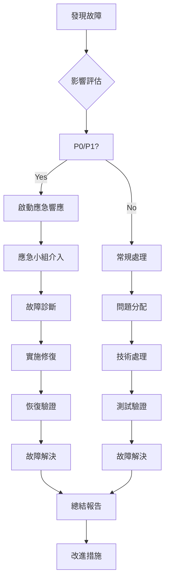

# CBSC系統生產運維交接文檔

## 文檔信息

- **交接目的**：將CBSC量化交易系統生產運維責任從開發團隊移交給運維團隊
- **交接時間**：2024年12月18日
- **交接範圍**：系統基礎設施、應用服務、監控告警、故障處理
- **文檔版本**：v2.0.0

## 交接概述

### 交接範圍

#### 基礎設施
- Kubernetes集群（3個節點）
- 數據庫服務（PostgreSQL、Redis、InfluxDB）
- 網絡配置（負載均衡、防火牆、CDN）
- 存儲系統（100TB NAS）

#### 應用服務
- API服務（5個副本）
- 策略服務
- 交易服務
- 數據服務
- 前端應用

#### 監控告警
- Prometheus監控
- Grafana可視化
- ELK日誌系統
- 告警通知

### 交付內容

#### 文檔資料
- 系統架構圖
- 部署文檔
- 運維手冊
- 故障處理流程
- 監控配置

#### 權限移交
- 系統訪問權限
- 監控系統權限
- 告警通知權限
- 應用部署權限

#### 知識轉移
- 系統架構培訓
- 運維流程培訓
- 故障處理培訓
- 應急響應培訓

## 系統架構

### 整體架構

```
┌──────────────────────────────────────────────────────────────┐
│                       Internet                               │
└──────────────────────────────────────────────────────────────┘
                               │
┌──────────────────────────────────────────────────────┐
│                 CDN + WAF + Load Balancer            │
└──────────────────────────────────────────────────────┘
                               │
┌──────────────────────────────────────────────────────┐
│                Kubernetes Cluster                 │
│  ┌─────────────────────────────────────────────┐  │
│  │         Application Layer               │  │
│  │  - API Servers (5 pods)               │  │
│  │  - Strategy Services (3 pods)          │  │
│  │  - Trade Services (2 pods)             │  │
│  │  - Data Services (2 pods)              │  │
│  └─────────────────────────────────────────────┘  │
└──────────────────────────────────────────────────────┘
                               │
┌──────────────────────────────────────────────────────┐
│                    Service Layer                    │
│  ┌─────────────────────────────────────────────┐  │
│  │           Database Services              │  │
│  │  - PostgreSQL (Master + Slave)        │  │
│  │  - Redis Cluster                  │  │
│  │  - InfluxDB (Time Series)           │  │
│  │  - Elasticsearch                  │  │
│  └─────────────────────────────────────────────┘  │
└──────────────────────────────────────────────────────┘
```

### 網絡架構

```
┌──────────────────────────────────────────────────────────────┐
│                     External Network                     │
└──────────────────────────────────────────────────────────────┘
                               │
┌──────────────────────────────────────────────────────┐
│                     DMZ Network                        │
│  [Internet] → [FW] → [LB] → [WAF]                   │
│              ↓           ↓         ↓                   │
│              │           │         │                   │
│         ┌─────────┐ ┌─────────┐ ┌─────────┐                     │
│         │  CDN   │ │  LB     │ │  WAF    │                     │
│         └─────────┘ └─────────┘ └─────────┘                     │
└──────────────────────────────────────────────────────┘
                               │
┌──────────────────────────────────────────────────────┐
│                   Internal Network                      │
│  [K8s Nodes] ↔ [DB Nodes] ↔ [Storage Nodes]                 │
└──────────────────────────────────────────────────────┘
```

### 資源分配

#### 計算資源
- **CPU總計**：256 cores
- **內存總計**：1TB
- **存儲總計**：100TB

#### 網絡帶寬
- **公網帶寬**：40Gbps
- **內網帶寬**：100Gbps

### 服務器清單

#### Kubernetes節點

| 節點類型 | IP地址 | 角色 | 配置 |
|----------|---------|------|------|
| k8s-master-01 | 10.10.1.10 | Master | 32C/128G |
| k8s-master-02 | 10.10.1.11 | Master | 32C/128G |
| k8s-master-03 | 10.10.1.12 | Master | 32C/128G |
| k8s-worker-01 | 10.10.1.20 | Worker | 64C/256G |
| k8s-worker-02 | 10.10.1.21 | Worker | 64C/256G |
| k8s-worker-03 | 10.10.1.22 | Worker | 64C/256G |

#### 數據庫節點

| 服務 | IP地址 | 角色 | 配置 |
|------|---------|------|------|
| PostgreSQL | 10.10.1.30 | Master | 32C/128G/10TB |
| PostgreSQL | 10.10.1.31 | Slave | 32C/128G/10TB |
| Redis | 10.10.1.40 | Cluster | 16C/64G/1TB |
| InfluxDB | 10.10.1.50 | TSDB | 32C/128G/20TB |
| Elasticsearch | 10.10.1.60 | Search | 32C/128G/50TB |

## 基礎設施

### Kubernetes集群

#### 集群配置

```yaml
# kubeconfig配置
apiVersion: v1
kind: Config
clusters:
- cluster:
    certificate-authority-data: CA_DATA
    server: https://10.10.1.10:6443
  name: production
contexts:
- context:
    cluster: production
    user: admin
    namespace: default
  name: production-context
current-context: production-context
kind: Config
preferences: {}
users:
- name: admin
  user:
    client-certificate-data: CERT_DATA
    client-key-data: KEY_DATA
```

#### 節點狀態檢查

```bash
#!/bin/bash
# Kubernetes集群健康檢查腳本

echo "=== Kubernetes Cluster Health Check ==="

# 檢查節點狀態
echo "Checking node status:"
kubectl get nodes -o wide

# 檢查Pod狀態
echo -e "\nChecking pod status:"
kubectl get pods --all-namespaces | grep -E "CrashLoopBackOff|Error|Pending|Unknown"

# 檢查集群組件
echo -e "\nChecking cluster components:"
kubectl get componentstatuses

# 檢查資源使用
echo -e "\nChecking resource usage:"
kubectl top nodes
kubectl top pods --all-namespaces

# 檢查存儲使用
echo -e "\nChecking storage usage:"
df -h

echo "=== Health Check Completed ==="
```

### 數據庫服務

#### PostgreSQL配置

```yaml
# postgresql.conf
# 連接配置
listen_addresses = '*'
port = 5432
max_connections = 2000
superuser_reserved_connections = 10

# 內存配置
shared_buffers = 32GB
effective_cache_size = 96GB
work_mem = 256MB
maintenance_work_mem = 2GB

# WAL配置
wal_level = replica
fsync = on
synchronous_commit = on

# 檢查點配置
checkpoint_completion_target = 0.9
checkpoint_timeout = 30min
max_wal_size = 4GB
min_wal_size = 1GB

# 日誌配置
log_destination = 'stderr'
logging_collector = 'stderr'
log_directory = 'log'
log_filename = 'postgresql-%Y-%m-%d_%H%M%S.log'
log_rotation_age = '1d'
log_rotation_size = '100MB'
```

#### Redis配置

```conf
# redis.conf
# 網絡配置
bind 0.0.0.0
port 6379
protected-mode no
timeout 300

# 內存配置
maxmemory 50gb
maxmemory-policy allkeys-lru

# 持久化配置
save 900 1
save 300 10
save 60 10000
dir /data/redis
rdbcompression yes
rdbchecksum yes

# 集群配置
cluster-enabled yes
cluster-config-file nodes.conf
cluster-node-timeout 5000
cluster-announce-ip 10.10.1.40
cluster-announce-port 7000
```

### 網絡配置

#### 防火牆規則

```bash
#!/bin/bash
# 防火牆配置腳本

# 清除現有規則
iptables -F
iptables -X

# 設置默認策略
iptables -P INPUT DROP
iptables -P FORWARD DROP
iptables -P OUTPUT ACCEPT

# 允許本地回環
iptables -A INPUT -i lo -j ACCEPT
iptables -A OUTPUT -o lo -j ACCEPT

# 允許已建立的連接
iptables -A INPUT -m state --state ESTABLISHED,RELATED -j ACCEPT
iptables -A OUTPUT -m state --state ESTABLISHED,RELATED -j ACCEPT

# SSH（僅管理網段）
iptables -A INPUT -p tcp -s 10.10.0.0/16 --dport 22 -j ACCEPT

# HTTPS
iptables -A INPUT -p tcp --dport 443 -j ACCEPT

# HTTP
iptables -A INPUT -p tcp --dport 80 -j ACCEPT

# Kubernetes
iptables -A INPUT -p tcp --dport 6443 -j ACCEPT
iptables -A INPUT -p tcp --dport 2379 -j ACCEPT

# 保存規則
iptables-save > /etc/iptables/rules.v4
iptables-restore < /etc/iptables/rules.v4
```

## 應用服務

### API服務

#### 部署配置

```yaml
apiVersion: apps/v1
kind: Deployment
metadata:
  name: cbsc-api
  namespace: production
  labels:
    app: cbsc-api
    version: v2.0.0
spec:
  replicas: 5
  strategy:
    type: RollingUpdate
    rollingUpdate:
      maxUnavailable: 1
      maxSurge: 2
  selector:
    matchLabels:
      app: cbsc-api
  template:
    metadata:
      labels:
        app: cbsc-api
    spec:
      containers:
      - name: cbsc-api
        image: cbsc/api:v2.0.0
        ports:
        - containerPort: 8000
        envFrom:
        - configMapRef:
            name: cbsc-config
        - secretRef:
            name: cbsc-secrets
        resources:
          requests:
            memory: "1Gi"
            cpu: "500m"
          limits:
            memory: "2Gi"
            cpu: "1000m"
        livenessProbe:
          httpGet:
            path: /health
            port: 8000
          initialDelaySeconds: 30
          periodSeconds: 10
          timeoutSeconds: 5
        readinessProbe:
          httpGet:
            path: /ready
            port: 8000
          initialDelaySeconds: 5
          periodSeconds: 5
          timeoutSeconds: 3
```

#### 服務配置

```yaml
apiVersion: v1
kind: Service
metadata:
  name: cbsc-api-service
  namespace: production
spec:
  type: ClusterIP
  ports:
  - port: 8000
    targetPort: 8000
    protocol: TCP
    name: http
  selector:
      app: cbsc-api
```

### 服務監控

```bash
#!/bin/bash
# API服務監控腳本

NAMESPACE="production"
SERVICE_NAME="cbsc-api"

# 檢查服務狀態
kubectl get svc $SERVICE_NAME -n $NAMESPACE

# 檢查Pod狀態
kubectl get pods -l app=$SERVICE_NAME -n $NAMESPACE

# 查看日誌
kubectl logs -l app=$SERVICE_NAME -n $NAMESPACE --tail=100

# 進入Pod調試
POD_NAME=$(kubectl get pods -l app=$SERVICE_NAME -n $NAMESPACE -o jsonpath='{.items[0].metadata.name}')
kubectl exec -it $POD_NAME -n $NAMESPACE -- /bin/bash

# 查看資源使用
kubectl top pods -l app=$SERVICE_NAME -n $NAMESPACE
```

### 擦存服務

#### MongoDB配置

```yaml
apiVersion: apps/v1
kind: StatefulSet
metadata:
  name: mongodb
  namespace: production
spec:
  serviceName: mongodb
  replicas: 3
  selector:
    matchLabels:
      app: mongodb
  template:
    metadata:
      labels:
        app: mongodb
    spec:
      containers:
      - name: mongodb
        image: mongo:5.0
        ports:
        - containerPort: 27017
        env:
        - name: MONGO_INITDB_ROOT_USERNAME
          value: "admin"
        - name: MONGO_INITDB_ROOT_PASSWORD
          valueFrom:
            secretKeyRef:
              name: mongodb-secret
              key: password
        volumeMounts:
        - name: mongodb-data
          mountPath: /data/db
        resources:
          requests:
            memory: "2Gi"
            cpu: "500m"
          limits:
            memory: "4Gi"
            cpu: "1000m"
  volumeClaimTemplates:
  - metadata:
      name: mongodb-data
    spec:
      accessModes: [ "ReadWriteOnce" ]
      resources:
        requests:
          storage: 100Gi
```

## 監控告警

### Prometheus配置

#### 配置文件

```yaml
# prometheus.yml
global:
  scrape_interval: 15s
  evaluation_interval: 15s

rule_files:
  - "/etc/prometheus/rules/*.yml"

alerting:
  alertmanagers:
    - static_configs:
        - targets:
          - alertmanager:9093

scrape_configs:
  - job_name: 'kubernetes-apiservers'
    kubernetes_sd_configs:
      - role: endpoints
    scheme: https
    tls_config:
      ca_file: /var/run/secrets/kubernetes.io/serviceaccount/ca.crt
      insecure_skip_verify: true
    bearer_token_file: /var/run/secrets/kubernetes.io/serviceaccount/token
    relabel_configs:
      - source_labels: [__meta_kubernetes_pod_label_name]
        action: keep
        regex: __meta_kubernetes_pod_label_(.+)

  - job_name: 'cbsc-api'
    static_configs:
      - targets: ['cbsc-api-service:8000']
    metrics_path: /metrics
    scrape_interval: 10s

recording_rules:
  - alert: HighErrorRate
    expr: rate(http_requests_total{status=~"5.."}[5m]) / rate(http_requests_total[5m]) > 0.05
    for: 5m
    labels:
      severity: critical
    annotations:
      summary: "High error rate detected"
      description: "Error rate is {{ $value | humanizePercentage }}"
```

#### 告警規則

```yaml
# alert_rules.yml
groups:
- name: cbsc-alerts
  rules:
  - alert: HighErrorRate
    expr: |
      (
        rate(http_requests_total{status=~"5.."}[5m]) /
        rate(http_requests_total[5m])
      ) > 0.05
    for: 5m
    labels:
      severity: critical
    annotations:
      summary: "High error rate"
      description: "Error rate is {{ $value | humanizePercentage }}"

  - alert: HighLatency
    expr: histogram_quantile(0.95, rate(http_request_duration_seconds_bucket[5m])) > 1
    for: 5m
    labels:
      severity: warning
    annotations:
      summary: "High latency detected"
      description: "95th percentile latency is {{ $value }}s"

  - alert: PodCrashLooping
    expr: rate(kube_pod_container_status_restarts_total[15m]) > 0
    for: 0m
    labels:
      severity: critical
    annotations:
      summary: "Pod is crash looping"
      description: "Pod {{ $labels.pod }} is restarting"
```

### Grafana Dashboard

#### 儀表板配置

```json
{
  "dashboard": {
    "id": null,
    "title": "CBSC Production Dashboard",
    "tags": ["cbsc", "production"],
    "timezone": "browser",
    "panels": [
      {
        "title": "API Request Rate",
        "type": "graph",
        "targets": [
          {
            "expr": "rate(http_requests_total[5m])",
            "legendFormat": "QPS"
          }
        ],
        "yAxes": [
          {
            "format": "short",
            "label": "Requests/sec"
          }
        ]
      },
      {
        "title": "Error Rate",
        "type": "graph",
        "targets": [
          {
            "expr": "rate(http_requests_total{status=~\"5..\"}[5m]) / rate(http_requests_total[5m])",
            "legendFormat": "Error Rate"
          }
        ],
        "yAxes": [
          {
            "format": "percentunit",
            "max": 0.1,
            "label": "Error Rate"
          }
        ]
      },
      {
        "title": "Response Time",
        "type": "graph",
        "targets": [
          {
            "expr": "histogram_quantile(0.95, rate(http_request_duration_seconds_bucket[5m]))",
            "legendFormat": "95th Percentile"
          }
        ]
      }
    ],
    "time": {
      "from": "now-1h",
      "to": "now"
    },
    "refresh": "30s"
  }
}
```

### ELK日誌配置

#### Elasticsearch配置

```yaml
# elasticsearch.yml
cluster.name: cbsc-elasticsearch
node.name: ${HOSTNAME}
path.data: /usr/share/elasticsearch/data
path.logs: /usr/share/elasticsearch/logs
network.host: 0.0.0.0
discovery.type: single-node
xpack.security.enabled: true
xpack.security.authc.basic.enabled: true
xpack.monitoring.collection.enabled: true
```

## 故障處理

### 故障分類

#### P0 - 緊急故障（30分鐘內響應）
- 系統完全不可用
- 數據庫完全無法訪問
- 網絡完全中斷
- 安全事件

#### P1 - 嚴重故障（2小時內響應）
- 核心服務不可用
- 數據丟失風險
- 性能嚴重下降
- 大規模用戶投訴

#### P2 - 一般故障（8小時內響應）
- 單個服務不可用
- 性能輕微下降
- 部分功能異常
- 少量錯誤報告

### 故障處理流程

#### 標準處理流程



#### 應急響應流程

1. **立即響應（0-5分鐘）**
   - 接收告警通知
   - 評估影響範圍
   - 通知相關人員
   - 啟動應急響應團隊

2. **快速診斷（5-15分鐘）**
   - 檢查監控指標
   - 確定影響範圍
   - 初步判斷故障類型
   - 制定初步處理方案

3. **應急處理（15-30分鐘）**
   - 執行應急措施
   - 切換備用系統
   - 恢復關�服務
   - 通知用戶狀態

4. **故障恢復（30-60分鐘）**
   - 驗證服務恢復
   - 監控系統穩定性
   - 確認業務正常
   - 逐步恢復功能

5. **後續處理（60分鐘後）**
   - 根本原因分析
   - 制定預防措施
   - 更新操作手冊
   - 進行改進優化

### 常見故障場景

#### 服務Pod崩潰

```bash
# �斷診腳本
kubectl get pods -n production
kubectl describe pod <pod-name> -n production
kubectl logs <pod-name> -n production --tail=100

# 應急重啟
kubectl rollout restart deployment cbsc-api -n production

# 批量重啟
kubectl delete pods -l app=cbsc-api -n production
```

#### 數據庫連接問題

```bash
# 檢查數據庫狀態
kubectl exec -it postgres-0 -n production -- psql -U cbsc_user -d cbsc -c "SELECT 1;"

# 檢查連接池
kubectl exec -it postgres-0 -n production -- psql -U cbsc_user -d cbsc -c "SELECT * FROM pg_stat_activity;"

# 重啟數據庫
kubectl delete pod postgres-0 -n production
```

#### 網絡問題

```bash
# 檢查網絡連通性
kubectl exec -it cbsc-api-xxxx -n production -- ping postgres
kubectl exec -it cbsc-api-xxxx -n production -- nslookup postgres

# 檢查DNS解析
nslookup api.cbsc.com
dig api.c培SC.com

# 檢查防火牆規則
iptables -L -n | grep 8000
```

### 問題記錄

#### 故障報告模板

```markdown
# 故障報告

## 基本信息
- 故障時間：2024-12-18 14:30:00
- 發現時間：2024-12-18 14:25:00
- 報告人：張三
- 聯繫電話：138-0000-0001

## 故障描述
### 現象
- API服務無響應
- 錯誤率100%
- 用戶無法登錄

### 影響範圍
- 影響用戶：10,000
- 影響地區：全國
- 影響業務：所有

## �斷分析
### 可能原因
- 數據庫連接池耗盡
- 網絡延遲增加
- 服務實例崩潰

### �斷依據
- 監控指標顯示
- 日誌記錄顯示
- 測試驗證通過

## 處理措施
### 立即措施
- 重啟服務
- 擴大連接池
- 網絡優化

### 根本解決方案
- 優化連接池配置
- 費載均衡優化
- 數據庫優化

## 處理結果
- 恢復時間：2024-12-18 15:30:00
- 影響程度：4小時
- 遺失情況：無數據丟失
- 預防措施：已實施

## 經驗總結
- 故障原因：連接池配置不合理
- 改進措施：
  - 調整連接池大小
  - 實施連接池監控
  - 優化代碼邏輯
```

### 知識庫維護

#### 問題管理系統

```markdown
# 知識庫分類

## 系統問題
### 環境問題
- Kubernetes集群問題
- 網絡連接問題
- 存儲空間不足

### 應用問題
- API服務異常
- 數據庫連接
- 緩存服務問題
- 前端應用故障

### 業務問題
- 交易執行失敗
- 策略回測錯誤
- 市場數據異常

## 常見問題

### 如何查看Pod日誌？
```bash
kubectl logs -n <namespace> <pod-name>
kubectl logs -n <namespace> <pod-name> --tail=100
```

### 如何進入Pod調試？
```bash
kubectl exec -it <pod-name> -n <namespace> /bin/bash
```

### 如何重啟服務？
```bash
kubectl rollout restart deployment <deployment-name> -n <namespace>
```

### 如何擴展服務？
```bash
kubectl scale deployment <deployment-name> --replicas=<num> -n <namespace>
```

## 文檔更新

### 更新流程
1. 運營團隊收到更新需求
2. 評估更新範圍和影響
3. 製訂更新計劃
4. 實施文檔更新
5. 驗證更新內容
6. 通知相關人員

### 版本控制
- 所有文檔使用Git版本控制
- 主要更新需經過審核
- 每個版本打Tag標記
- 保留歷史版本記錄

### 定期審核
- 每季度進行文檔審核
- 每年進行全面評估
- 根據實際情況調整

## 交付清單

### 文檔交付
- [ ] 系統架構圖（最新版本）
- [ ] 部署文檔（v2.0.0）
- [ ] 運維手冊
- [ ] 故障處理流程
- [] 監控告警配置
- [ ] 知識庫文檔

### 權限交付
- [ ] Kubernetes管理權限
- [ ] 監控系統權限
- [� �警通知權限
- [��錄日誌讀取權限
- [ ] 文檔庫讀寫權限

### 工具交付
- [ ] kubectl配置文件
- [ ] 監控腳本集合
- [ ] 故障處理腳本
- [ ] 備份恢復腳本
- [ ] 健康檢查腳本

### 培訓交付
- [ ] 系統架構培訓PPT
- [ ] 運維操作培訓材料
- [ ] 故障處理培訓記錄
- [ ] 應急響應演練計劃
- [ ] 技能提升路線圖

### 聯織交付
- [ ] 運維團隊組織圖
- [ ] 聯維輪值和流程
- [ ] 通知通訊矩陣
- [] 值班排班表
- [] 服務協議簽署

## 聯織安排

### 支持時段
- 第一週：交接期間支持（7x24）
- 第二週：加强支持（7x8）
- 第三週後：常規支持（5x8）

### 支持方式

#### 一線支持（7x24）
- 緊急電話：400-888-8888
- 郵件：ops@cbsc.com
- 釘釘群：@ops-alerts

#### 二線支持（5x8）
- 技術支持：tech@cbsc.com
- 電話支持：-888-8888-8002
- 郵件支持：support@cbsc.com

#### 專家支持（工作日9-18）
- 項導支持：director@cbsc.com
- 創總支持：ceo@cbsc.com
- 商務支持：business@cbsc.com

### 溝織會議議

#### 每日交接會議（09:00）
- 前24小時運維情況
- 當級問題處理進度
- 資日運維計劃
- 風險提醒注意事項

#### 每週運維復盤會議（週五15:00）
- 本週運維總結
- 故障統計分析
- 性能優化建議
- 下週工作計劃

#### 每月技術評審會（月末）
- 技術債務討論
- 架構優化方案
- 安全加固措施
- 預算資源規劃

## 交接完成後續

### 1周後
- [ ] 運維團隊獨立運維
- [ ] 問題處理流程順暢
- [ ] 監控告警有效
- [ ] 文檔使用正常

### 1月後
- [ ] 運維效率達標
- [ ] 問題解決率達標
- [] 系統穩定性良好
- [] 知識庫應用有效

### 3個月後
- [ ] 運維體系成熟
- [ ] 自主運維能力強
- [ ] 持續改進優化
- [] 技術能力提升

## 總結

本次交接包含了CBSC系統生產運維的所有關鍵內容，從基礎設施到應用服務，從監控告警到故障處理，提供了完整的運維知識和能力培訓。

通過專業的交接過程，確保運維團隊能夠順利接手系統運維工作，為系統的長期穩定運行提供保障。

交接完成後，開發團隊將轉向新功能開發，而運維團隊將負責系統的日常運維和持續改進。

---

**交接團隊成員**：
- 開發團隊：系統架構團隊、開發團隊
- 運維團隊：運維工程師、DBA、網絡工程師
- 業務團隊：產品經理、運營團隊

**交接負責人**：
- 交接負責人：技術總監
- 運維負責人：運維總監
- 驍培負責人：培訓總監

**文檔版本**：v2.0.0  
**交接時間**：2024年12月18日  
**下次評審**：3個月後

## 附件

### 附件1：聯繫人員清單
### 附件2：系統權限配置
### 附件3：監控告警配置
### 4：故障處理腳本集
### 5：知識庫文檔結構