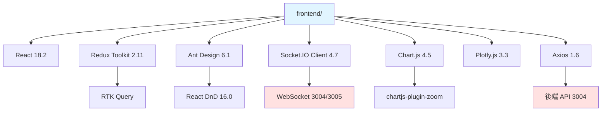
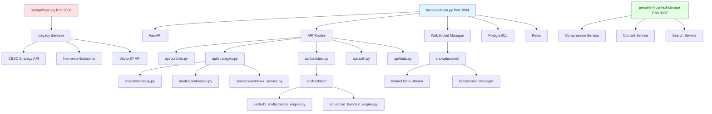
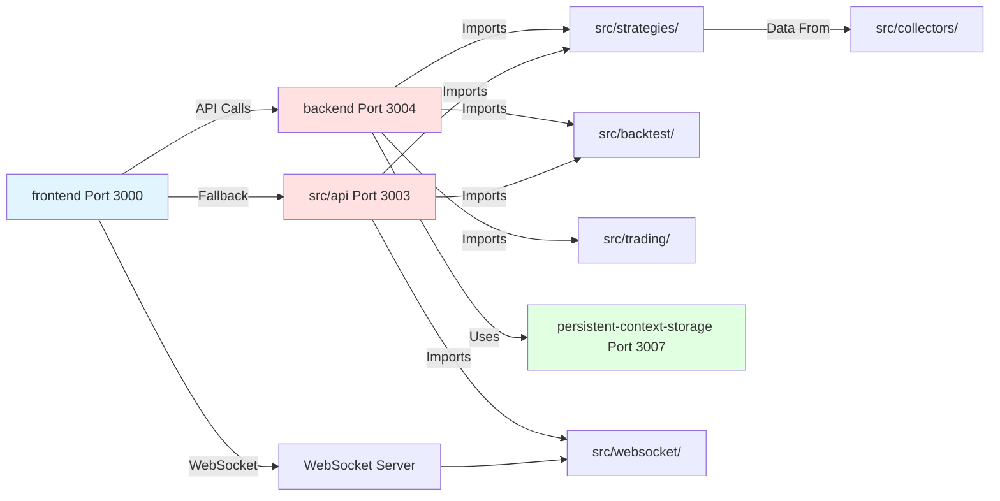
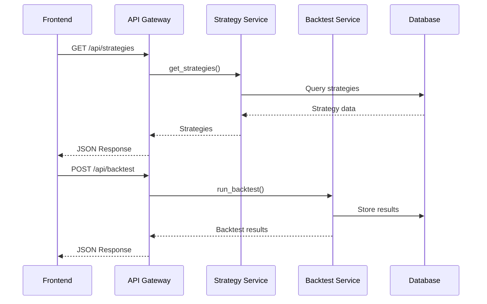

# CBSC Trading System 架構與依賴關係分析報告

**分析日期**: 2025-12-24T12:20:44Z
**分析範圍**: 完整系統架構、前端項目、後端服務、依賴圖、問題識別

---

## 1. 架構概覽

### 1.1 系統組件圖

```
┌─────────────────────────────────────────────────────────────────────────────┐
│                          CBSC Trading System                                │
├─────────────────────────────────────────────────────────────────────────────┤
│                                                                             │
│  ┌─────────────────┐    ┌─────────────────┐    ┌─────────────────┐         │
│  │   Frontend      │    │  Unified        │    │ Strategy        │         │
│  │   (frontend/)   │    │  Dashboard      │    │ Dashboard       │         │
│  │   Port: 3000    │    │  (unified-)     │    │ (strategy-)     │         │
│  │                 │    │  Port: 3000     │    │ Port: N/A       │         │
│  │  React 18       │    │  React 18       │    │  Embedded       │         │
│  │  Vite 5.0       │    │  Vite 5.0       │    │                 │         │
│  │  TypeScript     │    │  TypeScript     │    │                 │         │
│  └────────┬────────┘    └────────┬────────┘    └────────┬────────┘         │
│           │                      │                       │                   │
│           └──────────────────────┼───────────────────────┘                   │
│                                  │                                           │
│                    ┌─────────────▼─────────────┐                              │
│                    │      API Gateway/Proxy    │                              │
│                    │      (Vite Proxy)        │                              │
│                    └─────────────┬─────────────┘                              │
│                                  │                                           │
│           ┌──────────────────────┼──────────────────────┐                    │
│           │                      │                      │                    │
│           ▼                      ▼                      ▼                    │
│  ┌─────────────────┐    ┌─────────────────┐    ┌─────────────────┐         │
│  │  New Backend    │    │  Legacy API     │    │  Persistent     │         │
│  │  (backend/)     │    │  (src/api/)     │    │  Context        │         │
│  │  Port: 3004     │    │  Port: 3003     │    │  Storage        │         │
│  │  FastAPI        │    │  FastAPI        │    │  Port: 3007     │         │
│  │  20 Routes      │    │  Multiple       │    │  FastAPI        │         │
│  │                 │    │  Services       │    │                 │         │
│  └────────┬────────┘    └────────┬────────┘    └────────┬────────┘         │
│           │                      │                      │                   │
│           └──────────────────────┼──────────────────────┘                   │
│                                  │                                           │
│           ┌──────────────────────┼──────────────────────┐                    │
│           ▼                      ▼                      ▼                    │
│  ┌─────────────────┐    ┌─────────────────┐    ┌─────────────────┐         │
│  │   Strategies    │    │    Backtest     │    │     Trading     │         │
│  │  (src/strategies│    │  (src/backtest/)│    │  (src/trading/) │         │
│  │                 │    │                 │    │                 │         │
│  │  - Factory V2   │    │  - VectorBT     │    │  - Broker API   │         │
│  │  - Fundamental  │    │  - Monte Carlo  │    │  - Order Mgr    │         │
│  │  - Momentum     │    │  - Parallel     │    │  - Position Mgr │         │
│  │  - Volume       │    │  - Risk Metrics │    │  - Risk Mgr     │         │
│  └─────────────────┘    └─────────────────┘    └─────────────────┘         │
│                                                                             │
│  ┌─────────────────┐    ┌─────────────────┐    ┌─────────────────┐         │
│  │   WebSocket     │    │   Data/Market   │    │  Integration    │         │
│  │ (src/websocket/)│    │ (src/collectors)│    │   Services      │         │
│  │                 │    │                 │    │                 │         │
│  │  - Real-time    │    │  - Economic     │    │  - Telegram     │         │
│  │  - Streams      │    │  - Market Data  │    │  - Alerts       │         │
│  │  - Subscriptions│    │  - HIBOR        │    │  - Monitoring   │         │
│  └─────────────────┘    └─────────────────┘    └─────────────────┘         │
└─────────────────────────────────────────────────────────────────────────────┘
```

### 1.2 技術棧總結

#### 前端技術棧
| 項目 | 主要前端 | 統一儀表板 | 策略儀表板 (嵌入) |
|------|----------|------------|------------------|
| **框架** | React 18.2 | React 18.2 | N/A (嵌入) |
| **語言** | TypeScript | TypeScript | N/A |
| **構建工具** | Vite 5.0.8 | Vite 5.0.8 | N/A |
| **狀態管理** | Redux Toolkit 2.11 | Redux Toolkit 1.9 | N/A |
| **路由** | React Router 6.30 | React Router 6.8 | N/A |
| **UI組件** | Ant Design 6.1 | Ant Design 5.29 | Ant Design |
| **圖表** | Chart.js 4.5, Plotly 3.3 | Chart.js 4.4, Plotly 2.27 | Chart.js |
| **實時通信** | Socket.IO 4.7 | Socket.IO 4.7 | WebSocket |
| **表格** | React Table 7.8 | React Table 7.8 | Ant Design Table |
| **拖拽** | react-dnd 16.0 | react-dnd 16.0 | react-grid-layout |

#### 後端技術棧
| 組件 | 技術棧 | 端口 | 職責 |
|------|--------|------|------|
| **新後端** | FastAPI | 3004 | 統一API、認證、策略管理 |
| **舊後端** | FastAPI | 3003 | CBSC策略、數據API |
| **WebSocket** | FastAPI | 3004/3005 | 實時數據推送 |
| **持久化上下文** | FastAPI | 3007 | 上下文存儲服務 |
| **數據庫** | PostgreSQL | 5432 | 主數據存儲 |
| **緩存** | Redis | 6379 | 會話、緩存 |

---

## 2. 前端項目分析

### 2.1 主前端 (`frontend/`)

**項目結構**:
```
frontend/
├── src/
│   ├── api/              # API 客戶端端點
│   │   ├── endpoints/
│   │   │   ├── authApi.ts
│   │   │   ├── realtimeApi.ts
│   │   │   └── strategyApi.ts
│   │   └── utils/
│   ├── components/       # React 組件
│   │   ├── Charts/
│   │   ├── StrategyControl/
│   │   ├── BacktestReports/
│   │   ├── ExportTools/
│   │   └── Layout/
│   ├── pages/            # 頁面組件
│   │   ├── Dashboard.tsx
│   │   ├── StrategyManagement.tsx
│   │   ├── BacktestAnalysis.tsx
│   │   ├── RiskManagement.tsx
│   │   └── Login.tsx
│   ├── hooks/            # 自定義 Hooks
│   │   ├── useRealTimeDataProcessor.ts
│   │   ├── useWebSocketAdvanced.ts
│   │   └── useAuth.ts
│   ├── store/            # Redux Store
│   │   ├── slices/
│   │   │   ├── authSlice.ts
│   │   │   ├── dashboardSlice.ts
│   │   │   ├── strategySlice.ts
│   │   │   └── alertsSlice.ts
│   │   └── index.ts
│   ├── services/         # API 服務
│   │   ├── apiClient.ts
│   │   ├── api.ts
│   │   ├── config.ts
│   │   └── websocket/
│   ├── router/           # 路由配置
│   ├── types/            # TypeScript 類型
│   ├── utils/            # 工具函數
│   └── styles/           # 全局樣式
├── package.json
├── vite.config.ts
└── tsconfig.json
```

**主要依賴**:
```json
{
  "dependencies": {
    "react": "^18.2.0",
    "@reduxjs/toolkit": "^2.11.2",
    "antd": "^6.1.0",
    "axios": "^1.6.2",
    "socket.io-client": "^4.7.4",
    "chart.js": "^4.5.1",
    "plotly.js": "^3.3.1",
    "react-router-dom": "^6.30.2"
  }
}
```

**API 端點使用**:
- `http://localhost:3004/api` - 主要後端 API
- `ws://localhost:3004/ws` - WebSocket 連接

### 2.2 統一儀表板 (`unified-dashboard/`)

**項目結構**:
```
unified-dashboard/
├── src/
│   ├── components/
│   │   ├── Dashboard/
│   │   ├── Strategies/
│   │   └── Shared/
│   ├── hooks/
│   │   ├── useWebSocket.ts
│   │   └── useApiData.ts
│   ├── store/
│   │   └── api/
│   │       └── strategiesApi.ts
│   └── pages/
│       └── dashboard/
│           └── ResponsiveDashboardPage.tsx
```

**與主前端區別**:
- 更簡化的架構
- 使用 Zustand 作為輕量級狀態管理
- 專注於響應式設計

### 2.3 策略儀表板 (嵌入式)

**位置**: `frontend/strategy-dashboard/`

**狀態**: 嵌入式組件，非獨立應用

---

## 3. 後端服務分析

### 3.1 新後端 (`backend/`)

**目錄結構**:
```
backend/
├── api/                    # API 路由模塊
│   ├── analysis.py         # 分析服務
│   ├── auth.py             # 認證端點
│   ├── backtest.py         # 回測服務
│   ├── data.py             # 數據服務
│   ├── market_data.py      # 市場數據
│   ├── persistent_context.py # 持久化上下文
│   ├── portfolio.py        # 投資組合
│   ├── strategies.py       # 策略管理
│   ├── users.py            # 用戶管理
│   ├── webhooks.py         # Webhook 服務
│   └── __init__.py
├── config/                 # 配置
├── middleware/             # 中間件
│   └── rate_limit.py       # 速率限制
├── models/                 # 數據模型
│   ├── api_keys.py
│   ├── auth.py
│   └── webhooks.py
├── services/               # 服務層
│   └── webhook_service.py
├── utils/                  # 工具函數
│   ├── api_keys.py
│   └── auth.py
├── main.py                 # 應用入口
└── requirements.txt
```

**主要路由**:
```
/                          # 根路徑
/health                    # 健康檢查
/api/portfolio             # 投資組合管理
/api/data                  # 數據服務
/api/analysis              # 分析服務
/api/backtest              # 回測服務
/api/persistent-context    # 持久化上下文
/api/strategies            # 策略管理 (CRUD)
/ws                        # WebSocket 端點
```

**端口**: 3004

### 3.2 舊後端 API (`src/api/`)

**目錄結構**:
```
src/api/
├── alerts/                 # 告警服務
│   ├── models/
│   ├── router.py
│   └── services/
├── analytics/              # 分析服務
│   ├── models/
│   ├── router.py
│   └── services/
├── auth/                   # 認證 v2
│   ├── auth_endpoints_v2.py
│   ├── auth_utils.py
│   └── test_auth_v2.py
├── backtest/               # 回測服務
│   └── v2/
│       └── backtest_endpoints.py
├── data/                   # 數據端點
├── strategies/             # 策略 API
│   └── v2/                 # 策略 v2
├── trading/                # 交易 API
├── users/                  # 用戶端點
│   └── v2/
├── risk_management/        # 風險管理
│   └── v2/
├── auth_endpoints.py       # 舊認證
├── backtest_api.py         # 舊回測 API
├── cbsc_strategy_api.py    # CBSC 策略
├── non_price_endpoints.py  # 非價格策略
├── vectorbt_multiprocess_api.py  # VectorBT 多進程
└── websocket_server.py     # WebSocket 服務器
```

**端口**: 3003

### 3.3 策略實現 (`src/strategies/`)

**目錄結構**:
```
src/strategies/
├── adapters/               # 適配器
│   └── legacy_strategy_adapter.py
├── examples/               # 示例策略
│   ├── example_ma_strategy.py
│   ├── example_strategies.py
│   └── strategy_factory_examples.py
├── fundamental_v2/         # 基本面策略 v2
│   ├── base.py
│   ├── gdp_strategy.py
│   ├── hibor_strategy.py
│   └── pmi_strategy.py
├── momentum_v2/            # 動量策略 v2
│   ├── base.py
│   ├── adx_strategy.py
│   └── sar_strategy.py
├── volume_v2/              # 成交量策略 v2
├── technical_v2/           # 技術指標 v2
├── base.py                 # 策略基類
├── data_factory.py         # 數據工廠
├── data_loader.py          # 數據加載器
├── enhanced_factory.py     # 增強工廠
├── enhanced_factory_v2.py  # 增強工廠 v2
├── factory.py              # 基礎工廠
└── tests/                  # 測試
```

**策略類型**:
1. **技術策略**: MA Crossover, RSI, MACD
2. **動量策略**: ADX, SAR, Momentum
3. **基本面策略**: GDP, HIBOR, PMI
4. **成交量策略**: VWAP, Volume Analysis

### 3.4 回測引擎 (`src/backtest/`)

**目錄結構**:
```
src/backtest/
├── parallel/               # 並行處理
│   ├── benchmark.py
│   ├── dashboard.py
│   ├── fault_handler.py
│   └── integration.py
├── examples/               # 示例
├── tests/                  # 測試
├── advanced_backtest_engine.py
├── advanced_monte_carlo.py
├── base_backtest.py
├── config.py
├── data_sharding_engine.py
├── enhanced_backtest_engine.py
├── enhanced_monte_carlo.py
├── enhanced_risk_metrics.py
├── engine_interface.py
├── exceptions.py
├── influxdb_integration.py
├── monte_carlo.py
├── multi_asset_backtest_engine.py
├── parallel_processor.py
└── vectorbt_multiprocess_engine.py
```

**功能**:
- VectorBT 集成
- 蒙特卡羅模擬
- 並行處理
- 風險度量計算
- InfluxDB 時序數據存儲

### 3.5 交易執行 (`src/trading/`)

**目錄結構**:
```
src/trading/
├── base_trading_api.py     # 基礎交易 API
├── broker_adapter.py       # 券商適配器
├── broker_apis.py          # 券商 API
├── crypto_apis.py          # 加密貨幣 API
├── execution_service.py    # 執行服務
├── order_manager.py        # 訂單管理器
├── order_manager_v2.py     # 訂單管理器 v2
├── position_manager.py     # 持倉管理器
├── position_manager_v2.py  # 持倉管理器 v2
├── real_time_trading_engine.py  # 實時交易引擎
├── risk_manager.py         # 風險管理器
└── trading_manager.py      # 交易管理器
```

### 3.6 WebSocket 服務 (`src/websocket/`)

**目錄結構**:
```
src/websocket/
├── api_integrations.py          # API 集成
├── enhanced_websocket_server.py # 增強服務器
├── market_data_stream.py        # 市場數據流
├── notification_manager.py      # 通知管理器
├── production_websocket_manager.py # 生產管理器
├── stream_integrations.py       # 流集成
├── subscription_manager.py      # 訂閱管理器
├── unified_websocket_manager.py # 統一管理器
├── vectorbt_multiprocess_notifier.py # VectorBT 通知
└── websocket_server.py          # WebSocket 服務器
```

**功能**:
- 實時數據推送
- 頻道訂閱管理
- 心跳檢測
- 連接管理

### 3.7 持久化上下文存儲 (`persistent-context-storage/`)

**目錄結構**:
```
persistent-context-storage/
├── api/                    # API 端點
│   ├── context.py
│   ├── session.py
│   └── team.py
├── config/                 # 配置
│   └── database.py
├── models/                 # 數據模型
│   ├── context.py
│   ├── tag.py
│   └── user.py
├── services/               # 服務層
│   ├── compression_service.py
│   ├── context_service.py
│   ├── permission_service.py
│   ├── scheduler_service.py
│   ├── search_service.py
│   └── storage_service.py
├── tests/                  # 測試
│   ├── e2e/
│   ├── integration/
│   └── unit/
├── main.py                 # 應用入口
└── requirements.txt
```

**端口**: 3007

---

## 4. 依賴關係圖

### 4.1 前端依賴關係



### 4.2 後端依賴關係



### 4.3 跨模組依賴



---

## 5. 問題識別

### 5.1 重複代碼/模組

| 組件 | 重複位置 | 影響 |
|------|----------|------|
| **策略 API** | `backend/api/strategies.py` vs `src/api/cbsc_strategy_api.py` | 功能重疊，維護困難 |
| **後端入口** | `backend/main.py` vs `src/api/main.py` | 兩個 FastAPI 應用 |
| **用戶模型** | `backend/models/user.py` vs `src/models/user.py` | 數據模型不一致 |
| **WebSocket 服務器** | `backend/main.py` vs `src/websocket/websocket_server.py` | 多個實現 |
| **認證** | `backend/api/auth.py` vs `src/api/auth/` | 多個認證系統 |
| **回測 API** | `backend/api/backtest.py` vs `src/api/backtest_api.py` | 功能重疊 |
| **策略工廠** | `src/strategies/factory.py` vs `enhanced_factory.py` vs `enhanced_factory_v2.py` | 三個版本 |
| **訂單管理器** | `src/trading/order_manager.py` vs `order_manager_v2.py` | v1/v2 共存 |
| **持倉管理器** | `src/trading/position_manager.py` vs `position_manager_v2.py` | v1/v2 共存 |

### 5.2 循環依賴檢測

**潛在循環依賴**:
```
frontend/ → backend/ (API 調用)
backend/ → src/strategies/ (導入策略)
src/strategies/ → src/api/ (使用 API 端點)
src/api/ → backend/ (某些服務共享)
```

**實際檢測到的依賴鏈**:
1. `backend/main.py` → `backend/api/strategies.py` → `services/webhook_service.py` → `models/webhooks.py`
2. `src/api/main.py` → `src/strategies/` → `src/models/`
3. `frontend/src/services/apiClient.ts` → `backend/` (HTTP)

### 5.3 不一致的模式

| 類別 | 問題 | 示例 |
|------|------|------|
| **API 版本** | v0, v1, v2 共存 | `/api/strategies`, `/api/v1/strategies`, `/api/strategies/v2/` |
| **狀態管理** | Redux Toolkit 和 Zustand | 主前端用 RTK，Unified 用 Zustand |
| **錯誤處理** | 不一致的錯誤響應格式 | 有些返回 `{"success": false}`，有些返回 HTTP 錯誤 |
| **認證** | 多個認證實現 | `auth_simple.py`, `auth_service_v2.py`, `backend/api/auth.py` |
| **數據模型** | 模型分散在多個位置 | `backend/models/` vs `src/models/` |
| **配置管理** | 配置文件分散 | `.env`, `.env.prod`, `config/` 目錄 |
| **測試** | 測試框架不一致 | Jest, Vitest, pytest 共存 |

### 5.4 缺失的抽象

| 區域 | 問題 | 建議 |
|------|------|------|
| **策略接口** | 策略類沒有統一接口 | 創建 `StrategyProtocol` ABC |
| **數據提供者** | 數據加載分散 | 統一 `DataProvider` 接口 |
| **通知系統** | 多個通知實現 | 統一 `NotificationService` |
| **日誌記錄** | 日誌格式不一致 | 統一日誌配置 |
| **緩存策略** | 緩存實現分散 | 統一 `CacheService` |
| **API 客戶端** | 前端多個 API 客戶端 | 統一 API 服務層 |

---

## 6. 建議

### 6.1 合併機會

1. **統一後端服務**
   - 將 `backend/` 和 `src/api/` 合併到單一 FastAPI 應用
   - 統一端口 (3004 或 3003)
   - 移除重複的 API 端點

2. **整合策略模塊**
   - 選擇單一策略工廠版本 (推薦 `enhanced_factory_v2.py`)
   - 移除舊版本 (`factory.py`, `enhanced_factory.py`)
   - 統一策略接口

3. **統一數據模型**
   - 合併 `backend/models/` 和 `src/models/`
   - 創建單一 `models/` 目錄
   - 更新所有導入

4. **整合 WebSocket 服務**
   - 選擇單一 WebSocket 實現
   - 統一連接管理
   - 統一頻道訂閱

### 6.2 重構優先級

**P0 - 緊急 (影響功能和維護)**:
1. 統一後端服務 (消除 `backend/` vs `src/api/` 重複)
2. 解決 API 版本混亂 (v0/v1/v2)
3. 統一認證系統

**P1 - 高優先級 (影響開發效率)**:
1. 整合策略工廠版本
2. 統一數據模型
3. 移除 v1/v2 共存模組

**P2 - 中優先級 (技術債)**:
1. 統一狀態管理 (選擇 RTK Query 或 Zustand)
2. 統一測試框架
3. 統一配置管理

**P3 - 低優先級 (優化)**:
1. 統一日誌格式
2. 統一錯誤處理
3. 代碼風格統一

### 6.3 風險區域

| 區域 | 風險 | 緩解措施 |
|------|------|----------|
| **多後端服務** | 競態條件、數據不一致 | 統一為單一服務 |
| **API 版本混亂** | 客戶端調用錯誤 | 嚴格版本控制、逐步棄用 |
| **循環依賴** | 啟動失敗、導入錯誤 | 重構模組依賴、引入依賴注入 |
| **多認證系統** | 安全漏洞、令牌不一致 | 統一認證服務 |
| **數據模型分散** | 數據驗證不一致、類型錯誤 | 統一數據模型層 |

---

## 7. 架構改進建議

### 7.1 推薦架構

```
┌─────────────────────────────────────────────────────────────────┐
│                        單一後端服務                             │
├─────────────────────────────────────────────────────────────────┤
│                                                                  │
│  ┌─────────────────────────────────────────────────────────┐    │
│  │                   FastAPI Application                   │    │
│  │                      (Port 3004)                        │    │
│  ├─────────────────────────────────────────────────────────┤    │
│  │                                                           │    │
│  │  ┌─────────────┐  ┌─────────────┐  ┌─────────────┐      │    │
│  │  │   認證模塊   │  │  策略模塊    │  │  回測模塊    │      │    │
│  │  │   /auth     │  │ /strategies │  │  /backtest  │      │    │
│  │  └─────────────┘  └─────────────┘  └─────────────┘      │    │
│  │                                                           │    │
│  │  ┌─────────────┐  ┌─────────────┐  ┌─────────────┐      │    │
│  │  │  數據模塊    │  │  交易模塊    │  │ WebSocket   │      │    │
│  │  │   /data     │  │  /trading   │  │     /ws     │      │    │
│  │  └─────────────┘  └─────────────┘  └─────────────┘      │    │
│  │                                                           │    │
│  │  ┌─────────────┐  ┌─────────────┐  ┌─────────────┐      │    │
│  │  │  用戶模塊    │  │  上下文      │  │  Webhooks   │      │    │
│  │  │   /users    │  │  /context   │  │  /webhooks  │      │    │
│  │  └─────────────┘  └─────────────┘  └─────────────┘      │    │
│  │                                                           │    │
│  └─────────────────────────────────────────────────────────┘    │
│                              │                                  │
│                              ▼                                  │
│  ┌─────────────────────────────────────────────────────────┐    │
│  │                    服務層                                │    │
│  │  ┌──────────────┐  ┌──────────────┐  ┌──────────────┐   │    │
│  │  │ 策略工廠 V2  │  │ 回測引擎     │  │ 交易引擎     │   │    │
│  │  └──────────────┘  └──────────────┘  └──────────────┘   │    │
│  │  ┌──────────────┐  ┌──────────────┐  ┌──────────────┐   │    │
│  │  │ 數據服務     │  │ 認證服務     │  │ 通知服務     │   │    │
│  │  └──────────────┘  └──────────────┘  └──────────────┘   │    │
│  └─────────────────────────────────────────────────────────┘    │
│                              │                                  │
│                              ▼                                  │
│  ┌─────────────────────────────────────────────────────────┐    │
│  │                    數據層                                │    │
│  │  ┌──────────────┐  ┌──────────────┐  ┌──────────────┐   │    │
│  │  │  PostgreSQL  │  │    Redis     │  │  InfluxDB    │   │    │
│  │  └──────────────┘  └──────────────┘  └──────────────┘   │    │
│  └─────────────────────────────────────────────────────────┘    │
│                                                                  │
└─────────────────────────────────────────────────────────────────┘
```

### 7.2 數據流統一



---

## 8. 總結

### 8.1 關鍵發現

1. **多後端問題**: 系統有兩個主要後端 (`backend/` 和 `src/api/`)，功能重疊
2. **API 版本混亂**: v0, v1, v2 共存，需要統一
3. **重複代碼**: 策略工廠、訂單管理器等有多個版本
4. **分散的數據模型**: 模型分散在多個位置
5. **多認證系統**: 至少 3 個不同的認證實現

### 8.2 優先改進

1. **統一後端** - 合併 `backend/` 和 `src/api/`
2. **API 版本清理** - 標準化為單一版本
3. **整合策略系統** - 選擇單一策略工廠
4. **統一認證** - 實施單一認證服務
5. **數據模型整合** - 創建統一的 `models/` 目錄

### 8.3 風險評估

- **高風險**: 多後端服務、循環依賴、多認證系統
- **中風險**: API 版本混亂、重複代碼
- **低風險**: 測試框架不統一、配置分散

---

**報告完成**

*此分析基於 2025-12-24 的代碼庫狀態。建議定期更新此分析以跟蹤架構變化。*
