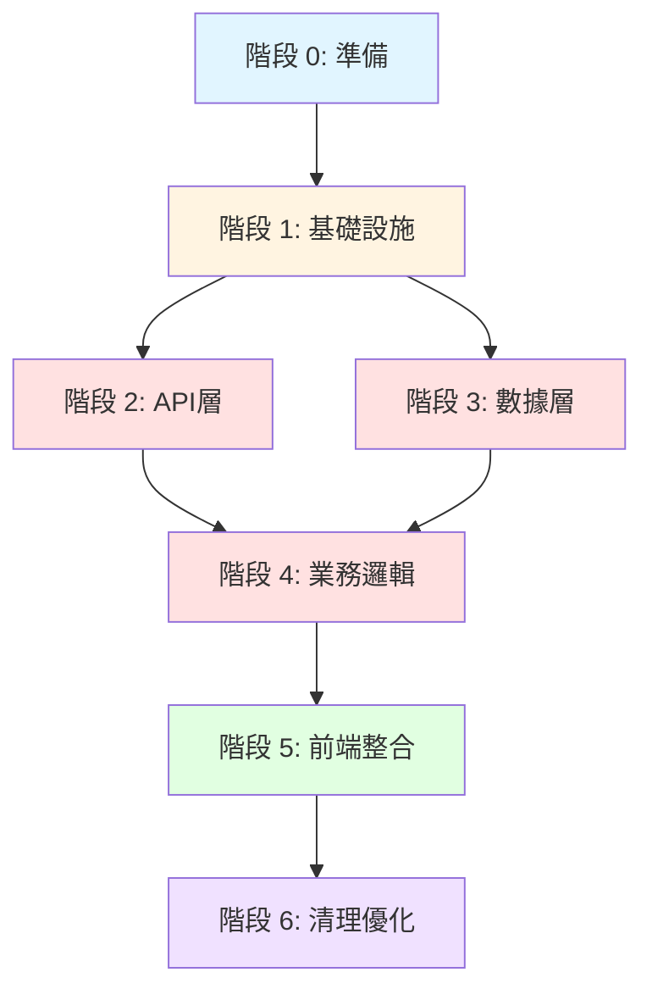
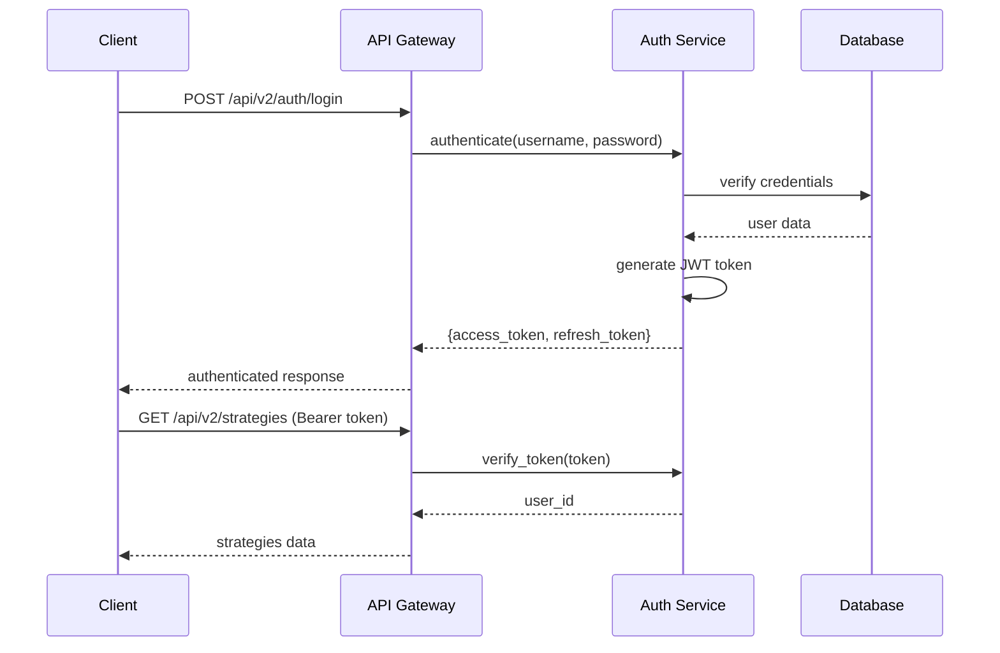
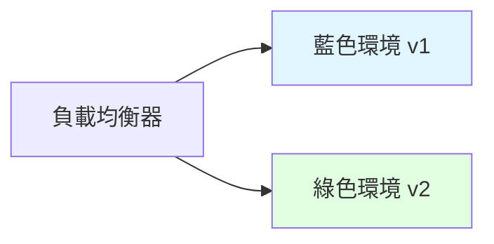
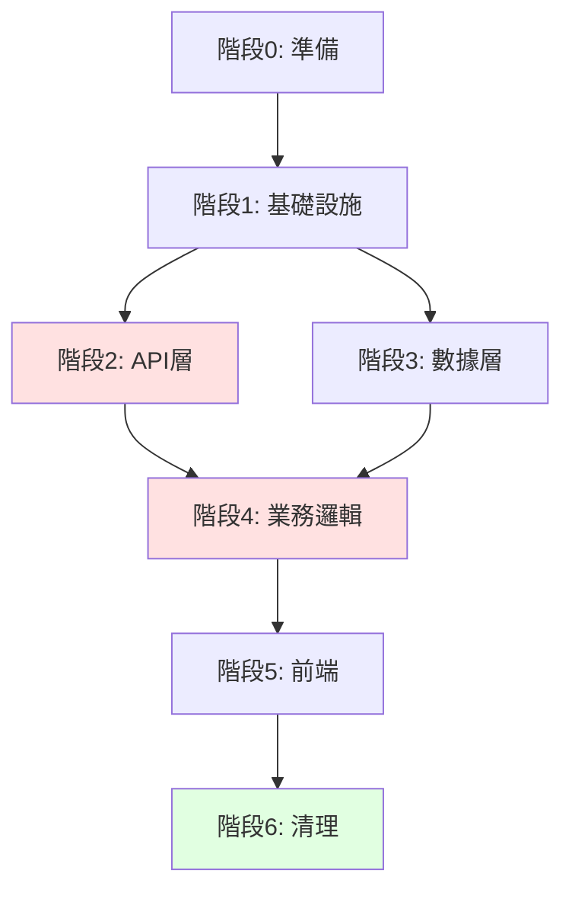

# CBSC 交易系統重構計劃

**創建日期**: 2025-12-24T12:26:09Z
**狀態**: 草案
**版本**: 1.0

---

## 1. 重構概述

### 1.1 背景

根據架構分析報告（`docs/ARCHITECTURE_ANALYSIS_REPORT.md`），CBSC交易系統存在以下核心問題：

| 問題類別 | 具體問題 | 影響範圍 |
|----------|----------|----------|
| **多後端服務** | `backend/` (3004) 和 `src/api/` (3003) 共存 | 維護成本翻倍，API不一致 |
| **重複代碼模組** | 9個主要重複模組 | 代碼膨脹，維護困難 |
| **API版本混亂** | v0, v1, v2 共存 | 客戶端調用混亂 |
| **循環依賴** | frontend → backend → src/api → backend | 啟動失敗，導入錯誤 |
| **數據模型分散** | `backend/models/` 和 `src/models/` | 數據不一致 |

### 1.2 重構目標

1. **統一後端服務** - 合併為單一 FastAPI 應用（端口 3004）
2. **消除重複代碼** - 移除9個重複模組
3. **標準化 API** - 統一為 v2 版本
4. **解決循環依賴** - 重構模組依賴關係
5. **零停機部署** - 確保業務連續性

### 1.3 重構原則

- **漸進式遷移** - 分階段實施，每階段可獨立驗證
- **向後兼容** - 保持舊 API 可用，逐步棄用
- **功能開關** - 使用特性開關控制新功能
- **藍綠部署** - 支持快速回滾
- **測試先行** - 每階段必須通過完整測試

---

## 2. 重構階段劃分

### 2.1 六階段重構路線圖

```
┌─────────────────────────────────────────────────────────────────────────────┐
│                         CBSC 系統重構六階段路線圖                            │
├─────────────────────────────────────────────────────────────────────────────┤
│                                                                             │
│  階段 0: 準備階段 (1週)                                                     │
│  ├─ 建立重構分支                                                            │
│  ├─ 設置監控和告警                                                          │
│  ├─ 建立基線測試套件                                                        │
│  └─ 文檔和完善計劃                                                          │
│                                                                             │
│  階段 1: 基礎設施統一 (2週)                                                  │
│  ├─ 統一配置管理                                                            │
│  ├─ 統一日誌系統                                                            │
│  ├─ 統一錯誤處理                                                            │
│  └─ 建立共享工具庫                                                          │
│                                                                             │
│  階段 2: API 層整合 (3週)                                                   │
│  ├─ 合併後端服務 (backend/ + src/api/)                                      │
│  ├─ API 版本標準化 (統一到 v2)                                              │
│  ├─ 統一認證系統                                                            │
│  └─ API 文檔生成                                                            │
│                                                                             │
│  階段 3: 數據層整合 (2週)                                                   │
│  ├─ 統一數據模型 (backend/models/ + src/models/)                            │
│  ├─ 數據庫遷移腳本                                                          │
│  ├─ 數據驗證規則統一                                                        │
│  └─ 數據訪問層抽象                                                          │
│                                                                             │
│  階段 4: 業務邏輯整合 (3週)                                                 │
│  ├─ 整合策略工廠 (3個版本 → 1個)                                            │
│  ├─ 整合交易模組 (order_manager v1/v2)                                      │
│  ├─ 整合回測引擎                                                            │
│  ├─ 整合 WebSocket 服務                                                     │
│  └─ 服務層抽象                                                              │
│                                                                             │
│  階段 5: 前端整合 (2週)                                                     │
│  ├─ 合併前端項目 (frontend/ + unified-dashboard/)                          │
│  ├─ 統一狀態管理                                                            │
│  ├─ 統一 API 客戶端                                                         │
│  └─ 統一測試框架                                                            │
│                                                                             │
│  階段 6: 清理和優化 (1週)                                                   │
│  ├─ 移除棄用代碼                                                            │
│  ├─ 性能優化                                                                │
│  ├─ 文檔更新                                                                │
│  └─ 最終驗收                                                                │
│                                                                             │
│  總計: 14週 (約3.5個月)                                                    │
└─────────────────────────────────────────────────────────────────────────────┘
```

### 2.2 階段依賴關係



---

## 3. 階段 0: 準備階段 (1週)

### 3.1 目標

建立重構基礎設施，確保可安全回滾。

### 3.2 任務清單

| 任務ID | 任務描述 | 負責人 | 預估時間 | 狀態 |
|--------|----------|--------|----------|------|
| 0.1 | 創建重構分支 `refactor/unified-backend` | Tech Lead | 0.5天 | 待開始 |
| 0.2 | 設置監控儀表板 (Grafana) | DevOps | 1天 | 待開始 |
| 0.3 | 建立基線測試套件 | QA | 2天 | 待開始 |
| 0.4 | 設置功能開關系統 | Backend Dev | 1天 | 待開始 |
| 0.5 | 建立回滾腳本 | DevOps | 0.5天 | 待開始 |

### 3.3 交付物

- [ ] 重構分支已創建並保護
- [ ] 監控儀表板配置完成
- [ ] 基線測試套件建立（覆蓋率 >70%）
- [ ] 功能開關系統可用
- [ ] 回滾腳本已測試

### 3.4 驗收標準

- 能在30分鐘內完成回滾
- 監控覆蓋所有關鍵 API
- 測試套件可在15分鐘內完成

---

## 4. 階段 1: 基礎設施統一 (2週)

### 4.1 目標

建立統一的基礎設施，為後續整合奠定基礎。

### 4.2 任務詳情

#### 4.2.1 統一配置管理

**問題**: 配置文件分散在 `.env`, `.env.prod`, `config/` 等多處

**解決方案**:

```python
# 統一配置結構
src/config/
├── __init__.py
├── base.py              # 基礎配置
├── development.py       # 開發環境
├── production.py        # 生產環境
├── testing.py           # 測試環境
└── settings.py          # 配置加載器
```

**實施步驟**:

1. 創建統一配置模組
2. 遷移所有環境變量到配置類
3. 更新所有導入
4. 添加配置驗證

**遷移命令**:

```bash
# 收集現有配置
find . -name ".env*" -o -name "config.py" | grep -v node_modules > config_files.txt

# 創建新配置結構
mkdir -p src/config
# ... 遷移腳本
```

#### 4.2.2 統一日誌系統

**問題**: 日誌格式不一致，分散在多處

**解決方案**:

```python
# src/utils/logging.py
import structlog
import logging

def configure_logging(service_name: str, level: str = "INFO"):
    """配置統一日誌系統"""
    structlog.configure(
        processors=[
            structlog.stdlib.filter_by_level,
            structlog.stdlib.add_logger_name,
            structlog.stdlib.add_log_level,
            structlog.stdlib.PositionalArgumentsFormatter(),
            structlog.processors.TimeStamper(fmt="iso"),
            structlog.processors.StackInfoRenderer(),
            structlog.processors.format_exc_info,
            structlog.processors.JSONRenderer()
        ],
        context_class=dict,
        logger_factory=structlog.stdlib.LoggerFactory(),
        cache_logger_on_first_use=True,
    )
```

#### 4.2.3 統一錯誤處理

**問題**: 錯誤響應格式不一致

**解決方案**:

```python
# src/core/exceptions.py
from fastapi import HTTPException
from typing import Any, Dict, Optional

class APIError(HTTPException):
    """統一 API 錯誤格式"""

    def __init__(
        self,
        status_code: int,
        code: str,
        message: str,
        details: Optional[Dict[str, Any]] = None
    ):
        self.code = code
        self.message = message
        self.details = details or {}
        super().__init__(status_code=status_code, detail=message)

    def to_dict(self) -> Dict[str, Any]:
        return {
            "success": False,
            "error": {
                "code": self.code,
                "message": self.message,
                "details": self.details
            },
            "timestamp": datetime.utcnow().isoformat()
        }
```

#### 4.2.4 建立共享工具庫

**目錄結構**:

```
src/utils/
├── __init__.py
├── logging.py          # 日誌工具
├── errors.py           # 錯誤處理
├── validators.py       # 數據驗證
├── formatters.py       # 格式化工具
├── cache.py            # 緩存工具
└── security.py         # 安全工具
```

### 4.3 驗收標準

- [ ] 所有服務使用統一配置
- [ ] 日誌格式統一並輸出到 JSON
- [ ] 錯誤響應格式一致
- [ ] 共享工具庫文檔完整

---

## 5. 階段 2: API 層整合 (3週)

### 5.1 目標

合併兩個後端服務，統一 API 版本。

### 5.2 核心任務

#### 5.2.1 合併後端服務

**當前狀態**:

| 服務 | 路徑 | 端口 | 路由數量 |
|------|------|------|----------|
| 新後端 | `backend/` | 3004 | 20 |
| 舊後端 | `src/api/` | 3003 | 多個 |

**目標狀態**:

```
統一後端服務
├── src/api/           # 移動到這裡
│   ├── main.py        # 統一入口 (端口 3004)
│   ├── v1/            # 舊版本 (棄用警告)
│   │   ├── __init__.py
│   │   ├── auth.py
│   │   └── strategies.py
│   ├── v2/            # 當前版本
│   │   ├── __init__.py
│   │   ├── auth/
│   │   ├── strategies/
│   │   ├── backtest/
│   │   ├── trading/
│   │   └── users/
│   └── middleware/    # 中間件
```

**遷移步驟**:

```bash
# 1. 備份現有服務
cp -r backend/ backend-backup-$(date +%Y%m%d)
cp -r src/api/ src/api-backup-$(date +%Y%m%d)

# 2. 創建新的 API 結構
mkdir -p src/api/v1 src/api/v2

# 3. 移動路由文件
# backend/api/* → src/api/v2/
# src/api/* → src/api/v2/ (合併)

# 4. 添加棄用警告到 v1
```

**棄用警告實現**:

```python
# src/api/v1/__init__.py
from fastapi import APIRouter, Header
from typing import Optional

router = APIRouter()

@router.api_route("/{path:path}", methods=["GET", "POST", "PUT", "DELETE"])
async def v1_deprecated_warning(
    path: str,
    x_api_version: Optional[str] = Header(None)
):
    if x_api_version != "1":
        return {
            "warning": "API v1 is deprecated. Please migrate to v2.",
            "migration_guide": "/docs/migration-v1-to-v2"
        }
```

#### 5.2.2 API 版本標準化

**當前混亂狀態**:

```
/api/strategies          # v0 (無版本)
/api/v1/strategies       # v1
/api/strategies/v2/      # v2 (路徑風格)
/api/v2/strategies       # v2 (標準風格)
```

**目標狀態**:

```
/api/v2/strategies       # 唯一版本
/api/v1/strategies       # 舊版本 (帶棄用警告)
```

**遷移映射表** (詳細見 `MIGRATION_CHECKLIST.md`):

| 舊端點 | 新端點 | 狀態 |
|--------|--------|------|
| `GET /api/strategies` | `GET /api/v2/strategies` | 需遷移 |
| `POST /api/backtest` | `POST /api/v2/backtests` | 需遷移 |
| `GET /api/data` | `GET /api/v2/market-data` | 需遷移 |

#### 5.2.3 統一認證系統

**問題**: 3個不同的認證實現

- `backend/api/auth.py`
- `src/api/auth/auth_endpoints_v2.py`
- `src/api/auth_endpoints.py`

**解決方案**:

```
src/api/v2/auth/
├── __init__.py
├── routes.py           # 認證端點
├── service.py          # 認證服務
├── middleware.py       # JWT 中間件
├── models.py           # 認證模型
└── dependencies.py     # 依賴注入
```

**統一認證流程**:



### 5.3 API 端點整合計劃

**第1週**: 遷移認證端點
**第2週**: 遷移策略和回測端點
**第3週**: 遷移其他端點和測試

### 5.4 驗收標準

- [ ] 單一 FastAPI 應用運行在端口 3004
- [ ] 所有 API 有統一的前綴 `/api/v2/`
- [ ] 舊 API 返回棄用警告
- [ ] 認證系統統一
- [ ] API 文檔自動生成 (Swagger/ReDoc)

---

## 6. 階段 3: 數據層整合 (2週)

### 6.1 目標

統一數據模型，建立清晰的數據訪問層。

### 6.2 當前問題

```
backend/models/
├── auth.py
├── api_keys.py
└── webhooks.py

src/models/
├── user.py
├── base.py
└── (其他模型)
```

### 6.3 解決方案

**統一模型結構**:

```
src/models/
├── __init__.py
├── base.py              # Base SQLAlchemy 模型
├── user.py              # 用戶模型
├── strategy.py          # 策略模型
├── backtest.py          # 回測模型
├── trading.py           # 交易模型
├── auth.py              # 認證相關模型
├── api_keys.py          # API 密鑰模型
└── webhooks.py          # Webhook 模型
```

**數據庫遷移腳本**:

```python
# migrations/merge_models.py
"""
Merge backend/models and src/models into unified src/models
"""
from alembic import op
import sqlalchemy as sa

def upgrade():
    # 1. 添加新列（如果需要）
    op.add_column('users', sa.Column('email_verified', sa.Boolean(), default=False))

    # 2. 遷移數據
    op.execute("""
        INSERT INTO src_models_users (id, username, email, created_at)
        SELECT id, username, email, created_at
        FROM backend_models_users
        ON CONFLICT (id) DO UPDATE SET
            email = EXCLUDED.email
    """)

    # 3. 刪除舊表（在確認遷移成功後）
    # op.drop_table('backend_models_users')

def downgrade():
    # 回滾步驟
    op.execute("""
        INSERT INTO backend_models_users (id, username, email, created_at)
        SELECT id, username, email, created_at
        FROM src_models_users
    """)
```

### 6.4 數據驗證規則統一

```python
# src/models/validators.py
from pydantic import BaseModel, validator
from typing import Optional

class UserCreate(BaseModel):
    username: str
    email: str
    password: str

    @validator('username')
    def validate_username(cls, v):
        if len(v) < 3:
            raise ValueError('Username must be at least 3 characters')
        if not v.isalnum():
            raise ValueError('Username must be alphanumeric')
        return v

    @validator('email')
    def validate_email(cls, v):
        if '@' not in v:
            raise ValueError('Invalid email format')
        return v

    @validator('password')
    def validate_password(cls, v):
        if len(v) < 8:
            raise ValueError('Password must be at least 8 characters')
        return v
```

### 6.5 驗收標準

- [ ] 所有模型統一到 `src/models/`
- [ ] 數據庫遷移腳本測試通過
- [ ] 所有模型有 Pydantic 驗證
- [ ] 數據訪問層抽象完整

---

## 7. 階段 4: 業務邏輯整合 (3週)

### 7.1 目標

整合重複的業務邏輯模組。

### 7.2 9個重複模組整合計劃

| 模組 | 重複位置 | 整合策略 | 預估時間 |
|------|----------|----------|----------|
| **策略工廠** | 3個版本 | 保留 `enhanced_factory_v2.py` | 3天 |
| **訂單管理器** | v1/v2 | 遷移到 v2，移除 v1 | 2天 |
| **持倉管理器** | v1/v2 | 遷移到 v2，移除 v1 | 2天 |
| **策略 API** | backend/src/api | 合併到統一 API | 2天 |
| **回測 API** | backend/src/api | 合併到統一 API | 2天 |
| **WebSocket** | 多個實現 | 統一到 `unified_websocket_manager.py` | 3天 |
| **認證服務** | 3個實現 | 階段2已完成 | - |
| **用戶模型** | 2個位置 | 階段3已完成 | - |
| **後端入口** | 2個main.py | 階段2已完成 | - |

### 7.3 策略工廠整合

**當前狀態**:

```
src/strategies/
├── factory.py              # 舊版本
├── enhanced_factory.py     # 增強版本
└── enhanced_factory_v2.py  # 最新版本 ✅
```

**整合步驟**:

1. **分析差異**:
   ```bash
   # 比較三個版本的差異
   diff -u src/strategies/factory.py src/strategies/enhanced_factory_v2.py
   ```

2. **遷移引用**:
   ```python
   # 查找所有舊引用
   grep -r "from.*factory import" src/ --include="*.py"
   grep -r "from.*enhanced_factory import" src/ --include="*.py"

   # 批量替換
   find src/ -name "*.py" -exec sed -i 's/from.*factory import/from src.strategies.enhanced_factory_v2 import/g' {} \;
   ```

3. **測試**:
   ```bash
   # 運行策略測試套件
   pytest src/strategies/tests/ -v
   ```

4. **刪除舊文件**:
   ```bash
   # 在測試通過後
   rm src/strategies/factory.py
   rm src/strategies/enhanced_factory.py
   ```

### 7.4 交易模組整合

**訂單管理器整合**:

```python
# src/trading/order_manager.py (統一版本)
from typing import List, Optional
from src.models.trading import Order, OrderStatus

class OrderManager:
    """統一訂單管理器 (v2)"""

    def __init__(self, db_session):
        self.db = db_session

    async def create_order(self, order_data: dict) -> Order:
        """創建訂單"""
        # v2 邏輯
        pass

    async def cancel_order(self, order_id: int) -> bool:
        """取消訂單"""
        # v2 邏輯
        pass

    # ... 其他方法
```

**遷移腳本**:

```bash
# 更新所有引用
find src/ -name "*.py" -exec sed -i 's/from src.trading.order_manager import/from src.trading.order_manager_v2 as order_manager/g' {} \;
```

### 7.5 WebSocket 服務整合

**當前狀態**:

```
src/websocket/
├── websocket_server.py           # 基礎實現
├── enhanced_websocket_server.py  # 增強實現
├── unified_websocket_manager.py  # 統一管理器 ✅
└── production_websocket_manager.py
```

**整合策略**:

保留 `unified_websocket_manager.py`，添加功能開關：

```python
# src/websocket/manager.py
from src.websocket.unified_websocket_manager import UnifiedWebSocketManager

class WebSocketService:
    """統一 WebSocket 服務"""

    def __init__(self, config):
        self.manager = UnifiedWebSocketManager(config)
        self.use_legacy_mode = config.get('USE_LEGACY_WS', False)

    async def connect(self, websocket, channel):
        if self.use_legacy_mode:
            return await self._connect_legacy(websocket, channel)
        return await self.manager.connect(websocket, channel)
```

### 7.6 驗收標準

- [ ] 9個重複模組全部整合
- [ ] 所有測試通過
- [ ] 代碼覆蓋率 >85%
- [ ] 性能基準測試通過

---

## 8. 階段 5: 前端整合 (2週)

### 8.1 目標

整合3個前端項目到統一結構。

### 8.2 當前狀態

```
frontend/                    # 主前端 (React 18, Redux Toolkit)
unified-dashboard/           # 統一儀表板 (React 18, Zustand)
frontend/strategy-dashboard/ # 策略儀表板 (嵌入式)
```

### 8.3 整合策略

**目標結構**:

```
frontend/
├── src/
│   ├── components/          # 合併所有組件
│   │   ├── Dashboard/
│   │   ├── Strategies/
│   │   ├── Backtest/
│   │   └── Shared/
│   ├── pages/               # 合併所有頁面
│   ├── store/               # 統一狀態管理
│   │   └── slices/
│   ├── services/            # 統一 API 客戶端
│   │   ├── api/
│   │   └── websocket/
│   ├── hooks/               # 合併所有 hooks
│   └── utils/
├── package.json
└── vite.config.ts
```

### 8.4 狀態管理統一

**決策**: 使用 Redux Toolkit (RTK Query)

**原因**:
- 主前端已使用
- 更適合大型應用
- 內建 API 緩存

**遷移步驟**:

```typescript
// frontend/src/store/index.ts
import { configureStore } from '@reduxjs/toolkit';
import { apiSlice } from './slices/apiSlice';
import authReducer from './slices/authSlice';

export const store = configureStore({
  reducer: {
    auth: authReducer,
    [apiSlice.reducerPath]: apiSlice.reducer,
  },
  middleware: (getDefaultMiddleware) =>
    getDefaultMiddleware().concat(apiSlice.middleware),
});

// 遷移 Zustand stores
// unified-dashboard/src/store/* → frontend/src/store/slices/*
```

### 8.5 API 客戶端統一

```typescript
// frontend/src/services/api/index.ts
import axios from 'axios';

const apiClient = axios.create({
  baseURL: process.env.VITE_API_URL || 'http://localhost:3004/api/v2',
  timeout: 30000,
  headers: {
    'Content-Type': 'application/json',
  },
});

// 請求攔截器
apiClient.interceptors.request.use(
  (config) => {
    const token = localStorage.getItem('access_token');
    if (token) {
      config.headers.Authorization = `Bearer ${token}`;
    }
    return config;
  },
  (error) => Promise.reject(error)
);

// 響應攔截器
apiClient.interceptors.response.use(
  (response) => response.data,
  (error) => {
    // 統一錯誤處理
    if (error.response?.status === 401) {
      // 處理認證失敗
    }
    return Promise.reject(error);
  }
);

export default apiClient;
```

### 8.6 組件遷移清單

| 組件 | 來源 | 目標 | 優先級 |
|------|------|------|--------|
| Dashboard | unified-dashboard | frontend/src/pages/Dashboard | P0 |
| ResponsiveLayout | unified-dashboard | frontend/src/components/Layout | P0 |
| StrategyChart | unified-dashboard | frontend/src/components/Charts | P1 |
| DataTable | unified-dashboard | frontend/src/components/Shared | P1 |
| StrategyWizard | unified-dashboard | frontend/src/components/StrategyWizard | P2 |

### 8.7 驗收標準

- [ ] 單一前端應用運行在端口 3000
- [ ] 統一使用 Redux Toolkit
- [ ] 統一 API 客戶端
- [ ] 所有組件遷移完成
- [ ] E2E 測試通過

---

## 9. 階段 6: 清理和優化 (1週)

### 9.1 目標

移除棄用代碼，優化性能，完善文檔。

### 9.2 清理任務

#### 9.2.1 移除棄用代碼

```bash
# 移除舊後端
rm -rf backend/
rm -rf src/api/v1/

# 移除舊策略工廠
rm -f src/strategies/factory.py
rm -f src/strategies/enhanced_factory.py

# 移除舊交易模組
rm -f src/trading/order_manager.py
rm -f src/trading/position_manager.py

# 移除獨立儀表板
rm -rf unified-dashboard/
```

#### 9.2.2 移除棄用 API 端點

```python
# 從路由中移除 v1 端點
# src/api/v2/__init__.py
# 移除所有 v1 路由註冊
```

#### 9.2.3 性能優化

```python
# 1. 數據庫查詢優化
# 添加索引
# src/models/strategy.py
class Strategy(Base):
    __tablename__ = 'strategies'

    # ... 添加索引
    __table_args__ = (
        Index('idx_user_id', 'user_id'),
        Index('idx_status', 'status'),
        Index('idx_created_at', 'created_at'),
    )

# 2. API 響應優化
# 添加分頁
# src/api/v2/strategies/routes.py
@router.get("/strategies")
async def list_strategies(
    page: int = 1,
    page_size: int = 20,
    user_id: Optional[int] = None
):
    # 使用分頁查詢
    pass

# 3. 緩存優化
from functools import lru_cache

@lru_cache(maxsize=128)
def get_strategy_config(strategy_id: int):
    # 緩存策略配置
    pass
```

#### 9.2.4 文檔更新

```bash
# 1. 更新 API 文檔
# 使用自動生成的 OpenAPI 文檔

# 2. 更新開發者文檔
# docs/ARCHITECTURE.md
# docs/API.md
# docs/DEPLOYMENT.md

# 3. 更新 README
```

### 9.3 最終驗收清單

- [ ] 所有棄用代碼已移除
- [ ] 性能測試基準達標
- [ ] API 響應時間 < 200ms (P95)
- [ ] 文檔完整且最新
- [ ] 所有測試通過 (覆蓋率 >85%)
- [ ] 生產部署腳本就緒

---

## 10. 部署策略

### 10.1 藍綠部署



**部署流程**:

1. **準備綠色環境**:
   ```bash
   # 部署新版本到綠色環境
   docker-compose -f docker-compose.green.yml up -d
   ```

2. **驗證綠色環境**:
   ```bash
   # 運行冒煙測試
   ./scripts/smoke-test.sh http://localhost:3005
   ```

3. **切換流量**:
   ```bash
   # 更新負載均衡器配置
   nginx -s reload
   ```

4. **監控指標**:
   - 錯誤率
   - 響應時間
   - CPU/內存使用

5. **回滾或繼續**:
   - 如果錯誤率 > 5%: 回滾
   - 否則: 繼續監控 1小時

### 10.2 功能開關實現

```python
# src/core/feature_flags.py
from functools import wraps
from typing import Callable

class FeatureFlags:
    """功能開關管理"""

    def __init__(self, redis_client):
        self.redis = redis_client

    def is_enabled(self, feature_name: str) -> bool:
        """檢查功能是否啟用"""
        value = self.redis.get(f"feature:{feature_name}")
        return value == b"1"

    def enable(self, feature_name: str):
        """啟用功能"""
        self.redis.set(f"feature:{feature_name}", "1")

    def disable(self, feature_name: str):
        """禁用功能"""
        self.redis.set(f"feature:{feature_name}", "0")

def feature_flag(feature_name: str):
    """功能開關裝飾器"""
    def decorator(func: Callable):
        @wraps(func)
        async def wrapper(*args, **kwargs):
            flags = FeatureFlags(redis_client)
            if not flags.is_enabled(feature_name):
                return {"error": "Feature not enabled"}
            return await func(*args, **kwargs)
        return wrapper
    return decorator

# 使用示例
@router.get("/api/v2/strategies/new-feature")
@feature_flag("new_strategy_ui")
async def new_strategy_feature():
    # 新功能實現
    pass
```

### 10.3 灰度發布

```python
# src/middleware/canary.py
from fastapi import Request
import random

class CanaryDeployment:
    """灰度發布中間件"""

    def __init__(self, canary_percentage: float = 0.1):
        self.canary_percentage = canary_percentage

    async def __call__(self, request: Request, call_next):
        # 檢查是否應該路由到灰度版本
        user_id = request.headers.get("X-User-ID")
        if user_id and self._should_route_to_canary(user_id):
            # 修改請求路由到灰度服務
            request.headers["X-CANARY"] = "true"

        response = await call_next(request)
        return response

    def _should_route_to_canary(self, user_id: str) -> bool:
        """基於用戶 ID 決定是否路由到灰度"""
        # 使用一致性哈希
        hash_value = int(hashlib.md5(user_id.encode()).hexdigest(), 16)
        return (hash_value % 100) < (self.canary_percentage * 100)
```

### 10.4 零停機遷移

**步驟**:

1. **數據庫遷移** (雙寫階段):
   - 新舊表同時寫入
   - 驗證數據一致性
   - 運行1-2週

2. **API 遷移** (代理階段):
   - 使用 API Gateway 代理請求
   - 逐步切換流量
   - 監控錯誤率

3. **前端遷移**:
   - 使用功能開關
   - 灰度發布新版本
   - 監控用戶反饋

4. **清理舊服務**:
   - 確認無流量後下線
   - 保留備份1個月
   - 刪除舊代碼

---

## 11. 時間表和里程碑

### 11.1 總體時間表

| 階段 | 任務 | 開始日期 | 結束日期 | 交付物 |
|------|------|----------|----------|--------|
| 0 | 準備階段 | Week 1 | Week 1 | 重構基礎設施 |
| 1 | 基礎設施統一 | Week 2 | Week 3 | 統一配置、日誌、錯誤處理 |
| 2 | API 層整合 | Week 4 | Week 6 | 統一後端服務 |
| 3 | 數據層整合 | Week 7 | Week 8 | 統一數據模型 |
| 4 | 業務邏輯整合 | Week 9 | Week 11 | 整合重複模組 |
| 5 | 前端整合 | Week 12 | Week 13 | 統一前端應用 |
| 6 | 清理和優化 | Week 14 | Week 14 | 最終交付 |

### 11.2 關鍵里程碑

```
├─ M1: 準備完成 (Week 1)
│  └─ 重構基礎設施就緒，可以開始整合
│
├─ M2: 基礎設施統一 (Week 3)
│  └─ 配置、日誌、錯誤處理統一
│
├─ M3: API 整合完成 (Week 6) ⭐
│  └─ 單一後端服務運行，API 標準化
│
├─ M4: 數據層統一 (Week 8)
│  └─ 數據模型統一，遷移腳本就緒
│
├─ M5: 業務邏輯整合 (Week 11) ⭐
│  └─ 9個重複模組全部整合
│
├─ M6: 前端整合 (Week 13)
│  └─ 單一前端應用
│
└─ M7: 重構完成 (Week 14) ⭐
   └─ 系統完全整合，準備上線
```

### 11.3 依賴關係



---

## 12. 風險管理

詳細風險評估請參考 `RISK_REGISTER.md`。

### 12.1 關鍵風險

| 風險 | 影響 | 緩解措施 |
|------|------|----------|
| 數據遷移失敗 | 高 | 完整備份，雙寫驗證 |
| API 不兼容 | 高 | 版本控制，棄用警告 |
| 性能下降 | 中 | 性能測試，優化查詢 |
| 延期 | 中 | 緩衝時間，優先級管理 |

---

## 13. 溝通計劃

### 13.1 幹係人

| 角色 | 姓名 | 職責 |
|------|------|------|
| 項目經理 | PM | 整體協調 |
| 技術負責人 | Tech Lead | 技術決策 |
| 後端開發 | Backend Dev | API 整合 |
| 前端開發 | Frontend Dev | 前端整合 |
| QA 工程師 | QA | 測試驗證 |
| DevOps | DevOps | 部署運維 |

### 13.2 溝通頻率

- **每日站會**: 15分鐘，同步進度
- **每週審視**: 1小時，檢查里程碑
- **階段評審**: 每階段結束，2小時
- **幹係人更新**: 每週，郵件報告

### 13.3 報告格式

```
# 週報 - Week X

## 本週完成
- [ ] 任務1
- [ ] 任務2

## 下週計劃
- [ ] 任務3
- [ ] 任務4

## 阻塞問題
- 問題描述 | 負責人 | 預計解決時間

## 風險提示
- 風險描述 | 影響 | 緩解措施
```

---

## 14. 成功標準

### 14.1 技術指標

| 指標 | 目標 | 測量方法 |
|------|------|----------|
| 代碼重複率 | <5% | SonarQube |
| 測試覆蓋率 | >85% | pytest coverage |
| API 響應時間 | <200ms (P95) | Prometheus |
| 錯誤率 | <0.1% | Sentry |
| 服務可用性 | >99.9% | Uptime monitoring |

### 14.2 業務指標

| 指標 | 目標 | 測量方法 |
|------|------|----------|
| 功能完整性 | 100% | 功能對照表 |
| 向後兼容性 | 100% | API 兼容性測試 |
| 用戶影響 | 0停機 | 部署監控 |
| 文檔完整性 | 100% | 文檔審查 |

### 14.3 驗收標準

- [ ] 所有階段完成並驗收
- [ ] 所有測試通過
- [ ] 性能基準達標
- [ ] 文檔完整
- [ ] 幹係人確認

---

## 15. 附錄

### 15.1 相關文檔

- `ARCHITECTURE_ANALYSIS_REPORT.md` - 架構分析報告
- `MIGRATION_CHECKLIST.md` - 遷移檢查清單
- `ROLLBACK_PROCEDURE.md` - 回滾程序
- `TEST_PLAN.md` - 測試計劃
- `RISK_REGISTER.md` - 風險登記冊

### 15.2 命令速查

```bash
# 創建重構分支
git checkout -b refactor/unified-backend

# 運行測試
pytest tests/ -v --cov=src

# 部署到測試環境
./scripts/deploy.sh staging

# 監控日誌
tail -f logs/app.log | jq '.'

# 檢查服務健康
curl http://localhost:3004/health

# 回滾
./scripts/rollback.sh
```

### 15.3 聯繫方式

- **項目倉庫**: https://github.com/your-org/cbsc-trading
- **問題追蹤**: GitHub Issues
- **文檔**: `docs/`
- **技術支持**: tech-support@cbsc.com

---

**文檔版本**: 1.0
**最後更新**: 2025-12-24T12:26:09Z
**下次審視**: 2025-12-31
