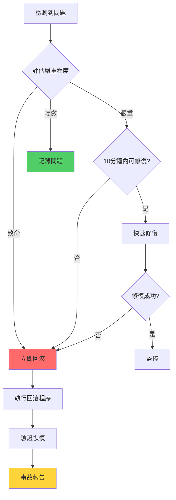

# CBSC 交易系統回滾程序

**創建日期**: 2025-12-24T12:26:09Z
**狀態**: 草案
**版本**: 1.0

---

## 1. 概述

本文檔定義 CBSC 交易系統重構項目的回滾程序，確保在出現問題時能快速恢復到穩定狀態。

### 1.1 回滾目標

- **RTO** (Recovery Time Objective): < 30 分鐘
- **RPO** (Recovery Point Objective): < 5 分鐘數據丟失
- **成功率**: > 95%

### 1.2 回滾原則

1. **快速優先** - 優先恢復服務，再分析問題
2. **數據保護** - 確保數據不丟失或不損壞
3. **可重複** - 回滾程序應可重複執行
4. **可驗證** - 每步都有驗證點

---

## 2. 回滾觸發條件

### 2.1 自動觸發條件

| 指標 | 閾值 | 持續時間 | 動作 |
|------|------|----------|------|
| 錯誤率 | > 5% | 5 分鐘 | 自動回滾 |
| 響應時間 (P95) | > 2 秒 | 10 分鐘 | 自動回滾 |
| 服務可用性 | < 99% | 5 分鐘 | 自動回滾 |
| 數據庫連接 | 失敗率 > 10% | 3 分鐘 | 自動回滾 |

### 2.2 手動觸發條件

**必須立即回滾的情況**:
- 數據損壞或丟失
- 安全漏洞被利用
- 支付/交易功能異常
- 用戶無法訪問核心功能

**應考慮回滾的情況**:
- 關鍵功能不可用
- 性能嚴務下降
- 大量用戶投訴
- 無法快速修復的 Bug

### 2.3 不需要回滾的情況

- 非關鍵功能的小問題
- 可以快速修復的 Bug (10 分鐘內)
- UI/Display 問題
- 日誌/監控問題

---

## 3. 回滾決策流程



---

## 4. 回滾前準備

### 4.1 檢查清單

在執行回滾前，確認以下項目:

```bash
#!/bin/bash
# scripts/pre-rollback-check.sh

echo "=== 回滾前檢查 ==="

# 1. 確認當前版本
CURRENT_VERSION=$(git describe --tags --always)
echo "當前版本: $CURRENT_VERSION"

# 2. 確認回滾目標版本
ROLLBACK_VERSION=${1:-$(git tag --sort=-creatordate | head -n 2 | tail -n 1)}
echo "回滾目標版本: $ROLLBACK_VERSION"

# 3. 檢查數據庫備份
LATEST_BACKUP=$(ls -t backups/ | head -n 1)
echo "最新備份: $LATEST_BACKUP"
if [ -z "$LATEST_BACKUP" ]; then
    echo "❌ 沒有找到數據庫備份！"
    exit 1
fi

# 4. 檢查當前數據庫連接
if ! psql -h localhost -U cbsc -d cbsc -c "SELECT 1" > /dev/null 2>&1; then
    echo "❌ 無法連接到數據庫！"
    exit 1
fi

# 5. 記錄當前數據庫狀態
echo "記錄當前數據庫狀態..."
psql -h localhost -U cbsc -d cbsc -c "
    SELECT
        schemaname,
        tablename,
        n_live_tup AS row_count
    FROM pg_stat_user_tables
    ORDER BY tablename
" > /tmp/db-state-before-rollback.txt

# 6. 記錄當前遷移版本
alembic current > /tmp/migration-before-rollback.txt

echo "✅ 回滾前檢查完成"
echo "準備回滾到: $ROLLBACK_VERSION"
```

### 4.2 創建回滾點

```bash
#!/bin/bash
# scripts/create-rollback-point.sh

TAG="rollback-point-$(date +%Y%m%d-%H%M%S)"
COMMIT_HASH=$(git rev-parse HEAD)

echo "創建回滾點: $TAG"

# 1. 創建 Git 標籤
git tag -a "$TAG" -m "Rollback point before deployment"
git push origin "$TAG"

# 2. 備份當前數據庫
BACKUP_FILE="backups/db-$TAG.sql"
pg_dump -h localhost -U cbsc cbsc > "$BACKUP_FILE"
gzip "$BACKUP_FILE"

# 3. 備份配置文件
cp -r .env .env.backup-$TAG
cp -r config/ config.backup-$TAG/

# 4. 記錄當前部署信息
cat > rollback-info-$TAG.txt << EOF
Rollback Point: $TAG
Created: $(date)
Git Commit: $COMMIT_HASH
Database Backup: ${BACKUP_FILE}.gz
Config Backup: .env.backup-$TAG
EOF

echo "✅ 回滾點創建完成: $TAG"
```

---

## 5. 回滾程序

### 5.1 阶段 1-2 回滾 (準備/基礎設施)

**影響範圍**: 配置、日誌、錯誤處理

**回滾步驟**:

```bash
#!/bin/bash
# scripts/rollback-phase-1-2.sh

echo "回滾階段 1-2: 準備和基礎設施"

# 1. 恢復配置文件
if [ -f ".env.backup-rollback-point-YYYYMMDD-HHMMSS" ]; then
    cp .env.backup-rollback-point-YYYYMMDD-HHMMSS .env
    echo "✅ 配置文件已恢復"
else
    echo "⚠️  未找到配置備份，使用默認配置"
fi

# 2. 恢復日誌配置
# 如果更改了日誌配置，恢復舊版本
git checkout HEAD~1 src/utils/logging.py

# 3. 重啟服務
systemctl restart cbsc-api
systemctl restart cbsc-worker

# 4. 驗證服務
curl -f http://localhost:3004/health || exit 1

echo "✅ 階段 1-2 回滾完成"
```

### 5.2 阶段 3 回滾 (API 層)

**影響範圍**: API 端點、路由、認證

**回滾步驟**:

```bash
#!/bin/bash
# scripts/rollback-phase-3.sh

echo "回滾階段 3: API 層"

# 1. 切換到前一個穩定版本
ROLLBACK_TAG=${1:-"rollback-point-YYYYMMDD-HHMMSS"}

git checkout $ROLLBACK_TAG

# 2. 重新安裝依賴
pip install -r requirements.txt

# 3. 恢復數據庫遷移 (如果需要)
alembic downgrade -1

# 4. 重啟 API 服務
systemctl restart cbsc-api

# 5. 驗證 API 端點
ENDPOINTS=(
    "/api/v2/strategies"
    "/api/v2/auth/health"
    "/api/v2/backtests"
)

for endpoint in "${ENDPOINTS[@]}"; do
    STATUS=$(curl -s -o /dev/null -w "%{http_code}" http://localhost:3004$endpoint)
    if [ "$STATUS" != "200" ]; then
        echo "❌ 端點 $endpoint 返回 $STATUS"
        exit 1
    fi
done

echo "✅ 階段 3 回滾完成"
```

### 5.3 阶段 4 回滾 (數據層)

**影響範圍**: 數據模型、數據庫結構

**回滾步驟**:

```bash
#!/bin/bash
# scripts/rollback-phase-4.sh

echo "回滾階段 4: 數據層"

# 1. 停止所有寫入操作
systemctl stop cbsc-api
systemctl stop cbsc-worker

# 2. 選擇回滾策略
echo "選擇數據回滾策略:"
echo "1) 恢復完整備份 (數據會丟失)"
echo "2) 回滾遷移腳本 (保留數據)"
read -p "選擇 (1 或 2): " STRATEGY

if [ "$STRATEGY" = "1" ]; then
    # 完整備份恢復
    BACKUP_FILE=${1:-"backups/db-latest.sql.gz"}

    echo "恢復數據庫備份..."
    gunzip -c "$BACKUP_FILE" | psql -h localhost -U cbsc cbsc

    # 更新遷移版本
    alembic stamp head

elif [ "$STRATEGY" = "2" ]; then
    # 回滾遷移
    echo "回滾最後一次遷移..."
    alembic downgrade -1

    # 驗證數據完整性
    python scripts/validate_data_integrity.py

else
    echo "無效選擇"
    exit 1
fi

# 3. 重啟服務
systemctl start cbsc-api
systemctl start cbsc-worker

# 4. 驗證數據庫連接
psql -h localhost -U cbsc -d cbsc -c "SELECT COUNT(*) FROM users" || exit 1

echo "✅ 階段 4 回滾完成"
```

### 5.4 阶段 5 回滾 (業務邏輯)

**影響範圍**: 策略、回測、交易模組

**回滾步驟**:

```bash
#!/bin/bash
# scripts/rollback-phase-5.sh

echo "回滾階段 5: 業務邏輯"

# 1. 恢復代碼版本
git checkout $ROLLBACK_TAG

# 2. 如果合併了模組，恢復分離狀態
if [ -f "src/strategies/factory.py.merged" ]; then
    mv src/strategies/factory.py.merged src/strategies/factory.py.bak
    git checkout HEAD~1 src/strategies/factory.py
fi

# 3. 恢復策略工廠
if [ ! -f "src/strategies/enhanced_factory_v2.py" ]; then
    git checkout HEAD~1 src/strategies/enhanced_factory_v2.py
fi

# 4. 恢復交易模組
if [ ! -f "src/trading/order_manager_v2.py" ]; then
    git checkout HEAD~1 src/trading/order_manager_v2.py
fi

# 5. 重新安裝依賴
pip install -r requirements.txt

# 6. 運行測試
pytest src/strategies/tests/ -v || exit 1
pytest src/trading/tests/ -v || exit 1

# 7. 重啟服務
systemctl restart cbsc-api
systemctl restart cbsc-worker

echo "✅ 階段 5 回滾完成"
```

### 5.5 阶段 6 回滾 (前端)

**影響範圍**: 前端應用、狀態管理

**回滾步驟**:

```bash
#!/bin/bash
# scripts/rollback-phase-6.sh

echo "回滾階段 6: 前端"

# 1. 恢復前端代碼
cd frontend
git checkout $ROLLBACK_TAG

# 2. 恢復依賴
rm -rf node_modules package-lock.json
npm install

# 3. 構建生產版本
npm run build

# 4. 重新部署前端
# 如果使用 Nginx
cp -r dist/* /var/www/html/cbsc/

# 如果使用 Docker
docker-compose down
docker-compose up -d

# 5. 驗證前端
curl -f http://localhost:3000/ || exit 1

echo "✅ 階段 6 回滾完成"
```

---

## 6. 自動化回滾腳本

### 6.1 完整回滾腳本

```bash
#!/bin/bash
# scripts/auto-rollback.sh

set -e

ROLLBACK_TAG=${1:-"rollback-point-latest"}
PHASE=${2:-"all"}

echo "=========================================="
echo "  CBSC 系統自動回滾"
echo "=========================================="
echo "回滾到: $ROLLBACK_TAG"
echo "階段: $PHASE"
echo ""

# 顏色定義
RED='\033[0;31m'
GREEN='\033[0;32m'
YELLOW='\033[1;33m'
NC='\033[0m' # No Color

# 日誌函數
log_info() {
    echo -e "${GREEN}[INFO]${NC} $1"
}

log_warn() {
    echo -e "${YELLOW}[WARN]${NC} $1"
}

log_error() {
    echo -e "${RED}[ERROR]${NC} $1"
}

# 檢查回滾點是否存在
if ! git rev-parse "$ROLLBACK_TAG" >/dev/null 2>&1; then
    log_error "回滾點 $ROLLBACK_TAG 不存在"
    log_info "可用的回滾點:"
    git tag -l "rollback-point-*" | sort -r
    exit 1
fi

# 記錄回滾開始時間
START_TIME=$(date +%s)

# 執行回滾
log_info "開始回滾流程..."

# 1. 通知團隊
log_info "發送回滾通知..."
# ./scripts/send-notification.sh "開始回滾到 $ROLLBACK_TAG"

# 2. 執行回滾前檢查
log_info "執行回滾前檢查..."
./scripts/pre-rollback-check.sh || {
    log_error "回滾前檢查失敗"
    exit 1
}

# 3. 停止服務
log_info "停止服務..."
systemctl stop cbsc-api
systemctl stop cbsc-worker
# systemctl stop cbsc-frontend

# 4. 執行具體階段回滾
case $PHASE in
    "phase-1-2"|"1-2")
        ./scripts/rollback-phase-1-2.sh
        ;;
    "phase-3"|"3")
        ./scripts/rollback-phase-3.sh "$ROLLBACK_TAG"
        ;;
    "phase-4"|"4")
        ./scripts/rollback-phase-4.sh
        ;;
    "phase-5"|"5")
        ./scripts/rollback-phase-5.sh
        ;;
    "phase-6"|"6")
        ./scripts/rollback-phase-6.sh
        ;;
    "all")
        ./scripts/rollback-phase-1-2.sh
        ./scripts/rollback-phase-3.sh "$ROLLBACK_TAG"
        ./scripts/rollback-phase-4.sh
        ./scripts/rollback-phase-5.sh
        ./scripts/rollback-phase-6.sh
        ;;
    *)
        log_error "未知階段: $PHASE"
        exit 1
        ;;
esac

# 5. 啟動服務
log_info "啟動服務..."
systemctl start cbsc-api
systemctl start cbsc-worker
# systemctl start cbsc-frontend

# 6. 等待服務啟動
log_info "等待服務啟動..."
sleep 30

# 7. 驗證服務健康
log_info "驗證服務健康..."
./scripts/post-rollback-check.sh || {
    log_error "服務健康檢查失敗"
    exit 1
}

# 8. 運行冒煙測試
log_info "運行冒煙測試..."
./scripts/smoke-test.sh || {
    log_warn "冒煙測試失敗，但服務已回滾"
}

# 9. 通知團隊完成
END_TIME=$(date +%s)
DURATION=$((END_TIME - START_TIME))
log_info "回滾完成！耗時: ${DURATION} 秒"
# ./scripts/send-notification.sh "回滾完成到 $ROLLBACK_TAG"

# 10. 生成回滾報告
cat > rollback-report-$(date +%Y%m%d-%H%M%S).txt << EOF
回滾報告
================
回滾目標: $ROLLBACK_TAG
執行時間: $(date)
耗時: ${DURATION} 秒
執行者: $(whoami)
階段: $PHASE

狀態: ✅ 成功

下一步:
1. 分析失敗原因
2. 修復問題
3. 重新部署
EOF

echo ""
log_info "=========================================="
log_info "  回滾成功完成！"
log_info "=========================================="
```

### 6.2 監控腳本 (自動觸發)

```python
# scripts/monitor_rollback_trigger.py
"""
自動監控並在達到閾值時觸發回滾
"""
import time
import requests
import subprocess
from datetime import datetime, timedelta

class RollbackMonitor:
    """回滾監控器"""

    def __init__(self):
        self.error_threshold = 0.05  # 5% 錯誤率
        self.latency_threshold = 2.0  # 2 秒響應時間
        self.availability_threshold = 0.99  # 99% 可用性
        self.consecutive_failures = 0
        self.max_consecutive_failures = 3

    def check_metrics(self):
        """檢查關鍵指標"""
        try:
            # 檢查健康端點
            response = requests.get(
                "http://localhost:3004/health",
                timeout=5
            )

            if response.status_code != 200:
                self.consecutive_failures += 1
                print(f"❌ 健康檢查失敗: {response.status_code}")
                return False

            # 解析指標
            metrics = response.json()

            error_rate = metrics.get("error_rate", 0)
            latency = metrics.get("latency_p95", 0)
            availability = metrics.get("availability", 1.0)

            # 檢查閾值
            issues = []

            if error_rate > self.error_threshold:
                issues.append(f"錯誤率過高: {error_rate:.2%}")

            if latency > self.latency_threshold:
                issues.append(f"響應時間過長: {latency:.2f}s")

            if availability < self.availability_threshold:
                issues.append(f"可用性過低: {availability:.2%}")

            if issues:
                self.consecutive_failures += 1
                for issue in issues:
                    print(f"⚠️  {issue}")

                if self.consecutive_failures >= self.max_consecutive_failures:
                    print("❌ 達到最大連續失敗次數，觸發回滾")
                    self.trigger_rollback()
                    return False
            else:
                self.consecutive_failures = 0

            return True

        except Exception as e:
            self.consecutive_failures += 1
            print(f"❌ 監控異常: {e}")

            if self.consecutive_failures >= self.max_consecutive_failures:
                self.trigger_rollback()
                return False

            return False

    def trigger_rollback(self):
        """觸發回滾"""
        print("🚨 觸發自動回滾！")

        # 執行回滾腳本
        try:
            result = subprocess.run(
                ["./scripts/auto-rollback.sh", "rollback-point-latest", "all"],
                capture_output=True,
                text=True,
                timeout=1800  # 30 分鐘超時
            )

            if result.returncode == 0:
                print("✅ 自動回滾成功")
            else:
                print(f"❌ 自動回滾失敗: {result.stderr}")

        except subprocess.TimeoutExpired:
            print("❌ 回滾超時，請手動介入！")

    def run(self, interval=60):
        """運行監控"""
        print("開始監控...")
        print(f"檢查間隔: {interval} 秒")
        print(f"錯誤率閾值: {self.error_threshold:.2%}")
        print(f"響應時間閾值: {self.latency_threshold} 秒")
        print(f"可用性閾值: {self.availability_threshold:.2%}")
        print("")

        while True:
            self.check_metrics()
            time.sleep(interval)

if __name__ == "__main__":
    monitor = RollbackMonitor()
    monitor.run(interval=60)
```

---

## 7. 回滾後驗證

### 7.1 健康檢查腳本

```bash
#!/bin/bash
# scripts/post-rollback-check.sh

echo "=== 回滾後驗證 ==="

# 1. 檢查服務狀態
echo "檢查服務狀態..."
if ! systemctl is-active --quiet cbsc-api; then
    echo "❌ API 服務未運行"
    exit 1
fi

if ! systemctl is-active --quiet cbsc-worker; then
    echo "❌ Worker 服務未運行"
    exit 1
fi

# 2. 檢查 API 端點
echo "檢查 API 端點..."
HEALTH_CHECK=$(curl -s http://localhost:3004/health)
if [ $? -ne 0 ]; then
    echo "❌ 無法訪問健康端點"
    exit 1
fi

# 解析 JSON 檢查狀態
HEALTHY=$(echo $HEALTH_CHECK | jq -r '.status')
if [ "$HEALTHY" != "healthy" ]; then
    echo "❌ 服務狀態不健康: $HEALTHY"
    exit 1
fi

# 3. 檢查數據庫連接
echo "檢查數據庫連接..."
DB_CHECK=$(psql -h localhost -U cbsc -d cbsc -t -c "SELECT 1" 2>&1)
if [ $? -ne 0 ]; then
    echo "❌ 數據庫連接失敗"
    exit 1
fi

# 4. 檢查關鍵功能
echo "檢查關鍵功能..."
AUTH_CHECK=$(curl -s -o /dev/null -w "%{http_code}" http://localhost:3004/api/v2/auth/health)
if [ "$AUTH_CHECK" != "200" ]; then
    echo "❌ 認證服務異常"
    exit 1
fi

# 5. 檢查 Redis 連接
echo "檢查 Redis 連接..."
if ! redis-cli -h localhost ping | grep -q PONG; then
    echo "❌ Redis 連接失敗"
    exit 1
fi

# 6. 檢查日誌
echo "檢查錯誤日誌..."
ERROR_COUNT=$(journalctl -u cbsc-api --since "5 minutes ago" | grep -i "error\|critical" | wc -l)
if [ $ERROR_COUNT -gt 10 ]; then
    echo "⚠️  過多錯誤日誌: $ERROR_COUNT"
fi

echo "✅ 所有檢查通過！"
echo ""
echo "回滾後狀態:"
echo "  API: 運行中"
echo "  數據庫: 連接正常"
echo "  Redis: 連接正常"
echo "  服務狀態: 健康"
```

### 7.2 數據完整性驗證

```python
# scripts/verify_data_integrity.py
"""
驗證回滾後的數據完整性
"""
import psycopg2
from datetime import datetime

def verify_data_integrity():
    """驗證數據完整性"""
    conn = psycopg2.connect(
        host="localhost",
        database="cbsc",
        user="cbsc",
        password="your_password"
    )

    cur = conn.cursor()

    issues = []

    # 1. 檢查外鍵約束
    print("檢查外鍵約束...")
    cur.execute("""
        SELECT
            tc.table_name,
            kcu.column_name,
            ccu.table_name AS foreign_table
        FROM information_schema.table_constraints tc
        JOIN information_schema.key_column_usage kcu
            ON tc.constraint_name = kcu.constraint_name
        JOIN information_schema.constraint_column_usage ccu
            ON ccu.constraint_name = tc.constraint_name
        WHERE tc.constraint_type = 'FOREIGN KEY'
    """)

    for table, column, foreign_table in cur.fetchall():
        cur.execute(f"""
            SELECT COUNT(*)
            FROM {table}
            LEFT JOIN {foreign_table}
                ON {table}.{column} = {foreign_table}.id
            WHERE {foreign_table}.id IS NULL
            AND {table}.{column} IS NOT NULL
        """)

        orphan_count = cur.fetchone()[0]
        if orphan_count > 0:
            issues.append(f"孤立記錄: {table}.{column} -> {foreign_table} ({orphan_count} 條)")

    # 2. 檢查關鍵表的記錄數
    print("檢查關鍵表記錄數...")
    tables = ['users', 'strategies', 'backtests', 'orders', 'positions']

    for table in tables:
        cur.execute(f"SELECT COUNT(*) FROM {table}")
        count = cur.fetchone()[0]
        print(f"  {table}: {count} 條記錄")

    # 3. 檢查最新數據
    print("檢查最新數據...")
    cur.execute("""
        SELECT
            tablename,
            n_live_tup AS row_count
        FROM pg_stat_user_tables
        ORDER BY tablename
    """)

    print("\n數據庫統計:")
    for table, count in cur.fetchall():
        print(f"  {table}: {count} 活躍行")

    # 4. 檢查數據一致性
    print("\n檢查數據一致性...")
    cur.execute("""
        SELECT
            schemaname,
            tablename,
            n_dead_tup AS dead_rows
        FROM pg_stat_user_tables
        WHERE n_dead_tup > 1000
    """)

    dead_rows = cur.fetchall()
    if dead_rows:
        print("⚠️  發現大量死行:")
        for schema, table, count in dead_rows:
            print(f"  {schema}.{table}: {count} 死行")
            issues.append(f"過多死行: {schema}.{table}")

    cur.close()
    conn.close()

    if issues:
        print("\n❌ 發現問題:")
        for issue in issues:
            print(f"  - {issue}")
        return False
    else:
        print("\n✅ 數據完整性驗證通過")
        return True

if __name__ == "__main__":
    verify_data_integrity()
```

### 7.3 功能驗證測試

```python
# scripts/smoke_test.py
"""
回滾後的冒煙測試
"""
import requests
import json

BASE_URL = "http://localhost:3004/api/v2"

def test_auth_health():
    """測試認證健康"""
    response = requests.get(f"{BASE_URL}/auth/health")
    assert response.status_code == 200
    assert response.json()["status"] == "healthy"
    print("✅ 認證健康檢查通過")

def test_strategies_list():
    """測試策略列表"""
    response = requests.get(f"{BASE_URL}/strategies")
    assert response.status_code == 200
    assert "data" in response.json()
    print("✅ 策略列表通過")

def test_portfolio_summary():
    """測試投資組合摘要"""
    response = requests.get(f"{BASE_URL}/portfolio/summary")
    assert response.status_code in [200, 401]  # 可能需要認證
    print("✅ 投資組合摘要通過")

def test_market_data():
    """測試市場數據"""
    response = requests.get(f"{BASE_URL}/market-data?symbol=AAPL")
    assert response.status_code in [200, 404]
    print("✅ 市場數據通過")

def run_all_tests():
    """運行所有測試"""
    tests = [
        test_auth_health,
        test_strategies_list,
        test_portfolio_summary,
        test_market_data,
    ]

    failed = []

    for test in tests:
        try:
            test()
        except AssertionError as e:
            print(f"❌ {test.__name__} 失敗: {e}")
            failed.append(test.__name__)
        except Exception as e:
            print(f"❌ {test.__name__} 錯誤: {e}")
            failed.append(test.__name__)

    if failed:
        print(f"\n❌ {len(failed)} 個測試失敗:")
        for name in failed:
            print(f"  - {name}")
        return False
    else:
        print(f"\n✅ 所有 {len(tests)} 個測試通過")
        return True

if __name__ == "__main__":
    success = run_all_tests()
    exit(0 if success else 1)
```

---

## 8. 回滾後行動

### 8.1 事故報告模板

```markdown
# 事故報告 - [日期]

## 基本信息
- **事故 ID**: INC-[YYYYMMDD]-[序號]
- **發生時間**: YYYY-MM-DD HH:MM:SS
- **檢測時間**: YYYY-MM-DD HH:MM:SS
- **回滾時間**: YYYY-MM-DD HH:MM:SS
- **恢復時間**: YYYY-MM-DD HH:MM:SS
- **總停機時間**: X 分鐘

## 影響範圍
- **影響用戶**: [數量]
- **影響區域**: [地區/服務]
- **影響功能**: [功能列表]

## 事故描述
[詳細描述事故現象]

## 根本原因
[分析根本原因]

## 回滾過程
1. [時間] - 檢測到問題
2. [時間] - 決定回滾
3. [時間] - 執行回滾
4. [時間] - 驗證恢復

## 後續行動
- [ ] 修復根本原因
- [ ] 添加監控告警
- [ ] 更新文檔
- [ ] 團隊培訓

## 預防措施
[列出預防再次發生的措施]
```

### 8.2 回滾後檢查清單

- [ ] 運行健康檢查腳本
- [ ] 運行數據完整性驗證
- [ ] 運行冒煙測試
- [ ] 檢查日誌中的錯誤
- [ ] 驗證關鍵業務流程
- [ ] 通知用戶 (如需要)
- [ ] 創建事故報告
- [ | 安排事故後審視會議

### 8.3 事故後審視

**會議議程**:

1. 事故時間線回顧
2. 根本原因分析
3. 回滾過程評估
4. 識別改進機會
5. 制定行動項目
6. 分配責任人和截止日期

**改進項目追蹤**:

| 項目 | 描述 | 負責人 | 截止日期 | 狀態 |
|------|------|--------|----------|------|
| 添加監控 | 添加 X 指標監控 | DevOps | YYYY-MM-DD | 待辦 |
| 更新文檔 | 更新回滾文檔 | Tech Lead | YYYY-MM-DD | 待辦 |
| 代碼審查 | 加強代碼審查流程 | Tech Lead | YYYY-MM-DD | 待辦 |

---

## 9. 最佳實踐

### 9.1 減少回滾需求

1. **漸進式部署** - 逐步推出新版本
2. **功能開關** - 快速禁用有問題的功能
3. **充分測試** - 在部署前進行全面測試
4. **監控告警** - 及早發現問題
5. **負載測試** - 驗證系統容量

### 9.2 加快回滾速度

1. **自動化腳本** - 減少手動操作
2. **預創建回滾點** - 定期創建穩定版本標籤
3. **文檔完善** - 清晰的步驟和檢查清單
4. **定期演練** - 每月進行回滾演練
5. **快速決策** - 明確的回滾觸發條件

### 9.3 回滾後學習

1. **根本原因分析** - 使用 5 Whys 方法
2. **改進流程** - 基於經驗改進流程
3. **知識分享** - 與團隊分享經驗
4. **更新檢查清單** - 將新學習加入檢查清單

---

## 10. 附錄

### 10.1 回滾命令速查

```bash
# 快速回滾到上一個版本
./scripts/auto-rollback.sh rollback-point-latest

# 回滾特定階段
./scripts/auto-rollback.sh rollback-point-20241224-120000 phase-3

# 查看可用回滾點
git tag -l "rollback-point-*" | sort -r

# 手動創建回滾點
./scripts/create-rollback-point.sh

# 運行回滾前檢查
./scripts/pre-rollback-check.sh

# 運行回滾後驗證
./scripts/post-rollback-check.sh
```

### 10.2 回滾決策樹

```
問題檢測
    │
    ├─ 致命問題 (數據丟失、安全漏洞)
    │   └─ → 立即回滾
    │
    ├─ 嚴重問題 (核心功能不可用)
    │   └─ → 10分鐘內可修復?
    │       ├─ 是 → 快速修復
    │       └─ 否 → 回滾
    │
    └─ 輕微問題 (非關鍵功能)
        └─ → 記錄問題，延後修復
```

---

**文檔版本**: 1.0
**最後更新**: 2025-12-24T12:26:09Z
**審視周期**: 每次重大回滾後
