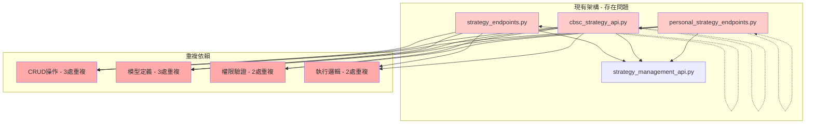
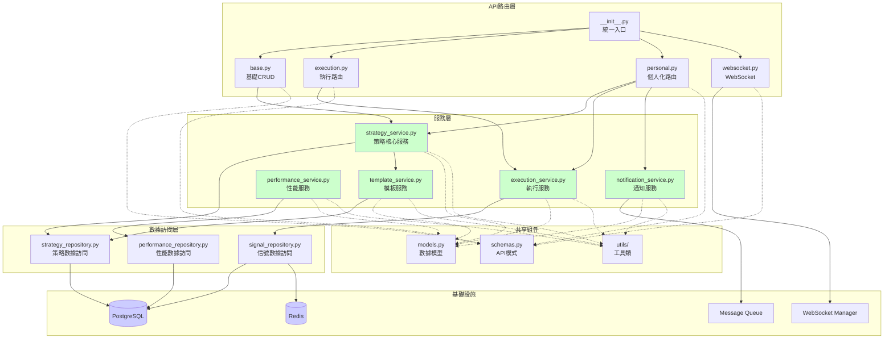
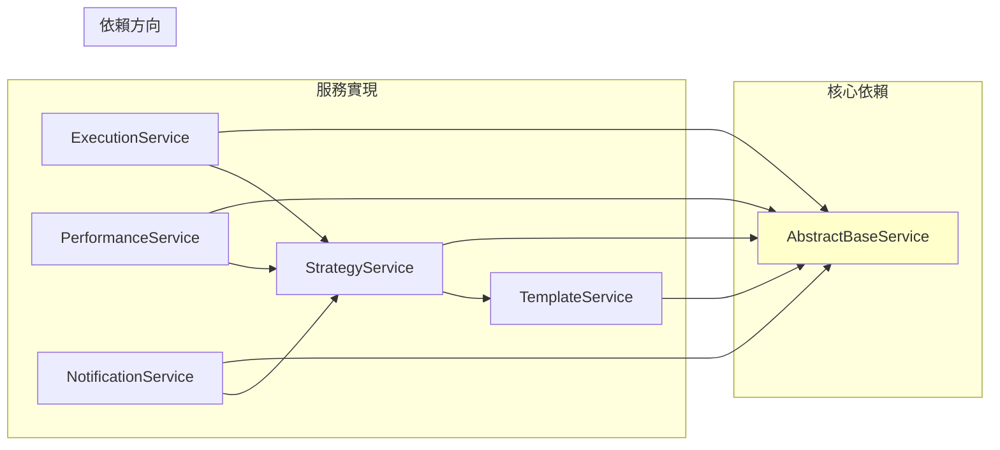
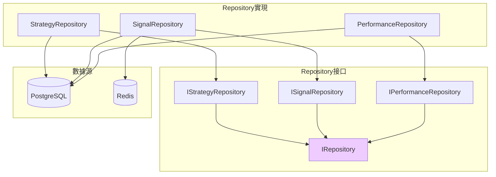
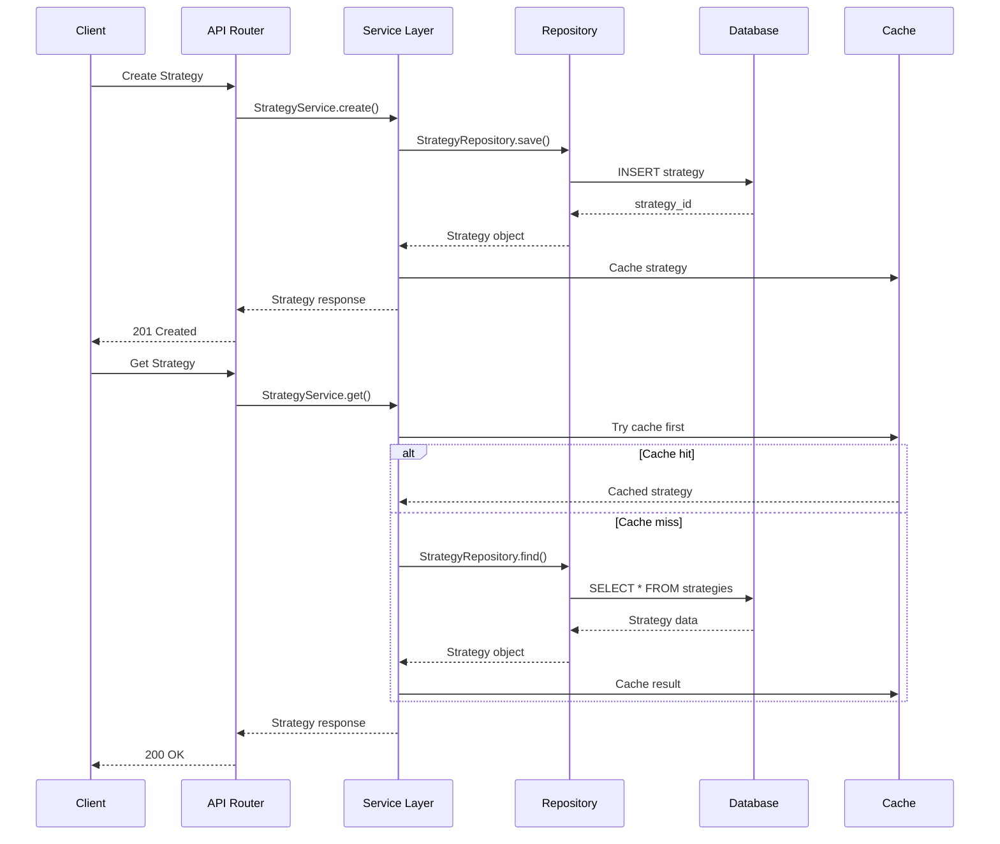
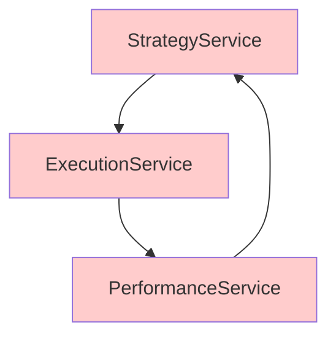
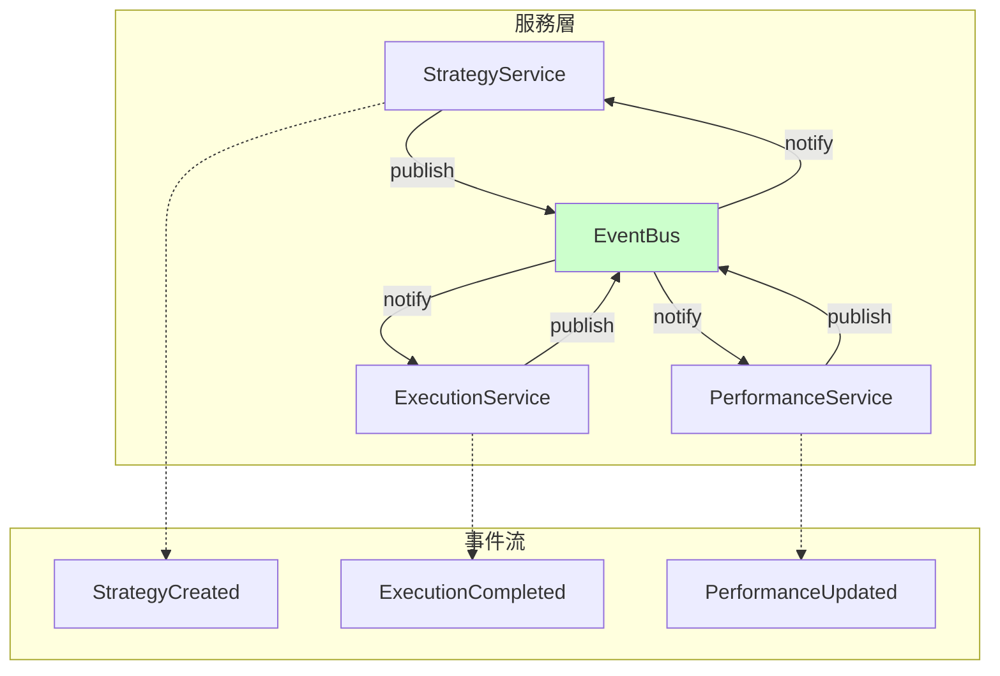
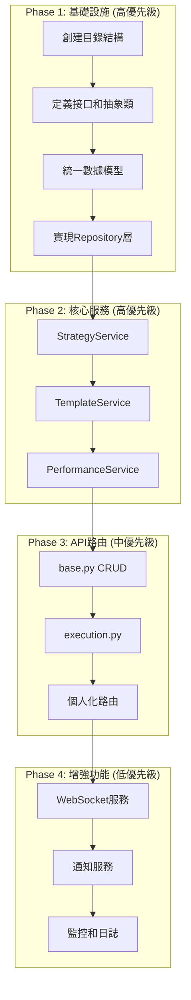

# 策略API模組依賴關係圖

## 1. 現有架構依賴關係



## 2. 目標架構依賴關係



## 3. 模組詳細依賴

### 3.1 服務層內部依賴



### 3.2 Repository層依賴



## 4. 數據流向圖



## 5. 依賴注入配置

### 5.1 FastAPI依賴注入

```python
# __init__.py
from fastapi import FastAPI
from .services import (
    StrategyService,
    ExecutionService,
    PerformanceService,
    TemplateService,
    NotificationService
)
from .repositories import (
    StrategyRepository,
    SignalRepository,
    PerformanceRepository
)

# 依賴注入容器
class DIContainer:
    def __init__(self):
        # Repository層
        self.strategy_repository = StrategyRepository()
        self.signal_repository = SignalRepository()
        self.performance_repository = PerformanceRepository()

        # Service層
        self.template_service = TemplateService(self.strategy_repository)
        self.performance_service = PerformanceService(self.performance_repository)
        self.strategy_service = StrategyService(
            repository=self.strategy_repository,
            performance_service=self.performance_service,
            template_service=self.template_service
        )
        self.execution_service = ExecutionService(
            strategy_service=self.strategy_service,
            signal_repository=self.signal_repository
        )
        self.notification_service = NotificationService()

    def get_strategy_service(self) -> StrategyService:
        return self.strategy_service

    def get_execution_service(self) -> ExecutionService:
        return self.execution_service

# 全局容器
container = DIContainer()

# FastAPI依賴
async def get_strategy_service() -> StrategyService:
    return container.get_strategy_service()
```

## 6. 循環依賴解決方案

### 6.1 問題識別



### 6.2 解決方案：事件驅動架構



## 7. 模組遷移優先級



## 8. 技術債務評估

| 類型 | 當前狀況 | 目標狀況 | 改進措施 |
|------|---------|---------|---------|
| 循環依賴 | 3處嚴重循環 | 0處循環 | 事件驅動解耦 |
| 重複代碼 | 700行(25%) | <50行(<5%) | 抽取公共組件 |
| 模塊耦合 | 高耦合 | 低耦合 | 依賴注入 |
| 測試覆蓋 | 40% | >90% | 單元測試 |
| 文檔完整性 | 30% | >90% | 自動生成 |

---

**文檔版本**: 1.0
**更新日期**: 2025-12-17
**責任人**: 架構團隊