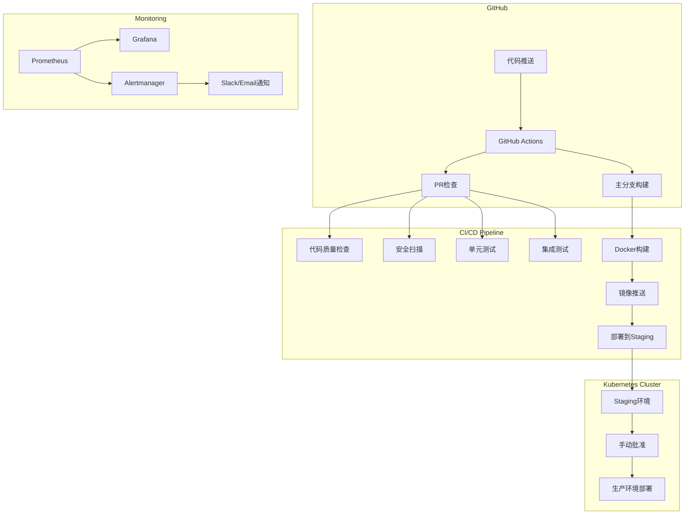

# CBSC量化交易策略管理系统 CI/CD 流水线指南

## 概述

本文档描述了CBSC量化交易策略管理系统的持续集成和持续部署（CI/CD）流水线的设计、配置和使用方法。

## 架构图



## 组件说明

### 1. GitHub Actions 工作流

#### PR Checks (`.github/workflows/pr-checks.yml`)
- **触发条件**: Pull Request创建或更新
- **检查内容**:
  - 代码质量检查 (ESLint, Prettier, Black, isort, mypy)
  - 安全扫描 (Trivy, Secret Detection, CodeQL)
  - 单元测试 (Jest, Pytest)
  - 集成测试
  - 构建验证

#### CI Main Pipeline (`.github/workflows/ci-main.yml`)
- **触发条件**: 推送到main/develop分支
- **执行阶段**:
  - 环境设置
  - 代码质量和安全扫描
  - 测试矩阵 (多OS、多Python/Node版本)
  - 集成测试
  - 性能测试
  - Docker镜像构建和推送
  - 创建部署包

#### Production Deployment (`.github/workflows/production-deploy.yml`)
- **触发条件**: 手动触发或标签推送
- **部署流程**:
  - 蓝绿部署
  - 健康检查
  - 流量切换
  - 回滚机制

### 2. Docker 配置

#### 多阶段构建
- **构建阶段**: 安装依赖，编译代码
- **生产阶段**: 最小化镜像，安全配置
- **开发阶段**: 包含开发工具

#### 镜像优化
- 使用 `.dockerignore` 减小构建上下文
- 多平台构建 (amd64, arm64)
- 使用 BuildKit 缓存

### 3. Kubernetes 部署

#### 命名空间隔离
- `cbsc-dev`: 开发环境
- `cbsc-staging`: 测试环境
- `cbsc-system`: 生产环境

#### 部署清单结构
```
k8s/
├── namespaces.yaml
├── configmaps.yaml
├── secrets.yaml
├── deployments/
│   ├── frontend.yaml
│   ├── api-gateway.yaml
│   ├── postgres.yaml
│   └── redis.yaml
├── services/
├── ingress/
└── monitoring/
```

### 4. 部署脚本

#### `deploy.sh`
主部署脚本，支持：
- 多环境部署
- 干运行模式
- 回滚功能
- 健康检查

#### `setup-secrets.sh`
密钥管理脚本：
- 创建Kubernetes secrets
- 从环境文件加载
- 加密敏感信息

#### `health-check.sh`
健康检查脚本：
- 服务状态监控
- 连续监控模式
- 多种输出格式

### 5. 监控和告警

#### Prometheus
- 指标收集
- 告警规则
- 服务发现

#### Grafana
- 系统概览仪表板
- 性能指标可视化
- 自定义面板

#### Alertmanager
- 告警路由
- 通知渠道 (Slack, Email)
- 告警抑制

## 使用指南

### 本地开发设置

1. 安装依赖：
```bash
# Node.js
cd frontend && npm install
cd ../unified-dashboard && npm install

# Python
pip install -r requirements.txt
pip install -r requirements-dev.txt
```

2. 运行测试：
```bash
# 前端测试
npm run test
npm run test:coverage

# 后端测试
pytest tests/
pytest tests/integration/
```

3. 代码质量检查：
```bash
# 前端
npm run lint
npm run type-check

# 后端
flake8 src/
black --check src/
isort --check-only src/
mypy src/
```

### 部署流程

#### 1. 部署到Staging环境
```bash
# 设置密钥
./scripts/deploy/setup-secrets.sh staging --from-env

# 部署应用
./scripts/deploy/deploy.sh staging

# 检查部署状态
./scripts/deploy/health-check.sh staging --continuous
```

#### 2. 部署到Production环境
```bash
# 创建发布标签
git tag -a v1.0.0 -m "Release version 1.0.0"
git push origin v1.0.0

# 或手动触发
./scripts/deploy/deploy.sh production --image-tag v1.0.0
```

### 监控配置

#### 访问监控面板
- Grafana: https://grafana.cbsc.com
  - 用户名: admin
  - 密码: 查看密钥管理

- Prometheus: https://prometheus.cbsc.com

#### 设置告警
1. 编辑 `monitoring/alertmanager/alertmanager.yml`
2. 更新通知渠道 (Slack webhook, Email)
3. 重新部署 Alertmanager

### 故障排查

#### 查看部署状态
```bash
# 查看Pod状态
kubectl get pods -n cbsc-system

# 查看部署历史
kubectl rollout history deployment/api-gateway -n cbsc-system

# 查看日志
kubectl logs -f deployment/api-gateway -n cbsc-system
```

#### 回滚部署
```bash
# 回滚到上一个版本
kubectl rollout undo deployment/api-gateway -n cbsc-system

# 或使用部署脚本
./scripts/deploy/deploy.sh production --rollback-to v0.9.0
```

#### 调试Pod
```bash
# 进入Pod调试
kubectl exec -it <pod-name> -n cbsc-system -- /bin/bash

# 端口转发
kubectl port-forward service/api-gateway 8000:8000 -n cbsc-system
```

## 最佳实践

### 1. 代码提交
- 遵循Conventional Commits规范
- 每个PR只包含一个功能或修复
- 确保所有测试通过

### 2. 分支策略
- `main`: 生产就绪代码
- `develop`: 开发中代码
- `feature/*`: 功能分支
- `hotfix/*`: 紧急修复

### 3. 安全考虑
- 定期更新依赖
- 使用密钥管理
- 启用镜像扫描
- 实施最小权限原则

### 4. 性能优化
- 使用缓存策略
- 实施资源限制
- 监控资源使用
- 定期性能测试

## 常见问题

### Q: 如何添加新的环境变量？
A: 1. 在 `k8s/configmaps.yaml` 添加非敏感配置
   2. 在 `k8s/secrets.yaml` 添加敏感配置
   3. 更新 Helm values 文件

### Q: 如何扩展到多个集群？
A: 1. 创建集群特定的配置文件
   2. 使用 ArgoCD 或 Flux 进行 GitOps
   3. 实施联邦策略

### Q: 如何优化构建时间？
A: 1. 使用 GitHub Actions 缓存
   2. 并行化构建步骤
   3. 使用 Docker BuildKit
   4. 优化 Dockerfile

### Q: 如何处理数据库迁移？
A: 1. 在部署脚本中添加迁移步骤
   2. 使用 Kubernetes Job 运行迁移
   3. 实施回滚策略

## 附录

### 环境变量列表
- `NODE_ENV`: 运行环境
- `DATABASE_URL`: 数据库连接
- `REDIS_URL`: Redis连接
- `JWT_SECRET`: JWT密钥
- `API_BASE_URL`: API基础URL

### 端口映射
- Frontend: 3000
- API Gateway: 8000
- User Management: 3004
- Strategy Dashboard: 3003
- Quant System: 8001
- Config Service: 3005
- PostgreSQL: 5432
- Redis: 6379

### 相关链接
- [GitHub Actions文档](https://docs.github.com/en/actions)
- [Kubernetes文档](https://kubernetes.io/docs/)
- [Helm文档](https://helm.sh/docs/)
- [Prometheus文档](https://prometheus.io/docs/)
- [Grafana文档](https://grafana.com/docs/)