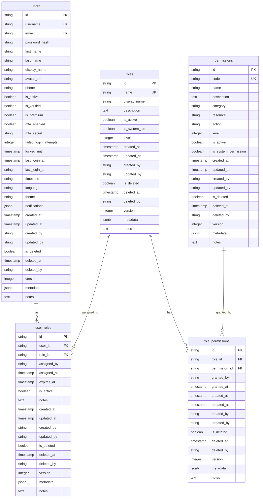
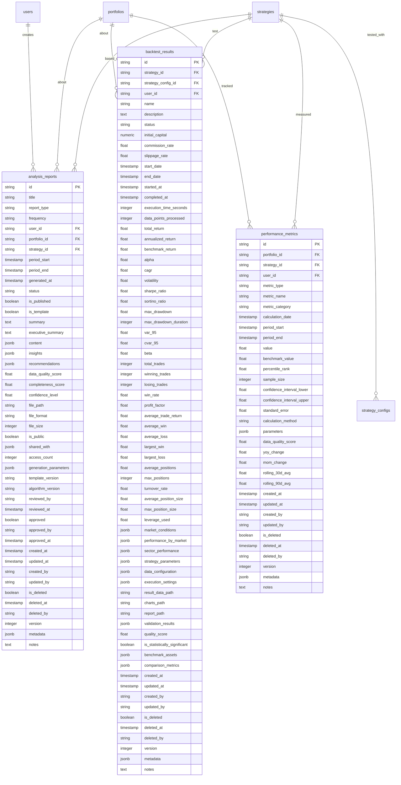

# CBSC Unified Database ERD (Entity Relationship Diagram)

## 數據庫設計概覽

本文檔描述了CBSC統一數據庫的實體關係圖（ERD），包含所有核心表結構和關聯關係。

## 核心設計原則

1. **統一性**: 所有表使用統一的基礎字段（ID, 時間戳, 審計字段）
2. **可擴展性**: 使用JSONB字段支持靈活的元數據存儲
3. **性能優化**: 合理的索引設計和查詢優化
4. **數據完整性**: 外鍵約束和數據驗證
5. **審計追蹤**: 完整的操作記錄和版本控制

## 主要功能模塊

### 1. 用戶和權限管理 (User & Permission Management)

### 2. 策略管理 (Strategy Management)

```mermaid
erDiagram
    strategy_categories ||--o{ strategies : contains
    strategies ||--o{ strategy_configs : configured_by
    strategies ||--o{ strategy_performance : tracked_by
    strategy_configs ||--o{ strategy_performance : using

    strategy_categories {
        string id PK
        string name UK
        string display_name
        text description
        string parent_id FK
        integer level
        integer sort_order
        boolean is_active
        timestamp created_at
        timestamp updated_at
        string created_by
        string updated_by
        boolean is_deleted
        timestamp deleted_at
        string deleted_by
        integer version
        jsonb metadata
        text notes
    }

    strategies {
        string id PK
        string name
        string code UK
        text description
        string category_id FK
        string strategy_type
        string status
        string risk_level
        float total_return
        float sharpe_ratio
        float max_drawdown
        float win_rate
        float profit_factor
        float volatility
        jsonb default_parameters
        jsonb required_indicators
        jsonb supported_timeframes
        string version
        boolean is_public
        integer total_users
        integer active_users
        integer total_signals
        timestamp created_at
        timestamp updated_at
        string created_by
        string updated_by
        boolean is_deleted
        timestamp deleted_at
        string deleted_by
        integer version
        jsonb metadata
        text notes
    }

    strategy_configs {
        string id PK
        string strategy_id FK
        string user_id FK
        string config_name
        boolean is_default
        jsonb custom_parameters
        string risk_tolerance
        float capital_allocation
        float max_position_size
        float stop_loss
        float take_profit
        boolean auto_trading_enabled
        boolean auto_rebalance
        string rebalance_frequency
        jsonb notifications
        boolean is_active
        timestamp created_at
        timestamp updated_at
        string created_by
        string updated_by
        boolean is_deleted
        timestamp deleted_at
        string deleted_by
        integer version
        jsonb metadata
        text notes
    }

    strategy_performance {
        string id PK
        string strategy_id FK
        string config_id FK
        timestamp date
        float total_return
        float daily_return
        float cumulative_return
        float benchmark_return
        float alpha
        float volatility
        float sharpe_ratio
        float sortino_ratio
        float max_drawdown
        float var_95
        float cvar_95
        integer total_trades
        integer winning_trades
        float win_rate
        float profit_factor
        float average_win
        float average_loss
        integer current_positions
        float open_positions_value
        float cash_balance
        jsonb market_conditions
        float data_quality_score
        timestamp created_at
        timestamp updated_at
        string created_by
        string updated_by
        boolean is_deleted
        timestamp deleted_at
        string deleted_by
        integer version
        jsonb metadata
        text notes
    }
```

### 3. 市場數據 (Market Data)

```mermaid
erDiagram
    market_data ||--o{ technical_indicators : calculated_from
    market_data ||--o{ sentiment_data : analyzed_for

    market_data {
        string id PK
        string symbol
        string exchange
        string asset_type
        timestamp timestamp
        string timeframe
        numeric open_price
        numeric high_price
        numeric low_price
        numeric close_price
        numeric adjusted_close
        integer volume
        numeric turnover
        numeric vwap
        numeric market_cap
        integer shares_outstanding
        numeric pe_ratio
        numeric pb_ratio
        numeric dividend_yield
        numeric beta
        string data_source
        float quality_score
        boolean is_adjusted
        timestamp created_at
        timestamp updated_at
        string created_by
        string updated_by
        boolean is_deleted
        timestamp deleted_at
        string deleted_by
        integer version
        jsonb metadata
        text notes
    }

    technical_indicators {
        string id PK
        string market_data_id FK
        string symbol
        timestamp timestamp
        string timeframe
        string indicator_type
        string indicator_name
        integer period
        jsonb values
        jsonb parameters
        string signal
        float confidence
        float strength
        timestamp calculated_at
        string calculation_method
        integer data_points_used
        timestamp created_at
        timestamp updated_at
        string created_by
        string updated_by
        boolean is_deleted
        timestamp deleted_at
        string deleted_by
        integer version
        jsonb metadata
        text notes
    }

    sentiment_data {
        string id PK
        string symbol
        string source
        timestamp timestamp
        float overall_score
        float sentiment_score
        float fear_greed_index
        float news_sentiment
        float social_sentiment
        float analyst_sentiment
        float options_sentiment
        integer mention_count
        integer positive_count
        integer negative_count
        integer neutral_count
        float weight
        float confidence
        float reliability_score
        jsonb keywords
        jsonb topics
        string collection_method
        string processing_algorithm
        string raw_data_reference
        timestamp created_at
        timestamp updated_at
        string created_by
        string updated_by
        boolean is_deleted
        timestamp deleted_at
        string deleted_by
        integer version
        jsonb metadata
        text notes
    }

    economic_indicators {
        string id PK
        string indicator_code
        string indicator_name
        string category
        string country
        float value
        string unit
        string period_type
        timestamp period_end_date
        float previous_value
        float change_percent
        float year_over_year
        float forecast_value
        float consensus_value
        float surprise_percent
        string importance_level
        jsonb market_impact
        string source
        timestamp release_time
        float reliability_score
        timestamp created_at
        timestamp updated_at
        string created_by
        string updated_by
        boolean is_deleted
        timestamp deleted_at
        string deleted_by
        integer version
        jsonb metadata
        text notes
    }
```

### 4. 交易和投資組合 (Trading & Portfolio)

```mermaid
erDiagram
    users ||--o{ portfolios : owns
    portfolios ||--o{ orders : contains
    portfolios ||--o{ positions : holds
    portfolios ||--o{ trades : executes
    strategies ||--o{ orders : generates
    strategy_configs ||--o{ orders : generates
    orders ||--o{ trades : results_in

    portfolios {
        string id PK
        string user_id FK
        string name
        text description
        string portfolio_type
        numeric cash_balance
        numeric available_cash
        numeric total_value
        numeric allocated_capital
        numeric unallocated_capital
        numeric total_return
        float total_return_percent
        numeric daily_return
        float daily_return_percent
        float volatility
        float sharpe_ratio
        float max_drawdown
        float var_95
        integer total_positions
        integer active_positions
        integer total_trades
        string benchmark_symbol
        float benchmark_return
        float alpha
        float beta
        integer max_positions
        float max_position_size
        float risk_limit
        boolean is_active
        timestamp inception_date
        timestamp last_rebalanced
        timestamp created_at
        timestamp updated_at
        string created_by
        string updated_by
        boolean is_deleted
        timestamp deleted_at
        string deleted_by
        integer version
        jsonb metadata
        text notes
    }

    orders {
        string id PK
        string external_order_id
        string strategy_id FK
        string strategy_config_id FK
        string user_id FK
        string portfolio_id FK
        string symbol
        string exchange
        string asset_type
        string order_type
        string side
        string status
        integer quantity
        numeric price
        numeric stop_price
        integer filled_quantity
        integer remaining_quantity
        string time_in_force
        timestamp execution_time
        numeric average_fill_price
        numeric commission
        numeric slippage
        numeric taxes
        numeric total_cost
        numeric stop_loss_price
        numeric take_profit_price
        float trailing_stop_percent
        string order_reason
        jsonb tags
        text notes
        string broker
        boolean submitted_to_broker
        jsonb broker_response
        timestamp created_at
        timestamp updated_at
        string created_by
        string updated_by
        boolean is_deleted
        timestamp deleted_at
        string deleted_by
        integer version
        jsonb metadata
        text notes
    }

    trades {
        string id PK
        string order_id FK
        string user_id FK
        string portfolio_id FK
        string symbol
        string exchange
        string asset_type
        string side
        integer quantity
        numeric price
        numeric notional
        timestamp trade_time
        string external_trade_id
        string execution_venue
        numeric commission
        numeric slippage
        numeric taxes
        numeric total_cost
        timestamp settlement_date
        string settlement_currency
        numeric fx_rate
        string trade_reason
        jsonb strategy_signal
        jsonb market_conditions
        string broker_reference
        string clearing_firm
        timestamp created_at
        timestamp updated_at
        string created_by
        string updated_by
        boolean is_deleted
        timestamp deleted_at
        string deleted_by
        integer version
        jsonb metadata
        text notes
    }

    positions {
        string id PK
        string portfolio_id FK
        string user_id FK
        string symbol
        string exchange
        string asset_type
        string side
        integer quantity
        integer available_quantity
        numeric average_cost
        numeric total_cost
        numeric commission_paid
        numeric current_price
        numeric market_value
        numeric unrealized_pnl
        float unrealized_pnl_percent
        numeric realized_pnl
        numeric total_pnl
        timestamp first_opened
        timestamp last_updated
        numeric max_price
        numeric min_price
        numeric max_unrealized_pnl
        numeric max_drawdown
        jsonb tags
        text notes
        string risk_level
        timestamp created_at
        timestamp updated_at
        string created_by
        string updated_by
        boolean is_deleted
        timestamp deleted_at
        string deleted_by
        integer version
        jsonb metadata
        text notes
    }
```

### 5. 分析報告 (Analytics & Reporting)

### 6. 系統管理 (System Management)

```mermaid
erDiagram
    users ||--o{ audit_logs : performs
    system_configs ||--o{ data_schemas : defines
    users ||--o{ system_configs : configures

    system_configs {
        string id PK
        string config_key UK
        string config_name
        string config_type
        text description
        jsonb config_value
        jsonb default_value
        string data_type
        boolean is_encrypted
        boolean is_readonly
        boolean is_required
        boolean requires_restart
        string category
        string group
        integer sort_order
        jsonb validation_rules
        jsonb allowed_values
        float min_value
        float max_value
        string version
        string environment
        boolean is_active
        string source
        timestamp last_synced_at
        string sync_status
        timestamp created_at
        timestamp updated_at
        string created_by
        string updated_by
        boolean is_deleted
        timestamp deleted_at
        string deleted_by
        integer version
        jsonb metadata
        text notes
    }

    audit_logs {
        string id PK
        string action
        string resource_type
        string resource_id
        string user_id FK
        text action_description
        string operation_type
        string ip_address
        text user_agent
        string session_id
        string request_id
        jsonb old_values
        jsonb new_values
        jsonb changed_fields
        boolean success
        text error_message
        string error_code
        integer duration_ms
        string risk_level
        boolean security_flag
        boolean compliance_flag
        string service_name
        string endpoint
        string method
        timestamp timestamp
        string correlation_id
        jsonb metadata
        jsonb tags
        timestamp created_at
        timestamp updated_at
        string created_by
        string updated_by
        boolean is_deleted
        timestamp deleted_at
        string deleted_by
        integer version
        jsonb metadata
        text notes
    }

    data_schemas {
        string id PK
        string schema_name UK
        string schema_version
        string schema_type
        text description
        jsonb schema_definition
        jsonb table_definitions
        jsonb field_definitions
        jsonb relationships
        jsonb constraints
        jsonb indexes
        jsonb validation_rules
        jsonb quality_checks
        jsonb data_lineage
        string parent_schema_id FK
        boolean is_current
        boolean is_deprecated
        jsonb migration_path
        boolean backward_compatible
        boolean forward_compatible
        jsonb breaking_changes
        boolean is_active
        string deployment_status
        timestamp deployed_at
        jsonb deployed_environments
        integer usage_count
        timestamp last_used_at
        integer data_volume
        timestamp created_at
        timestamp updated_at
        string created_by
        string updated_by
        boolean is_deleted
        timestamp deleted_at
        string deleted_by
        integer version
        jsonb metadata
        text notes
    }

    system_health {
        string id PK
        string service_name
        string component_name
        string check_type
        string status
        float health_score
        integer response_time_ms
        float error_rate
        float availability_percent
        timestamp last_check_time
        float warning_threshold
        float critical_threshold
        jsonb check_details
        jsonb metrics
        text error_message
        integer consecutive_failures
        integer consecutive_successes
        timestamp last_failure_time
        timestamp last_recovery_time
        timestamp created_at
        timestamp updated_at
        string created_by
        string updated_by
        boolean is_deleted
        timestamp deleted_at
        string deleted_by
        integer version
        jsonb metadata
        text notes
    }
```

## 索引策略

### 主要索引

1. **用戶表索引**
   - `users_username_idx` (username)
   - `users_email_idx` (email)
   - `users_active_idx` (is_active, is_deleted)

2. **策略表索引**
   - `strategies_code_idx` (code)
   - `strategies_type_status_idx` (strategy_type, status)
   - `strategies_category_idx` (category_id)

3. **市場數據索引**
   - `market_data_symbol_time_idx` (symbol, timestamp, timeframe)
   - `market_data_exchange_symbol_idx` (exchange, symbol, timestamp)
   - `market_data_timestamp_timeframe_idx` (timestamp, timeframe)

4. **交易表索引**
   - `orders_portfolio_status_idx` (portfolio_id, status)
   - `trades_portfolio_time_idx` (portfolio_id, trade_time)
   - `positions_portfolio_symbol_idx` (portfolio_id, symbol)

5. **分析報告索引**
   - `reports_type_period_idx` (report_type, period_start, period_end)
   - `reports_user_date_idx` (user_id, generated_at)
   - `backtest_strategy_date_idx` (strategy_id, start_date, end_date)

## 數據完整性約束

### 外鍵約束
- 所有外鍵字段都有適當的引用完整性約束
- 使用ON DELETE CASCADE或SET NULL策略
- 確保數據一致性

### 檢查約束
- 數值字段範圍檢查
- 枚舉值約束
- 時間戳合理性檢查

### 唯一性約束
- 業務鍵唯一性（如用戶名、郵箱、策略代碼）
- 組合唯一性約束

## 性能優化建議

### 1. 分區策略
- 市場數據按時間分區
- 交易記錄按時間分區
- 審計日誌按時間分區

### 2. 查詢優化
- 合理使用複合索引
- 避免全表掃描
- 使用物化視圖複雜查詢

### 3. 連接池配置
- 適當的連接池大小
- 連接超時設置
- 連接回收策略

## 備份和恢復策略

### 1. 定期備份
- 每日增量備份
- 每週完整備份
- 跨區域備份存儲

### 2. 恢復測試
- 定期恢復演練
- RTO/RPO目標定義
- 災難恢復計劃

### 3. 數據保留
- 歷史數據歸檔策略
- 合規性數據保留要求
- 數據清理規則

## 安全考慮

### 1. 訪問控制
- 基於角色的權限控制
- 行級安全策略
- 數據脫敏

### 2. 數據加密
- 靜態數據加密
- 傳輸數據加密
- 密鑰管理

### 3. 審計追蹤
- 完整的操作日誌
- 敏感操作監控
- 異常行為檢測

---

*最後更新: 2025-12-10*
*版本: Unified Database v1.0*
*維護者: CBSC Development Team*