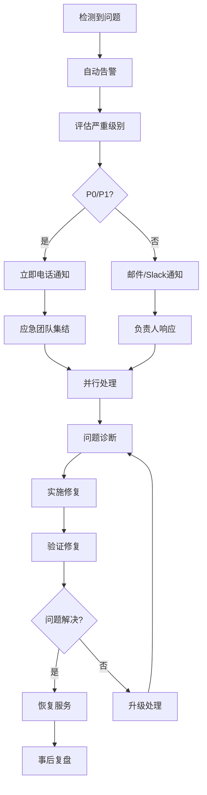

# API迁移风险评估与缓解措施

## 📋 执行摘要

本文档对CBSC策略管理系统API迁移过程中可能出现的各类风险进行全面评估，并提供了详细的缓解措施和应急预案。通过识别、评估和规划风险，确保迁移过程安全可控。

## 🎯 风险评估方法论

### 风险矩阵

```
影响程度
高    │  R1  │  R2  │  R3  │
──────┼──────┼──────┼──────┼─────
中    │  R4  │  R5  │  R6  │
──────┼──────┼──────┼──────┼─────
低    │  R7  │  R8  │  R9  │
──────┼──────┼──────┼──────┼─────
      │ 低   │ 中   │ 高   │
                发生概率
```

### 风险评级标准

| 概率/影响 | 低(1-2) | 中(3-4) | 高(5) |
|----------|---------|---------|--------|
| **低(1-2)** | 可接受 | 需监控 | 需缓解 |
| **中(3-4)** | 需监控 | 需缓解 | 严重 |
| **高(5)** | 需缓解 | 严重 | 灾难性 |

## 🔍 详细风险分析

### 1. 技术风险

#### 1.1 数据丢失风险 (R1 - 灾难性)
**描述**：迁移过程中可能导致策略数据、执行历史、用户配置等关键数据丢失

**概率**：低 (1)
**影响**：灾难性 (5)
**风险值**：5

**缓解措施**：
```yaml
预防措施:
  - 多重备份策略：
    - 迁移前完整备份
    - 实时增量备份
    - 异地备份存储
  - 数据校验机制：
    - 迁移前后数据哈希对比
    - 记录数量一致性检查
    - 关键字段抽样验证

监控措施:
  - 数据完整性实时监控
  - 备份状态自动检查
  - 异常数据自动告警

应急预案:
  - 立即停止所有写入操作
  - 从最近的时间点恢复
  - 数据修复和同步脚本
  - 手动数据 reconciliation
```

**负责人**：DBA团队
**检查频率**：每次迁移操作后

#### 1.2 性能严重下降 (R2 - 严重)
**描述**：新系统性能远低于预期，影响交易执行和用户体验

**概率**：中 (3)
**影响**：高 (5)
**风险值**：15

**缓解措施**：
```yaml
预防措施:
  - 性能基准测试：
    - 全面的压力测试
    - 最低性能标准制定
    - 性能回归测试
  - 渐进式迁移：
    - 按功能模块逐步迁移
    - 小流量验证
    - 快速回滚能力

监控措施:
  - 实时性能监控
  - 自动化性能对比
  - 性能阈值告警
  - 慢查询日志分析

应急预案:
  - 自动扩容机制
  - 查询优化热修复
  - 缓存策略紧急调整
  - 快速回滚到旧系统
```

**负责人**：性能团队
**检查频率**：持续监控

#### 1.3 系统不可用 (R3 - 严重)
**描述**：迁移导致系统整体或部分功能不可用

**概率**：中 (3)
**影响**：高 (5)
**风险值**：15

**缓解措施**：
```yaml
预防措施:
  - 高可用架构：
    - 多实例部署
    - 负载均衡配置
    - 故障转移机制
  - 蓝绿部署：
    - 并行环境运行
    - 流量切换能力
    - 瞬间回滚机制

监控措施:
  - 健康检查端点
  - 服务可用性监控
  - 自动故障检测
  - 业务指标监控

应急预案:
  - 自动故障转移
  - 紧急流量切换
  - 服务快速重启
  - 降级服务模式
```

**负责人**：运维团队
**检查频率**：分钟级监控

### 2. 业务风险

#### 2.1 交易中断 (R4 - 严重)
**描述**：策略执行中断，导致交易机会损失或财务损失

**概率**：低 (2)
**影响**：灾难性 (5)
**风险值**：10

**缓解措施**：
```yaml
预防措施:
  - 执行状态保持：
    - 会话持久化
    - 断点续传机制
    - 执行上下文备份
  - 风险控制：
    - 执行前系统检查
    - 交易量限制
    - 紧急停止机制

监控措施:
  - 执行状态实时监控
  - 交易流水跟踪
  - 异常模式检测
  - 财务影响评估

应急预案:
  - 立即停止所有交易
  - 人工接管执行
  - 补偿机制启动
  - 损失评估报告
```

**负责人**：交易团队
**检查频率**：实时监控

#### 2.2 用户体验下降 (R5 - 中等)
**描述**：新系统界面、响应速度或功能变化影响用户体验

**概率**：高 (5)
**影响**：中 (3)
**风险值**：15

**缓解措施**：
```yaml
预防措施:
  - 用户培训和文档：
    - 变更说明文档
    - 视频教程制作
    - FAQ更新
  - 渐进式更新：
    - 保持界面一致性
    - 分批次用户迁移
    - 收集反馈优化

监控措施:
  - 用户行为分析
  - APM前端监控
  - 用户反馈收集
  - 满意度调查

应急预案:
  - 快速界面回退
  - 临时功能禁用
  - 客服支持加强
  - 用户补偿方案
```

**负责人**：产品团队
**检查频率**：每日

### 3. 合规风险

#### 3.1 监管违规 (R6 - 严重)
**描述**：系统变更导致不符合金融监管要求

**概率**：低 (1)
**影响**：灾难性 (5)
**风险值**：5

**缓解措施**：
```yaml
预防措施:
  - 合规审查：
    - 迁移方案合规评估
    - 监管机构报备
    - 合规测试
  - 审计日志：
    - 完整的操作记录
    - 数据访问日志
    - 变更追踪

监控措施:
  - 合规规则引擎
  - 实时合规检查
  - 异常行为监控
  - 定期审计报告

应急预案:
  - 立即停止违规操作
  - 启动合规修复流程
  - 监管紧急沟通
  - 修正措施实施
```

**负责人**：法务合规团队
**检查频率**：每次变更

## 🛡️ 风险缓解策略

### 1. 技术缓解策略

#### 1.1 并行运行策略
```python
# 双系统并行运行配置
class ParallelExecutionConfig:
    def __init__(self):
        self.modes = {
            'read_only': {
                'legacy_percentage': 50,
                'new_percentage': 50,
                'comparison_enabled': True
            },
            'write_operations': {
                'mode': 'dual_write',  # 双写模式
                'verification': True,
                'auto_sync': True
            },
            'execution': {
                'mode': 'shadow_mode',  # 影子模式
                'compare_results': True
            }
        }

    async def handle_write_request(self, request):
        """处理写请求的双写模式"""
        # 写入旧系统
        legacy_result = await self.write_to_legacy(request)

        # 写入新系统
        new_result = await self.write_to_new(request)

        # 验证一致性
        if await self.verify_consistency(legacy_result, new_result):
            return new_result
        else:
            # 不一致时记录并告警
            await self.log_inconsistency(request, legacy_result, new_result)
            return legacy_result  # 以旧系统为准
```

#### 1.2 熔断器模式
```python
# 熔断器实现
class CircuitBreaker:
    def __init__(self, failure_threshold=5, timeout=60):
        self.failure_threshold = failure_threshold
        self.timeout = timeout
        self.failure_count = 0
        self.last_failure_time = None
        self.state = 'CLOSED'  # CLOSED, OPEN, HALF_OPEN

    async def call(self, func, *args, **kwargs):
        if self.state == 'OPEN':
            if time.time() - self.last_failure_time > self.timeout:
                self.state = 'HALF_OPEN'
            else:
                raise CircuitBreakerOpenException()

        try:
            result = await func(*args, **kwargs)
            if self.state == 'HALF_OPEN':
                self.state = 'CLOSED'
                self.failure_count = 0
            return result
        except Exception as e:
            self.failure_count += 1
            self.last_failure_time = time.time()

            if self.failure_count >= self.failure_threshold:
                self.state = 'OPEN'

            raise e
```

### 2. 业务缓解策略

#### 2.1 灰度发布
```python
# 灰度发布控制器
class CanaryReleaseController:
    def __init__(self):
        self.traffic_rules = {
            'internal_users': 100,    # 内部用户100%
            'vip_users': 10,          # VIP用户10%
            'regular_users': 5,       # 普通用户5%
            'new_users': 0           # 新用户0%
        }

    def get_routing(self, user_info):
        """根据用户信息决定路由"""
        if user_info.is_internal:
            return 'new_system' if random.random() < 0.01 else 'legacy'
        elif user_info.is_vip:
            return 'new_system' if random.random() < 0.1 else 'legacy'
        else:
            return 'new_system' if random.random() < 0.05 else 'legacy'
```

#### 2.2 业务监控
```python
# 业务指标监控
class BusinessMetrics:
    def __init__(self):
        self.metrics = {
            'trading_volume': 0,
            'success_rate': 0,
            'user_satisfaction': 0,
            'compliance_score': 0
        }

    async def collect_metrics(self):
        """收集业务指标"""
        trading_volume = await self.get_trading_volume()
        success_rate = await self.calculate_success_rate()
        user_feedback = await self.get_user_feedback()
        compliance_status = await self.check_compliance()

        # 检查是否超出阈值
        alerts = []
        if success_rate < 0.99:
            alerts.append("成功率低于99%")
        if user_feedback < 4.0:
            alerts.append("用户满意度低于4.0")

        if alerts:
            await self.send_alert(alerts)
```

## 📋 风险监控仪表板

### 关键风险指标 (KRIs)

| 风险类别 | KRI名称 | 正常范围 | 警告阈值 | 危险阈值 |
|---------|---------|----------|----------|----------|
| 技术风险 | API错误率 | <0.1% | 0.5% | 1% |
| 技术风险 | 响应时间 | <100ms | 200ms | 500ms |
| 业务风险 | 交易成功率 | >99.9% | 99.5% | 99% |
| 业务风险 | 用户投诉数 | <5/天 | 20/天 | 50/天 |
| 合规风险 | 合规检查通过率 | 100% | 95% | 90% |

### 实时监控配置

```yaml
# monitoring/risk_monitoring.yaml
dashboard:
  title: "API迁移风险监控"
  panels:
    - title: "系统健康度"
      type: "gauge"
      queries:
        - "system_health_score"

    - title: "错误率趋势"
      type: "graph"
      queries:
        - "error_rate{api=~\"strategies.*\"}"

    - title: "数据一致性检查"
      type: "table"
      queries:
        - "data_consistency_check"

    - title: "用户反馈"
      type: "stat"
      queries:
        - "user_satisfaction_score"

alerts:
  - name: "HighErrorRate"
    condition: "error_rate > 0.01"
    severity: "critical"

  - name: "DataInconsistency"
    condition: "data_inconsistencies > 0"
    severity: "critical"

  - name: "LowSuccessRate"
    condition: "trading_success_rate < 0.995"
    severity: "warning"
```

## 🚨 应急响应流程

### 1. 响应级别

| 级别 | 描述 | 响应时间 | 升级条件 |
|------|------|----------|----------|
| P0 | 系统完全不可用 | 5分钟 | 10分钟未解决 |
| P1 | 核心功能受影响 | 15分钟 | 30分钟未解决 |
| P2 | 部分功能异常 | 30分钟 | 2小时未解决 |
| P3 | 性能下降 | 2小时 | 4小时未解决 |

### 2. 应急响应团队

| 角色 | 职责 | P0响应 | P1响应 |
|------|------|---------|---------|
| 事件指挥官 | 协调资源，决策 | 立即 | 5分钟 |
| 技术负责人 | 问题诊断，修复 | 立即 | 立即 |
| 运维负责人 | 基础设施维护 | 立即 | 5分钟 |
| 业务负责人 | 业务影响评估 | 5分钟 | 15分钟 |
| 沟通负责人 | 内外部沟通 | 5分钟 | 15分钟 |

### 3. 应急响应流程



## 📊 风险接受标准

### 风险接受矩阵

| 风险等级 | 接受标准 | 缓解后状态 | 负责人签字 |
|---------|----------|------------|-----------|
| 灾难性 | 不可接受 | 必须降低到严重以下 | CTO |
| 严重 | 不可接受 | 必须降低到中等以下 | 技术VP |
| 中等 | 有条件接受 | 需持续监控 | 部门总监 |
| 低 | 可接受 | 定期检查 | 团队经理 |

### 已接受的风险

1. **性能小幅下降** (已接受)
   - 原因：新系统初始化开销
   - 接受范围：<10%
   - 缓解措施：预热和优化

2. **短暂的功能不可用** (已接受)
   - 原因：流量切换瞬间
   - 接受范围：<5秒
   - 缓解措施：健康检查

## 📝 风险管理计划

### 月度风险管理

- [ ] 风险识别会议（每月第一周）
- [ ] 风险评估更新（每月第二周）
- [ ] 缓解措施检查（每月第三周）
- [ ] 风险报告发布（每月第四周）

### 季度风险审计

- [ ] 外部安全审计
- [ ] 业务连续性测试
- [ ] 灾难恢复演练
- [ ] 风险管理流程优化

### 年度风险回顾

- [ ] 风险管理框架评估
- [ ] 风险文化调研
- [ ] 风险管理培训
- [ ] 年度风险报告

## 📚 参考资料

1. [ISO 31000 风险管理标准](https://www.iso.org/iso-31000-risk-management.html)
2. [COSO 企业风险管理框架](https://www.coso.org/)
3. [NIST 网络安全框架](https://www.nist.gov/cyberframework)
4. [OWASP 风险评级方法](https://owasp.org/www-community/OWASP_Risk_Rating_Methodology)

---

**文档版本**：v1.0
**审批人**：CTO办公室
**生效日期**：2025-12-13
**下次更新**：2026-01-13