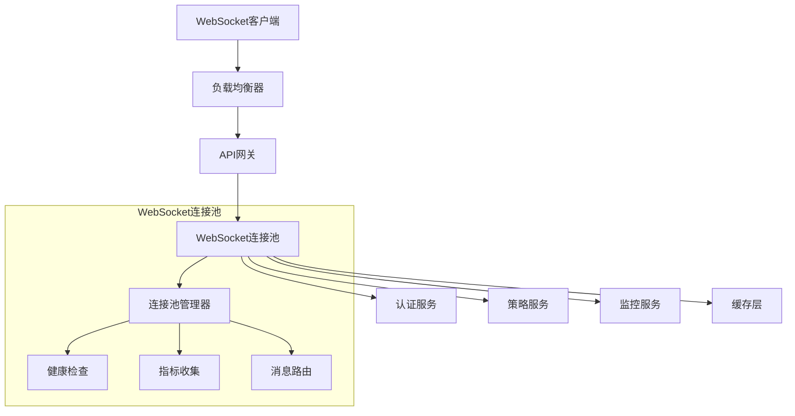

# WebSocket连接池集成指南

## 概述

WebSocket连接池是CBSC系统架构重构的关键组件，提供高性能的实时通信能力。本文档介绍如何集成、部署和使用WebSocket连接池系统。

## 目录

1. [架构概览](#架构概览)
2. [快速开始](#快速开始)
3. [配置指南](#配置指南)
4. [API参考](#api参考)
5. [客户端集成](#客户端集成)
6. [监控和运维](#监控和运维)
7. [性能优化](#性能优化)
8. [故障排查](#故障排查)
9. [最佳实践](#最佳实践)

## 架构概览

### 系统组件



### 核心特性

- **连接池管理**: 高效的连接复用和管理
- **连接限制**: 5个/用户，总计1000个连接
- **健康检查**: 自动检测和清理失效连接
- **心跳机制**: 30秒间隔的心跳检测
- **消息路由**: 支持单播、广播、频道订阅
- **性能监控**: 实时指标收集和分析
- **故障恢复**: 自动重连和错误恢复

## 快速开始

### 1. 环境准备

确保系统满足以下要求：

- Python 3.8+
- FastAPI 0.104+
- Redis (可选，用于分布式部署)
- PostgreSQL (用于用户数据)

### 2. 安装依赖

```bash
# 安装Python依赖
pip install fastapi websockets aiohttp pydantic python-jose[cryptography]

# 安装性能测试依赖
pip install matplotlib numpy psutil websockets
```

### 3. 基本配置

创建 `websocket_config.py`:

```python
from src.services.websocket_pool import ConnectionPoolConfig

# WebSocket连接池配置
WEBSOCKET_CONFIG = ConnectionPoolConfig(
    max_connections_per_user=5,
    max_total_connections=1000,
    connection_timeout=30,
    heartbeat_interval=30,
    idle_timeout=300,
    health_check_interval=60,
    message_queue_size=1000,
    broadcast_batch_size=100
)
```

### 4. 服务启动

```python
from src.api.main import app
from src.services.websocket_pool import get_connection_pool, ConnectionPoolConfig
import uvicorn

# 创建应用实例
config = ConnectionPoolConfig()
pool = get_connection_pool(config)

# 启动服务
if __name__ == "__main__":
    uvicorn.run(
        "src.api.main:app",
        host="0.0.0.0",
        port=8000,
        reload=True,
        log_level="info"
    )
```

### 5. 客户端连接示例

```javascript
// JavaScript客户端示例
const ws = new WebSocket('ws://localhost:8000/ws-pool/connect?token=your-jwt-token&channel=strategies');

ws.onopen = function(event) {
    console.log('WebSocket连接已建立');
};

ws.onmessage = function(event) {
    const message = JSON.parse(event.data);
    console.log('收到消息:', message);

    // 处理不同类型的消息
    switch(message.type) {
        case 'connection_established':
            console.log('连接ID:', message.data.connection_id);
            break;
        case 'broadcast':
            console.log('广播消息:', message.data);
            break;
        case 'heartbeat':
            // 处理心跳
            break;
    }
};

// 发送消息
ws.send(JSON.stringify({
    type: 'subscribe',
    target: 'strategy_updates'
}));
```

## 配置指南

### 连接池配置

| 参数 | 默认值 | 说明 | 建议范围 |
|------|--------|------|----------|
| `max_connections_per_user` | 5 | 每个用户最大连接数 | 3-10 |
| `max_total_connections` | 1000 | 总最大连接数 | 500-5000 |
| `connection_timeout` | 30 | 连接超时(秒) | 15-60 |
| `heartbeat_interval` | 30 | 心跳间隔(秒) | 15-60 |
| `idle_timeout` | 300 | 空闲超时(秒) | 60-900 |
| `health_check_interval` | 60 | 健康检查间隔(秒) | 30-120 |

### 环境变量配置

```bash
# .env文件
WEBSOCKET_MAX_CONNECTIONS=1000
WEBSOCKET_MAX_PER_USER=5
WEBSOCKET_HEARTBEAT_INTERVAL=30
WEBSOCKET_IDLE_TIMEOUT=300

# JWT配置
JWT_SECRET_KEY=your-secret-key
JWT_ALGORITHM=HS256

# Redis配置（分布式部署）
REDIS_URL=redis://localhost:6379/0
```

### 生产环境配置

```python
# production_config.py
from src.services.websocket_pool import ConnectionPoolConfig

PRODUCTION_WEBSOCKET_CONFIG = ConnectionPoolConfig(
    max_connections_per_user=5,
    max_total_connections=5000,
    connection_timeout=15,
    heartbeat_interval=20,
    idle_timeout=180,
    health_check_interval=30,
    message_queue_size=5000,
    broadcast_batch_size=200
)
```

## API参考

### WebSocket连接端点

#### 建立连接

```
GET /ws-pool/connect?token={jwt_token}&channel={channel}&strategy_ids={comma_separated_ids}
```

**参数说明:**
- `token`: JWT认证令牌
- `channel`: 连接频道 (default, strategies, market_data, notifications等)
- `strategy_ids`: 策略ID列表 (可选)

**响应示例:**
```json
{
    "type": "connection_established",
    "data": {
        "connection_id": "uuid-string",
        "channel": "strategies",
        "user_id": 123,
        "server_time": "2025-12-11T10:00:00Z"
    }
}
```

### 消息格式

#### 客户端消息

```json
{
    "type": "subscribe|unsubscribe|ping|data",
    "target": "channel_name",  // 可选，用于subscribe/unsubscribe
    "data": {
        // 消息内容
    }
}
```

#### 服务器消息

```json
{
    "id": "message-uuid",
    "type": "data|broadcast|unicast|heartbeat|error",
    "timestamp": "2025-12-11T10:00:00Z",
    "data": {
        // 消息内容
    }
}
```

### REST API端点

#### 连接池状态

```http
GET /ws-pool/status
```

**响应:**
```json
{
    "success": true,
    "data": {
        "status": "running",
        "stats": {
            "total_connections": 245,
            "active_connections": 240,
            "peak_connections": 512,
            "total_messages_sent": 15420,
            "total_messages_received": 8750
        }
    }
}
```

#### 广播消息

```http
POST /ws-pool/broadcast
Content-Type: application/json

{
    "channel": "strategies",
    "message": {
        "type": "strategy_update",
        "strategy_id": "strategy_123",
        "performance": {
            "return": 0.08,
            "sharpe_ratio": 1.5
        }
    }
}
```

#### 发送用户消息

```http
POST /ws-pool/send-to-user
Content-Type: application/json

{
    "user_id": 123,
    "message": {
        "type": "user_notification",
        "title": "系统通知",
        "content": "您的策略已更新"
    }
}
```

更多API详情请参考 `src/api/strategies/websocket_pool_api.py`

## 客户端集成

### Python客户端

```python
import asyncio
import json
import websockets
import jwt

class WebSocketClient:
    def __init__(self, server_url: str, jwt_token: str):
        self.server_url = server_url
        self.jwt_token = jwt_token
        self.websocket = None
        self.connection_id = None

    async def connect(self, channel: str = "default"):
        """建立WebSocket连接"""
        uri = f"{self.server_url}?token={self.jwt_token}&channel={channel}"
        self.websocket = await websockets.connect(uri)

        # 接收欢迎消息
        welcome = await self.websocket.recv()
        welcome_data = json.loads(welcome)
        self.connection_id = welcome_data["data"]["connection_id"]

        print(f"连接已建立: {self.connection_id}")

    async def subscribe(self, channel: str):
        """订阅频道"""
        message = {
            "type": "subscribe",
            "target": channel
        }
        await self.websocket.send(json.dumps(message))

    async def send_message(self, message_type: str, data: dict):
        """发送消息"""
        message = {
            "type": message_type,
            "data": data
        }
        await self.websocket.send(json.dumps(message))

    async def listen(self):
        """监听消息"""
        try:
            async for message in self.websocket:
                data = json.loads(message)
                await self.handle_message(data)
        except websockets.exceptions.ConnectionClosed:
            print("连接已关闭")

    async def handle_message(self, data: dict):
        """处理收到的消息"""
        print(f"收到消息: {data}")

    async def close(self):
        """关闭连接"""
        if self.websocket:
            await self.websocket.close()

# 使用示例
async def main():
    # JWT token应该从认证服务获取
    jwt_token = "your-jwt-token"
    client = WebSocketClient("ws://localhost:8000/ws-pool/connect", jwt_token)

    try:
        await client.connect("strategies")
        await client.subscribe("strategy_updates")

        # 发送心跳
        await client.send_message("ping", {"timestamp": "2025-12-11T10:00:00Z"})

        # 监听消息
        await client.listen()

    finally:
        await client.close()

if __name__ == "__main__":
    asyncio.run(main())
```

### React客户端

```jsx
import React, { useState, useEffect, useRef } from 'react';

const WebSocketClient = ({ token, channel = 'default' }) => {
    const [isConnected, setIsConnected] = useState(false);
    const [messages, setMessages] = useState([]);
    const [connectionId, setConnectionId] = useState(null);
    const ws = useRef(null);

    useEffect(() => {
        // 建立WebSocket连接
        const wsUrl = `ws://localhost:8000/ws-pool/connect?token=${token}&channel=${channel}`;
        ws.current = new WebSocket(wsUrl);

        ws.current.onopen = (event) => {
            console.log('WebSocket连接已建立');
            setIsConnected(true);
        };

        ws.current.onmessage = (event) => {
            const message = JSON.parse(event.data);

            // 处理连接建立消息
            if (message.type === 'connection_established') {
                setConnectionId(message.data.connection_id);
                return;
            }

            // 添加消息到列表
            setMessages(prev => [...prev, message]);
        };

        ws.current.onclose = (event) => {
            console.log('WebSocket连接已关闭');
            setIsConnected(false);
        };

        ws.current.onerror = (error) => {
            console.error('WebSocket错误:', error);
        };

        // 清理函数
        return () => {
            if (ws.current) {
                ws.current.close();
            }
        };
    }, [token, channel]);

    const sendMessage = (type, data) => {
        if (ws.current && ws.current.readyState === WebSocket.OPEN) {
            const message = {
                type: type,
                data: data
            };
            ws.current.send(JSON.stringify(message));
        }
    };

    const subscribe = (channel) => {
        sendMessage('subscribe', { target: channel });
    };

    const unsubscribe = (channel) => {
        sendMessage('unsubscribe', { target: channel });
    };

    return (
        <div>
            <h3>WebSocket客户端</h3>
            <p>状态: {isConnected ? '已连接' : '未连接'}</p>
            {connectionId && <p>连接ID: {connectionId}</p>}

            <div>
                <button onClick={() => subscribe('strategy_updates')}>
                    订阅策略更新
                </button>
                <button onClick={() => unsubscribe('strategy_updates')}>
                    取消订阅策略更新
                </button>
                <button onClick={() => sendMessage('ping', { timestamp: new Date().toISOString() })}>
                    发送心跳
                </button>
            </div>

            <div>
                <h4>消息历史</h4>
                <ul>
                    {messages.map((msg, index) => (
                        <li key={index}>
                            {msg.type} - {new Date(msg.timestamp).toLocaleTimeString()}
                        </li>
                    ))}
                </ul>
            </div>
        </div>
    );
};

export default WebSocketClient;
```

## 监控和运维

### 健康检查端点

```http
GET /ws-pool/health
```

**响应示例:**
```json
{
    "success": true,
    "data": {
        "status": "healthy",
        "metrics": {
            "total_connections": 245,
            "active_connections": 240,
            "error_rate": 0.02,
            "uptime_seconds": 3600,
            "last_cleanup": "2025-12-11T10:00:00Z"
        }
    }
}
```

### Prometheus指标

```python
# 在监控服务中添加Prometheus指标
from prometheus_client import Counter, Histogram, Gauge

# 定义指标
websocket_connections_total = Gauge('websocket_connections_total', 'Total WebSocket connections')
websocket_messages_total = Counter('websocket_messages_total', 'Total WebSocket messages', ['type'])
websocket_message_duration = Histogram('websocket_message_duration_seconds', 'WebSocket message duration')

# 在WebSocket连接池中更新指标
def update_metrics(pool_stats):
    websocket_connections_total.set(pool_stats['total_connections'])
    websocket_messages_total.labels('sent').inc(pool_stats['total_messages_sent'])
    websocket_messages_total.labels('received').inc(pool_stats['total_messages_received'])
```

### 日志配置

```python
import logging
from pythonjsonlogger import jsonlogger

# 配置结构化日志
logHandler = logging.StreamHandler()
formatter = jsonlogger.JsonFormatter()
logHandler.setFormatter(formatter)

logger = logging.getLogger('websocket_pool')
logger.addHandler(logHandler)
logger.setLevel(logging.INFO)
```

### Grafana仪表板

建议的监控面板：

1. **连接概览**
   - 当前连接数
   - 峰值连接数
   - 连接成功率
   - 错误率

2. **性能指标**
   - 消息吞吐量
   - 平均延迟
   - P95/P99延迟
   - 队列大小

3. **资源使用**
   - 内存使用
   - CPU使用率
   - 网络I/O

4. **业务指标**
   - 活跃用户数
   - 热门频道
   - 策略订阅数

## 性能优化

### 1. 连接复用

```python
# 在客户端实现连接复用
class ConnectionPool:
    def __init__(self):
        self.connections = {}
        self.max_connections_per_user = 3

    async def get_connection(self, user_id: str, token: str):
        if user_id not in self.connections:
            self.connections[user_id] = []

        # 复用现有连接
        for conn in self.connections[user_id]:
            if not conn.closed:
                return conn

        # 创建新连接
        if len(self.connections[user_id]) < self.max_connections_per_user:
            ws = await self._create_connection(token)
            self.connections[user_id].append(ws)
            return ws

        # 使用最少使用的连接
        return min(self.connections[user_id], key=lambda x: x.last_used)
```

### 2. 消息批处理

```python
# 批量发送消息优化
class BatchMessageSender:
    def __init__(self, batch_size: int = 100, flush_interval: float = 0.1):
        self.batch_size = batch_size
        self.flush_interval = flush_interval
        self.message_queue = []
        self.last_flush = time.time()

    async def add_message(self, connection_id: str, message: dict):
        self.message_queue.append((connection_id, message))

        if (len(self.message_queue) >= self.batch_size or
            time.time() - self.last_flush > self.flush_interval):
            await self.flush()

    async def flush(self):
        if not self.message_queue:
            return

        # 按连接分组
        messages_by_connection = {}
        for conn_id, msg in self.message_queue:
            if conn_id not in messages_by_connection:
                messages_by_connection[conn_id] = []
            messages_by_connection[conn_id].append(msg)

        # 批量发送
        tasks = []
        for conn_id, messages in messages_by_connection.items():
            task = self._send_batch(conn_id, messages)
            tasks.append(task)

        await asyncio.gather(*tasks)

        self.message_queue.clear()
        self.last_flush = time.time()
```

### 3. 内存优化

```python
# 使用弱引用避免内存泄漏
import weakref

class WeakConnectionManager:
    def __init__(self):
        self.connections = weakref.WeakValueDictionary()

    def add_connection(self, connection_id: str, websocket):
        self.connections[connection_id] = websocket

    def get_connection(self, connection_id: str):
        return self.connections.get(connection_id)
```

### 4. 缓存策略

```python
# Redis缓存热点数据
import redis

class WebSocketCache:
    def __init__(self, redis_url: str):
        self.redis = redis.from_url(redis_url)

    async def cache_strategy_data(self, strategy_id: str, data: dict):
        """缓存策略数据"""
        key = f"strategy:{strategy_id}"
        await self.redis.setex(key, 300, json.dumps(data))  # 5分钟过期

    async def get_cached_strategy_data(self, strategy_id: str):
        """获取缓存的策略数据"""
        key = f"strategy:{strategy_id}"
        cached = await self.redis.get(key)
        if cached:
            return json.loads(cached)
        return None
```

## 故障排查

### 常见问题

#### 1. 连接被拒绝

**症状**: 客户端无法建立WebSocket连接

**可能原因**:
- 连接数达到上限
- JWT token无效或过期
- 服务器资源不足

**排查步骤**:
```bash
# 检查连接池状态
curl http://localhost:8000/ws-pool/status

# 检查服务器日志
tail -f /var/log/websocket_pool.log

# 检查系统资源
free -h
df -h
```

#### 2. 消息丢失

**症状**: 客户端没有收到预期消息

**可能原因**:
- 网络中断
- 连接已断开
- 消息队列满

**排查步骤**:
```python
# 检查连接状态
async def check_connection_health():
    stats = pool.get_pool_stats()
    print(f"Active connections: {stats['active_connections']}")
    print(f"Error rate: {stats['connection_errors'] / stats['total_messages_sent']}")
```

#### 3. 性能下降

**症状**: 消息延迟增加，吞吐量下降

**可能原因**:
- 连接数过多
- 消息处理阻塞
- 系统资源不足

**排查步骤**:
```bash
# 监控系统资源
top
htop
iotop

# 检查WebSocket指标
curl http://localhost:8000/ws-pool/stats
```

### 调试工具

#### 1. WebSocket调试客户端

```python
import asyncio
import json
import websockets

async def debug_websocket():
    uri = "ws://localhost:8000/ws-pool/connect?token=debug-token"
    async with websockets.connect(uri) as websocket:
        # 发送测试消息
        await websocket.send(json.dumps({
            "type": "ping",
            "data": {"debug": True}
        }))

        # 监听响应
        async for message in websocket:
            data = json.loads(message)
            print(f"收到: {data}")
```

#### 2. 性能分析脚本

```python
# 使用性能测试脚本
python scripts/test_websocket_performance.py --test throughput --report throughput_report.html
```

## 最佳实践

### 1. 连接管理

- **连接复用**: 客户端应该复用WebSocket连接，避免频繁建立和断开
- **优雅关闭**: 在页面卸载或应用关闭时正确关闭WebSocket连接
- **重连机制**: 实现指数退避的重连策略

```javascript
class WebSocketManager {
    constructor(url, token) {
        this.url = url;
        this.token = token;
        this.reconnectAttempts = 0;
        this.maxReconnectAttempts = 5;
    }

    async connect() {
        try {
            this.ws = new WebSocket(`${this.url}?token=${this.token}`);
            this.setupEventHandlers();
            this.reconnectAttempts = 0;
        } catch (error) {
            this.scheduleReconnect();
        }
    }

    scheduleReconnect() {
        if (this.reconnectAttempts < this.maxReconnectAttempts) {
            const delay = Math.min(1000 * Math.pow(2, this.reconnectAttempts), 30000);
            setTimeout(() => {
                this.reconnectAttempts++;
                this.connect();
            }, delay);
        }
    }
}
```

### 2. 消息设计

- **消息大小**: 保持消息小于16KB以避免分片
- **消息频率**: 避免高频小消息，考虑批量发送
- **消息格式**: 使用一致的JSON格式，包含必要元数据

```json
{
    "id": "unique-message-id",
    "type": "message-type",
    "timestamp": "2025-12-11T10:00:00Z",
    "data": {
        "content": "message-content"
    },
    "metadata": {
        "source": "service-name",
        "version": "1.0"
    }
}
```

### 3. 错误处理

- **分类处理**: 区分网络错误、业务错误和系统错误
- **日志记录**: 记录详细的错误信息用于排查
- **用户反馈**: 提供友好的错误提示给用户

```python
async def handle_websocket_error(error, connection_id):
    error_type = type(error).__name__

    if isinstance(error, ConnectionError):
        logger.warning(f"Connection error for {connection_id}: {error}")
        # 尝试重连
    elif isinstance(error, TimeoutError):
        logger.error(f"Timeout error for {connection_id}: {error}")
        # 检查系统负载
    else:
        logger.error(f"Unexpected error for {connection_id}: {error}")
        # 记录详细堆栈
```

### 4. 安全考虑

- **认证**: 使用JWT token进行用户认证
- **授权**: 验证用户对频道和策略的访问权限
- **速率限制**: 实现消息发送速率限制
- **输入验证**: 验证所有客户端输入

```python
# 消息速率限制
from collections import defaultdict
import time

class RateLimiter:
    def __init__(self, max_requests_per_minute=60):
        self.max_requests = max_requests_per_minute
        self.requests = defaultdict(list)

    def is_allowed(self, user_id: int) -> bool:
        now = time.time()
        minute_ago = now - 60

        # 清理过期记录
        self.requests[user_id] = [
            req_time for req_time in self.requests[user_id]
            if req_time > minute_ago
        ]

        # 检查限制
        if len(self.requests[user_id]) >= self.max_requests:
            return False

        # 记录新请求
        self.requests[user_id].append(now)
        return True
```

### 5. 监控和告警

- **关键指标**: 监控连接数、消息延迟、错误率
- **告警阈值**: 设置合理的告警阈值
- **趋势分析**: 分析长期趋势进行容量规划

```python
# 监控告警
class AlertManager:
    def __init__(self):
        self.thresholds = {
            'error_rate': 0.05,  # 5%
            'avg_latency': 100,  # 100ms
            'connection_count': 900  # 接近上限
        }

    def check_metrics(self, stats):
        alerts = []

        if stats.get('error_rate', 0) > self.thresholds['error_rate']:
            alerts.append({
                'level': 'warning',
                'message': f"Error rate {stats['error_rate']:.2%} exceeds threshold"
            })

        if stats.get('avg_latency_ms', 0) > self.thresholds['avg_latency']:
            alerts.append({
                'level': 'critical',
                'message': f"Average latency {stats['avg_latency_ms']}ms exceeds threshold"
            })

        return alerts
```

## 总结

WebSocket连接池为CBSC系统提供了强大的实时通信能力。通过合理的配置、监控和优化，可以支持高并发的实时数据推送需求。

关键要点：
1. **合理配置连接限制**，平衡性能和资源使用
2. **实施完善的监控**，及时发现和解决问题
3. **优化消息处理**，提高系统吞吐量
4. **做好安全防护**，确保系统安全稳定

通过遵循本文档的指南，您可以成功集成和部署WebSocket连接池系统。