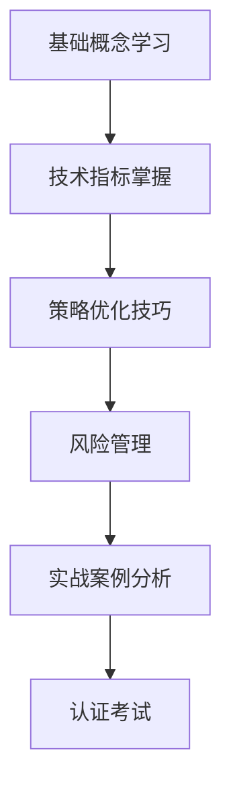
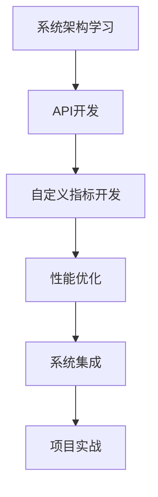
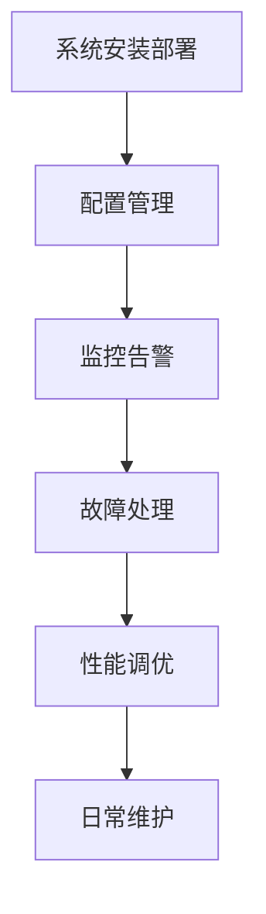

# 用户培训材料 - Enhanced Non-Price TA System

## 📖 概述

本培训材料体系提供完整的Enhanced Non-Price Technical Analysis System学习资源，涵盖从入门到高级的全套培训内容，帮助用户快速掌握系统的强大功能。

## 🎯 培训目标

### 🎓 学习目标
- **基础用户**: 5分钟快速上手，30分钟掌握核心功能
- **进阶用户**: 2小时掌握高级功能，能够独立优化策略
- **高级用户**: 1天精通系统架构，能够自定义开发
- **专家用户**: 1周成为系统专家，能够培训他人

### 📊 技能层次
```
技能金字塔
    ┌─────────────────┐
    │   专家级 (1周)   │  ← 系统架构、高级开发、培训能力
    ├─────────────────┤
    │   高级级 (1天)   │  ← 自定义开发、性能调优、系统集成
    ├─────────────────┤
    │   进阶级 (2小时)  │  ← 策略优化、批量处理、高级分析
    ├─────────────────┤
    │   基础级 (30分钟) │  ← 核心功能、基础操作、结果解读
    └─────────────────┘
```

## 📚 培训材料目录

```
training/
├── README.md                           # 本文档 - 培训导航中心
├── videos/                             # 视频培训材料
│   ├── README.md                       # 视频培训概述
│   ├── installation_video.md           # 安装配置视频脚本
│   ├── basic_usage_video.md            # 基础使用视频脚本
│   ├── advanced_features_video.md      # 高级功能视频脚本
│   ├── optimization_video.md           # 策略优化视频脚本
│   ├── troubleshooting_video.md         # 故障排除视频脚本
│   └── expert_tips_video.md            # 专家技巧视频脚本
├── presentations/                      # 演示文稿
│   ├── README.md                       # 演示文稿概述
│   ├── system_overview.md              # 系统概述演示
│   ├── technical_deep_dive.md          # 技术深度分析
│   ├── case_studies.md                 # 实际案例研究
│   ├── best_practices.md               # 最佳实践分享
│   └── future_roadmap.md               # 未来发展路线图
├── interactive/                        # 交互式教程
│   ├── README.md                       # 交互式教程概述
│   ├── guided_tour.md                  # 引导式系统导览
│   ├── interactive_examples.md         # 交互式示例
│   ├── practice_projects.md            # 实践项目
│   ├── coding_challenges.md            # 编程挑战
│   └── assessment_quizzes.md           # 评估测验
├── certification/                      # 认证材料
│   ├── README.md                       # 认证体系概述
│   ├── certification_guide.md          # 认证指南
│   ├── study_materials.md              # 学习材料
│   ├── practice_exams.md               # 练习考试
│   ├── project_portfolio.md            # 项目作品集
│   └── expert_interview.md             # 专家面试指南
├── manuals/                            # 培训手册
│   ├── README.md                       # 手册目录
│   ├── quick_start_manual.md           # 快速开始手册
│   ├── user_training_manual.md         # 用户培训手册
│   ├── developer_manual.md             # 开发者手册
│   ├── administrator_manual.md         # 管理员手册
│   └── troubleshooting_manual.md        # 故障排除手册
└── resources/                          # 培训资源
    ├── README.md                       # 资源目录
    ├── code_samples/                   # 代码示例
    ├── datasets/                       # 示例数据集
    ├── templates/                      # 模板文件
    ├── tools/                          # 培训工具
    └── references/                     参考资料
```

## 🚀 快速导航

### 🔰 新手入门 (5分钟快速上手)
1. **[系统概述演示](presentations/system_overview.md)** - 了解系统功能和优势
2. **[快速开始手册](manuals/quick_start_manual.md)** - 5分钟快速上手指南
3. **[安装配置视频](videos/installation_video.md)** - 跟着视频完成安装
4. **[基础使用视频](videos/basic_usage_video.md)** - 学习核心操作
5. **[交互式导览](interactive/guided_tour.md)** - 探索系统功能

### 🎯 进阶学习 (2小时掌握高级功能)
1. **[高级功能视频](videos/advanced_features_video.md)** - 学习高级特性
2. **[策略优化视频](videos/optimization_video.md)** - 掌握优化技巧
3. **[用户培训手册](manuals/user_training_manual.md)** - 详细功能说明
4. **[交互式示例](interactive/interactive_examples.md)** - 动手实践
5. **[实践项目](interactive/practice_projects.md)** - 完整项目练习

### 👨‍💻 高级开发 (1天精通系统)
1. **[技术深度分析](presentations/technical_deep_dive.md)** - 系统架构解析
2. **[开发者手册](manuals/developer_manual.md)** - 开发指南
3. **[专家技巧视频](videos/expert_tips_video.md)** - 专家级技巧
4. **[编程挑战](interactive/coding_challenges.md)** - 进阶挑战
5. **[案例研究](presentations/case_studies.md)** - 实际应用案例

### 🏆 专家认证 (1周成为专家)
1. **[认证指南](certification/certification_guide.md)** - 认证体系说明
2. **[学习材料](certification/study_materials.md)** - 完整学习资料
3. **[实践考试](certification/practice_exams.md)** - 认证考试准备
4. **[项目作品集](certification/project_portfolio.md)** - 项目作品展示
5. **[专家面试](certification/expert_interview.md)** - 专家级面试技巧

## 🎯 培训路径

### 路径1: 量化分析师
**目标**: 成为专业的量化策略分析师
**时间**: 1-2周
**内容**:


**推荐学习顺序**:
1. [基础概念](../user_guide/tutorials/beginner/basic_concepts.md) - 2小时
2. [技术指标](../user_guide/tutorials/intermediate/advanced_optimization.md) - 4小时
3. [策略优化](interactive/practice_projects.md#策略优化项目) - 6小时
4. [风险管理](../user_guide/tutorials/intermediate/risk_management.md) - 3小时
5. [案例研究](presentations/case_studies.md) - 4小时
6. [认证考试](certification/practice_exams.md) - 2小时

### 路径2: 系统开发者
**目标**: 成为系统开发和定制专家
**时间**: 2-3周
**内容**:


**推荐学习顺序**:
1. [系统架构](presentations/technical_deep_dive.md) - 4小时
2. [API开发](manuals/developer_manual.md) - 8小时
3. [自定义开发](interactive/coding_challenges.md) - 12小时
4. [性能调优](../deployment/configuration/performance_tuning.md) - 6小时
5. [系统集成](presentations/best_practices.md) - 4小时
6. [项目实战](interactive/practice_projects.md) - 10小时

### 路径3: 运维管理员
**目标**: 成为系统运维和管理专家
**时间**: 1周
**内容**:


**推荐学习顺序**:
1. [安装部署](../deployment/installation/) - 4小时
2. [配置管理](../deployment/configuration/) - 6小时
3. [监控告警](../deployment/production/monitoring_setup.md) - 4小时
4. [故障处理](../deployment/troubleshooting/) - 6小时
5. [性能调优](../deployment/configuration/performance_tuning.md) - 4小时
6. [日常维护](../deployment/maintenance/) - 2小时

## 📖 学习建议

### 🔰 初学者建议
1. **循序渐进**: 从基础概念开始，不要急于求成
2. **动手实践**: 理论学习与实际操作相结合
3. **记录笔记**: 整理学习要点和问题
4. **寻求帮助**: 遇到问题及时查阅文档或询问社区

### 👨‍💻 进阶用户建议
1. **深度学习**: 理解系统底层原理和设计思路
2. **项目实践**: 通过实际项目提升技能
3. **代码分析**: 阅读和分析优秀代码实现
4. **持续优化**: 不断改进和优化自己的策略

### 🏆 专家用户建议
1. **分享交流**: 参与社区讨论，分享经验
2. **创新思考**: 探索新的分析方法和策略
3. **跨领域学习**: 结合其他领域的知识
4. **持续学习**: 跟上最新的技术和方法发展

## 🎯 培训成果评估

### 技能评估维度

#### 理论知识 (40%)
- [ ] 系统架构理解
- [ ] 技术分析理论
- [ ] 策略优化原理
- [ ] 风险管理知识
- [ ] 数据处理理论

#### 实践能力 (50%)
- [ ] 系统操作熟练度
- [ ] 策略开发能力
- [ ] 问题解决能力
- [ ] 性能优化能力
- [ ] 代码开发能力

#### 创新能力 (10%)
- [ ] 新策略设计
- [ ] 方法创新
- [ ] 系统改进建议
- [ ] 跨领域应用
- [ ] 最佳实践总结

### 认证等级

#### 🟢 初级认证 (Foundation)
- **要求**: 掌握基础功能，能够独立使用系统
- **考试**: 基础操作和概念测试 (30分钟)
- **通过率**: 80%+

#### 🟡 中级认证 (Professional)
- **要求**: 掌握高级功能，能够开发和优化策略
- **考试**: 理论+实践测试 (2小时)
- **项目**: 完成一个完整的策略优化项目
- **通过率**: 60%+

#### 🔴 高级认证 (Expert)
- **要求**: 精通系统架构，能够自定义开发
- **考试**: 高级理论+开发测试 (4小时)
- **项目**: 完成一个复杂的项目开发
- **面试**: 专家面试 (1小时)
- **通过率**: 30%+

## 🔗 相关资源

### 📚 学习资源
- **[用户指南](../user_guide/)** - 完整用户文档
- **[API文档](../api/)** - API参考文档
- **[部署指南](../deployment/)** - 系统部署指南
- **[故障排除](../deployment/troubleshooting/)** - 问题解决方案

### 🛠️ 开发工具
- **[代码示例](resources/code_samples/)** - 实用代码片段
- **[模板文件](resources/templates/)** - 项目模板
- **[培训工具](resources/tools/)** - 辅助学习工具
- **[数据集](resources/datasets/)** - 练习数据集

### 👥 社区支持
- **[GitHub Issues](https://github.com/your-org/ta-system/issues)** - 问题反馈
- **[论坛讨论](https://forum.ta-system.com)** - 社区交流
- **[技术博客](https://blog.ta-system.com)** - 最新资讯
- **[在线培训](https://training.ta-system.com)** - 在线课程

## 📞 培训支持

### 🎓 讲师团队
- **首席讲师**: 10年+量化交易经验
- **技术专家**: 系统架构和开发经验
- **行业顾问**: 金融行业实践经验
- **助教团队**: 7x24小时在线支持

### 📞 联系方式
- **技术支持**: support@ta-system.com
- **培训咨询**: training@ta-system.com
- **企业合作**: enterprise@ta-system.com
- **认证查询**: certification@ta-system.com

### ⏰ 支持时间
- **在线支持**: 7x24小时
- **电话支持**: 工作日 9:00-18:00
- **视频培训**: 预约制
- **现场培训**: 企业定制

---

**🎉 开始您的Enhanced Non-Price TA系统学习之旅！**