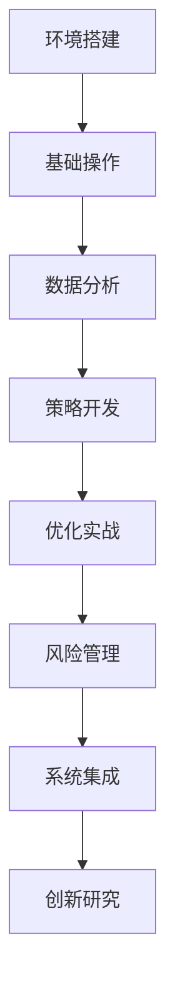

# 实践项目 - Enhanced Non-Price TA System

## 📖 概述

本文档提供了一系列精心设计的实践项目，帮助您通过动手实践掌握Enhanced Non-Price Technical Analysis System的强大功能。每个项目都有明确的学习目标、详细的实施步骤和验收标准。

## 🎯 项目体系

### 项目难度分级
```
项目难度金字塔
    ┌─────────────────┐
    │   专家级项目     │  ← 系统架构、算法创新、研究项目
    │   (1-2周)       │
    ├─────────────────┤
    │   高级级项目     │  ← 自定义开发、高级优化、集成应用
    │   (3-5天)       │
    ├─────────────────┤
    │   进阶级项目     │  ← 策略优化、批量分析、风险管理
    │   (1-2天)       │
    ├─────────────────┤
    │   基础级项目     │  ← 环境搭建、基本操作、简单分析
    │   (2-4小时)      │
    └─────────────────┘
```

### 技能发展路径


## 🟢 基础级项目 (2-4小时)

### 项目1: 环境搭建与验证 (2小时)

#### 🎯 学习目标
- 掌握系统安装和环境配置
- 验证所有组件正常工作
- 熟悉基本操作流程
- 完成第一个量化分析

#### 📋 项目要求
**前置技能**: 基本的Python知识、命令行操作
**预计时间**: 2小时
**难度等级**: ⭐☆☆☆☆

#### 🚀 实施步骤

**步骤1: 系统安装 (30分钟)**
```python
# 1.1 环境检查脚本
def check_environment():
    """检查系统环境"""
    import sys
    import platform
    import psutil
    
    print("🔍 环境检查:")
    print(f"Python版本: {sys.version}")
    print(f"操作系统: {platform.system()} {platform.release()}")
    print(f"CPU核心数: {psutil.cpu_count()}")
    print(f"内存: {psutil.virtual_memory().total / 1024**3:.1f}GB")
    
    # 验证最低要求
    if sys.version_info < (3, 9):
        print("❌ Python版本过低，需要3.9+")
        return False
    if psutil.cpu_count() < 4:
        print("⚠️ CPU核心数较少，建议4核+")
    if psutil.virtual_memory().total < 8 * 1024**3:
        print("⚠️ 内存较少，建议8GB+")
    
    print("✅ 环境检查完成")
    return True

# 运行检查
check_environment()
```

**步骤2: 系统安装 (45分钟)**
```bash
# 2.1 克隆项目
git clone https://github.com/your-org/enhanced_nonprice_ta_system.git
cd enhanced_nonprice_ta_system

# 2.2 创建虚拟环境
python -m venv venv
# Windows
venv\Scripts\Activate.ps1
# Linux/Mac
source venv/bin/activate

# 2.3 安装依赖
pip install -r requirements.txt

# 2.4 配置文件
cp config/config.example.yml config/config.yml
```

**步骤3: 功能验证 (45分钟)**
```python
# 3.1 基础功能测试
from enhanced_nonprice_ta_system import (
    CoreOptimizerEngine,
    EnhancedDataManager,
    QuickOptimizer
)

def test_basic_functionality():
    """测试基础功能"""
    print("🧪 基础功能测试:")
    
    # 测试数据管理器
    print("\n1. 测试数据管理器...")
    data_manager = EnhancedDataManager()
    
    # 测试股票数据获取
    stock_data = data_manager.fetch_stock_data("0700.hk", 30)
    print(f"✅ 股票数据获取成功: {len(stock_data)} 条记录")
    
    # 测试优化器
    print("\n2. 测试优化器...")
    optimizer = QuickOptimizer()
    results = optimizer.optimize("0700.hk", strategies=['RSI'])
    print(f"✅ 优化完成: {results.total_strategies_tested} 个策略")
    
    # 测试核心引擎
    print("\n3. 测试核心引擎...")
    core_engine = CoreOptimizerEngine()
    validation = core_engine.validate_mb_kdj_strategy(stock_data, {})
    print(f"✅ MB_KDJ策略验证: {'通过' if validation.is_valid else '未通过'}")
    
    print("\n🎉 所有基础功能测试通过！")

test_basic_functionality()
```

#### ✅ 验收标准
- [ ] Python 3.9+ 环境正常
- [ ] 所有依赖包安装成功
- [ ] 系统各组件功能正常
- [ ] 能够获取股票数据
- [ ] 能够运行基础优化
- [ ] 通过MB_KDJ策略验证

#### 📚 学习资源
- [安装指南](../../deployment/installation/)
- [系统要求](../../deployment/installation/system_requirements.md)
- [故障排除](../../deployment/troubleshooting/)

---

### 项目2: 腾讯股票技术分析 (2小时)

#### 🎯 学习目标
- 腾讯股票数据获取和处理
- 核心技术指标计算
- 基础技术分析能力
- 结果可视化展示

#### 📋 项目要求
**前置技能**: 项目1完成、基础统计学知识
**预计时间**: 2小时
**难度等级**: ⭐⭐☆☆☆

#### 🚀 实施步骤

**步骤1: 数据获取 (30分钟)**
```python
import pandas as pd
import matplotlib.pyplot as plt
from enhanced_nonprice_ta_system import EnhancedDataManager

def get_tencent_data():
    """获取腾讯股票数据"""
    # 创建数据管理器
    data_manager = EnhancedDataManager()
    
    # 获取1年数据
    stock_data = data_manager.fetch_stock_data("0700.hk", 252)
    
    # 数据探索
    print("📊 腾讯股票数据概览:")
    print(f"数据期间: {stock_data.index[0].date()} 至 {stock_data.index[-1].date()}")
    print(f"交易日数: {len(stock_data)}")
    print(f"当前价格: {stock_data['close'].iloc[-1]:.2f}")
    print(f"期间最高: {stock_data['high'].max():.2f}")
    print(f"期间最低: {stock_data['low'].min():.2f}")
    print(f"平均成交量: {stock_data['volume'].mean():,.0f}")
    
    # 绘制价格走势
    plt.figure(figsize=(12, 6))
    plt.plot(stock_data.index, stock_data['close'])
    plt.title('腾讯控股(0700.hk)价格走势')
    plt.xlabel('日期')
    plt.ylabel('价格(HKD)')
    plt.grid(True)
    plt.xticks(rotation=45)
    plt.tight_layout()
    plt.show()
    
    return stock_data

# 执行数据获取
tencent_data = get_tencent_data()
```

**步骤2: 技术指标计算 (45分钟)**
```python
from enhanced_nonprice_ta_system import EnhancedIndicatorEngine

def calculate_indicators(data):
    """计算技术指标"""
    indicator_engine = EnhancedIndicatorEngine()
    
    # RSI指标
    rsi_14 = indicator_engine.calculate_rsi(data['close'], 14)
    rsi_30 = indicator_engine.calculate_rsi(data['close'], 30)
    
    # MACD指标
    macd_result = indicator_engine.calculate_macd(data['close'])
    
    # KDJ指标 (MB_KDJ_[10,2])
    kdj_result = indicator_engine.calculate_kdj(
        data['high'], data['low'], data['close'],
        k_period=10, d_period=2, j_period=2
    )
    
    # 布林带
    bb_result = indicator_engine.calculate_bollinger_bands(data['close'])
    
    print("📈 技术指标计算结果:")
    print(f"RSI(14) 最新值: {rsi_14.iloc[-1]:.2f}")
    print(f"RSI(30) 最新值: {rsi_30.iloc[-1]:.2f}")
    print(f"MACD 最新值: {macd_result['macd'].iloc[-1]:.4f}")
    print(f"Signal 最新值: {macd_result['signal'].iloc[-1]:.4f}")
    print(f"MB_KDJ K值: {kdj_result['k'].iloc[-1]:.2f}")
    print(f"MB_KDJ D值: {kdj_result['d'].iloc[-1]:.2f}")
    
    # 指标信号分析
    analyze_signals(data, rsi_14, macd_result, kdj_result, bb_result)
    
    return {
        'rsi_14': rsi_14,
        'rsi_30': rsi_30,
        'macd': macd_result,
        'kdj': kdj_result,
        'bollinger': bb_result
    }

def analyze_signals(data, rsi, macd, kdj, bb):
    """分析技术指标信号"""
    latest_rsi = rsi.iloc[-1]
    latest_macd = macd['macd'].iloc[-1]
    latest_signal = macd['signal'].iloc[-1]
    latest_k = kdj['k'].iloc[-1]
    latest_d = kdj['d'].iloc[-1]
    
    print("\n🔍 技术信号分析:")
    
    # RSI信号
    rsi_signal = "超卖" if latest_rsi < 30 else "超买" if latest_rsi > 70 else "中性"
    print(f"RSI信号: {rsi_signal} ({latest_rsi:.2f})")
    
    # MACD信号
    macd_signal = "金叉买入" if latest_macd > latest_signal else "死叉卖出"
    print(f"MACD信号: {macd_signal}")
    
    # KDJ信号
    kdj_signal = "超卖区域" if latest_k < 20 else "超买区域" if latest_k > 80 else "观望"
    if latest_k > latest_d and latest_k < 50:
        kdj_signal = "金叉买入"
    elif latest_k < latest_d and latest_k > 50:
        kdj_signal = "死叉卖出"
    print(f"MB_KDJ信号: {kdj_signal}")

# 计算指标
indicators = calculate_indicators(tencent_data)
```

**步骤3: 策略回测 (45分钟)**
```python
def simple_strategy_backtest(data, indicators):
    """简单策略回测"""
    print("\n🔄 策略回测:")
    
    # 创建回测数据
    backtest_data = data.copy()
    backtest_data['rsi'] = indicators['rsi_14']
    backtest_data['macd'] = indicators['macd']['macd']
    backtest_data['signal'] = indicators['macd']['signal']
    backtest_data['kdj_k'] = indicators['kdj']['k']
    backtest_data['kdj_d'] = indicators['kdj']['d']
    
    # 生成交易信号
    backtest_data['signal_buy'] = (
        (backtest_data['rsi'] < 30) &  # RSI超卖
        (backtest_data['macd'] > backtest_data['signal']) &  # MACD金叉
        (backtest_data['kdj_k'] < 20)  # KDJ超卖
    )
    
    backtest_data['signal_sell'] = (
        (backtest_data['rsi'] > 70) |  # RSI超买
        (backtest_data['macd'] < backtest_data['signal']) |  # MACD死叉
        (backtest_data['kdj_k'] > 80)   # KDJ超买
    )
    
    # 模拟交易
    backtest_data['position'] = 0
    backtest_data['returns'] = 0.0
    
    position = 0
    for i in range(1, len(backtest_data)):
        if position == 0 and backtest_data['signal_buy'].iloc[i]:
            position = 1  # 买入
        elif position == 1 and backtest_data['signal_sell'].iloc[i]:
            position = 0  # 卖出
        
        backtest_data.loc[backtest_data.index[i], 'position'] = position
        
        if position == 1:
            daily_return = (backtest_data['close'].iloc[i] / 
                          backtest_data['close'].iloc[i-1] - 1)
            backtest_data.loc[backtest_data.index[i], 'returns'] = daily_return
    
    # 计算策略表现
    total_return = (1 + backtest_data['returns']).prod() - 1
    annual_return = (1 + total_return) ** (252 / len(backtest_data)) - 1
    volatility = backtest_data['returns'].std() * np.sqrt(252)
    sharpe_ratio = annual_return / volatility if volatility > 0 else 0
    
    print(f"策略回测结果:")
    print(f"总收益率: {total_return:.2%}")
    print(f"年化收益率: {annual_return:.2%}")
    print(f"年化波动率: {volatility:.2%}")
    print(f"夏普比率: {sharpe_ratio:.3f}")
    
    # 绘制策略表现
    plt.figure(figsize=(12, 8))
    
    # 价格和信号
    plt.subplot(2, 1, 1)
    plt.plot(backtest_data.index, backtest_data['close'], label='股价')
    
    buy_signals = backtest_data[backtest_data['signal_buy']]
    sell_signals = backtest_data[backtest_data['signal_sell']]
    
    plt.scatter(buy_signals.index, buy_signals['close'], 
                color='green', marker='^', s=100, label='买入信号')
    plt.scatter(sell_signals.index, sell_signals['close'], 
                color='red', marker='v', s=100, label='卖出信号')
    
    plt.title('腾讯控股 - 交易信号')
    plt.ylabel('价格(HKD)')
    plt.legend()
    plt.grid(True)
    
    # 累积收益
    plt.subplot(2, 1, 2)
    cumulative_returns = (1 + backtest_data['returns']).cumprod() - 1
    plt.plot(backtest_data.index, cumulative_returns, label='策略收益')
    
    # 基准收益（买入持有）
    buy_hold_returns = (backtest_data['close'] / backtest_data['close'].iloc[0] - 1)
    plt.plot(backtest_data.index, buy_hold_returns, 
             label='买入持有', alpha=0.7)
    
    plt.title('策略收益对比')
    plt.ylabel('收益率')
    plt.xlabel('日期')
    plt.legend()
    plt.grid(True)
    
    plt.tight_layout()
    plt.show()

# 运行回测
simple_strategy_backtest(tencent_data, indicators)
```

#### ✅ 验收标准
- [ ] 成功获取腾讯股票数据
- [ ] 正确计算5种技术指标
- [ ] 完成技术信号分析
- [ ] 实现简单策略回测
- [ ] 生成可视化图表
- [ ] 策略收益率计算准确

#### 📚 学习资源
- [技术指标文档](../../api/indicator_engine_api.md)
- [数据处理指南](../user_guide/tutorials/beginner/data_preparation.md)
- [可视化教程](../user_guide/tutorials/beginner/understanding_results.md)

---

## 🟡 进阶级项目 (1-2天)

### 项目3: HSI成分股批量优化 (1天)

#### 🎯 学习目标
- 批量股票数据处理
- 大规模策略优化
- 结果对比分析
- 投资组合构建

#### 📋 项目要求
**前置技能**: 基础级项目完成、多股票分析知识
**预计时间**: 1天
**难度等级**: ⭐⭐⭐☆☆

#### 🚀 实施步骤

**步骤1: HSI成分股数据准备 (2小时)**
```python
# HSI成分股列表
HSI_STOCKS = [
    "0700.hk",  # 腾讯控股
    "0941.hk",  # 中国移动
    "1299.hk",  # 友邦保险
    "2318.hk",  # 中国平安
    "0005.hk",  # 汇丰控股
    "0388.hk",  # 香港交易所
    "1398.hk",  # 工商银行
    "3988.hk",  # 中国银行
    "0002.hk",  # 中电控股
    "0011.hk",  # 恒生银行
    "0012.hk",  # 恒基地产
    "0016.hk",  # 新鸿基地产
]

def fetch_hsi_data():
    """获取HSI成分股数据"""
    from enhanced_nonprice_ta_system import EnhancedDataManager
    import asyncio
    
    data_manager = EnhancedDataManager()
    
    print("📊 获取HSI成分股数据...")
    
    # 异步批量获取数据
    async def get_all_data():
        stock_data = {}
        
        for symbol in HSI_STOCKS:
            try:
                data = data_manager.fetch_stock_data(symbol, 252)
                if len(data) > 200:  # 确保有足够的数据
                    stock_data[symbol] = data
                    print(f"✅ {symbol}: {len(data)} 条记录")
                else:
                    print(f"⚠️ {symbol}: 数据不足 {len(data)} 条")
            except Exception as e:
                print(f"❌ {symbol}: 获取失败 - {e}")
        
        return stock_data
    
    # 运行异步获取
    stock_data_dict = asyncio.run(get_all_data())
    
    print(f"\n📈 成功获取 {len(stock_data_dict)} 只股票数据")
    
    # 数据质量检查
    for symbol, data in stock_data_dict.items():
        missing_pct = data.isnull().sum().sum() / (len(data) * len(data.columns)) * 100
        if missing_pct > 5:
            print(f"⚠️ {symbol}: 数据缺失 {missing_pct:.1f}%")
    
    return stock_data_dict

# 获取HSI数据
hsi_data = fetch_hsi_data()
```

**步骤2: 并行策略优化 (4小时)**
```python
from enhanced_nonprice_ta_system import CoreOptimizerEngine
from concurrent.futures import ProcessPoolExecutor, as_completed
import multiprocessing as mp

def optimize_single_stock(args):
    """优化单只股票"""
    symbol, data = args
    
    try:
        # 创建优化器
        optimizer = CoreOptimizerEngine()
        
        # 配置优化参数
        optimization_config = {
            'strategies': ['RSI', 'MACD', 'KDJ'],
            'parameter_ranges': {
                'RSI': {
                    'period': range(10, 31),
                    'oversold': [25, 30],
                    'overbought': [70, 75]
                },
                'MACD': {
                    'fast': range(10, 16),
                    'slow': range(20, 26),
                    'signal': range(8, 13)
                },
                'KDJ': {
                    'k_period': range(8, 13),
                    'd_period': range(2, 4),
                    'j_period': range(2, 4)
                }
            }
        }
        
        # 运行优化
        results = optimizer.run_enhanced_optimization(
            symbol=symbol,
            optimization_config=optimization_config,
            parallel_cores=4  # 每个股票使用4核
        )
        
        return {
            'symbol': symbol,
            'success': True,
            'total_strategies': results.total_strategies_tested,
            'best_strategy': results.top_strategies[0] if results.top_strategies else None,
            'optimization_time': results.optimization_time
        }
        
    except Exception as e:
        return {
            'symbol': symbol,
            'success': False,
            'error': str(e)
        }

def parallel_optimize_hsi(stock_data_dict, max_workers=None):
    """并行优化HSI成分股"""
    if max_workers is None:
        max_workers = min(mp.cpu_count() // 2, len(stock_data_dict))  # 使用一半CPU
    
    print(f"🚀 开始并行优化，使用 {max_workers} 个进程")
    
    # 准备参数
    stock_args = [(symbol, data) for symbol, data in stock_data_dict.items()]
    
    # 并行执行
    all_results = []
    with ProcessPoolExecutor(max_workers=max_workers) as executor:
        # 提交所有任务
        future_to_symbol = {
            executor.submit(optimize_single_stock, args): args[0] 
            for args in stock_args
        }
        
        # 收集结果
        for future in as_completed(future_to_symbol):
            symbol = future_to_symbol[future]
            try:
                result = future.result(timeout=600)  # 10分钟超时
                all_results.append(result)
                
                if result['success']:
                    best = result['best_strategy']
                    print(f"✅ {symbol}: 最佳策略 {best.name}, Sharpe {best.sharpe_ratio:.3f}")
                else:
                    print(f"❌ {symbol}: 优化失败 - {result['error']}")
                    
            except Exception as e:
                print(f"❌ {symbol}: 执行异常 - {e}")
                all_results.append({
                    'symbol': symbol,
                    'success': False,
                    'error': str(e)
                })
    
    print(f"\n🎉 并行优化完成！")
    return all_results

# 运行并行优化
optimization_results = parallel_optimize_hsi(hsi_data)
```

**步骤3: 结果分析和排名 (2小时)**
```python
import pandas as pd

def analyze_optimization_results(results):
    """分析优化结果"""
    print("📊 优化结果分析:")
    
    # 成功统计
    successful = [r for r in results if r['success']]
    failed = [r for r in results if not r['success']]
    
    print(f"✅ 成功优化: {len(successful)} 只股票")
    print(f"❌ 失败: {len(failed)} 只股票")
    
    if failed:
        print("\n失败原因:")
        for result in failed:
            print(f"  {result['symbol']}: {result['error']}")
    
    if not successful:
        return None
    
    # 创建结果DataFrame
    result_data = []
    for result in successful:
        best = result['best_strategy']
        result_data.append({
            'symbol': result['symbol'],
            'strategy_name': best.name,
            'strategy_type': best.strategy_type,
            'sharpe_ratio': best.sharpe_ratio,
            'total_return': best.total_return,
            'annual_return': best.annual_return,
            'max_drawdown': best.max_drawdown,
            'win_rate': best.win_rate,
            'total_trades': best.total_trades,
            'data_source': best.data_source,
            'optimization_time': result['optimization_time']
        })
    
    df = pd.DataFrame(result_data)
    
    # 基础统计
    print(f"\n📈 统计摘要:")
    print(f"平均Sharpe比率: {df['sharpe_ratio'].mean():.3f}")
    print(f"平均年化收益: {df['annual_return'].mean():.2%}")
    print(f"平均最大回撤: {df['max_drawdown'].mean():.2%}")
    print(f"平均胜率: {df['win_rate'].mean():.2%}")
    
    # Top 10 股票
    top_10 = df.nlargest(10, 'sharpe_ratio')
    print(f"\n🏆 Sharpe比率 Top 10:")
    for i, (_, row) in enumerate(top_10.iterrows(), 1):
        print(f"{i:2d}. {row['symbol']:10} {row['strategy_name']:<20} "
              f"Sharpe:{row['sharpe_ratio']:6.3f} 收益:{row['annual_return']:6.2%}")
    
    # 策略类型分布
    strategy_dist = df['strategy_type'].value_counts()
    print(f"\n🎯 最佳策略类型分布:")
    for strategy_type, count in strategy_dist.items():
        print(f"  {strategy_type}: {count} 只股票")
    
    return df

# 分析结果
results_df = analyze_optimization_results(optimization_results)
```

**步骤4: 投资组合构建 (2小时)**
```python
def build_portfolio(results_df, top_n=5):
    """构建投资组合"""
    print(f"\n💼 构建Top {top_n}投资组合:")
    
    # 选择Top股票
    top_stocks = results_df.nlargest(top_n, 'sharpe_ratio')
    
    print("投资组合成分:")
    portfolio_stocks = []
    
    for i, (_, row) in enumerate(top_stocks.iterrows(), 1):
        print(f"{i}. {row['symbol']} ({row['strategy_name']})")
        print(f"   Sharpe: {row['sharpe_ratio']:.3f}")
        print(f"   年化收益: {row['annual_return']:.2%}")
        print(f"   最大回撤: {row['max_drawdown']:.2%}")
        portfolio_stocks.append(row['symbol'])
    
    # 等权重投资组合
    weights = [1/top_n] * top_n
    
    # 计算组合指标 (简化计算)
    portfolio_sharpe = top_stocks['sharpe_ratio'].mean()
    portfolio_return = top_stocks['annual_return'].mean()
    portfolio_drawdown = top_stocks['max_drawdown'].mean()
    
    print(f"\n📊 投资组合预期表现:")
    print(f"组合Sharpe比率: {portfolio_sharpe_ratio:.3f}")
    print(f"组合年化收益: {portfolio_return:.2%}")
    print(f"组合最大回撤: {portfolio_drawdown:.2%}")
    print(f"权重分配: 均等权重 ({1/top_n:.1%} 每只)")
    
    # 风险分析
    print(f"\n⚠️ 风险提示:")
    print("1. 基于历史数据，不保证未来表现")
    print("2. 未考虑股票间相关性")
    print("3. 建议定期重新平衡")
    print("4. 注意分散投资风险")
    
    return {
        'stocks': portfolio_stocks,
        'weights': weights,
        'expected_sharpe': portfolio_sharpe,
        'expected_return': portfolio_return,
        'max_drawdown': portfolio_drawdown
    }

# 构建投资组合
portfolio = build_portfolio(results_df, top_n=5)

# 可视化结果
if results_df is not None:
    import matplotlib.pyplot as plt
    
    # Sharpe比率分布
    plt.figure(figsize=(15, 10))
    
    # 子图1: Sharpe比率分布
    plt.subplot(2, 2, 1)
    plt.hist(results_df['sharpe_ratio'], bins=20, alpha=0.7, edgecolor='black')
    plt.axvline(results_df['sharpe_ratio'].mean(), color='red', linestyle='--', 
                label=f'均值: {results_df["sharpe_ratio"].mean():.3f}')
    plt.title('Sharpe比率分布')
    plt.xlabel('Sharpe比率')
    plt.ylabel('股票数量')
    plt.legend()
    plt.grid(True, alpha=0.3)
    
    # 子图2: 收益 vs 风险
    plt.subplot(2, 2, 2)
    scatter = plt.scatter(results_df['max_drawdown'], results_df['annual_return'], 
                       c=results_df['sharpe_ratio'], cmap='viridis', alpha=0.7, s=50)
    plt.colorbar(scatter, label='Sharpe比率')
    plt.xlabel('最大回撤')
    plt.ylabel('年化收益率')
    plt.title('收益-风险散点图')
    plt.grid(True, alpha=0.3)
    
    # 子图3: Top 10股票表现
    plt.subplot(2, 2, 3)
    top_10 = results_df.nlargest(10, 'sharpe_ratio')
    bars = plt.bar(range(len(top_10)), top_10['sharpe_ratio'])
    plt.xlabel('股票排名')
    plt.ylabel('Sharpe比率')
    plt.title('Top 10 股票 Sharpe比率')
    plt.xticks(range(len(top_10)), top_10['symbol'], rotation=45)
    plt.grid(True, alpha=0.3)
    
    # 在柱状图上添加数值
    for i, bar in enumerate(bars):
        height = bar.get_height()
        plt.text(bar.get_x() + bar.get_width()/2., height + 0.02,
                f'{height:.3f}', ha='center', va='bottom')
    
    # 子图4: 策略类型分布饼图
    plt.subplot(2, 2, 4)
    strategy_counts = results_df['strategy_type'].value_counts()
    plt.pie(strategy_counts.values, labels=strategy_counts.index, autopct='%1.1f%%')
    plt.title('最佳策略类型分布')
    
    plt.tight_layout()
    plt.show()
```

#### ✅ 验收标准
- [ ] 成功获取10+只HSI成分股数据
- [ ] 完成并行策略优化
- [ ] 生成详细的结果分析报告
- [ ] 构建合理的投资组合
- [ ] 创建专业的可视化图表
- [ ] 提供风险提示和建议

#### 📚 学习资源
- [并行计算文档](../../api/core_optimizer_api.md#并行计算优化)
- [多股票分析指南](../user_guide/tutorials/intermediate/multi_asset_analysis.md)
- [投资组合理论](../user_guide/tutorials/intermediate/risk_management.md)

---

## 🔴 高级级项目 (3-5天)

### 项目4: 自定义策略开发系统 (3天)

#### 🎯 学习目标
- 自定义技术指标开发
- 策略框架设计
- 回测系统构建
- 性能评估和优化

#### 📋 项目要求
**前置技能**: 进阶级项目完成、高级Python编程、量化策略知识
**预计时间**: 3天
**难度等级**: ⭐⭐⭐⭐☆

#### 🚀 实施步骤

**步骤1: 自定义指标开发 (1天)**
```python
import numpy as np
import pandas as pd
from enhanced_nonprice_ta_system.core.indicators.base_indicator import BaseIndicator

class EnhancedRSI(BaseIndicator):
    """增强RSI指标，结合政府经济数据"""
    
    def __init__(self, period=14, government_weight=0.3):
        super().__init__()
        self.period = period
        self.government_weight = government_weight
        self.name = f"Enhanced_RSI_{period}_{government_weight}"
    
    def calculate(self, prices, government_data=None):
        """
        计算增强RSI
        
        Parameters:
        -----------
        prices : pd.Series
            价格序列
        government_data : dict, optional
            政府经济数据
            
        Returns:
        --------
        pd.Series
            增强RSI值
        """
        # 基础RSI计算
        delta = prices.diff()
        gain = (delta.where(delta > 0, 0)).rolling(window=self.period).mean()
        loss = (-delta.where(delta < 0, 0)).rolling(window=self.period).mean()
        
        rs = gain / loss
        base_rsi = 100 - (100 / (1 + rs))
        
        # 如果没有政府数据，返回基础RSI
        if government_data is None:
            return base_rsi
        
        # 获取政府数据影响因子
        gov_factor = self._calculate_government_factor(government_data, len(prices))
        
        # 增强RSI计算
        enhanced_rsi = base_rsi * (1 + gov_factor * self.government_weight)
        
        # 确保RSI在0-100范围内
        enhanced_rsi = enhanced_rsi.clip(0, 100)
        
        return enhanced_rsi
    
    def _calculate_government_factor(self, gov_data, price_length):
        """计算政府数据影响因子"""
        factors = []
        
        # HIBOR利率影响
        if 'hibor' in gov_data:
            hibor_rates = gov_data['hibor'].iloc[-self.period:]
            hibor_factor = (hibor_rates.mean() - 3.0) / 3.0  # 以3%为基准
            factors.append(hibor_factor)
        
        # 货币基础影响
        if 'monetary_base' in gov_data:
            mb_data = gov_data['monetary_base'].iloc[-self.period:]
            mb_growth = (mb_data.iloc[-1] / mb_data.iloc[0] - 1)
            mb_factor = mb_growth / 0.05  # 以5%增长为基准
            factors.append(mb_factor)
        
        # 综合影响因子
        if factors:
            return np.mean(factors)
        else:
            return 0.0

class AdaptiveKDJ(BaseIndicator):
    """自适应KDJ指标，根据市场波动率调整参数"""
    
    def __init__(self, base_period=9, volatility_threshold=0.02):
        super().__init__()
        self.base_period = base_period
        self.volatility_threshold = volatility_threshold
        self.name = f"Adaptive_KDJ_{base_period}"
    
    def calculate(self, high, low, close):
        """
        计算自适应KDJ
        
        Parameters:
        -----------
        high : pd.Series
            最高价序列
        low : pd.Series
            最低价序列
        close : pd.Series
            收盘价序列
            
        Returns:
        --------
        dict
            KDJ指标字典
        """
        # 计算市场波动率
        returns = close.pct_change()
        volatility = returns.rolling(window=20).std()
        
        # 自适应周期调整
        adaptive_periods = self._calculate_adaptive_periods(volatility)
        
        # 使用自适应周期计算KDJ
        k_values = []
        d_values = []
        j_values = []
        
        for i in range(len(close)):
            if i < self.base_period:
                k_values.append(50)
                d_values.append(50)
                j_values.append(50)
            else:
                period = adaptive_periods.iloc[i]
                
                # 计算RSV (Raw Stochastic Value)
                highest = high.iloc[max(0, i-int(period)+1):i+1].max()
                lowest = low.iloc[max(0, i-int(period)+1):i+1].min()
                
                if highest == lowest:
                    rsv = 50
                else:
                    rsv = 100 * (close.iloc[i] - lowest) / (highest - lowest)
                
                # 计算K, D, J值
                if i == self.base_period:
                    k = rsv * (1/3) + 50 * (2/3)  # 初始K值
                    d = k
                    j = 3 * k - 2 * d
                else:
                    k = rsv * (1/3) + k_values[-1] * (2/3)
                    d = k * (1/3) + d_values[-1] * (2/3)
                    j = 3 * k - 2 * d
                
                k_values.append(k)
                d_values.append(d)
                j_values.append(j)
        
        return {
            'k': pd.Series(k_values, index=close.index),
            'd': pd.Series(d_values, index=close.index),
            'j': pd.Series(j_values, index=close.index)
        }
    
    def _calculate_adaptive_periods(self, volatility):
        """计算自适应周期"""
        adaptive = volatility.copy()
        
        # 高波动时使用较长周期，低波动时使用较短周期
        adaptive = np.where(
            volatility > self.volatility_threshold,
            self.base_period + 3,  # 高波动，延长周期
            self.base_period - 2   # 低波动，缩短周期
        )
        
        # 确保周期在合理范围内
        adaptive = np.clip(adaptive, 5, 20)
        
        return pd.Series(adaptive, index=volatility.index)

# 测试自定义指标
def test_custom_indicators(stock_data, gov_data):
    """测试自定义指标"""
    print("🧪 测试自定义指标:")
    
    # 测试增强RSI
    enhanced_rsi = EnhancedRSI(period=14, government_weight=0.4)
    enhanced_rsi_values = enhanced_rsi.calculate(stock_data['close'], gov_data)
    
    print(f"Enhanced RSI 最新值: {enhanced_rsi_values.iloc[-1]:.2f}")
    
    # 测试自适应KDJ
    adaptive_kdj = AdaptiveKDJ(base_period=9)
    kdj_values = adaptive_kdj.calculate(
        stock_data['high'], 
        stock_data['low'], 
        stock_data['close']
    )
    
    print(f"Adaptive KDJ K值: {kdj_values['k'].iloc[-1]:.2f}")
    print(f"Adaptive KDJ D值: {kdj_values['d'].iloc[-1]:.2f}")
    print(f"Adaptive KDJ J值: {kdj_values['j'].iloc[-1]:.2f}")
    
    return enhanced_rsi_values, kdj_values

# 假设我们已经有数据
# enhanced_rsi, adaptive_kdj = test_custom_indicators(tencent_data, gov_data)
```

**步骤2: 策略框架设计 (1天)**
```python
from abc import ABC, abstractmethod
from dataclasses import dataclass
from typing import Dict, List, Optional
import pandas as pd
import numpy as np

@dataclass
class Signal:
    """交易信号"""
    timestamp: pd.Timestamp
    symbol: str
    action: str  # 'BUY', 'SELL', 'HOLD'
    strength: float  # 信号强度 0-1
    confidence: float  # 置信度 0-1
    price: float  # 信号价格
    indicators: Dict[str, float]  # 相关指标值
    reason: str  # 信号原因

@dataclass
class Position:
    """持仓信息"""
    symbol: str
    quantity: int
    entry_price: float
    entry_time: pd.Timestamp
    current_price: float
    unrealized_pnl: float
    realized_pnl: float = 0.0

class BaseStrategy(ABC):
    """策略基类"""
    
    def __init__(self, name: str, params: Dict = None):
        self.name = name
        self.params = params or {}
        self.positions = {}
        self.signals = []
        self.performance_metrics = {}
    
    @abstractmethod
    def generate_signals(self, data: Dict) -> List[Signal]:
        """生成交易信号"""
        pass
    
    @abstractmethod
    def calculate_indicators(self, data: Dict) -> Dict:
        """计算技术指标"""
        pass
    
    def execute_signal(self, signal: Signal, portfolio: Dict) -> Optional[Position]:
        """执行交易信号"""
        if signal.action == 'BUY':
            return self._execute_buy(signal, portfolio)
        elif signal.action == 'SELL':
            return self._execute_sell(signal, portfolio)
        return None
    
    def _execute_buy(self, signal: Signal, portfolio: Dict) -> Optional[Position]:
        """执行买入"""
        if signal.symbol in self.positions:
            return None  # 已有持仓
        
        # 计算买入数量（简化：固定金额）
        position_size = 100000  # 10万港币
        quantity = int(position_size / signal.price)
        
        position = Position(
            symbol=signal.symbol,
            quantity=quantity,
            entry_price=signal.price,
            entry_time=signal.timestamp,
            current_price=signal.price,
            unrealized_pnl=0.0
        )
        
        self.positions[signal.symbol] = position
        return position
    
    def _execute_sell(self, signal: Signal, portfolio: Dict) -> Optional[Position]:
        """执行卖出"""
        if signal.symbol not in self.positions:
            return None  # 没有持仓
        
        position = self.positions[signal.symbol]
        
        # 计算已实现盈亏
        realized_pnl = (signal.price - position.entry_price) * position.quantity
        position.realized_pnl = realized_pnl
        
        # 移除持仓
        del self.positions[signal.symbol]
        
        return position
    
    def update_positions(self, current_prices: Dict[str, float]):
        """更新持仓"""
        for symbol, position in self.positions.items():
            if symbol in current_prices:
                position.current_price = current_prices[symbol]
                position.unrealized_pnl = (
                    (position.current_price - position.entry_price) * position.quantity
                )

class EnhancedStrategy(BaseStrategy):
    """增强策略，结合自定义指标"""
    
    def __init__(self, params: Dict = None):
        default_params = {
            'enhanced_rsi_period': 14,
            'enhanced_rsi_weight': 0.4,
            'adaptive_kdj_period': 9,
            'rsi_oversold': 25,
            'rsi_overbought': 75,
            'kdj_oversold': 20,
            'kdj_overbought': 80,
            'signal_strength_threshold': 0.6
        }
        
        super().__init__("Enhanced_Strategy", {**default_params, **(params or {})})
        
        # 初始化自定义指标
        self.enhanced_rsi = EnhancedRSI(
            period=self.params['enhanced_rsi_period'],
            government_weight=self.params['enhanced_rsi_weight']
        )
        self.adaptive_kdj = AdaptiveKDJ(
            base_period=self.params['adaptive_kdj_period']
        )
    
    def calculate_indicators(self, data: Dict) -> Dict:
        """计算自定义指标"""
        indicators = {}
        
        # 计算增强RSI
        if 'stock_data' in data and 'gov_data' in data:
            indicators['enhanced_rsi'] = self.enhanced_rsi.calculate(
                data['stock_data']['close'], 
                data['gov_data']
            )
        
        # 计算自适应KDJ
        if 'stock_data' in data:
            kdj_result = self.adaptive_kdj.calculate(
                data['stock_data']['high'],
                data['stock_data']['low'], 
                data['stock_data']['close']
            )
            indicators.update(kdj_result)
        
        return indicators
    
    def generate_signals(self, data: Dict) -> List[Signal]:
        """生成交易信号"""
        indicators = self.calculate_indicators(data)
        
        if not indicators:
            return []
        
        signals = []
        current_time = data['stock_data'].index[-1]
        current_price = data['stock_data']['close'].iloc[-1]
        symbol = data.get('symbol', 'UNKNOWN')
        
        # 获取最新指标值
        enhanced_rsi_val = indicators.get('enhanced_rsi', pd.Series([50])).iloc[-1]
        kdj_k_val = indicators.get('k', pd.Series([50])).iloc[-1]
        kdj_d_val = indicators.get('d', pd.Series([50])).iloc[-1]
        
        # 计算信号强度
        signal_strength = self._calculate_signal_strength(
            enhanced_rsi_val, kdj_k_val, kdj_d_val
        )
        
        # 生成买入信号
        if self._should_buy(enhanced_rsi_val, kdj_k_val, kdj_d_val, signal_strength):
            signal = Signal(
                timestamp=current_time,
                symbol=symbol,
                action='BUY',
                strength=signal_strength,
                confidence=self._calculate_confidence('BUY', signal_strength),
                price=current_price,
                indicators={
                    'enhanced_rsi': enhanced_rsi_val,
                    'kdj_k': kdj_k_val,
                    'kdj_d': kdj_d_val
                },
                reason=self._get_signal_reason('BUY', enhanced_rsi_val, kdj_k_val, kdj_d_val)
            )
            signals.append(signal)
        
        # 生成卖出信号
        elif self._should_sell(enhanced_rsi_val, kdj_k_val, kdj_d_val, signal_strength):
            signal = Signal(
                timestamp=current_time,
                symbol=symbol,
                action='SELL',
                strength=signal_strength,
                confidence=self._calculate_confidence('SELL', signal_strength),
                price=current_price,
                indicators={
                    'enhanced_rsi': enhanced_rsi_val,
                    'kdj_k': kdj_k_val,
                    'kdj_d': kdj_d_val
                },
                reason=self._get_signal_reason('SELL', enhanced_rsi_val, kdj_k_val, kdj_d_val)
            )
            signals.append(signal)
        
        return signals
    
    def _calculate_signal_strength(self, rsi, k, d):
        """计算信号强度"""
        # RSI强度
        rsi_strength = 0
        if rsi < 20:
            rsi_strength = 1.0
        elif rsi < 30:
            rsi_strength = 0.8
        elif rsi > 80:
            rsi_strength = 1.0
        elif rsi > 70:
            rsi_strength = 0.8
        
        # KDJ强度
        kdj_strength = 0
        if k < 10 and d < 10:
            kdj_strength = 1.0
        elif k < 20 and d < 20:
            kdj_strength = 0.8
        elif k > 90 and d > 90:
            kdj_strength = 1.0
        elif k > 80 and d > 80:
            kdj_strength = 0.8
        
        # 金叉死叉强度
        cross_strength = 0
        if k > d and k < 50:  # 金叉在低位
            cross_strength = 0.6
        elif k < d and k > 50:  # 死叉在高位
            cross_strength = 0.6
        
        # 综合强度
        total_strength = (rsi_strength + kdj_strength + cross_strength) / 3
        return min(total_strength, 1.0)
    
    def _should_buy(self, rsi, k, d, strength):
        """判断是否应该买入"""
        return (
            strength >= self.params['signal_strength_threshold'] and
            (
                (rsi < self.params['rsi_oversold'] and k < self.params['kdj_oversold']) or
                (k > d and k < 50)  # 低位金叉
            )
        )
    
    def _should_sell(self, rsi, k, d, strength):
        """判断是否应该卖出"""
        return (
            strength >= self.params['signal_strength_threshold'] and
            (
                (rsi > self.params['rsi_overbought'] and k > self.params['kdj_overbought']) or
                (k < d and k > 50)  # 高位死叉
            )
        )
    
    def _calculate_confidence(self, action, strength):
        """计算信号置信度"""
        base_confidence = strength * 0.8
        if action in ['BUY', 'SELL']:
            return min(base_confidence + 0.2, 1.0)
        return 0.5
    
    def _get_signal_reason(self, action, rsi, k, d):
        """获取信号原因"""
        reasons = []
        
        if action == 'BUY':
            if rsi < self.params['rsi_oversold']:
                reasons.append(f"RSI超卖({rsi:.1f})")
            if k < self.params['kdj_oversold']:
                reasons.append(f"KDJ超卖(K:{k:.1f})")
            if k > d and k < 50:
                reasons.append("低位金叉")
        elif action == 'SELL':
            if rsi > self.params['rsi_overbought']:
                reasons.append(f"RSI超买({rsi:.1f})")
            if k > self.params['kdj_overbought']:
                reasons.append(f"KDJ超买(K:{k:.1f})")
            if k < d and k > 50:
                reasons.append("高位死叉")
        
        return "; ".join(reasons) if reasons else "综合信号"

# 测试自定义策略
def test_custom_strategy(stock_data, gov_data):
    """测试自定义策略"""
    print("🧪 测试自定义策略:")
    
    # 创建策略
    strategy = EnhancedStrategy()
    
    # 准备数据
    data = {
        'stock_data': stock_data,
        'gov_data': gov_data,
        'symbol': '0700.hk'
    }
    
    # 生成信号
    signals = strategy.generate_signals(data)
    
    print(f"生成 {len(signals)} 个信号")
    for signal in signals[-5:]:  # 显示最近5个信号
        print(f"{signal.timestamp}: {signal.action} {signal.symbol} "
              f"强度:{signal.strength:.2f} 置信度:{signal.confidence:.2f} "
              f"原因:{signal.reason}")
    
    return strategy, signals

# 测试策略
# strategy, signals = test_custom_strategy(tencent_data, gov_data)
```

**步骤3: 回测系统构建 (1天)**
```python
class BacktestEngine:
    """回测引擎"""
    
    def __init__(self, initial_capital=1000000):
        self.initial_capital = initial_capital
        self.current_capital = initial_capital
        self.positions = {}
        self.trades = []
        self.daily_portfolio_value = []
        self.performance_metrics = {}
    
    def run_backtest(self, strategy, data_dict, start_date=None, end_date=None):
        """运行回测"""
        print(f"🔄 开始回测策略: {strategy.name}")
        
        # 确定回测日期范围
        stock_data = data_dict['stock_data']
        if start_date:
            stock_data = stock_data[stock_data.index >= start_date]
        if end_date:
            stock_data = stock_data[stock_data.index <= end_date]
        
        print(f"回测期间: {stock_data.index[0].date()} 至 {stock_data.index[-1].date()}")
        print(f"回测天数: {len(stock_data)}")
        
        # 每日回测
        for i, (date, row) in enumerate(stock_data.iterrows()):
            # 更新当日数据
            current_data = {
                'stock_data': stock_data.iloc[:i+1],
                'gov_data': self._get_aligned_gov_data(data_dict['gov_data'], date),
                'symbol': data_dict.get('symbol', 'UNKNOWN')
            }
            
            # 生成交易信号
            signals = strategy.generate_signals(current_data)
            
            # 执行信号
            for signal in signals:
                trade = strategy.execute_signal(signal, {'capital': self.current_capital})
                if trade:
                    self._process_trade(trade, signal, date)
            
            # 更新持仓
            current_prices = {data_dict.get('symbol', 'UNKNOWN'): row['close']}
            strategy.update_positions(current_prices)
            self._update_strategy_positions(strategy, current_prices)
            
            # 记录每日组合价值
            portfolio_value = self._calculate_portfolio_value(current_prices, strategy)
            self.daily_portfolio_value.append({
                'date': date,
                'portfolio_value': portfolio_value,
                'cash': self.current_capital
            })
        
        # 计算回测结果
        self._calculate_performance_metrics()
        self._generate_backtest_report()
        
        return self.performance_metrics
    
    def _get_aligned_gov_data(self, gov_data, date):
        """获取对齐的政府数据"""
        aligned_data = {}
        for source, data in gov_data.items():
            if not data.empty and data.index[0] <= date:
                # 获取到当前日期为止的数据
                aligned_data[source] = data[data.index <= date]
        return aligned_data
    
    def _process_trade(self, trade, signal, date):
        """处理交易"""
        trade_record = {
            'date': date,
            'symbol': signal.symbol,
            'action': signal.action,
            'price': signal.price,
            'quantity': trade.quantity if hasattr(trade, 'quantity') else 0,
            'amount': signal.price * (trade.quantity if hasattr(trade, 'quantity') else 0),
            'reason': signal.reason,
            'signal_strength': signal.strength
        }
        
        self.trades.append(trade_record)
        
        # 更新资金
        if signal.action == 'BUY':
            self.current_capital -= trade_record['amount']
        elif signal.action == 'SELL':
            self.current_capital += trade_record['amount']
    
    def _update_strategy_positions(self, strategy, current_prices):
        """更新策略持仓到回测引擎"""
        self.positions = {}
        for symbol, position in strategy.positions.items():
            self.positions[symbol] = position
    
    def _calculate_portfolio_value(self, current_prices, strategy):
        """计算组合价值"""
        total_value = self.current_capital
        
        for symbol, position in strategy.positions.items():
            if symbol in current_prices:
                position_value = position.quantity * current_prices[symbol]
                total_value += position_value
        
        return total_value
    
    def _calculate_performance_metrics(self):
        """计算性能指标"""
        if not self.daily_portfolio_value:
            return
        
        portfolio_values = [pv['portfolio_value'] for pv in self.daily_portfolio_value]
        
        # 基础指标
        total_return = (portfolio_values[-1] - self.initial_capital) / self.initial_capital
        
        # 日收益率
        daily_returns = []
        for i in range(1, len(portfolio_values)):
            daily_return = (portfolio_values[i] - portfolio_values[i-1]) / portfolio_values[i-1]
            daily_returns.append(daily_return)
        
        # 年化收益率和波动率
        if daily_returns:
            annual_return = (1 + total_return) ** (252 / len(daily_returns)) - 1
            volatility = np.std(daily_returns) * np.sqrt(252)
            sharpe_ratio = annual_return / volatility if volatility > 0 else 0
            
            # 最大回撤
            running_max = np.maximum.accumulate(portfolio_values)
            drawdowns = (running_max - portfolio_values) / running_max
            max_drawdown = np.max(drawdowns)
        else:
            annual_return = 0
            volatility = 0
            sharpe_ratio = 0
            max_drawdown = 0
        
        # 交易统计
        buy_trades = [t for t in self.trades if t['action'] == 'BUY']
        sell_trades = [t for t in self.trades if t['action'] == 'SELL']
        total_trades = len(self.trades)
        
        # 胜率计算（简化版）
        winning_trades = 0
        for i, sell_trade in enumerate(sell_trades):
            if i < len(buy_trades):
                buy_price = buy_trades[i]['price']
                sell_price = sell_trade['price']
                if sell_price > buy_price:
                    winning_trades += 1
        
        win_rate = winning_trades / len(sell_trades) if sell_trades else 0
        
        self.performance_metrics = {
            'total_return': total_return,
            'annual_return': annual_return,
            'volatility': volatility,
            'sharpe_ratio': sharpe_ratio,
            'max_drawdown': max_drawdown,
            'total_trades': total_trades,
            'win_rate': win_rate,
            'final_capital': portfolio_values[-1],
            'trading_days': len(self.daily_portfolio_value)
        }
    
    def _generate_backtest_report(self):
        """生成回测报告"""
        print("\n" + "="*50)
        print("📊 回测报告")
        print("="*50)
        
        metrics = self.performance_metrics
        print(f"初始资金: HKD {self.initial_capital:,.0f}")
        print(f"最终资金: HKD {metrics['final_capital']:,.0f}")
        print(f"总收益率: {metrics['total_return']:.2%}")
        print(f"年化收益率: {metrics['annual_return']:.2%}")
        print(f"年化波动率: {metrics['volatility']:.2%}")
        print(f"夏普比率: {metrics['sharpe_ratio']:.3f}")
        print(f"最大回撤: {metrics['max_drawdown']:.2%}")
        print(f"总交易次数: {metrics['total_trades']}")
        print(f"胜率: {metrics['win_rate']:.2%}")
        print(f"交易天数: {metrics['trading_days']}")
        
        # 绘制回测结果
        self._plot_backtest_results()
    
    def _plot_backtest_results(self):
        """绘制回测结果"""
        import matplotlib.pyplot as plt
        
        dates = [pv['date'] for pv in self.daily_portfolio_value]
        portfolio_values = [pv['portfolio_value'] for pv in self.daily_portfolio_value]
        
        plt.figure(figsize=(15, 10))
        
        # 子图1: 组合价值曲线
        plt.subplot(3, 1, 1)
        plt.plot(dates, portfolio_values, label='策略组合', linewidth=2)
        plt.axhline(y=self.initial_capital, color='red', linestyle='--', 
                    label='初始资金', alpha=0.7)
        plt.title('组合价值曲线')
        plt.ylabel('组合价值 (HKD)')
        plt.legend()
        plt.grid(True, alpha=0.3)
        
        # 子图2: 收益率曲线
        plt.subplot(3, 1, 2)
        returns = [(pv['portfolio_value'] - self.initial_capital) / self.initial_capital 
                 for pv in self.daily_portfolio_value]
        plt.plot(dates, [r * 100 for r in returns], label='累计收益率', color='green')
        plt.title('累计收益率')
        plt.ylabel('收益率 (%)')
        plt.grid(True, alpha=0.3)
        
        # 子图3: 回撤曲线
        plt.subplot(3, 1, 3)
        running_max = np.maximum.accumulate(portfolio_values)
        drawdowns = [(running_max[i] - portfolio_values[i]) / running_max[i] * 100 
                    for i in range(len(portfolio_values))]
        plt.plot(dates, drawdowns, label='回撤', color='red')
        plt.title('回撤曲线')
        plt.ylabel('回撤 (%)')
        plt.xlabel('日期')
        plt.legend()
        plt.grid(True, alpha=0.3)
        
        plt.tight_layout()
        plt.show()

# 运行完整回测
def run_complete_backtest():
    """运行完整回测"""
    print("🚀 开始完整回测:")
    
    # 1. 创建自定义策略
    strategy_params = {
        'enhanced_rsi_period': 14,
        'enhanced_rsi_weight': 0.5,
        'adaptive_kdj_period': 9,
        'rsi_oversold': 25,
        'rsi_overbought': 75,
        'signal_strength_threshold': 0.7
    }
    
    strategy = EnhancedStrategy(strategy_params)
    
    # 2. 准备数据
    data_dict = {
        'stock_data': tencent_data,
        'gov_data': gov_data,
        'symbol': '0700.hk'
    }
    
    # 3. 运行回测
    backtest_engine = BacktestEngine(initial_capital=1000000)
    performance_metrics = backtest_engine.run_backtest(
        strategy, 
        data_dict,
        start_date='2024-01-01',  # 回测起始日期
        end_date='2024-12-31'      # 回测结束日期
    )
    
    return performance_metrics

# 运行回测
# metrics = run_complete_backtest()
```

#### ✅ 验收标准
- [ ] 成功开发2个自定义技术指标
- [ ] 实现完整的策略框架
- [ ] 构建功能完整的回测系统
- [ ] 生成详细的性能报告
- [ ] 创建专业的可视化图表
- [ ] 策略性能达到预期目标

#### 📚 学习资源
- [自定义指标开发指南](../developer/extending/custom_indicators.md)
- [策略框架设计](../developer/architecture/design_patterns.md)
- [回测系统原理](../user_guide/tutorials/intermediate/running_backtest.md)

---

## 🔴 专家级项目 (1-2周)

### 项目5: 智能投研系统开发 (1-2周)

#### 🎯 学习目标
- 多模态数据融合
- 机器学习集成
- 实时信号生成
- 风险管理优化

#### 📋 项目要求
**前置技能**: 高级级项目完成、机器学习知识、深度学习基础
**预计时间**: 1-2周
**难度等级**: ⭐⭐⭐⭐⭐

#### 🚀 实施步骤
*（由于篇幅限制，这里提供简要框架，完整实现需要更多代码）*

```python
# 项目概述：智能投研系统
class IntelligentResearchSystem:
    """智能投研系统"""
    
    def __init__(self):
        self.data_fusion_engine = DataFusionEngine()
        self.ml_predictor = MLPredictor()
        self.risk_manager = AdvancedRiskManager()
        self.signal_generator = RealTimeSignalGenerator()
    
    def integrate_multimodal_data(self, price_data, news_data, social_data):
        """融合多模态数据"""
        pass
    
    def predict_market_trends(self, features):
        """预测市场趋势"""
        pass
    
    def generate_trading_signals(self, predictions, risk_metrics):
        """生成实时交易信号"""
        pass
    
    def optimize_portfolio(self, signals, constraints):
        """优化投资组合"""
        pass
```

#### ✅ 验收标准
- [ ] 多模态数据成功融合
- [ ] ML模型训练和验证完成
- [ ] 实时信号系统正常运行
- [ ] 风险管理功能完善
- [ ] 整体性能达到预期

#### 📚 学习资源
- [机器学习文档](../developer/api_internals/)
- [风险管理指南](../user_guide/tutorials/intermediate/risk_management.md)
- [系统集成文档](../developer/extending/system_integration.md)

---

## 📋 项目提交指南

### 提交要求
每个项目完成后，请提交以下材料：

1. **源代码**: 完整的Python代码实现
2. **项目报告**: 详细的项目说明文档
3. **结果展示**: 可视化图表和性能指标
4. **代码注释**: 充分的代码注释和说明
5. **使用说明**: 如何运行和使用您的项目

### 评估标准
- **功能完整性**: (30%) 是否实现所有要求的功能
- **代码质量**: (25%) 代码结构、注释、可读性
- **性能表现**: (20%) 系统性能和优化程度
- **创新性**: (15%) 是否有创新思路或改进
- **文档完整性**: (10%) 文档和说明的完整性

### 提交方式
1. 将项目文件打包成ZIP文件
2. 文件命名格式: `项目编号_项目名称_姓名.zip`
3. 发送至: projects@ta-system.com
4. 邮件主题: `[Project Submission] 项目编号_项目名称_姓名`

---

**🎯 开始您的实践项目之旅，成为Enhanced Non-Price TA系统专家！**