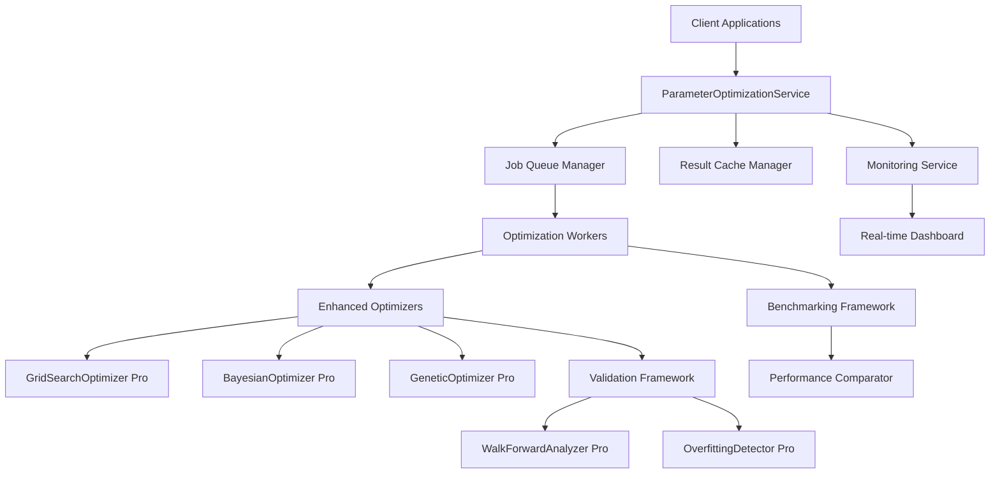

# Advanced Parameter Optimization Enhancement Design

## System Architecture Overview

This design document outlines the architecture for enhancing the advanced parameter optimization system, focusing on Grid Search, Machine Learning-assisted optimization, and Walk-Forward Analysis capabilities.

## Enhanced Requirements Based on User Selections

### 1. Comprehensive Parameter Optimization (Selection 1.D)
The system must support ALL parameter types:
- **Technical Indicators**: RSI periods, MACD parameters, Bollinger Bands multipliers
- **Strategy Parameters**: Stop-loss levels, take-profit targets, position sizing rules
- **Risk Management**: Leverage ratios, maximum drawdown limits, correlation thresholds
- **Portfolio Allocation**: Capital distribution, rebalancing frequencies, hedge ratios

### 2. Integrated Data Source Optimization (Selection 2.C)
Multi-source data integration for robust parameter validation:
- **Price Data**: OHLCV from all available stock exchanges
- **Government Economic Data**: HIBOR rates, GDP, trade balances, monetary base
- **Technical Indicators**: 477 calculated indicators as additional features
- **Alternative Data**: Market sentiment, volatility indices, correlation matrices

### 3. Institutional-Scale Performance (Selection 3.C)
Massive parameter processing capabilities:
- **Target**: >1,000,000 parameter combinations per optimization
- **Hardware**: 32-core parallel processing with distributed computing
- **Memory**: Efficient streaming algorithms for large datasets
- **Storage**: Intelligent caching and result persistence

### 4. Automated Parameter Application (Selection 4.B)
Seamless integration with existing trading systems:
- **Configuration Updates**: Auto-update strategy config files
- **Live Deployment**: Hot-swappable parameters without system restart
- **Version Control**: Track parameter changes with rollback capability
- **Validation Pipeline**: Automated testing before production deployment

### 5. Real-Time Progress Monitoring (Selection 5.A)
Priority focus on optimization progress tracking:
- **Live Dashboard**: Real-time progress bars and completion estimates
- **Parallel Job Status**: Monitor multiple concurrent optimizations
- **Performance Metrics**: CPU, memory, and algorithm convergence tracking
- **Alert System**: Notifications for completion, failures, or milestones

## Enhanced Architecture Design

### 1. Automated Parameter Application System (Selection 4.B)

```python
class ParameterAutoApplication:
    """Automated parameter application and deployment system"""

    def __init__(self):
        self.config_manager = ConfigManager()
        self.validator = ParameterValidator()
        self.deployment_engine = DeploymentEngine()
        self.version_control = ParameterVersionControl()

    def apply_optimal_parameters(self, optimization_result: OptimizationResult) -> bool:
        """Automatically apply optimal parameters to production systems"""
        # 1. Validate parameters against production constraints
        if not self.validator.validate_for_production(optimization_result):
            return False

        # 2. Create parameter version with rollback capability
        version_id = self.version_control.create_version(optimization_result)

        # 3. Update strategy configuration files
        config_updated = self.config_manager.update_strategy_config(
            strategy_name=optimization_result.strategy_name,
            parameters=optimization_result.optimal_parameters,
            version_id=version_id
        )

        # 4. Deploy without system restart (hot-swap)
        deployed = self.deployment_engine.hot_swap_parameters(
            strategy_name=optimization_result.strategy_name,
            new_parameters=optimization_result.optimal_parameters
        )

        return config_updated and deployed

    def rollback_parameters(self, version_id: str) -> bool:
        """Rollback to previous parameter version"""
        return self.version_control.rollback_to_version(version_id)
```

### 2. Real-Time Progress Monitoring System (Selection 5.A)

```python
class ProgressMonitoringSystem:
    """Real-time optimization progress tracking and monitoring"""

    def __init__(self):
        self.dashboard = OptimizationDashboard()
        self.progress_tracker = ProgressTracker()
        self.alert_system = AlertSystem()
        self.metrics_collector = MetricsCollector()

    def start_monitoring(self, optimization_job: OptimizationJob) -> None:
        """Start real-time monitoring of optimization job"""
        # Real-time progress updates
        self.progress_tracker.track_job_progress(
            job_id=optimization_job.job_id,
            total_combinations=optimization_job.total_combinations,
            update_interval=1.0  # 1 second updates
        )

        # Parallel job status monitoring
        self.dashboard.update_parallel_jobs_status([
            self._get_job_status(job_id)
            for job_id in optimization_job.parallel_jobs
        ])

        # Performance metrics collection
        self.metrics_collector.start_collecting(
            metrics=['cpu_usage', 'memory_usage', 'convergence_rate', 'completion_time'],
            job_id=optimization_job.job_id
        )

    def get_real_time_status(self, job_id: str) -> Dict[str, Any]:
        """Get comprehensive real-time job status"""
        return {
            'progress_percentage': self.progress_tracker.get_progress(job_id),
            'estimated_completion': self.progress_tracker.get_eta(job_id),
            'current_best_score': self.progress_tracker.get_best_score(job_id),
            'combinations_per_second': self.metrics_collector.get_cps(job_id),
            'system_resources': self.metrics_collector.get_resource_usage(job_id),
            'parallel_status': self.dashboard.get_parallel_jobs_status(job_id)
        }
```

### 3. Production Service Layer



### 2. Enhanced Optimizer Architecture

```python
class ProductionParameterOptimizer:
    """Production-ready parameter optimization framework"""

    def __init__(self, config: OptimizationConfig):
        self.config = config
        self.service_layer = ParameterOptimizationService(config)
        self.cache_manager = ResultCacheManager(config.cache_config)
        self.monitoring = OptimizationMonitoringService()

    def optimize_strategy(self,
                         strategy_config: StrategyConfig,
                         data: MarketData,
                         method: OptimizationMethod) -> OptimizationResult:
        """Main optimization entry point"""

        # 1. Pre-processing and validation
        validated_data = self._validate_and_preprocess(data, strategy_config)

        # 2. Check cache for existing results
        cache_key = self._generate_cache_key(strategy_config, data, method)
        cached_result = self.cache_manager.get(cache_key)
        if cached_result and self._is_cache_valid(cached_result, data):
            return cached_result

        # 3. Submit optimization job
        job_id = self.service_layer.submit_optimization_job(
            OptimizationRequest(
                strategy=strategy_config,
                data=validated_data,
                method=method,
                validation_level=ValidationLevel.ROBUST
            )
        )

        # 4. Monitor and retrieve results
        return self._monitor_and_retrieve_results(job_id)
```

### 3. Enhanced Algorithm Components

#### 3.1 Grid Search Pro

```python
class GridSearchOptimizerPro(BaseOptimizer):
    """Enhanced Grid Search with adaptive resolution and early stopping"""

    def __init__(self, config: OptimizationConfig):
        super().__init__(config)
        self.adaptive_resolution = AdaptiveResolution(config)
        self.early_stopping = EarlyStoppingDetector(config)
        self.parallel_processor = ParallelProcessor(config.parallel_config)

    def optimize(self, objective_func: Callable, **kwargs) -> OptimizationResult:
        """Enhanced grid search with adaptive features"""

        # Phase 1: Coarse grid exploration
        coarse_results = self._coarse_grid_search(objective_func, **kwargs)

        # Phase 2: Adaptive refinement
        refined_params = self._adaptive_resolution.identify_promising_regions(coarse_results)
        refined_results = self._refined_grid_search(refined_params, objective_func, **kwargs)

        # Phase 3: Final optimization with early stopping
        final_results = self._final_optimization(refined_results, objective_func, **kwargs)

        return self._select_best_result(coarse_results + refined_results + final_results)

    def _coarse_grid_search(self, objective_func: Callable, **kwargs) -> List[ParameterResult]:
        """Initial coarse grid exploration"""
        coarse_grid = self._generate_coarse_parameter_grid()
        return self._evaluate_parameter_grid(coarse_grid, objective_func, **kwargs)

    def _adaptive_refinement(self, promising_regions: List[ParameterRegion],
                             objective_func: Callable, **kwargs) -> List[ParameterResult]:
        """Adaptive refinement around promising parameter regions"""
        refined_grids = []
        for region in promising_regions:
            refined_grid = self._generate_refined_grid(region)
            refined_grids.extend(refined_grid)
        return self._evaluate_parameter_grid(refined_grids, objective_func, **kwargs)
```

#### 3.2 Bayesian Optimization Pro

```python
class BayesianOptimizerPro(BaseOptimizer):
    """Enhanced Bayesian Optimization with advanced surrogate models"""

    def __init__(self, config: OptimizationConfig):
        super().__init__(config)
        self.surrogate_model = AdvancedSurrogateModel(config)
        self.acquisition_optimizer = AcquisitionOptimizer(config)
        self.space_transformer = ParameterSpaceTransformer(config)

    def optimize(self, objective_func: Callable, **kwargs) -> OptimizationResult:
        """Advanced Bayesian optimization with multiple acquisition functions"""

        # Transform parameter space
        transformed_space = self.space_transformer.transform(self.config.parameter_ranges)

        # Initialize with random sampling
        self._initialize_with_random_sampling(objective_func, transformed_space, **kwargs)

        # Main optimization loop
        for iteration in range(self.config.max_iterations):

            # Select next evaluation point
            next_point = self._select_next_evaluation_point()

            # Evaluate objective function
            result = self._evaluate_objective(next_point, objective_func, **kwargs)

            # Update surrogate model
            self.surrogate_model.update(next_point, result.score)

            # Check for convergence
            if self._check_convergence():
                break

        return self._extract_best_result()

    def _select_next_evaluation_point(self) -> ParameterPoint:
        """Advanced acquisition function optimization"""

        # Multiple acquisition functions
        acquisition_functions = [
            UpperConfidenceBound(self.surrogate_model),
            ExpectedImprovement(self.surrogate_model),
            ProbabilityOfImprovement(self.surrogate_model)
        ]

        # Optimize acquisition functions in parallel
        candidate_points = []
        for af in acquisition_functions:
            candidate = self.acquisition_optimizer.optimize(af)
            candidate_points.append(candidate)

        # Select best candidate using meta-acquisition
        return self._meta_acquisition_selection(candidate_points)
```

#### 3.3 Genetic Algorithm Pro

```python
class GeneticOptimizerPro(BaseOptimizer):
    """Enhanced Genetic Algorithm with advanced operators"""

    def __init__(self, config: OptimizationConfig):
        super().__init__(config)
        self.population_manager = PopulationManager(config)
        self.genetic_operators = AdvancedGeneticOperators(config)
        self.adaptive_mechanisms = AdaptiveEvolutionMechanisms(config)

    def optimize(self, objective_func: Callable, **kwargs) -> OptimizationResult:
        """Advanced genetic optimization with adaptive mechanisms"""

        # Initialize population with diverse individuals
        population = self._initialize_diverse_population()

        for generation in range(self.config.max_generations):

            # Evaluate fitness with parallel processing
            fitness_scores = self._evaluate_population_fitness(population, objective_func, **kwargs)

            # Apply adaptive mechanisms
            population = self._adaptive_mechanisms.apply_adaptive_pressure(population, fitness_scores, generation)

            # Advanced selection, crossover, mutation
            new_population = self._evolve_population_advanced(population, fitness_scores)

            # Update tracking metrics
            self._track_generation_metrics(generation, population, fitness_scores)

            # Convergence check
            if self._check_evolution_convergence():
                break

        return self._extract_best_individual()

    def _evolve_population_advanced(self, population: List[Individual],
                                     fitness_scores: List[float]) -> List[Individual]:
        """Advanced evolution with multiple selection mechanisms"""

        # Multiple selection strategies
        elite_individuals = self._elite_selection(population, fitness_scores)
        tournament_winners = self._tournament_selection(population, fitness_scores)
        roulette_wheel_selected = self._roulette_wheel_selection(population, fitness_scores)

        # Advanced crossover with multiple strategies
        offspring = []
        for _ in range(len(population) - len(elite_individuals)):

            # Parent selection with probability weights
            if random.random() < 0.6:
                parents = self._select_parents_tournament(population, fitness_scores)
            elif random.random() < 0.3:
                parents = self._select_parents_roulette(population, fitness_scores)
            else:
                parents = random.sample(population, 2)

            # Advanced crossover with multiple operators
            if random.random() < 0.5:
                child = self._multi_point_crossover(parents[0], parents[1])
            else:
                child = self._uniform_crossover(parents[0], parents[1])

            # Adaptive mutation
            child = self._adaptive_mutation(child)
            offspring.append(child)

        return elite_individuals + offspring
```

### 4. Advanced Validation Framework

#### 4.1 Walk-Forward Analysis Pro

```python
class WalkForwardAnalyzerPro:
    """Advanced Walk-Forward Analysis with multi-scale windows"""

    def __init__(self, config: WalkForwardConfig):
        self.config = config
        self.window_analyzer = MultiScaleWindowAnalyzer(config)
        self.robustness_evaluator = RobustnessEvaluator(config)

    def analyze(self, data: MarketData, strategy_config: StrategyConfig,
                optimization_result: OptimizationResult) -> WalkForwardResult:
        """Comprehensive walk-forward analysis"""

        # Multi-scale window analysis
        scale_results = {}
        for scale in [1, 3, 6, 12]:  # Monthly, quarterly, semi-annual, annual
            scale_config = self._create_scale_config(scale)
            scale_result = self._analyze_at_scale(data, strategy_config, optimization_result, scale_config)
            scale_results[scale] = scale_result

        # Robustness evaluation across scales
        robustness_report = self.robustness_evaluator.evaluate_cross_scale(scale_results)

        # Temporal stability analysis
        stability_report = self._analyze_temporal_stability(scale_results)

        # Performance attribution
        attribution_report = self._analyze_performance_attribution(scale_results)

        return WalkForwardResult(
            scale_results=scale_results,
            robustness_report=robustness_report,
            stability_report=stability_report,
            attribution_report=attribution_report,
            overall_score=self._calculate_overall_score(scale_results)
        )

    def _analyze_at_scale(self, data: MarketData, strategy_config: StrategyConfig,
                          optimization_result: OptimizationResult,
                          scale_config: ScaleConfig) -> ScaleResult:
        """Analyze at specific time scale"""

        windows = self.window_analyzer.create_windows(data, scale_config)
        window_results = []

        for i, window in enumerate(windows):
            train_data, test_data = window.split_train_test(scale_config.train_ratio)

            # Re-optimize parameters on train data
            window_optimizer = self._create_window_optimizer(scale_config)
            window_result = window_optimizer.optimize(train_data, strategy_config)

            # Evaluate on test data
            test_performance = self._evaluate_parameters(
                window_result.parameters, test_data, strategy_config
            )

            window_results.append(WindowResult(
                window_id=i,
                train_period=(window.start_date, window.train_end_date),
                test_period=(window.test_start_date, window.end_date),
                train_performance=window_result,
                test_performance=test_performance,
                generalization_gap=test_performance.sharpe_ratio - window_result.sharpe_ratio
            ))

        return ScaleResult(
            scale=scale_config.scale,
            windows=window_results,
            average_generalization_gap=np.mean([w.generalization_gap for w in window_results]),
            consistency_score=self._calculate_consistency_score(window_results)
        )
```

#### 4.2 Advanced Overfitting Detection

```python
class OverfittingDetectorPro:
    """Advanced overfitting detection with multiple statistical methods"""

    def __init__(self, config: ValidationConfig):
        self.config = config
        self.statistical_tests = StatisticalTestSuite(config)
        self.machine_learning_tests = MachineLearningTestSuite(config)

    def detect_overfitting(self, in_sample_data: PerformanceData,
                           out_sample_data: PerformanceData,
                           cross_validation_data: List[PerformanceData]) -> OverfittingReport:
        """Comprehensive overfitting detection using multiple methods"""

        # Statistical overfitting tests
        statistical_results = self.statistical_tests.run_all_tests(
            in_sample_data, out_sample_data, cross_validation_data
        )

        # Machine learning overfitting tests
        ml_results = self.machine_learning_tests.run_all_tests(
            in_sample_data, out_sample_data, cross_validation_data
        )

        # Behavioral overfitting tests
        behavioral_results = self._behavioral_overfitting_tests(
            in_sample_data, out_sample_data
        )

        # Ensemble overfitting risk assessment
        ensemble_risk = self._calculate_ensemble_overfitting_risk([
            statistical_results, ml_results, behavioral_results
        ])

        return OverfittingReport(
            statistical_risk=statistical_results.overall_risk,
            ml_risk=ml_results.overall_risk,
            behavioral_risk=behavioral_results.overall_risk,
            ensemble_risk=ensemble_risk,
            risk_factors=self._identify_risk_factors([
                statistical_results, ml_results, behavioral_results
            ]),
            recommendations=self._generate_overfitting_recommendations(ensemble_risk)
        )

    def _behavioral_overfitting_tests(self, in_sample: PerformanceData,
                                       out_sample: PerformanceData) -> BehavioralResult:
        """Behavioral analysis of potential overfitting"""

        # Performance degradation analysis
        degradation_metrics = self._analyze_performance_degradation(in_sample, out_sample)

        # Risk-adjusted performance comparison
        risk_adjusted_comparison = self._compare_risk_adjusted_performance(in_sample, out_sample)

        # Drawdown and recovery analysis
        drawdown_analysis = self._analyze_drawdown_patterns(in_sample, out_sample)

        # Return predictability tests
        return_tests = self._analyze_return_predictability(in_sample, out_sample)

        return BehavioralResult(
            degradation_risk=degradation_metrics.risk_score,
            risk_adjusted_risk=risk_adjusted_comparison.risk_score,
            drawdown_risk=drawdown_analysis.risk_score,
            return_predictability_risk=return_tests.risk_score,
            overall_risk=np.mean([
                degradation_metrics.risk_score,
                risk_adjusted_comparison.risk_score,
                drawdown_analysis.risk_score,
                return_tests.risk_score
            ])
        )
```

### 5. Production API Design

#### 5.1 Core Service API

```python
# FastAPI application structure
from fastapi import FastAPI, HTTPException, BackgroundTasks
from pydantic import BaseModel, Field

app = FastAPI(title="Parameter Optimization API", version="1.0.0")

# Request/Response Models
class OptimizationRequest(BaseModel):
    strategy: StrategyConfig = Field(..., description="Strategy configuration")
    data_source: str = Field(..., description="Data source identifier")
    optimization_method: OptimizationMethod = Field(..., description="Optimization method")
    validation_config: ValidationConfig = Field(default_factory=ValidationConfig)
    performance_constraints: Optional[PerformanceConstraints] = None

class OptimizationResponse(BaseModel):
    job_id: str = Field(..., description="Job identifier")
    status: OptimizationStatus = Field(..., description="Current job status")
    progress: float = Field(ge=0, le=1, description="Progress (0-1)")
    result: Optional[OptimizationResult] = None

# API Endpoints
@app.post("/optimize", response_model=OptimizationResponse)
async def submit_optimization(
    request: OptimizationRequest,
    background_tasks: BackgroundTasks
) -> OptimizationResponse:
    """Submit parameter optimization job"""

    try:
        # Validate request
        validated_request = await validate_optimization_request(request)

        # Create job
        job_id = generate_job_id()
        optimization_job = OptimizationJob(
            job_id=job_id,
            request=validated_request,
            status=OptimizationStatus.QUEUED
        )

        # Submit background task
        background_tasks.add_task(
            execute_optimization_job,
            job_id=job_id,
            request=validated_request
        )

        return OptimizationResponse(
            job_id=job_id,
            status=OptimizationStatus.QUEUED,
            progress=0.0
        )

    except ValidationError as e:
        raise HTTPException(status_code=400, detail=str(e))

@app.get("/optimize/{job_id}/status", response_model=OptimizationResponse)
async def get_optimization_status(job_id: str) -> OptimizationResponse:
    """Get optimization job status"""

    job = await get_optimization_job(job_id)
    if not job:
        raise HTTPException(status_code=404, detail="Job not found")

    return OptimizationResponse(
        job_id=job_id,
        status=job.status,
        progress=job.progress,
        result=job.result
    )

@app.get("/optimize/{job_id}/result")
async def get_optimization_result(job_id: str) -> OptimizationResult:
    """Get optimization job result"""

    job = await get_optimization_job(job_id)
    if not job or job.status != OptimizationStatus.COMPLETED:
        raise HTTPException(status_code=404, detail="Result not available")

    if not job.result:
        raise HTTPException(status_code=500, detail="Result missing from completed job")

    return job.result
```

### 6. Monitoring and Observability

#### 6.1 Real-time Dashboard Architecture

```python
class OptimizationDashboard:
    """Real-time optimization monitoring dashboard"""

    def __init__(self):
        self.redis_client = RedisClient()
        self.websocket_manager = WebSocketManager()
        self.metrics_collector = MetricsCollector()

    async def start_monitoring(self, websocket: WebSocket):
        """Start real-time monitoring for optimization jobs"""

        await self.websocket_manager.add_connection(websocket)

        # Subscribe to optimization updates
        pubsub = self.redis_client.pubsub()
        await pubsub.subscribe("optimization_updates")

        async for message in pubsub.listen():
            update = OptimizationUpdate.parse_raw(message.data)

            # Send real-time update
            await websocket.send_json({
                "type": "optimization_update",
                "data": update.dict()
            })

            # Update dashboard metrics
            await self._update_dashboard_metrics(update)

    def _update_dashboard_metrics(self, update: OptimizationUpdate):
        """Update dashboard metrics and visualizations"""

        # Update progress charts
        self._update_progress_chart(update.job_id, update.progress)

        # Update performance comparisons
        if update.current_best_score:
            self._update_performance_comparison(update.job_id, update.current_best_score)

        # Update method efficiency
        if update.method_efficiency:
            self._update_method_efficiency_chart(update.method_efficiency)
```

### 7. Integration Patterns

#### 7.1 VectorBT Integration

```python
class VectorBTIntegration:
    """Integration layer for VectorBT backtesting framework"""

    def __init__(self, optimization_service: ParameterOptimizationService):
        self.optimization_service = optimization_service
        self.backtest_engine = VectorBTEngine()

    async def optimize_with_vectorbt(self,
                                     strategy_config: StrategyConfig,
                                     market_data: pd.DataFrame,
                                     optimization_request: OptimizationRequest) -> OptimizationResult:
        """Optimize strategy parameters using VectorBT integration"""

        # Create VectorBT-compatible objective function
        def vectorbt_objective(params: Dict[str, Any]) -> ParameterResult:

            # Configure strategy with parameters
            strategy = self._create_vectorbt_strategy(strategy_config, params)

            # Run backtest
            backtest_result = self.backtest_engine.run_backtest(
                data=market_data,
                strategy=strategy
            )

            # Convert to optimization result
            return self._convert_to_parameter_result(params, backtest_result)

        # Submit optimization
        optimization_request.objective_function = vectorbt_objective
        result = await self.optimization_service.optimize(
            strategy_config,
            MarketData.from_dataframe(market_data),
            optimization_request.method
        )

        return result
```

### 8. Performance and Scalability

#### 8.1 Distributed Processing Architecture

```python
class DistributedOptimizationManager:
    """Manages distributed optimization across multiple compute nodes"""

    def __init__(self, cluster_config: ClusterConfig):
        self.cluster_config = cluster_config
        self.node_manager = NodeManager(cluster_config)
        self.job_distributor = JobDistributor()
        self.result_aggregator = ResultAggregator()

    async def submit_distributed_optimization(self,
                                             optimization_job: OptimizationJob) -> DistributedOptimizationResult:
        """Submit optimization job for distributed processing"""

        # Analyze job requirements
        job_requirements = self._analyze_job_complexity(optimization_job)

        # Allocate compute resources
        allocated_nodes = await self.node_manager.allocate_resources(job_requirements)

        # Split job for distributed processing
        sub_jobs = self._split_optimization_job(optimization_job, allocated_nodes)

        # Submit sub-jobs to nodes
        job_results = []
        for sub_job, node in zip(sub_jobs, allocated_nodes):
            result = await node.execute_sub_job(sub_job)
            job_results.append(result)

        # Aggregate results
        final_result = await self.result_aggregator.aggregate_results(job_results)

        return final_result
```

## Implementation Phases

### Phase 1: Core Algorithm Enhancement (Week 1-2)
- Enhanced Grid Search with adaptive resolution
- Advanced Bayesian Optimization with multiple acquisition functions
- Improved Genetic Algorithms with adaptive mechanisms
- Comprehensive validation framework

### Phase 2: Production Services (Week 3-4)
- RESTful API development with FastAPI
- Real-time monitoring dashboard with Dash
- Distributed processing with Redis job queues
- Integration with existing VectorBT framework

### Phase 3: Testing and Validation (Week 5)
- Comprehensive testing suite
- Performance benchmarking
- Load testing and optimization
- Security validation

### Phase 4: Documentation and Deployment (Week 6)
- Complete API documentation
- User guides and tutorials
- Production deployment
- Monitoring and observability setup

## Key Technical Decisions

### Algorithm Selection
- **Hybrid Approach**: Combine multiple optimization methods for robustness
- **Adaptive Mechanisms**: Automatically adjust parameters based on problem characteristics
- **Early Stopping**: Prevent resource waste on unpromising optimization paths

### Architecture Patterns
- **Microservices**: Separate optimization services for scalability
- **Event-Driven**: Asynchronous processing with real-time updates
- **Caching Strategy**: Intelligent caching for optimization results

### Technology Stack
- **Backend**: FastAPI for APIs, Redis for caching, Celery for job queues
- **Frontend**: Dash/Plotly for real-time monitoring
- **ML Libraries**: Scikit-learn, Optuna for advanced optimization
- **Containerization**: Docker for deployment consistency

This design provides a comprehensive blueprint for enhancing the parameter optimization system with production-ready capabilities while maintaining compatibility with existing systems.