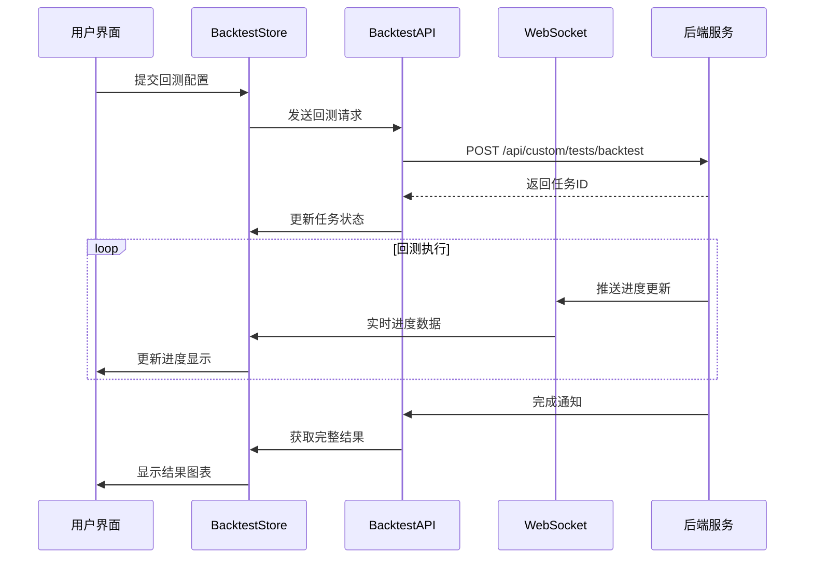

# 前端回测可视化增强 - 设计文档

## 架构概览

### 系统架构图

```mermaid
graph TB
    subgraph "前端层 Frontend Layer"
        A[Backtest.vue 主页面] --> B[BacktestConfig.vue 配置组件]
        A --> C[BacktestProgress.vue 进度组件]
        A --> D[EquityCurveChart.vue 核心图表]
        A --> E[PerformanceMetrics.vue 性能面板]
        A --> F[TradeRecords.vue 交易记录]
    end

    subgraph "数据层 Data Layer"
        G[BacktestStore Pinia Store] --> H[BacktestAPI API服务]
        G --> I[WebSocketService 实时数据]
        J[LocalStorage 本地缓存] --> G
    end

    subgraph "后端API Backend API"
        H --> K[/api/custom/tests/backtest]
        I --> L[WebSocket 进度更新]
    end

    A --> G
    D --> M[ECharts 图表库]
    B --> N[Element Plus UI]
```

### 技术栈选择

**前端框架层**
- **Vue 3.5+**: 组件化开发，Composition API
- **TypeScript 5.6+**: 类型安全，提高代码质量
- **Pinia 2.2+**: 状态管理，替代Vuex
- **Vue Router 4.4+**: 路由管理和导航

**UI组件层**
- **Element Plus 2.8+**: UI组件库，提供丰富的表单和表格组件
- **Tailwind CSS**: 原子化CSS，快速样式开发
- **ECharts 5.5+**: 图表可视化库，支持复杂的金融图表

**数据处理层**
- **Axios**: HTTP客户端，API请求封装
- **Day.js**: 日期时间处理
- **Lodash**: 工具函数库，数据处理辅助

## 核心组件设计

### 1. Backtest.vue - 主页面组件

**职责**: 回测功能的入口点和流程控制器

**状态管理**:
```typescript
interface BacktestState {
  currentPhase: 'config' | 'running' | 'completed' | 'error';
  config: BacktestConfig | null;
  result: BacktestResult | null;
  isRunning: boolean;
  progress: BacktestProgress;
}
```

**核心方法**:
- `startBacktest(config: BacktestConfig)`: 启动回测
- `pauseBacktest()`: 暂停回测
- `cancelBacktest()`: 取消回测
- `exportResult(format: 'pdf' | 'csv')`: 导出结果

### 2. EquityCurveChart.vue - Equity Curve图表组件

**设计特点**:
- 基于ECharts实现专业的金融图表
- 支持多策略对比显示
- 集成缩放、平移、数据提示等交互功能
- 响应式设计，自适应容器大小

**配置结构**:
```typescript
interface EquityCurveConfig {
  strategies: StrategyData[];
  benchmark?: BenchmarkData;
  timeRange: [Date, Date];
  showDrawdown: boolean;
  showSignals: boolean;
  theme: 'light' | 'dark';
}
```

**核心功能**:
- 多曲线渲染和颜色管理
- 回撤区域自动识别和标记
- 买卖信号点叠加显示
- 时间范围选择和数据缩放
- 图表导出（PNG/PDF）

### 3. BacktestConfig.vue - 配置表单组件

**表单结构**:
```typescript
interface BacktestConfig {
  symbol: string[];
  dateRange: {
    start: Date;
    end: Date;
  };
  strategy: {
    type: StrategyType;
    parameters: Record<string, any>;
  };
  risk: {
    maxPositionSize: number;
    stopLoss: number;
    takeProfit: number;
  };
  benchmark: string;
}
```

**验证规则**:
- 股票代码格式验证
- 日期范围合理性检查
- 策略参数范围验证
- 风险参数限制检查

### 4. PerformanceMetrics.vue - 性能指标面板

**指标分类**:
- **收益指标**: 总收益率、年化收益率、基准超额收益
- **风险指标**: 最大回撤、波动率、VaR、CVaR
- **风险调整收益**: 夏普比率、索提诺比率、卡尔玛比率
- **交易指标**: 胜率、盈亏比、平均持仓天数、交易频率

**可视化方式**:
- 关键指标卡片展示
- 指标对比雷达图
- 风险收益散点图
- 滚动收益计算

## 数据流设计

### 回测数据流程



### 数据模型标准化

**回测结果数据结构**:
```typescript
interface BacktestResult {
  id: string;
  config: BacktestConfig;
  status: 'completed' | 'failed' | 'cancelled';
  summary: {
    totalReturn: number;
    annualReturn: number;
    sharpeRatio: number;
    maxDrawdown: number;
    winRate: number;
    totalTrades: number;
  };
  equityCurve: Array<{
    date: string;
    value: number;
    benchmark?: number;
    drawdown?: number;
  }>;
  trades: Array<{
    date: string;
    symbol: string;
    action: 'buy' | 'sell';
    quantity: number;
    price: number;
    amount: number;
    pnl?: number;
  }>;
  monthlyReturns: Array<{
    month: string;
    return: number;
    benchmark: number;
  }>;
  createdAt: string;
  completedAt: string;
}
```

## 性能优化策略

### 1. 图表渲染优化

**数据采样策略**:
- 数据点 > 1000时，采用LTTB算法进行采样
- 保持关键极值点和趋势特征
- 动态调整采样密度

**渲染优化**:
- 使用Canvas渲染大数据量图表
- 实现图表增量更新
- 开启GPU硬件加速

### 2. 内存管理

**数据缓存**:
- 使用IndexedDB缓存历史回测结果
- 实现LRU缓存策略，限制缓存大小
- 提供缓存清理和手动刷新功能

**组件生命周期**:
- 及时销毁图表实例，避免内存泄漏
- 使用防抖处理频繁的参数更新
- 实现组件懒加载和代码分割

### 3. 网络请求优化

**请求策略**:
- 实现API请求防重复
- 使用请求取消机制避免竞态条件
- 实现智能重试和错误恢复

**数据传输**:
- 启用gzip压缩减少传输量
- 使用WebSocket减少轮询开销
- 实现增量数据更新

## 用户体验设计

### 交互设计原则

**即时反馈**:
- 所有用户操作提供即时视觉反馈
- 加载状态使用骨架屏显示结构
- 错误信息清晰并提供解决建议

**渐进式披露**:
- 根据用户熟悉程度显示详细程度
- 高级功能采用折叠面板设计
- 提供新手引导和帮助提示

**一致性设计**:
- 遵循Material Design和Element Plus规范
- 保持颜色、字体、间距的一致性
- 统一的交互模式和操作逻辑

### 响应式设计

**断点设置**:
- 移动端: < 768px
- 平板端: 768px - 1024px
- 桌面端: > 1024px

**适配策略**:
- 图表在小屏幕上简化显示
- 表格支持横向滚动
- 关键操作始终保持可见

## 可维护性设计

### 组件设计原则

**单一职责**:
- 每个组件只负责一个核心功能
- 保持组件的纯净性和可测试性
- 避免组件间的强耦合

**可配置性**:
- 通过props控制组件行为
- 提供插槽支持自定义扩展
- 使用事件系统进行组件通信

### 代码组织

**目录结构**:
```
src/
├── views/
│   └── Backtest.vue
├── components/
│   ├── backtest/
│   │   ├── BacktestConfig.vue
│   │   ├── BacktestProgress.vue
│   │   ├── PerformanceMetrics.vue
│   │   └── TradeRecords.vue
│   └── charts/
│       ├── EquityCurveChart.vue
│       ├── BacktestPriceChart.vue
│       └── PerformanceChart.vue
├── stores/
│   └── backtest.ts
├── services/
│   ├── backtestApi.ts
│   └── websocketService.ts
└── types/
    └── backtest.ts
```

**命名规范**:
- 组件使用PascalCase命名
- 文件名与组件名保持一致
- 类型定义使用`.ts`后缀
- 服务文件使用Service后缀

### 测试策略

**单元测试**:
- 组件渲染测试
- 业务逻辑函数测试
- API服务层测试
- 工具函数测试

**集成测试**:
- 组件间交互测试
- API集成测试
- 状态管理测试
- 用户操作流程测试

**端到端测试**:
- 完整回测流程测试
- 跨浏览器兼容性测试
- 性能基准测试
- 可访问性测试