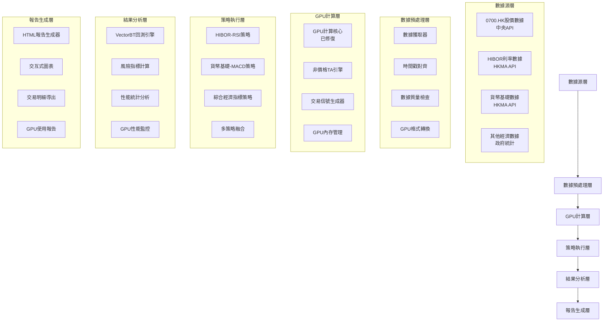

# 系統設計 - GPU加速0700.HK非價格TA量化回測系統

## 架構概述

本系統基於已修復的GPU計算核心（100%測試通過），設計一個專門針對0700.HK的GPU加速量化回測平台，充分利用非價格技術分析指標的交易信號生成能力。

### 設計原則

1. **GPU優先原則** - 所有計算優先在GPU上執行，最大程度利用硬件性能
2. **數據一致性** - 確保GPU計算結果與CPU實現的數值一致性
3. **模塊化設計** - 各組件低耦合，便於測試、維護和擴展
4. **可觀測性** - 完整的性能監控和診測能力
5. **用戶友好** - 簡單的配置和直觀的結果展示

### 系統架構圖



## 核心組件設計

### 1. 數據預處理引擎 (DataPreprocessingEngine)

#### 職責
- 統一的數據獲取和格式化
- 時間序列對齊和同步
- 數據質量檢查和清理
- GPU友好的數據格式轉換

#### 關鍵設計
```python
class DataPreprocessingEngine:
    def __init__(self, gpu_device: int = 0):
        self.gpu_device = gpu_device
        self.data_sources = {
            'stock': StockDataSource(),
            'hibor': HiborDataSource(),
            'monetary': MonetaryDataSource(),
            'gdp': GDPDataSource()
        }
        self.gpu_pipeline = get_gpu_pipeline(gpu_device)

    def prepare_0700_dataset(self, start_date: str, end_date: str) -> Dict[str, cp.ndarray]:
        """準備0700.HK回測數據集"""
        # 1. 並行獲取多源數據
        # 2. 時間戳對齊
        # 3. 數據質量檢查
        # 4. GPU格式轉換
        pass
```

### 2. GPU非價格TA引擎 (GPUNonPriceTAEngine)

#### 職責
- GPU加速的非價格技術指標計算
- 多策略並行計算優化
- 交易信號生成和融合
- 計算結果驗證

#### 關鍵算法
```python
class GPUNonPriceTAEngine:
    def __init__(self, gpu_device: int = 0):
        self.gpu_core = get_gpu_computation_core(gpu_device)
        self.memory_manager = get_gpu_memory_manager(gpu_device)

    def calculate_hibor_rsi_strategy(self, hibor_data: cp.ndarray,
                                    stock_data: cp.ndarray,
                                    rsi_period: int = 14,
                                    signal_threshold: float = 0.3) -> cp.ndarray:
        """GPU加速HIBOR-RSI策略計算"""
        # 1. GPU RSI計算（使用已修復的GPU核心）
        hibor_rsi = self.gpu_core.calculate_rsi_gpu(hibor_data, rsi_period)

        # 2. 股價趨勢計算
        price_trend = self.gpu_core.calculate_moving_average_gpu(stock_data, 20)

        # 3. 信號生成（GPU並行計算）
        signals = self._generate_hibor_signals(hibor_rsi, price_trend, signal_threshold)

        return signals

    def calculate_monetary_macd_strategy(self, monetary_data: cp.ndarray,
                                        stock_data: cp.ndarray,
                                        fast_period: int = 12,
                                        slow_period: int = 26) -> cp.ndarray:
        """GPU加速貨幣基礎-MACD策略計算"""
        # MACD GPU計算邏輯
        pass

    def generate_composite_signals(self, strategy_signals: List[cp.ndarray],
                                 weights: Optional[np.ndarray] = None) -> cp.ndarray:
        """多策略信號融合（GPU並行計算）"""
        # 使用GPU進行信號融合計算
        pass
```

### 3. GPU回測執行器 (GPUBacktestExecutor)

#### 職責
- GPU加速的策略回測執行
- VectorBT與GPU計算的整合
- 多參數並行優化
- 結果驗證和性能統計

#### 執行流程
```python
class GPUBacktestExecutor:
    def __init__(self, gpu_device: int = 0):
        self.gpu_device = gpu_device
        self.ta_engine = GPUNonPriceTAEngine(gpu_device)
        self.vectorbt_engine = VectorBTEngine()
        self.gpu_monitor = get_gpu_monitor(gpu_device)

    def execute_strategy_backtest(self, strategy_config: StrategyConfig,
                                 data: Dict[str, cp.ndarray]) -> BacktestResult:
        """執行GPU加速策略回測"""
        # 1. 開始GPU性能監控
        self.gpu_monitor.start_operation("strategy_backtest")

        try:
            # 2. GPU策略信號計算
            signals = self.ta_engine.calculate_strategy_signals(
                strategy_config, data
            )

            # 3. 轉換為VectorBT格式
            cpu_data = self._convert_gpu_to_vectorbt_format(signals, data)

            # 4. VectorBT回測執行
            result = self.vectorbt_engine.execute_backtest(
                strategy_config, cpu_data
            )

            # 5. 性能統計
            gpu_stats = self.gpu_monitor.get_operation_stats()

            return BacktestResult(
                strategy_result=result,
                gpu_performance=gpu_stats,
                execution_time=time.time() - start_time
            )

        finally:
            # 6. 結束監控並清理資源
            self.gpu_monitor.end_operation(success=True)
            self.memory_manager.cleanup_memory()
```

### 4. 專業報告生成器 (ProfessionalReportGenerator)

#### 職責
- HTML格式的專業回測報告
- 交互式圖表和可視化
- GPU性能分析報告
- 交易明細和統計分析

#### 報告結構
```html
<!DOCTYPE html>
<html>
<head>
    <title>0700.HK GPU加速量化回測報告</title>
    <!-- Plotly.js for interactive charts -->
    <script src="https://cdn.plot.ly/plotly-latest.min.js"></script>
</head>
<body>
    <h1>騰訊控股 (0700.HK) GPU加速量化回測報告</h1>

    <!-- 執行摘要 -->
    <section id="executive-summary">
        <h2>執行摘要</h2>
        <div id="key-metrics"></div>
        <div id="gpu-performance"></div>
    </section>

    <!-- 策略表現 -->
    <section id="strategy-performance">
        <h2>策略表現分析</h2>
        <div id="equity-curve"></div>
        <div id="drawdown-analysis"></div>
    </section>

    <!-- GPU性能分析 -->
    <section id="gpu-analysis">
        <h2>GPU性能分析</h2>
        <div id="gpu-utilization-chart"></div>
        <div id="memory-usage-chart"></div>
    </section>

    <!-- 交易信號分析 -->
    <section id="signal-analysis">
        <h2>交易信號分析</h2>
        <div id="signal-distribution"></div>
        <div id="signal-performance"></div>
    </section>
</body>
</html>
```

## 性能優化策略

### 1. GPU內存管理
- **預分配策略**: 根據數據大小預先分配GPU內存
- **分批處理**: 大數據集自動分批，避免內存溢出
- **智能清理**: 計算完成後立即釋放GPU內存
- **內存池**: 重用內存塊，減少分配開銷

### 2. 計算優化
- **向量化操作**: 使用CuPy的向量化函數替代循環
- **並行計算**: 多個策略並行執行
- **內核融合**: 將多個計算步驟融合為單一GPU內核
- **數據局部性**: 優化數據訪問模式，減少GPU內存帶宽消耗

### 3. CPU-GPU協作
- **異步傳輸**: 計算與數據傳輸並行
- **流水線處理**: 多階段處理流水線
- **智能回退**: GPU不可用時自動切換CPU模式
- **負載均衡**: 動態調整CPU-GPU工作負載

## 數據流設計

### 時間序列處理
```python
# 時間戳對齊算法
def align_time_series(stock_data: pd.DataFrame,
                     non_price_data: Dict[str, pd.DataFrame]) -> pd.DataFrame:
    """統一時間戳對齊"""
    # 1. 找到所有數據源的時間交集
    common_dates = stock_data.index
    for data in non_price_data.values():
        common_dates = common_dates.intersection(data.index)

    # 2. 重采樣到統一頻率（日線）
    aligned_data = {}
    aligned_data['stock'] = stock_data.reindex(common_dates)

    for name, data in non_price_data.items():
        aligned_data[name] = data.reindex(common_dates).fillna(method='ffill')

    return aligned_data
```

### GPU數據格式
```python
# GPU優化的數據格式
class GPUDataFormat:
    @staticmethod
    def convert_to_gpu_format(data: pd.DataFrame) -> cp.ndarray:
        """轉換為GPU優化格式"""
        # 1. 轉換為float32格式（GPU友好）
        # 2. 連續內存布局
        # 3. 預分配GPU內存
        return cp.asarray(data.values.astype(np.float32))

    @staticmethod
    def create_gpu_data_dict(aligned_data: Dict[str, pd.DataFrame]) -> Dict[str, cp.ndarray]:
        """創建GPU數據字典"""
        gpu_data = {}
        for name, df in aligned_data.items():
            gpu_data[name] = GPUDataFormat.convert_to_gpu_format(df)
        return gpu_data
```

## 錯誤處理和恢復

### GPU故障處理
```python
class GPUErrorHandler:
    def __init__(self):
        self.fallback_threshold = 3  # 3次失敗後切換CPU
        self.failure_count = 0

    def handle_gpu_error(self, error: Exception, operation: str) -> bool:
        """處理GPU錯誤，決定是否回退到CPU"""
        self.failure_count += 1

        if self.failure_count >= self.fallback_threshold:
            logger.warning(f"GPU連續失敗{self.failure_count}次，切換到CPU模式")
            self._switch_to_cpu_mode()
            return True

        # 嘗試GPU恢復
        return self._attempt_gpu_recovery(operation)
```

### 數據一致性檢查
```python
def validate_gpu_vs_cpu_results(gpu_result: cp.ndarray,
                               cpu_result: np.ndarray,
                               tolerance: float = 1e-6) -> bool:
    """驗證GPU和CPU計算結果的一致性"""
    gpu_cpu = gpu_result.get()
    diff = np.abs(gpu_cpu - cpu_result)
    max_diff = np.max(diff)

    return max_diff < tolerance
```

## 配置管理

### 系統配置
```yaml
# config/gpu_0700_config.yaml
system:
  gpu_device: 0
  max_batch_size: 10000
  memory_threshold: 0.8

data_sources:
  stock:
    symbol: "0700.HK"
    api_url: "http://18.180.162.113:9191/inst/getInst"
    duration_days: 1095

  non_price:
    hibor:
      enabled: true
      priority: 1
    monetary_base:
      enabled: true
      priority: 1
    gdp:
      enabled: true
      priority: 2

strategies:
  hibor_rsi:
    enabled: true
    rsi_period: 14
    signal_threshold: 0.3

  monetary_macd:
    enabled: true
    fast_period: 12
    slow_period: 26

  composite:
    enabled: true
    weights: [0.4, 0.6]

performance:
  target_gpu_utilization: 0.8
  min_speedup_ratio: 20.0
  max_memory_usage: 0.85

output:
  report_format: "html"
  include_charts: true
  export_signals: true
```

本設計確保系統能夠充分利用GPU計算能力，同時保持高度的可靠性和用戶友好性。