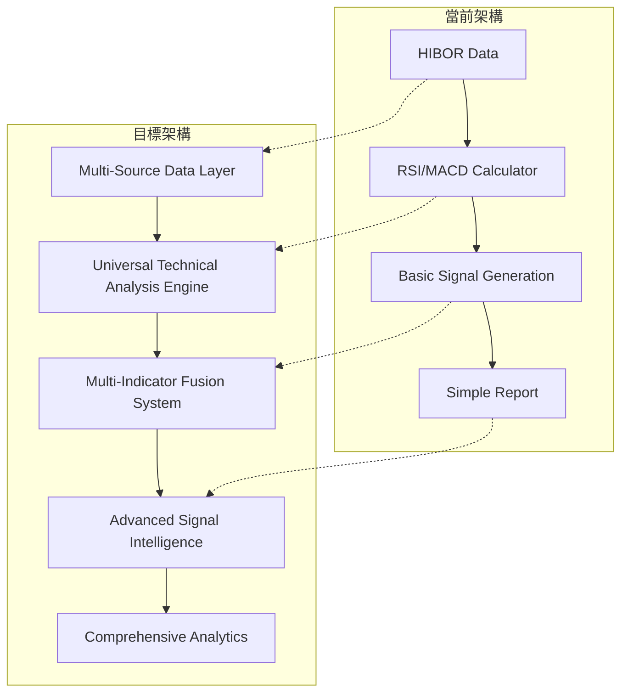

# Expand HIBOR Technical Prototype - Design Document

## System Architecture Overview

本設計旨在將現有的單一HIBOR技術原型轉換為一個**通用非價格數據技術分析框架**，支持多種政府數據源和豐富的技術指標計算。

### 當前架構 vs 目標架構



## 1. 核心架構設計

### 1.1 分層架構

```python
# 數據接入層 (Data Access Layer)
class UniversalNonPriceDataAdapter:
    """統一的非價格數據適配器"""
    - HKMADataCollector (HIBOR, 匯率, 貨幣基礎)
    - GovernmentDataCollector (經濟統計數據)
    - DataNormalizer (數據標準化和預處理)

# 數據對齊層 (Data Alignment Layer)
class DataAlignmentManager:
    """數據時間對齊管理器"""
    - TemporalAligner (時間軸統一)
    - MissingDataHandler (缺失數據處理)
    - FrequencyStandardizer (頻率標準化)
    - DataQualityValidator (數據質量驗證)

# 指標計算層 (Indicator Calculation Layer)
class UniversalTechnicalAnalysisEngine:
    """通用技術分析引擎"""
    - TrendIndicators (SMA, EMA, MACD, DEMA, TEMA)
    - MomentumIndicators (RSI, Stochastic, CCI, MFI, Williams %R)
    - VolatilityIndicators (Bollinger Bands, ATR, Keltner Channels)
    - VolumeIndicators (適用於有成交量數據的指標)
    - CustomEconomicIndicators (基於經濟數據特色指標)

# 智能適配層 (Intelligent Adaptation Layer)
class IntelligentIndicatorSelector:
    """智能指標選擇和適配器"""
    - IndicatorSuitabilityAssessor (指標適用性評估)
    - ParameterAdaptationEngine (參數自適應調整)
    - DataTypeClassifier (數據類型自動識別)
    - RecommendationEngine (指標推薦引擎)

# 信號融合層 (Signal Fusion Layer)
class MultiIndicatorSignalFusion:
    """多指標信號融合系統"""
    - SignalGenerator (單指標信號生成)
    - WeightManager (動態權重分配)
    - ConflictResolver (信號衝突解決)
    - CompositeSignalGenerator (綜合信號生成)

# 優化評估層 (Optimization & Evaluation Layer)
class ParameterOptimizationEngine:
    """參數優化和評估引擎"""
    - ParameterSpaceExplorer (參數空間探索)
    - ParallelOptimizer (並行優化器)
    - PerformanceEvaluator (性能評估器)
    - BacktestValidator (回測驗證器)
```

### 1.2 數據流設計


## 2. 核心組件設計

### 2.1 數據對齊管理器 (Data Alignment Manager)

```python
class DataAlignmentManager:
    """
    數據時間對齊管理器

    職責：
    1. 將不同數據源對齊到統一時間軸
    2. 處理缺失數據和異常值
    3. 標準化不同頻率的數據
    4. 驗證數據質量和一致性
    """

    def __init__(self):
        self.temporal_aligner = TemporalAligner()
        self.missing_data_handler = MissingDataHandler()
        self.frequency_standardizer = FrequencyStandardizer()
        self.quality_validator = DataQualityValidator()

    def align_multiple_sources(self, data_dict: Dict[str, pd.DataFrame]) -> Dict[str, pd.DataFrame]:
        """對齊多個數據源"""
        # 1. 找到共同時間範圍
        common_dates = self._find_common_timeframe(data_dict)

        # 2. 對齊到共同時間軸
        aligned_data = {}
        for source, data in data_dict.items():
            aligned_data[source] = self._align_to_timeframe(data, common_dates)

        # 3. 處理缺失數據
        for source, data in aligned_data.items():
            aligned_data[source] = self.missing_data_handler.handle_missing_data(data)

        # 4. 驗證數據質量
        self.quality_validator.validate_aligned_data(aligned_data)

        return aligned_data

class TemporalAligner:
    """時間軸對齊器"""

    def find_common_timeframe(self, data_dict: Dict[str, pd.DataFrame]) -> pd.DatetimeIndex:
        """找到所有數據源的共同時間範圍"""
        common_dates = None

        for data in data_dict.values():
            dates = set(data.index)
            common_dates = dates if common_dates is None else common_dates.intersection(dates)

        return pd.DatetimeIndex(sorted(common_dates))

    def align_to_timeframe(self, data: pd.DataFrame, target_dates: pd.DatetimeIndex) -> pd.DataFrame:
        """將數據對齊到目標時間範圍"""
        # 確保所有目標日期都有數據行
        aligned = data.reindex(target_dates)
        return aligned

class MissingDataHandler:
    """缺失數據處理器"""

    def handle_missing_data(self, data: pd.DataFrame, method: str = 'adaptive') -> pd.DataFrame:
        """智能處理缺失數據"""
        if method == 'forward_fill':
            return data.fillna(method='ffill')
        elif method == 'linear':
            return data.interpolate(method='linear')
        elif method == 'adaptive':
            return self._adaptive_interpolation(data)

    def _adaptive_interpolation(self, data: pd.DataFrame) -> pd.DataFrame:
        """自適應插值方法"""
        # 根據數據特性和缺失模式選擇最佳插值方法
        result = data.copy()

        for column in data.columns:
            missing_count = data[column].isnull().sum()
            if missing_count == 0:
                continue

            missing_ratio = missing_count / len(data)

            if missing_ratio < 0.05:
                # 少量缺失，使用線性插值
                result[column] = data[column].interpolate(method='linear')
            elif missing_ratio < 0.15:
                # 中等缺失，使用樣條插值
                result[column] = data[column].interpolate(method='spline', order=3)
            else:
                # 大量缺失，使用前向填充
                result[column] = data[column].fillna(method='ffill')

        return result

class DataQualityValidator:
    """數據質量驗證器"""

    def validate_aligned_data(self, aligned_data: Dict[str, pd.DataFrame]) -> Dict[str, Any]:
        """驗證對齊後的數據質量"""
        quality_report = {}

        for source, data in aligned_data.items():
            # 檢查完整性
            completeness = self._check_completeness(data)

            # 檢查異常值
            anomalies = self._detect_anomalies(data)

            # 檢查一致性
            consistency = self._check_consistency(data)

            quality_report[source] = {
                'completeness_score': completeness,
                'anomaly_count': anomalies,
                'consistency_score': consistency,
                'overall_quality': self._calculate_overall_quality(completeness, anomalies, consistency)
            }

        return quality_report
```

### 2.2 智能指標選擇器 (Intelligent Indicator Selector)

```python
class IntelligentIndicatorSelector:
    """
    智能指標選擇和適配器

    職責：
    1. 評估技術指標對特定數據的適用性
    2. 根據數據特點動態調整指標參數
    3. 自動識別數據類型
    4. 推薦最適合的指標組合
    """

    def __init__(self):
        self.suitability_assessor = IndicatorSuitabilityAssessor()
        self.parameter_adaptation = ParameterAdaptationEngine()
        self.data_type_classifier = DataTypeClassifier()
        self.recommendation_engine = RecommendationEngine()

    def recommend_indicators(self, data_dict: Dict[str, pd.DataFrame]) -> Dict[str, Dict]:
        """為每個數據源推薦適合的技術指標"""
        recommendations = {}

        for source, data in data_dict.items():
            # 1. 分析數據特性
            data_characteristics = self._analyze_data_characteristics(data)

            # 2. 識別數據類型
            data_type = self.data_type_classifier.classify(data_characteristics)

            # 3. 評估指標適用性
            suitable_indicators = self.suitability_assessor.assess_suitability(
                data_type, data_characteristics
            )

            # 4. 適配參數
            adapted_parameters = self.parameter_adaptation.adapt_parameters(
                suitable_indicators, data_characteristics
            )

            # 5. 生成推薦
            recommendations[source] = {
                'data_type': data_type,
                'characteristics': data_characteristics,
                'suitable_indicators': suitable_indicators,
                'adapted_parameters': adapted_parameters
            }

        return recommendations

class IndicatorSuitabilityAssessor:
    """指標適用性評估器"""

    def __init__(self):
        self.suitability_matrix = self._create_suitability_matrix()

    def assess_suitability(self, data_type: str, characteristics: Dict) -> List[str]:
        """評估指標適用性"""
        suitable_indicators = []

        # 基礎指標（適用所有數據）
        suitable_indicators.extend(['rsi', 'sma', 'ema'])

        # 根據數據類型添加專用指標
        type_specific_indicators = self.suitability_matrix.get(data_type, [])
        suitable_indicators.extend(type_specific_indicators)

        # 根據數據特性調整
        if characteristics.get('trend_strength', 0) > 0.3:
            suitable_indicators.extend(['macd', 'dema', 'tema'])

        if characteristics.get('volatility', 0) > 0.1:
            suitable_indicators.extend(['bollinger_bands', 'atr'])

        if characteristics.get('data_length', 0) > 80:
            suitable_indicators.extend(['stochastic', 'williams_r'])

        return list(set(suitable_indicators))  # 去重

    def _create_suitability_matrix(self) -> Dict[str, List[str]]:
        """創建指標適用性矩陣"""
        return {
            'hibor': ['rate_curve_indicator', 'rate_volatility_indicator'],
            'exchange_rate': ['momentum_indicator', 'currency_strength_indicator'],
            'monetary_base': ['growth_rate_indicator', 'monetary_momentum_indicator'],
            'liquidity': ['pressure_indicator', 'liquidity_stress_indicator'],
            'efbn': ['yield_spread_indicator', 'term_structure_indicator'],
            'rmb': ['usage_ratio_indicator', 'demand_pressure_indicator']
        }

class ParameterAdaptationEngine:
    """參數自適應調整引擎"""

    def adapt_parameters(self, indicators: List[str], characteristics: Dict) -> Dict[str, Dict]:
        """根據數據特點調整指標參數"""
        adapted_params = {}
        data_length = characteristics.get('data_length', 100)

        for indicator in indicators:
            if data_length < 50:
                params = self._get_short_term_params(indicator)
            elif data_length < 100:
                params = self._get_medium_term_params(indicator)
            else:
                params = self._get_long_term_params(indicator)

            # 根據其他特性微調
            params = self._fine_tune_parameters(params, characteristics)
            adapted_params[indicator] = params

        return adapted_params

    def _get_short_term_params(self, indicator: str) -> Dict:
        """短期數據參數"""
        return {
            'rsi': {'period': 7, 'overbought': 70, 'oversold': 30},
            'macd': {'fast': 5, 'slow': 12, 'signal': 3},
            'bollinger_bands': {'period': 10, 'std_dev': 1.5}
        }.get(indicator, {})

    def _get_medium_term_params(self, indicator: str) -> Dict:
        """中期數據參數"""
        return {
            'rsi': {'period': 14, 'overbought': 70, 'oversold': 30},
            'macd': {'fast': 12, 'slow': 26, 'signal': 9},
            'bollinger_bands': {'period': 20, 'std_dev': 2.0}
        }.get(indicator, {})

    def _get_long_term_params(self, indicator: str) -> Dict:
        """長期數據參數"""
        return {
            'rsi': {'period': 21, 'overbought': 70, 'oversold': 30},
            'macd': {'fast': 12, 'slow': 26, 'signal': 9},
            'bollinger_bands': {'period': 20, 'std_dev': 2.0}
        }.get(indicator, {})

class DataTypeClassifier:
    """數據類型分類器"""

    def classify(self, characteristics: Dict) -> str:
        """識別數據類型"""
        # 基於數據特徵進行分類
        data_range = characteristics.get('range', (0, 1))
        volatility = characteristics.get('volatility', 0)

        if data_range[1] < 10:  # 利率範圍0-10%
            return 'hibor'
        elif volatility > 0.05:  # 高波動性
            return 'exchange_rate'
        elif data_range[1] > 100000:  # 大數值
            return 'monetary_base'
        elif 'pressure' in characteristics.get('description', '').lower():
            return 'liquidity'
        else:
            return 'unknown'
```

### 2.3 通用數據適配器 (Universal Data Adapter)

```python
class UniversalNonPriceDataAdapter:
    """
    通用非價格數據適配器

    職責：
    1. 統一不同政府數據源的接口
    2. 數據驗證和清洗
    3. 數據標準化和預處理
    4. 緩存管理和性能優化
    """

    def __init__(self):
        self.data_collectors = {
            'hibor': HIBORDataCollector(),
            'exchange_rate': ExchangeRateCollector(),
            'monetary_base': MonetaryBaseCollector(),
            'liquidity': LiquidityCollector(),
            'efbn': EFBNCpLLECTOR(),
            'rmb': RMBLiquidityCollector()
        }
        self.data_validator = DataValidator()
        self.data_normalizer = DataNormalizer()
        self.cache_manager = CacheManager()

    async def collect_data(self, data_source: str, days: int) -> pd.DataFrame:
        """收集指定數據源的數據"""
        pass

    def normalize_data(self, raw_data: pd.DataFrame, data_type: str) -> pd.DataFrame:
        """標準化數據格式和範圍"""
        pass
```

### 2.2 通用技術指標引擎 (Universal Technical Analysis Engine)

```python
class UniversalTechnicalAnalysisEngine:
    """
    通用技術指標計算引擎

    支持的指標類別：
    1. 趨勢指標 (Trend Indicators)
    2. 動量指標 (Momentum Indicators)
    3. 波動率指標 (Volatility Indicators)
    4. 自定義經濟指標 (Custom Economic Indicators)
    """

    def __init__(self):
        self.trend_indicators = TrendIndicators()
        self.momentum_indicators = MomentumIndicators()
        self.volatility_indicators = VolatilityIndicators()
        self.custom_indicators = CustomEconomicIndicators()

    def calculate_all_indicators(self, data: pd.DataFrame, config: Dict) -> Dict[str, Any]:
        """計算所有配置的技術指標"""
        pass

    def calculate_indicator(self, indicator_type: str, data: pd.Series, params: Dict) -> Dict:
        """計算單個技術指標"""
        pass
```

### 2.3 多指標信號融合 (Multi-Indicator Signal Fusion)

```python
class MultiIndicatorSignalFusion:
    """
    多指標信號融合系統

    核心功能：
    1. 單指標信號生成
    2. 多指標權重分配
    3. 信號衝突解決
    4. 綜合信號評分
    """

    def __init__(self):
        self.signal_generator = SignalGenerator()
        self.weight_manager = DynamicWeightManager()
        self.conflict_resolver = ConflictResolver()
        self.composite_scorer = CompositeSignalScorer()

    def generate_composite_signal(self, indicators: Dict[str, Any],
                                fusion_config: Dict) -> Dict[str, Any]:
        """生成綜合信號"""
        pass

    def optimize_fusion_weights(self, historical_data: pd.DataFrame,
                              performance_target: str) -> Dict[str, float]:
        """優化信號融合權重"""
        pass
```

## 3. 數據源擴展設計

### 3.1 支持的數據源

```python
DATA_SOURCES_CONFIG = {
    'hibor': {
        'collector': 'HIBORDataCollector',
        'frequency': 'daily',
        'tenors': ['overnight', '1_week', '1_month', '3_months', '6_months', '12_months'],
        'normalization': 'rate_to_decimal'
    },
    'exchange_rate': {
        'collector': 'ExchangeRateCollector',
        'frequency': 'daily',
        'currencies': ['USD', 'CNY', 'EUR', 'JPY'],
        'normalization': 'log_return'
    },
    'monetary_base': {
        'collector': 'MonetaryBaseCollector',
        'frequency': 'daily',
        'components': ['monetary_base', 'claims_on_banks', 'depository_receipts'],
        'normalization': 'percentage_change'
    },
    'liquidity': {
        'collector': 'LiquidityCollector',
        'frequency': 'daily',
        'normalization': 'z_score'
    },
    'efbn': {
        'collector': 'EFBNCpLLECTOR',
        'frequency': 'daily',
        'maturities': ['2-year', '5-year', '10-year'],
        'normalization': 'yield_spread'
    },
    'rmb': {
        'collector': 'RMBLiquidityCollector',
        'frequency': 'daily',
        'normalization': 'usage_ratio'
    }
}
```

### 3.2 數據標準化策略

```python
class DataNormalizer:
    """
    數據標準化器

    針對不同類型的經濟數據採用不同的標準化策略
    """

    def normalize_rate_data(self, rates: pd.Series) -> pd.Series:
        """利率數據標準化：轉為小數並計算變化"""
        return rates.pct_change()

    def normalize_index_data(self, index: pd.Series) -> pd.Series:
        """指數數據標準化：對數回報率"""
        return np.log(index / index.shift(1))

    def normalize_level_data(self, levels: pd.Series) -> pd.Series:
        """水平數據標準化：Z-score"""
        return (levels - levels.mean()) / levels.std()

    def normalize_ratio_data(self, ratios: pd.Series) -> pd.Series:
        """比率數據標準化：Min-Max"""
        return (ratios - ratios.min()) / (ratios.max() - ratios.min())
```

## 4. 擴展指標設計

### 4.1 趨勢指標擴展

```python
class TrendIndicators:
    """
    趨勢指標集合 - 適用於非價格數據
    """

    def calculate_dema(self, data: pd.Series, period: int = 21) -> pd.Series:
        """雙指數移動平均 (Double EMA)"""
        ema1 = data.ewm(span=period).mean()
        ema2 = ema1.ewm(span=period).mean()
        return 2 * ema1 - ema2

    def calculate_tema(self, data: pd.Series, period: int = 21) -> pd.Series:
        """三指數移動平均 (Triple EMA)"""
        ema1 = data.ewm(span=period).mean()
        ema2 = ema1.ewm(span=period).mean()
        ema3 = ema2.ewm(span=period).mean()
        return 3 * ema1 - 3 * ema2 + ema3

    def calculate_trima(self, data: pd.Series, period: int = 18) -> pd.Series:
        """三角移動平均 (Triangular Moving Average)"""
        return data.rolling(window=period, win_type='triang').mean()
```

### 4.2 經濟數據特色指標

```python
class CustomEconomicIndicators:
    """
    基於經濟數據特色的自定義指標
    """

    def calculate_rate_curve_indicator(self, hibor_data: pd.DataFrame) -> pd.Series:
        """
        利率期限結構指標

        計算不同期限HIBOR利率的斜率和曲度，
        捕捉利率期限結構的變化趨勢
        """
        if 'overnight' in hibor_data.columns and '12_months' in hibor_data.columns:
            slope = hibor_data['12_months'] - hibor_data['overnight']
            return slope
        return pd.Series()

    def calculate_rate_volatility_indicator(self, rates: pd.Series, period: int = 20) -> pd.Series:
        """
        利率波動率指標

        基於利率變化的波動率，適用於HIBOR等利率數據
        """
        rate_changes = rates.pct_change()
        return rate_changes.rolling(window=period).std() * np.sqrt(252)

    def calculate_liquidity_pressure_indicator(self, liquidity_data: pd.DataFrame) -> pd.Series:
        """
        流動性壓力指標

        綜合多個流動性指標，評估市場流動性狀況
        """
        # 實現流動性壓力計算邏輯
        pass

    def calculate_monetary_momentum_indicator(self, monetary_data: pd.Series, period: int = 50) -> pd.Series:
        """
        貨幣動量指標

        基於貨幣基礎數據的動量指標
        """
        return monetary_data.pct_change(period)
```

## 5. 參數優化設計

### 5.1 擴展參數空間

```python
EXTENDED_PARAMETER_SPACES = {
    'rsi': {
        'period': list(range(5, 101, 5)),  # 5-100
        'overbought': list(range(65, 91, 5)),  # 65-90
        'oversold': list(range(10, 36, 5))  # 10-35
    },
    'macd': {
        'fast': list(range(5, 51, 2)),  # 5-50
        'slow': list(range(15, 101, 5)),  # 15-100
        'signal': list(range(5, 21, 2))  # 5-20
    },
    'bollinger_bands': {
        'period': list(range(10, 51, 5)),  # 10-50
        'std_dev': [1.0, 1.25, 1.5, 1.75, 2.0, 2.25, 2.5]  # 1.0-2.5
    },
    'stochastic': {
        'k_period': list(range(5, 26, 2)),  # 5-25
        'd_period': list(range(2, 11, 1)),  # 2-10
        'overbought': list(range(75, 96, 5)),  # 75-95
        'oversold': list(range(5, 26, 5))  # 5-25
    },
    'ema': {
        'period': list(range(5, 101, 5))  # 5-100
    },
    'atr': {
        'period': list(range(5, 31, 2))  # 5-30
    }
}
```

### 5.2 並行優化策略

```python
class ParallelParameterOptimizer:
    """
    並行參數優化器

    實現多線程並行參數搜索，提升優化效率
    """

    def __init__(self, n_workers: int = None):
        self.n_workers = n_workers or min(32, os.cpu_count())
        self.result_cache = {}

    def optimize_parallel(self, data: pd.Series, indicator_config: Dict,
                        objective_func: str = 'sharpe') -> List[Dict]:
        """並行參數優化"""
        pass

    def evaluate_combination(self, data: pd.Series, params: Dict,
                           indicator_func: callable, objective: str) -> float:
        """評估單個參數組合的性能"""
        pass
```

## 6. 性能優化設計

### 6.1 計算緩存機制

```python
class ComputationCache:
    """
    計算結果緩存系統

    緩存技術指標計算結果，避免重複計算
    """

    def __init__(self, cache_size: int = 10000, ttl: int = 3600):
        self.cache_size = cache_size
        self.ttl = ttl  # Time to live in seconds
        self.cache = {}

    def get_cache_key(self, data_hash: str, indicator: str, params: Dict) -> str:
        """生成緩存鍵"""
        param_str = json.dumps(params, sort_keys=True)
        return f"{data_hash}_{indicator}_{hash(param_str)}"

    def get_cached_result(self, cache_key: str) -> Optional[Any]:
        """獲取緩存結果"""
        if cache_key in self.cache:
            result, timestamp = self.cache[cache_key]
            if time.time() - timestamp < self.ttl:
                return result
            else:
                del self.cache[cache_key]
        return None
```

### 6.2 內存優化

```python
class MemoryOptimizedCalculator:
    """
    內存優化的技術指標計算器

    使用NumPy向量化操作和內存映射優化大數據處理
    """

    def calculate_indicators_vectorized(self, data: np.ndarray,
                                      indicator_configs: List[Dict]) -> Dict:
        """向量化技術指標計算"""
        pass

    def use_chunked_processing(self, data: pd.Series, chunk_size: int = 10000):
        """分塊處理大數據集"""
        pass
```

## 7. 測試和驗證設計

### 7.1 指標計算驗證

```python
class IndicatorValidationFramework:
    """
    技術指標計算驗證框架

    確保擴展的指標計算結果符合行業標準
    """

    def validate_indicator_calculation(self, indicator_name: str,
                                     test_data: pd.Series,
                                     expected_result: pd.Series) -> bool:
        """驗證指標計算準確性"""
        pass

    def benchmark_calculation_speed(self, data_sizes: List[int]) -> Dict:
        """基準測試計算速度"""
        pass
```

### 7.2 信號質量評估

```python
class SignalQualityAssessment:
    """
    信號質量評估系統

    評估生成的交易信號的質量和有效性
    """

    def assess_signal_quality(self, signals: pd.Series,
                            price_data: pd.Series) -> Dict:
        """評估信號質量"""
        return {
            'signal_precision': self.calculate_precision(signals, price_data),
            'signal_recall': self.calculate_recall(signals, price_data),
            'sharpe_ratio': self.calculate_sharpe(signals, price_data),
            'max_drawdown': self.calculate_max_drawdown(signals, price_data),
            'signal_consistency': self.calculate_consistency(signals)
        }
```

## 8. 擴展性和維護性

### 8.1 插件化指標系統

```python
class PluginIndicatorSystem:
    """
    插件化技術指標系統

    支持動態加載自定義技術指標
    """

    def load_indicator_plugin(self, plugin_path: str) -> bool:
        """加載技術指標插件"""
        pass

    def register_custom_indicator(self, indicator_class: Type) -> None:
        """註冊自定義技術指標"""
        pass
```

### 8.2 配置管理

```python
class ConfigurationManager:
    """
    配置管理器

    管理系統配置和參數設置
    """

    def load_config(self, config_path: str) -> Dict:
        """加載配置文件"""
        pass

    def validate_config(self, config: Dict) -> List[str]:
        """驗證配置有效性"""
        pass

    def update_config(self, updates: Dict) -> None:
        """更新配置設置"""
        pass
```

## 總結

本設計提供了一個全面、可擴展、高性能的非價格數據技術分析框架。通過分層架構、模塊化設計和性能優化，系統將能夠：

1. **支持多種政府數據源**的統一處理和分析
2. **提供豐富的技術指標**庫，適用於非價格數據特性
3. **實現高效參數優化**，找到最優策略組合
4. **生成高質量交易信號**，支持量化決策
5. **保持良好的擴展性**，便於未來功能擴展

這個設計為將HIBOR原型轉換為實用化的量化分析平台奠定了堅實基礎。