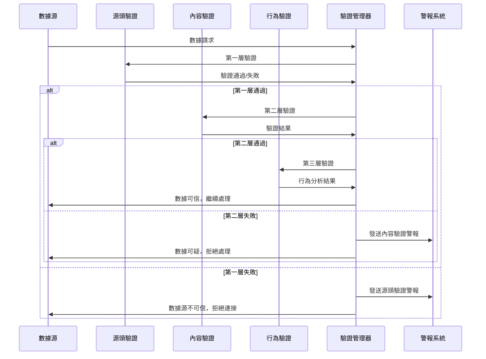
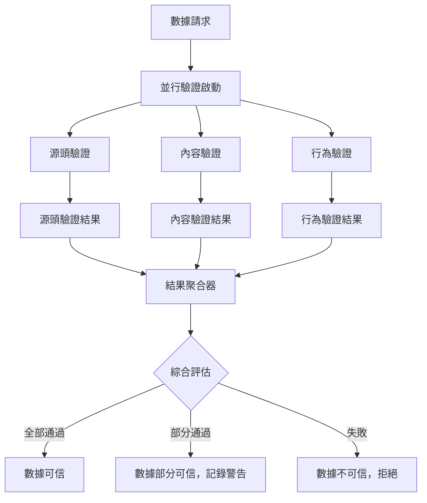

# 多重驗認數據真實性 - 設計文檔

## 系統架構

### 三層驗證架構概覽

```
┌─────────────────────────────────────────────────────────────┐
│                    數據真實性驗證框架                          │
├─────────────────────────────────────────────────────────────┤
│  第三層：行為驗證 (Behavioral Analysis)                      │
│  ├─ 時間序列分析引擎                                         │
│  ├─ 机器学习異常檢測                                        │
│  ├─ 歷史模式對比                                             │
│  └─ 實時行為監控                                             │
├─────────────────────────────────────────────────────────────┤
│  第二層：內容驗證 (Content Validation)                       │
│  ├─ 數據完整性檢查                                           │
│  ├─ 業務規則驗證                                             │
│  ├─ 統計異常檢測                                             │
│  └─ 跨源一致性驗證                                           │
├─────────────────────────────────────────────────────────────┤
│  第一層：源頭驗證 (Source Authentication)                     │
│  ├─ 數字簽名驗證                                             │
│  ├─ TLS證書驗證                                              │
│  ├─ API端點白名單                                            │
│  └─ 頻率限制檢測                                             │
├─────────────────────────────────────────────────────────────┤
│  數據源                                                      │
│  ├─ 香港中央API (股票數據)                                   │
│  ├─ HKMA API (政府經濟數據)                                  │
│  ├─ 其他官方數據源                                           │
│  └─ 歷史數據存儲                                             │
└─────────────────────────────────────────────────────────────┘
```

## 核心組件設計

### 1. 數據驗證管理器 (DataAuthenticityManager)
```python
class DataAuthenticityManager:
    """數據真實性驗證統一管理器"""

    def __init__(self, config: Dict[str, Any]):
        self.source_authenticator = SourceAuthenticator(config['source'])
        self.content_validator = ContentValidator(config['content'])
        self.behavior_analyzer = BehaviorAnalyzer(config['behavior'])
        self.alert_system = AlertSystem(config['alerts'])

    async def verify_data(self, data_request: DataRequest) -> VerificationResult:
        """執行三層驗證"""
        pass
```

### 2. 源頭驗證器 (SourceAuthenticator)
```python
class SourceAuthenticator:
    """第一層：源頭驗證"""

    async def verify_digital_signature(self, data: bytes, signature: str) -> bool
    async def verify_tls_certificate(self, endpoint: str) -> bool
    async def check_api_whitelist(self, endpoint: str) -> bool
    async def detect_rate_limiting_anomaly(self, request_count: int) -> bool
```

### 3. 內容驗證器 (ContentValidator)
```python
class ContentValidator:
    """第二層：內容驗證"""

    async def verify_data_integrity(self, data: bytes, expected_hash: str) -> bool
    async def validate_business_rules(self, data: Dict[str, Any]) -> ValidationResult
    async def detect_statistical_anomalies(self, data: pd.DataFrame) -> List[Anomaly]
    async def cross_source_validation(self, data_sources: Dict[str, Any]) -> ConsistencyResult
```

### 4. 行為分析器 (BehaviorAnalyzer)
```python
class BehaviorAnalyzer:
    """第三層：行為驗證"""

    async def analyze_time_series_patterns(self, data: pd.Series) -> PatternAnalysis
    async def detect_ml_anomalies(self, data: np.ndarray) -> MLAnomalyResult
    async def compare_historical_patterns(self, current: pd.Series, historical: pd.Series) -> ComparisonResult
    async def monitor_real_time_behavior(self, data_stream: AsyncIterator) -> BehaviorAlert
```

## 驗證流程設計

### 標準驗證流程


### 並行驗證優化


## 性能優化策略

### 1. 智能緩存機制
```python
class VerificationCache:
    """驗證結果緩存系統"""

    def __init__(self):
        self.source_cache = TTLCache(maxsize=1000, ttl=300)  # 5分鐘
        self.content_cache = TTLCache(maxsize=500, ttl=600)  # 10分鐘
        self.behavior_cache = TTLCache(maxsize=200, ttl=1800) # 30分鐘
```

### 2. 異步處理架構
```python
class AsyncVerificationPipeline:
    """異步驗證管道"""

    async def process_batch(self, requests: List[DataRequest]) -> List[VerificationResult]:
        """批量並行處理驗證請求"""
        semaphore = asyncio.Semaphore(10)  # 限制併發數
        tasks = [self._verify_with_semaphore(semaphore, req) for req in requests]
        return await asyncio.gather(*tasks, return_exceptions=True)
```

### 3. 漸進式驗證策略
```python
class ProgressiveVerification:
    """漸進式驗證 - 根據風險等級調整驗證深度"""

    def get_verification_level(self, data_source: str, data_type: str) -> int:
        """根據數據源和類型決定驗證級別"""
        risk_matrix = {
            ('central_api', 'stock_price'): 3,  # 最高級別
            ('hkma_api', 'economic_data'): 2,  # 中級別
            ('third_party', 'reference'): 1   # 基本級別
        }
        return risk_matrix.get((data_source, data_type), 1)
```

## 警報和監控設計

### 1. 警報分級系統
```python
class AlertSeverity(Enum):
    CRITICAL = "critical"    # 數據完全不可信
    HIGH = "high"           # 數據高度可疑
    MEDIUM = "medium"       # 數據有異常但可用
    LOW = "low"            # 輕微偏差，僅供記錄
```

### 2. 監控指標
```python
class VerificationMetrics:
    """驗證系統監控指標"""

    verification_success_rate: float
    verification_latency_ms: float
    anomaly_detection_rate: float
    false_positive_rate: float
    system_availability: float
```

## 配置管理

### 1. 驗證規則配置
```yaml
verification_config:
  source_verification:
    require_digital_signature: true
    tls_certificate_check: true
    allowed_endpoints:
      - "http://18.180.162.113:9191"
      - "https://api.hkma.gov.hk"
    rate_limit_threshold: 100  # requests per minute

  content_validation:
    integrity_check: true
    business_rule_validation: true
    statistical_anomaly_threshold: 3.0  # sigma
    cross_source_minimum_sources: 2

  behavior_analysis:
    time_series_analysis: true
    ml_anomaly_detection: true
    historical_comparison_window: 30  # days
    real_time_monitoring: true
```

### 2. 動態配置更新
```python
class ConfigManager:
    """動態配置管理器"""

    async def reload_config(self) -> bool
    async def validate_config(self, config: Dict[str, Any]) -> ValidationResult
    async def rollback_config(self) -> bool
```

## 錯誤處理和回退機制

### 1. 驗證失敗處理
```python
class VerificationFailureHandler:
    """驗證失敗處理器"""

    async def handle_source_failure(self, error: SourceAuthError) -> FallbackAction
    async def handle_content_failure(self, error: ContentValidationError) -> FallbackAction
    async def handle_behavior_failure(self, error: BehaviorAnalysisError) -> FallbackAction
```

### 2. 安全回退策略
```python
class FallbackStrategy:
    """安全回退策略"""

    def get_fallback_data_source(self, primary_source: str) -> str
    def get_cached_data(self, data_key: str) -> Optional[Any]
    def use_estimated_data(self, data_type: str) -> Any
```

## 測試策略

### 1. 單元測試
- 每個驗證組件的獨立測試
- 模擬數據源的異常情況測試
- 邊界條件和錯誤處理測試

### 2. 集成測試
- 端到端驗證流程測試
- 多層驗證協同工作測試
- 性能和負載測試

### 3. 安全測試
- 數據偽造攻擊測試
- 中間人攻擊防護測試
- 拒絕服務攻擊測試

## 部署和維護

### 1. 漸進式部署計劃
1. **Phase 1**: 部署源頭驗證層
2. **Phase 2**: 部署內容驗證層
3. **Phase 3**: 部署行為驗證層
4. **Phase 4**: 全系統集成和優化

### 2. 監控和維護
- 實時監控儀表板
- 定期驗證規則更新
- 性能基準測試
- 安全漏洞評估