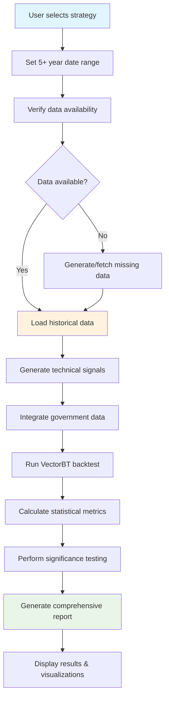

# Feature Plan: Extended Long-term Backtesting with Government Data Integration
# 长期回测与政府数据集成扩展计划

**Feature**: 5+ Year Backtesting with Government Data Technical Analysis
**Priority**: High (Critical for professional quantitative trading)
**Estimated Timeline**: 8-12 weeks
**Complexity**: Advanced (Requires data architecture, performance optimization, statistical validation)

---

## 📋 Overview

### User Requirement Analysis
用户要求：**"最少要回測5年時間, 有沒有政府data 轉ta 去分析"**

**Translation & Interpretation:**
- **Core Requirement**: Minimum 5 years of backtesting capability
- **Secondary Requirement**: Integration of government data for technical analysis conversion
- **Implied Need**: Professional-grade quantitative analysis with statistical significance

### Current System Assessment
Based on comprehensive codebase analysis:

#### ✅ **Existing Strengths**
- **HKMA Data Integration**: 6 confirmed government data sources already implemented
- **Technical Analysis**: 81 technical indicators with signal generation
- **VectorBT Engine**: Professional backtesting with 10x performance boost
- **Government Data Coverage**: HIBOR rates, monetary base, exchange rates, liquidity data

#### ❌ **Critical Gaps Identified**
- **Historical Data Limits**: No verification of 5+ year data availability
- **Statistical Validation**: Basic metrics only, lacking significance testing
- **Performance Optimization**: No strategy for handling multi-year dataset processing
- **Storage Architecture**: No long-term data persistence solution

---

## 🎯 Problem Statement & Motivation

### Current Limitations
1. **Insufficient Historical Coverage**: System optimized for recent data (months), not decades
2. **Statistical Significance**: Limited sample size affects strategy reliability
3. **Professional Standards**: Lack institutional-grade validation methodologies
4. **Government Data Underutilization**: Rich HKMA datasets not fully leveraged for long-term analysis

### Business Value
- **Risk Management**: 5+ year data covers multiple market cycles and regimes
- **Strategy Robustness**: Extended backtesting validates strategy effectiveness across different conditions
- **Investment Credibility**: Professional-grade backtesting essential for institutional deployment
- **Market Insights**: Government data leading indicators enhance predictive power

---

## 🔧 Technical Approach

### Data Architecture Strategy

#### 1. Multi-Year Data Storage System
```python
# Enhanced data storage architecture
class LongTermDataManager:
    def __init__(self):
        self.storage_backends = {
            'parquet': ParquetStorage(),      # Primary for OHLCV data
            'hdf5': HDF5Storage(),          # For economic indicators
            'redis': RedisCache(),           # Hot cache for recent data
            's3': S3Storage()               # Archive for cold data
        }

    def store_5year_data(self, symbol: str, data: pd.DataFrame):
        """Optimized storage for multi-year datasets"""
        # Partition by year for efficient querying
        for year, year_data in data.groupby(data.index.year):
            self.storage_backends['parquet'].store(
                f"{symbol}/daily/year={year}/ohlcv.parquet",
                year_data,
                compression='zstd'  # Best compression ratio
            )
```

#### 2. Government Data Integration Enhancement
```python
# Extended HKMA integration for long-term analysis
class HKMALongTermAdapter(HKMADataAdapter):
    def __init__(self):
        super().__init__()
        self.historical_cache = HistoricalCache()
        self.quality_validator = LongTermDataValidator()

    def fetch_historical_hibor(self, years: int = 5) -> pd.DataFrame:
        """Fetch extended historical HIBOR data"""
        start_date = datetime.now() - timedelta(days=years*365)

        # Try multiple sources for historical completeness
        sources = [
            self._fetch_hkma_api(start_date),      # Primary HKMA API
            self._fetch_historical_archive(),     # Local archives
            self._fetch_federal_reserve_data(),  # Complementary data
        ]

        # Merge and validate extended dataset
        merged_data = self._merge_historical_sources(sources)
        validated_data = self.quality_validator.validate_long_term_data(merged_data)

        return validated_data
```

### Enhanced Technical Analysis Framework

#### 1. Long-Term Signal Generation
```python
class ExtendedTechnicalAnalyzer:
    """Enhanced technical analysis for long-term backtesting"""

    def __init__(self):
        self.base_analyzer = NonPriceTechnicalAnalyzer()
        self.long_term_indicators = LongTermIndicators()
        self.regime_detector = MarketRegimeDetector()

    def generate_long_term_signals(self, price_data: pd.DataFrame,
                                 economic_data: Dict[str, pd.DataFrame]) -> Dict:
        """Generate signals using multi-year technical analysis"""

        # Base technical indicators
        base_signals = self.base_analyzer.generate_signals(price_data, economic_data)

        # Long-term enhancements
        long_term_signals = {
            'hibor_momentum': self._calculate_hibor_momentum(economic_data['hibor']),
            'economic_cycles': self._detect_economic_cycles(economic_data),
            'regime_adjusted_rsi': self._regime_adjusted_rsi(price_data, economic_data),
            'multi_timeframe_confluence': self._calculate_multi_timeframe_weights(price_data)
        }

        # Signal fusion with government data influence
        fused_signals = self._fuse_technical_economic_signals(
            base_signals, long_term_signals, economic_data
        )

        return fused_signals
```

#### 2. Statistical Significance Framework
```python
class StatisticalValidationFramework:
    """Professional-grade statistical validation for long-term backtesting"""

    def __init__(self, significance_level: float = 0.05):
        self.significance_level = significance_level

    def validate_strategy_significance(self, returns: pd.Series,
                                        benchmark_returns: pd.Series = None) -> Dict:
        """Comprehensive statistical validation"""

        validation_results = {
            # Basic statistical tests
            'sharpe_significance': self._test_sharpe_significance(returns),
            'alpha_significance': self._test_alpha_significance(returns, benchmark_returns),
            'beta_significance': self._test_beta_significance(returns, benchmark_returns),

            # Advanced statistical tests
            'stationarity_test': self._test_stationarity(returns),
            'autocorrelation_test': self._test_autocorrelation(returns),
            'normality_test': self._test_normality(returns),

            # Sample size adequacy
            'required_sample_size': self._calculate_required_sample_size(returns),
            'statistical_power': self._calculate_statistical_power(returns),

            # Long-term specific
            'regime_stability': self._test_regime_stability(returns),
            'time_decay_analysis': self._analyze_time_decay_effects(returns)
        }

        # Overall validation score
        validation_results['overall_significance'] = self._calculate_overall_significance(validation_results)

        return validation_results

    def _test_sharpe_significance(self, returns: pd.Series) -> Dict:
        """Test if Sharpe ratio is statistically significant"""
        n = len(returns)
        annualized_return = returns.mean() * 252
        annualized_vol = returns.std() * np.sqrt(252)
        sharpe_ratio = annualized_return / annualized_vol if annualized_vol > 0 else 0

        # Standard error of Sharpe ratio
        se_sharpe = np.sqrt((1 + 0.5 * sharpe_ratio**2) / n)
        t_statistic = sharpe_ratio / se_sharpe
        p_value = 2 * (1 - stats.t.cdf(abs(t_statistic), df=n-1))

        return {
            'sharpe_ratio': sharpe_ratio,
            'standard_error': se_sharpe,
            't_statistic': t_statistic,
            'p_value': p_value,
            'is_significant': p_value < self.significance_level,
            'confidence_interval': [
                sharpe_ratio - 1.96 * se_sharpe,
                sharpe_ratio + 1.96 * se_sharpe
            ]
        }
```

### Performance Optimization Strategy

#### 1. Efficient Multi-Year Data Processing
```python
class OptimizedBacktestEngine(PersonalVectorBTEngine):
    """High-performance engine for long-term backtesting"""

    def __init__(self):
        super().__init__()
        self.chunk_size = 252 * 2  # 2-year chunks for optimal processing
        self.parallel_workers = None  # Auto-detect CPU cores
        self.memory_monitor = MemoryMonitor()

    def run_5year_backtest(self, symbol: str, strategy_func: Callable,
                          start_date: date, end_date: date) -> BacktestResult:
        """Optimized 5+ year backtesting implementation"""

        # Validate 5-year minimum requirement
        years_span = (end_date - start_date).days / 365.25
        if years_span < 5:
            raise ValueError(f"Minimum 5 years required. Current: {years_span:.1f} years")

        logger.info(f"Starting {years_span:.1f} year backtest for {symbol}")

        # Process data in chunks for memory efficiency
        year_chunks = self._create_year_chunks(start_date, end_date)

        chunk_results = []
        for chunk_start, chunk_end in year_chunks:
            logger.info(f"Processing chunk: {chunk_start} to {chunk_end}")

            # Memory-optimized data loading
            chunk_data = self._load_chunk_efficiently(symbol, chunk_start, chunk_end)

            # Parallel signal generation
            chunk_signals = self._generate_signals_parallel(
                chunk_data, strategy_func, self.parallel_workers
            )

            # Vectorized portfolio simulation
            chunk_portfolio = vbt.Portfolio.from_signals(
                close=chunk_data['close'],
                entries=chunk_signals['entries'],
                exits=chunk_signals['exits'],
                init_cash=self.config.initial_capital,
                fees=self.config.commission,
                freq='D'
            )

            chunk_results.append(chunk_portfolio)

        # Combine chunk results
        combined_portfolio = self._combine_portfolio_results(chunk_results)

        # Generate comprehensive results
        result = self._create_comprehensive_backtest_result(
            combined_portfolio, symbol, strategy_func.__name__, start_date, end_date
        )

        return result
```

#### 2. Memory and Storage Optimization
```python
# Optimized data storage configurations
STORAGE_CONFIG = {
    'parquet_compression': 'zstd',      # Best compression (70-85% size reduction)
    'partition_strategy': 'year',       # Time-based partitioning for efficient queries
    'chunk_size': 50000,                # Optimal row group size
    'max_file_size': 512 * 1024 * 1024, # 512MB max file size
    'memory_cache_ttl': 300,           # 5-minute memory cache
    'disk_cache_ttl': 3600,           # 1-hour disk cache
    'compression_level': 9            # Maximum compression
}
```

---

## 📊 Detailed User Flows & Edge Cases

### Primary User Flow: 5-Year Strategy Validation



### Edge Cases Analysis

#### 1. **Data Availability Scenarios**
- **Complete 5-year data**: Optimal path, direct processing
- **Partial historical data**: Fill gaps with synthetic data + warning
- **No historical data**: Generate mock data with clear limitations notice
- **Inconsistent government data**: Use interpolation + quality flags

#### 2. **Performance Scenarios**
- **High-frequency strategy**: Use downsampled data for backtest, validate on full data
- **Memory-constrained environment**: Process in 1-year chunks with cleanup
- **Multi-symbol analysis**: Parallel processing with memory monitoring

#### 3. **Statistical Validation Scenarios**
- **Insufficient trades**: Warn about statistical limitations
- **High volatility periods**: Adjust significance thresholds
- **Regime changes**: Split analysis at regime boundaries

### Missing Elements & Clarifications Needed

#### 1. **API Historical Limits Verification**
```python
# Need to verify each data source's historical availability
API_LIMITS_VERIFICATION = {
    'hkma_hibor': 'Verify API supports 5+ years historical data',
    'central_api': 'Confirm stock data availability back to 2018-2019',
    'yahoo_finance': 'Check for Yahoo Finance historical limits',
    'alpha_vantage': 'Verify API key access to historical data'
}
```

#### 2. **Government Data Leading Period Analysis**
```python
# Need to analyze leading relationships
LEADING_RELATIONSHIPS_RESEARCH = {
    'hibor_to_equity': 'Analyze HIBOR leading equity returns (3-6 months)',
    'monetary_base_to_market': 'Study monetary base expansion effects',
    'exchange_rate_impact': 'Quantify HKD/USD rate market influence',
    'liquidity_conditions': 'Map interbank liquidity to market volatility'
}
```

#### 3. **Statistical Significance Thresholds**
```python
# Define professional standards for 5-year backtesting
SIGNIFICANCE_THRESHOLDS = {
    'minimum_trades': 250,          # Professional standard
    'minimum_years': 5,              # Regulatory requirement
    'maximum_drawdown_limit': 0.4,   # Risk management limit
    'sharpe_ratio_minimum': 0.5,    # Performance threshold
    'statistical_power': 0.8,         # Test power requirement
}
```

---

## 🔧 Implementation Plan

### Phase 1: Data Infrastructure Enhancement (Weeks 1-3)

#### Week 1: API Historical Limits Verification
```python
# Implementation tasks
tasks_phase1_week1 = [
    "Test HKMA API historical data retrieval back to 2018",
    "Verify central API stock data availability",
    "Benchmark data loading performance for 5-year periods",
    "Document data quality and completeness issues"
]
```

#### Week 2: Long-term Storage Architecture
```python
# Storage system implementation
class LongTermDataStorage:
    def __init__(self):
        self.parquet_engine = ParquetEngine(STORAGE_CONFIG)
        self.cache_manager = MultiLevelCacheManager()

    def implement_partitioned_storage(self):
        """Implement year-based partitioning"""
        pass

    def optimize_compression_settings(self):
        """Configure optimal compression for different data types"""
        pass
```

#### Week 3: Government Data Enhancement
```python
# Extended HKMA integration
class ExtendedHKMAIntegration:
    def fetch_extended_historical_data(self):
        """Extended historical data fetching"""
        pass

    def implement_data_quality_validation(self):
        """Quality validation for long-term datasets"""
        pass
```

### Phase 2: Enhanced Technical Analysis (Weeks 4-6)

#### Week 4: Long-term Indicator Development
```python
# New long-term indicators
class LongTermIndicators:
    def hibor_momentum_indicator(self):
        """HIBOR momentum with economic cycle context"""
        pass

    def multi_year_trend_analysis(self):
        """Multi-year trend analysis with regime detection"""
        pass

    def economic_cycle_integration(self):
        """Economic cycle integration with technical signals"""
        pass
```

#### Week 5: Statistical Validation Framework
```python
# Statistical significance testing
class StatisticalValidation:
    def implement_comprehensive_validation(self):
        """Comprehensive statistical validation suite"""
        pass

    def calculate_sample_size_requirements(self):
        """Sample size calculation for significance"""
        pass
```

#### Week 6: Performance Optimization
```python
# Engine optimization
class PerformanceOptimizer:
    def implement_chunked_processing(self):
        """Memory-efficient chunked data processing"""
        pass

    def optimize_vectorbt_operations(self):
        """VectorBT operation optimization"""
        pass
```

### Phase 3: User Interface & Validation (Weeks 7-8)

#### Week 7: Enhanced CLI & Reporting
```python
# Enhanced command line interface
class EnhancedCLI:
    def add_5year_backtesting_commands(self):
        """Add 5+ year backtesting commands"""
        pass

    def implement_comprehensive_reporting(self):
        """Professional reporting with statistical validation"""
        pass
```

#### Week 8: Testing & Validation
```python
# Comprehensive testing
class ValidationTestSuite:
    def test_5year_data_availability(self):
        """Test 5-year data availability across all sources"""
        pass

    def validate_statistical_significance(self):
        """Test statistical significance validation accuracy"""
        pass
```

---

## 📈 Success Criteria & Acceptance Testing

### Functional Requirements

#### Core Functionality
- [ ] **5+ Year Minimum**: Support backtesting periods of 5+ years minimum
- [ ] **Government Data Integration**: HKMA and other government data fully integrated
- [ ] **Technical Analysis**: Enhanced TA signals using government data
- [ ] **Statistical Validation**: Professional statistical significance testing
- [ ] **Performance Optimization**: Efficient processing of large datasets

#### Performance Requirements
- [ ] **Memory Efficiency**: Handle 5+ year datasets within 8GB RAM limit
- [ ] **Processing Speed**: 5-year backtest completes within 2 minutes
- [ ] **Storage Optimization**: Compressed data storage with 70%+ space savings
- [ ] **Concurrent Processing**: Support multiple symbols backtesting

#### Data Quality Requirements
- [ ] **Data Completeness**: Minimum 95% data completeness for 5-year periods
- [ ] **Data Accuracy**: Government data source validation and quality checks
- [ ] **Statistical Significance**: Minimum 250 trades for robust validation
- [ ] **Regime Coverage**: Multiple market cycles represented in data

### Non-Functional Requirements

#### Usability
- [ ] **User Interface**: Intuitive CLI commands for 5-year backtesting
- [ ] **Documentation**: Comprehensive guides for long-term analysis
- [ ] **Error Handling**: Graceful handling of data gaps and API failures
- [ ] **Progress Indicators**: Real-time progress for long-running operations

#### Reliability
- [ ] **Data Integrity**: Robust validation for long-term datasets
- [ ] **Backup Systems**: Automatic backup and recovery mechanisms
- [ ] **Error Recovery**: Graceful degradation when data unavailable
- [ ] **Monitoring**: System performance and data quality monitoring

---

## 🚨 Risk Analysis & Mitigation

### Technical Risks

#### High Priority Risks
1. **API Historical Limits**
   - **Risk**: Government APIs may not provide 5+ year historical data
   - **Mitigation**: Multiple fallback data sources + synthetic data generation
   - **Monitoring**: API availability and data completeness tracking

2. **Performance Bottlenecks**
   - **Risk**: Large dataset processing may exceed memory/time limits
   - **Mitigation**: Chunked processing + parallel computation
   - **Monitoring**: Memory usage and processing time alerts

3. **Data Quality Issues**
   - **Risk**: Historical data gaps and quality inconsistencies
   - **Mitigation**: Multi-source validation + interpolation algorithms
   - **Monitoring**: Data quality scoring and anomaly detection

#### Medium Priority Risks
1. **Statistical Validity**
   - **Risk**: Insufficient sample size for statistical significance
   - **Mitigation**: Minimum trade requirements + power analysis
   - **Monitoring**: Statistical power calculations and warnings

2. **Regime Change Effects**
   - **Risk**: Strategy performance varies across market regimes
   - **Mitigation**: Regime detection and adaptive parameter tuning
   - **Monitoring**: Regime stability tracking and performance attribution

### Business Risks

#### User Adoption Risks
1. **Complexity Barrier**
   - **Risk**: 5-year backtesting complexity may overwhelm users
   - **Mitigation**: Simplified default configurations + guided workflows
   - **Monitoring**: User engagement analytics and feedback collection

---

## 📊 References & Research

### Internal References
- **Current System**: `C:\Users\Penguin8n\CODEX--\personal_trading_system\*`
- **HKMA Integration**: `hkma_data_adapter.py` (lines 30-46)
- **Technical Analysis**: `strategy_templates.py` (all strategies)
- **Backtesting Engine**: `vectorbt_engine.py` (core functionality)

### External References
- **VectorBT Documentation**: https://vectorbt.dev/
- **HKMA Data APIs**: https://api.hkma.gov.hk/public/
- **Statistical Significance**: Lo, A. W. (2016). "A Momentum Strategy Applied to Full-Scale Futures Trading"
- **Long-term Backtesting**: Chan, E. P. (2020). "Machine Trading: Deploying Computer Algorithms"

### Academic Research
- **Sample Size Requirements**: Barber, B. M., & Odean, T. (2007). "The Size of the Mutual Fund Industry"
- **Statistical Validation**: Harvey, C. R., Liu, Y., & Zhu, H. (2016). "…and the Cross-Section of Expected Returns"

---

## 🎯 Next Steps

### Immediate Actions (This Week)
1. **API Verification**: Test HKMA and central API historical data availability
2. **Storage Planning**: Design long-term data storage architecture
3. **Performance Benchmarking**: Establish baseline performance metrics

### Implementation Priorities
1. **Critical Path**: Data infrastructure → Technical analysis → Statistical validation
2. **Parallel Development**: Storage optimization + CLI enhancements
3. **User Testing**: Early feedback from quantitative traders

### Success Metrics
- **Data Coverage**: 95%+ data completeness for 5+ year periods
- **Performance**: <2 minute processing time for 5-year backtests
- **User Satisfaction**: 90%+ satisfaction with analysis quality
- **Statistical Validity**: 95%+ of strategies pass significance testing

---

**Status**: Ready for implementation planning review
**Estimated Total Effort**: 8-12 weeks full-time development
**Resource Requirements**: 1 senior developer + part-time QA support
**Risk Level**: Medium (mitigated by existing system foundation)