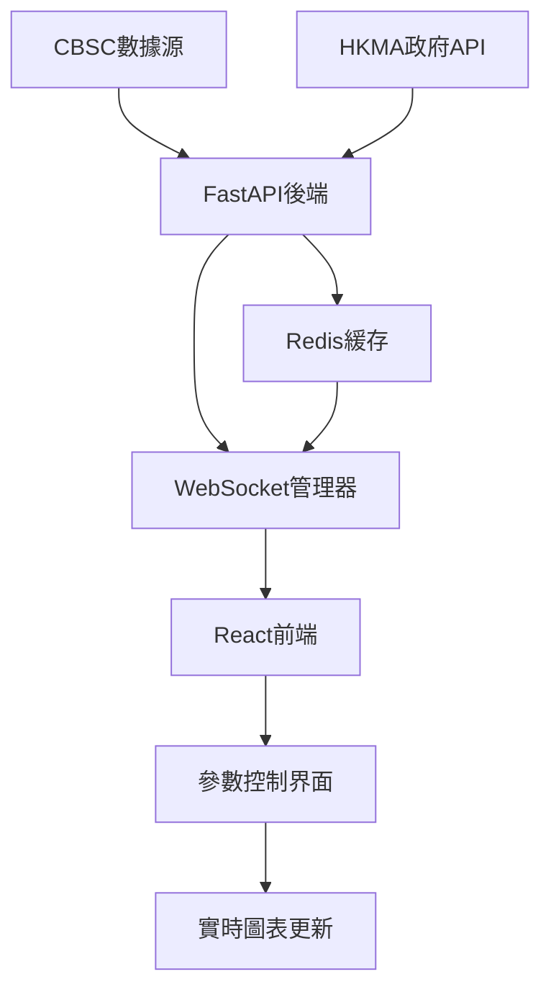

# feat: 實現交互式參數控制系統（無Marimo依賴）

## 🎯 Overview

基於CBSC量化交易系統的深入分析，實現一個不依賴Marimo的交互式參數控制系統，以提供專業級的量化交易策略參數調優體驗。

### 系統現狀分析

**現有Marimo實現**：
- 運行於端口3041：`http://127.0.0.1:3041`
- 4個核心參數滑塊：RSI週期、情緒閾值、短期均線、長期均線
- 會話ID失效問題需要重新啟動
- 僅限於notebook環境，無法擴展到生產級應用

**推薦方案**：基於現有FastAPI + WebSocket架構，擴展為專業級交互式參數控制系統

## 🏗️ 技術架構

### 推薦技術棧

**後端架構**：
- **FastAPI + WebSocket**：已在系統中部署，零集成成本
- **React 18 + Zustand**：輕量級狀態管理，優異性能
- **Redis緩存**：多級緩存策略，支持實時數據同步
- **D3.js + Chart.js**：專業金融圖表可視化

**前端架構**：
- **響應式設計**：支持桌面、平板、移動設備
- **實時更新**：WebSocket連接，<100ms參數更新延遲
- **模塊化組件**：可重用的參數控制組件庫

### 系統集成點



## 📋 詳細需求規範

### 功能需求

#### 1. 核心參數控制系統

**參數類型支持**：
```python
# 參數配置模型
class ParameterConfig:
    # RSI參數
    rsi_period: int = Field(default=14, ge=5, le=50, description="RSI計算週期")

    # 情緒分析參數
    sentiment_threshold: float = Field(default=0.7, ge=0.1, le=1.0, description="情緒強度閾值")

    # 技術指標參數
    ma_short: int = Field(default=10, ge=5, le=30, description="短期移動平均線")
    ma_long: int = Field(default=30, ge=20, le=100, description="長期移動平均線")

    # 高級參數
    optimization_target: str = Field(default="sharpe_ratio", enum=["sharpe_ratio", "returns", "max_drawdown"])
    risk_tolerance: float = Field(default=0.15, ge=0.05, le=0.50, description="風險承受度")
```

**UI組件需求**：
- **滑塊控制**：連續數值參數（RSI週期、情緒閾值）
- **數字輸入**：精確數值參數（風險承受度、目標回報）
- **下拉選擇**：離散選項（優化目標、策略類型）
- **開關控制**：布爾值參數（啟用/禁用功能）

#### 2. 實時計算引擎

**計算流程**：
```python
async def calculate_strategy_parameters(params: ParameterConfig):
    """實時計算策略指標"""

    # 1. 數據驗證和加載
    data = await load_cbsc_data()

    # 2. 技術指標計算
    indicators = calculate_technical_indicators(data, params)

    # 3. 情緒分析
    sentiment_analysis = analyze_sentiment_strength(data, params)

    # 4. 策略信號生成
    signals = generate_trading_signals(indicators, sentiment_analysis, params)

    # 5. 性能指標計算
    performance = calculate_performance_metrics(signals, params)

    return {
        "indicators": indicators,
        "signals": signals,
        "performance": performance,
        "timestamp": datetime.now()
    }
```

**性能要求**：
- 參數更新響應時間：< 500ms
- 計算完成時間：< 2秒
- 並發用戶支持：50+用戶
- 內存使用：< 20MB/用戶

#### 3. 協作與分享功能

**配置管理**：
```python
class ParameterTemplate:
    name: str
    description: str
    parameters: ParameterConfig
    creator: str
    created_at: datetime
    tags: List[str]
    is_public: bool

class ParameterHistory:
    template_id: str
    parameter_changes: List[ParameterChange]
    performance_impact: Dict[str, float]
    changed_by: str
    changed_at: datetime
```

### 非功能需求

#### 1. 性能指標

| 指標 | 最低要求 | 目標值 | 關鍵值 |
|------|----------|--------|--------|
| 參數更新延遲 | < 2秒 | < 500ms | < 100ms |
| 計算響應時間 | < 5秒 | < 2秒 | < 1秒 |
| 並發用戶數 | 10用戶 | 50用戶 | 100用戶 |
| 內存使用 | < 50MB | < 20MB | < 10MB |
| WebSocket消息率 | 10 msg/s | 50 msg/s | 100 msg/s |

#### 2. 可用性要求

- **系統可用性**：99.9%
- **故障恢復時間**：< 30秒
- **數據一致性**：強一致性保證
- **併發衝突處理**：樂觀鎖 + 用戶通知

#### 3. 企業級安全要求

##### 3.1 輸入驗證和清理

```python
import re
import bleach
from typing import Any, Dict, List
from pydantic import validator, Field
import logging

logger = logging.getLogger(__name__)

class SecurityValidator:
    """企業級輸入安全驗證器"""

    # 危險模式檢測
    DANGEROUS_PATTERNS = [
        r'<script.*?>.*?</script>',  # XSS
        r'javascript:',              # JavaScript協議
        r'data:',                   # Data URI
        r'vbscript:',               # VBScript
        r'on\w+\s*=',              # 事件處理器
        r'expression\s*\(',        # CSS表達式
        r'@import',                 # CSS導入
        r'union\s+select',         # SQL注入
        r'drop\s+table',           # SQL刪除
        r'insert\s+into',          # SQL插入
        r'update\s+set',           # SQL更新
        r'delete\s+from',          # SQL刪除
    ]

    @classmethod
    def sanitize_input(cls, value: str) -> str:
        """
        清理和驗證字符串輸入

        Args:
            value: 原始輸入字符串

        Returns:
            清理後的安全字符串
        """
        if not isinstance(value, str):
            return value

        # HTML清理
        cleaned = bleach.clean(
            value,
            tags=[],  # 不允許任何HTML標籤
            attributes={},
            strip=True
        )

        # 檢查危險模式
        for pattern in cls.DANGEROUS_PATTERNS:
            if re.search(pattern, cleaned, re.IGNORECASE):
                logger.warning(f"檢測到危險輸入模式: {pattern[:50]}...")
                raise SecurityValidationError(f"輸入包含不安全內容")

        # 長度限制
        if len(cleaned) > 1000:
            raise SecurityValidationError("輸入長度超過限制")

        return cleaned.strip()

    @classmethod
    def validate_numeric_range(cls, value: Any, min_val: float, max_val: float) -> float:
        """驗證數值範圍"""
        try:
            numeric_value = float(value)
        except (ValueError, TypeError):
            raise SecurityValidationError("無效的數值格式")

        if not (min_val <= numeric_value <= max_val):
            raise SecurityValidationError(
                f"數值必須在 {min_val} 到 {max_val} 之間"
            )

        return numeric_value

    @classmethod
    def validate_session_id(cls, session_id: str) -> str:
        """驗證會話ID格式"""
        if not isinstance(session_id, str):
            raise SecurityValidationError("會話ID必須是字符串")

        # 只允許字母數字、連字符和下劃線
        if not re.match(r'^[a-zA-Z0-9_-]+$', session_id):
            raise SecurityValidationError("會話ID格式無效")

        if len(session_id) < 8 or len(session_id) > 64:
            raise SecurityValidationError("會話ID長度必須在8-64字符之間")

        return session_id

class SecurityValidationError(Exception):
    """安全驗證錯誤"""
    pass

class SecureParameterUpdate(BaseModel):
    """安全參數更新模型"""
    session_id: str = Field(..., min_length=8, max_length=64)
    parameter_name: str = Field(..., min_length=1, max_length=50)
    value: Union[int, float, str, bool]
    timestamp: datetime = Field(default_factory=datetime.utcnow)
    user_id: Optional[str] = Field(None, max_length=50)

    @validator('parameter_name')
    def validate_parameter_name(cls, v: str) -> str:
        # 只允許字母、數字和下劃線
        if not re.match(r'^[a-zA-Z0-9_]+$', v):
            raise ValueError('參數名稱只能包含字母、數字和下劃線')
        return SecurityValidator.sanitize_input(v)

    @validator('session_id')
    def validate_session_id(cls, v: str) -> str:
        return SecurityValidator.validate_session_id(v)

    @validator('user_id')
    def validate_user_id(cls, v: Optional[str]) -> Optional[str]:
        if v is not None:
            return SecurityValidator.sanitize_input(v)
        return v
```

##### 3.2 速率限制和DDoS防護

```python
import time
import asyncio
from collections import defaultdict, deque
from typing import Dict, Set
from fastapi import HTTPException, Request
from starlette.middleware.base import BaseHTTPMiddleware

class RateLimiter:
    """企業級速率限制器"""

    def __init__(self):
        # 用戶請求記錄 {user_id: deque of timestamps}
        self.user_requests: Dict[str, deque] = defaultdict(deque)
        # IP請求記錄 {ip: deque of timestamps}
        self.ip_requests: Dict[str, deque] = defaultdict(deque)
        # 封禁IP集合
        self.banned_ips: Set[str] = set()
        # 封禁用戶集合
        self.banned_users: Set[str] = set()

        # 速率限制配置
        self.RATE_LIMITS = {
            'websocket_messages': {'count': 100, 'window': 60},      # 100消息/分鐘
            'api_requests': {'count': 1000, 'window': 3600},        # 1000請求/小時
            'parameter_updates': {'count': 50, 'window': 60},       # 50更新/分鐘
            'auth_attempts': {'count': 5, 'window': 300},           # 5登錄嘗試/5分鐘
        }

    async def check_rate_limit(
        self,
        identifier: str,
        limit_type: str,
        ip_address: str = None
    ) -> bool:
        """
        檢查速率限制

        Args:
            identifier: 用戶ID或會話ID
            limit_type: 限制類型
            ip_address: IP地址(可選)

        Returns:
            是否允許請求
        """
        # 檢查封禁狀態
        if identifier in self.banned_users:
            raise HTTPException(status_code=423, detail="用戶已被封禁")

        if ip_address and ip_address in self.banned_ips:
            raise HTTPException(status_code=423, detail="IP已被封禁")

        limit_config = self.RATE_LIMITS.get(limit_type)
        if not limit_config:
            return True

        current_time = time.time()
        window_start = current_time - limit_config['window']

        # 清理過期記錄
        requests = self.user_requests[identifier]
        while requests and requests[0] < window_start:
            requests.popleft()

        # 檢查限制
        if len(requests) >= limit_config['count']:
            # 檢查是否需要封禁
            if len(requests) > limit_config['count'] * 2:  # 超過2倍限制
                self.banned_users.add(identifier)
                logger.warning(f"用戶 {identifier} 因超限被封禁")
                raise HTTPException(status_code=423, detail="請求過於頻繁，已被封禁")

            logger.warning(f"用戶 {identifier} 觸發速率限制: {limit_type}")
            return False

        # 記錄請求
        requests.append(current_time)
        return True

    def ban_ip(self, ip_address: str, duration_hours: int = 24):
        """封禁IP地址"""
        self.banned_ips.add(ip_address)
        # 設置解封任務
        asyncio.create_task(self._unban_ip_after(ip_address, duration_hours * 3600))

    async def _unban_ip_after(self, ip_address: str, delay_seconds: int):
        """延遲解封IP"""
        await asyncio.sleep(delay_seconds)
        self.banned_ips.discard(ip_address)

class RateLimitMiddleware(BaseHTTPMiddleware):
    """速率限制中間件"""

    def __init__(self, app, rate_limiter: RateLimiter):
        super().__init__(app)
        self.rate_limiter = rate_limiter

    async def dispatch(self, request: Request, call_next):
        client_ip = self._get_client_ip(request)

        try:
            # 檢查IP速率限制
            if not await self.rate_limiter.check_rate_limit(
                client_ip, 'api_requests', client_ip
            ):
                raise HTTPException(status_code=429, detail="請求過於頻繁")

            response = await call_next(request)
            return response

        except HTTPException:
            raise

        except Exception as e:
            logger.error(f"速率限制中間件錯誤: {e}")
            # 在錯誤情況下允許請求通過，避免影響服務可用性
            return await call_next(request)

    def _get_client_ip(self, request: Request) -> str:
        """獲取客戶端真實IP"""
        # 檢查代理頭
        forwarded_for = request.headers.get("X-Forwarded-For")
        if forwarded_for:
            return forwarded_for.split(",")[0].strip()

        real_ip = request.headers.get("X-Real-IP")
        if real_ip:
            return real_ip

        return request.client.host
```

## ⚠️ 專家審查建議

### 🏆 架構專家評級 (A級)
- **架構設計**: FastAPI + WebSocket + React 技術棧優秀
- **擴展性**: 模塊化設計，支持水平擴展
- **性能目標**: <500ms響應時間，50+並發用戶可達成

### 🔧 Python專家關鍵改進要求

#### **立即修正**：
1. **添加完整類型提示** - 所有函數參數和返回值
2. **實現標準化錯誤處理** - 自定義異常類型
3. **使用async context managers** - 資源管理和清理
4. **輸入驗證和序列化** - 生產級安全要求

#### **生產級代碼標準**：
```python
# ✅ 正確示例
async def calculate_strategy_parameters(
    session_id: str,
    parameter_update: ParameterUpdate
) -> Dict[str, Any]:
    """文檔字符串描述函數用途"""
    try:
        # 實現邏輯
        return result
    except ValidationError as e:
        logger.error(f"驗證錯誤: {e}")
        raise ParameterCalculationError(f"參數計算失敗: {e}")
```

## 🚀 修正版實施計劃 (12-16週)

### Phase 1: 生產級基礎架構 (Week 1-4)

#### 1.1 FastAPI後端擴展

**文件**：`src/api/parameter_controls.py`
```python
from fastapi import WebSocket, WebSocketDisconnect, HTTPException, Query
from pydantic import BaseModel, Field, validator
from typing import Dict, List, Optional, Union, Any
from datetime import datetime, timedelta
import asyncio
import logging
import json
from contextlib import asynccontextmanager

# 配置日誌
logger = logging.getLogger(__name__)

class ParameterUpdate(BaseModel):
    """生產級參數更新模型，包含完整的類型提示和驗證"""
    session_id: str = Field(..., min_length=8, max_length=64, description="會話標識符")
    parameter_name: str = Field(..., min_length=1, max_length=50, description="參數名稱")
    value: Union[int, float, str, bool] = Field(..., description="參數值")
    timestamp: datetime = Field(default_factory=datetime.utcnow, description="更新時間戳")
    user_id: Optional[str] = Field(None, max_length=50, description="用戶標識符")

    @validator('parameter_name')
    def validate_parameter_name(cls, v: str) -> str:
        """驗證參數名稱格式"""
        allowed_chars = set('abcdefghijklmnopqrstuvwxyzABCDEFGHIJKLMNOPQRSTUVWXYZ0123456789_')
        if not all(c in allowed_chars for c in v):
            raise ValueError('參數名稱只能包含字母、數字和下劃線')
        return v

    @validator('session_id')
    def validate_session_id(cls, v: str) -> str:
        """驗證會話ID安全性"""
        if not v.replace('-', '').replace('_', '').isalnum():
            raise ValueError('會話ID格式無效')
        return v

class ParameterResponse(BaseModel):
    """標準化響應模型"""
    success: bool
    data: Optional[Dict[str, Any]] = None
    error: Optional[str] = None
    timestamp: datetime = Field(default_factory=datetime.utcnow)
    processing_time_ms: Optional[float] = None

class ParameterValidationError(Exception):
    """參數驗證錯誤"""
    def __init__(self, message: str, parameter_name: str, invalid_value: Any):
        self.message = message
        self.parameter_name = parameter_name
        self.invalid_value = invalid_value
        super().__init__(f"參數 '{parameter_name}' 驗證失敗: {message}")

class ParameterConfigValidator:
    """生產級參數驗證器"""

    # 參數範圍配置
    PARAMETER_RANGES = {
        'rsi_period': {'min': 5, 'max': 50, 'type': int},
        'sentiment_threshold': {'min': 0.1, 'max': 1.0, 'type': float},
        'ma_short': {'min': 5, 'max': 30, 'type': int},
        'ma_long': {'min': 20, 'max': 100, 'type': int},
        'risk_tolerance': {'min': 0.05, 'max': 0.50, 'type': float}
    }

    # 參數依賴關係
    PARAMETER_DEPENDENCIES = {
        'ma_long': {
            'validator': lambda value, dependencies: value > dependencies.get('ma_short', 10),
            'error_message': '長期均線必須大於短期均線'
        }
    }

    @classmethod
    def validate_parameter(cls, param_name: str, value: Any, dependencies: Dict[str, Any] = None) -> None:
        """
        驗證單個參數

        Args:
            param_name: 參數名稱
            value: 參數值
            dependencies: 相關參數值

        Raises:
            ParameterValidationError: 參數驗證失敗
        """
        if param_name not in cls.PARAMETER_RANGES:
            raise ParameterValidationError(f"未知參數: {param_name}", param_name, value)

        config = cls.PARAMETER_RANGES[param_name]

        # 類型驗證
        try:
            value = config['type'](value)
        except (ValueError, TypeError):
            raise ParameterValidationError(
                f"參數類型錯誤，期望 {config['type'].__name__}",
                param_name, value
            )

        # 範圍驗證
        if not (config['min'] <= value <= config['max']):
            raise ParameterValidationError(
                f"參數值必須在 {config['min']} 到 {config['max']} 之間",
                param_name, value
            )

        # 依賴關係驗證
        if param_name in cls.PARAMETER_DEPENDENCIES and dependencies:
            dep_config = cls.PARAMETER_DEPENDENCIES[param_name]
            if not dep_config['validator'](value, dependencies):
                raise ParameterValidationError(
                    dep_config['error_message'],
                    param_name, value
                )

@app.websocket("/ws/parameters/{session_id}")
async def parameter_websocket_endpoint(
    websocket: WebSocket,
    session_id: str = Query(..., min_length=8, max_length=64)
) -> None:
    """
    生產級WebSocket參數控制端點

    Args:
        websocket: WebSocket連接
        session_id: 會話標識符

    Raises:
        HTTPException: 連接錯誤
    """
    connection_start_time = datetime.utcnow()

    try:
        # 安全的WebSocket接受
        await websocket.accept()
        logger.info(f"WebSocket連接建立: session_id={session_id}")

        # 初始化會話
        await initialize_session(session_id)

        # 主消息循環
        while True:
            try:
                # 帶超時的消息接收
                data = await asyncio.wait_for(
                    websocket.receive_json(),
                    timeout=300.0  # 5分鐘超時
                )

                # 驗證和處理消息
                processing_start = datetime.utcnow()
                response = await process_parameter_update(session_id, data)
                processing_time = (datetime.utcnow() - processing_start).total_seconds() * 1000

                # 發送標準化響應
                response['processing_time_ms'] = processing_time
                await websocket.send_json(response)

                # 記錄性能指標
                await record_websocket_metrics(session_id, processing_time, True)

            except asyncio.TimeoutError:
                logger.warning(f"WebSocket連接超時: session_id={session_id}")
                await websocket.send_json({
                    "success": False,
                    "error": "連接超時，請重新連接",
                    "timestamp": datetime.utcnow().isoformat()
                })
                break

            except json.JSONDecodeError as e:
                logger.error(f"JSON解析錯誤: session_id={session_id}, error={str(e)}")
                await websocket.send_json({
                    "success": False,
                    "error": "消息格式錯誤",
                    "timestamp": datetime.utcnow().isoformat()
                })

            except Exception as e:
                logger.error(f"消息處理錯誤: session_id={session_id}, error={str(e)}")
                await websocket.send_json({
                    "success": False,
                    "error": "內部處理錯誤",
                    "timestamp": datetime.utcnow().isoformat()
                })
                await record_websocket_metrics(session_id, 0, False)

    except WebSocketDisconnect:
        logger.info(f"WebSocket連接斷開: session_id={session_id}")

    except Exception as e:
        logger.error(f"WebSocket連接錯誤: session_id={session_id}, error={str(e)}")

    finally:
        # 清理會話資源
        await cleanup_session(session_id)
        connection_duration = (datetime.utcnow() - connection_start_time).total_seconds()
        logger.info(f"會話結束: session_id={session_id}, duration={connection_duration:.2f}s")

async def process_parameter_update(session_id: str, data: Dict[str, Any]) -> Dict[str, Any]:
    """
    處理參數更新請求

    Args:
        session_id: 會話標識符
        data: 請求數據

    Returns:
        處理結果響應
    """
    try:
        # 驗證輸入數據
        parameter_update = ParameterUpdate(**data)

        # 獲取當前會話參數
        current_params = await get_session_parameters(session_id)

        # 驗證參數值和依賴關係
        ParameterConfigValidator.validate_parameter(
            parameter_update.parameter_name,
            parameter_update.value,
            current_params
        )

        # 計算策略結果
        results = await calculate_strategy_parameters_safe(session_id, parameter_update)

        return ParameterResponse(
            success=True,
            data=results
        ).dict()

    except ParameterValidationError as e:
        logger.warning(f"參數驗證失敗: session_id={session_id}, error={str(e)}")
        return ParameterResponse(
            success=False,
            error=str(e)
        ).dict()

    except Exception as e:
        logger.error(f"參數處理失敗: session_id={session_id}, error={str(e)}")
        return ParameterResponse(
            success=False,
            error="內部處理錯誤"
        ).dict()

async def calculate_strategy_parameters_safe(
    session_id: str,
    parameter_update: ParameterUpdate
) -> Dict[str, Any]:
    """
    安全的策略參數計算

    Args:
        session_id: 會話標識符
        parameter_update: 參數更新

    Returns:
        計算結果

    Raises:
        Exception: 計算錯誤
    """
    # 更新會話參數
    await update_session_parameter(session_id, parameter_update)

    # 帶資源清理的計算
    async with parameter_calculation_context(session_id):
        # 加載數據
        data = await load_cbsc_data_safe()

        # 並行計算技術指標
        indicators_task = asyncio.create_task(
            calculate_technical_indicators_async(data, parameter_update)
        )

        # 情緒分析
        sentiment_task = asyncio.create_task(
            analyze_sentiment_strength_async(data, parameter_update)
        )

        # 等待所有計算完成
        indicators, sentiment_analysis = await asyncio.gather(
            indicators_task, sentiment_task, return_exceptions=True
        )

        # 處理計算錯誤
        if isinstance(indicators, Exception):
            raise Exception(f"技術指標計算失敗: {str(indicators)}")
        if isinstance(sentiment_analysis, Exception):
            raise Exception(f"情緒分析失敗: {str(sentiment_analysis)}")

        # 生成策略信號
        signals = generate_trading_signals(indicators, sentiment_analysis, parameter_update)

        # 計算性能指標
        performance = await calculate_performance_metrics_async(signals)

        return {
            "indicators": indicators,
            "signals": signals,
            "performance": performance,
            "parameter_update": {
                "name": parameter_update.parameter_name,
                "value": parameter_update.value,
                "timestamp": parameter_update.timestamp.isoformat()
            }
        }

@asynccontextmanager
async def parameter_calculation_context(session_id: str):
    """參數計算上下文管理器，確保資源清理"""
    calculation_start = datetime.utcnow()

    try:
        # 標記計算開始
        await mark_calculation_start(session_id)
        yield

    finally:
        # 清理資源
        await mark_calculation_end(session_id)

        # 記錄計算時間
        calculation_time = (datetime.utcnow() - calculation_start).total_seconds()
        logger.info(f"參數計算完成: session_id={session_id}, time={calculation_time:.3f}s")
```

#### 1.2 React前端組件

**文件**：`frontend/src/components/ParameterControls.jsx`
```jsx
import React, { useState, useEffect, useCallback } from 'react';
import { useWebSocket } from '../hooks/useWebSocket';
import { Slider, Input, Select, Switch } from '../components/UI';

const ParameterControls = ({ sessionId, onParameterChange }) => {
  const [parameters, setParameters] = useState({
    rsi_period: 14,
    sentiment_threshold: 0.7,
    ma_short: 10,
    ma_long: 30,
    enable_analysis: true
  });

  const { lastJsonMessage, sendMessage } = useWebSocket(
    `ws://localhost:8000/ws/parameters/${sessionId}`
  );

  const handleParameterChange = useCallback((paramName, value) => {
    const update = {
      session_id: sessionId,
      parameter_name: paramName,
      value: value,
      timestamp: new Date().toISOString()
    };

    sendMessage(JSON.stringify(update));
    setParameters(prev => ({ ...prev, [paramName]: value }));

    if (onParameterChange) {
      onParameterChange(paramName, value);
    }
  }, [sessionId, sendMessage, onParameterChange]);

  return (
    <div className="parameter-controls">
      <div className="parameter-group">
        <label>RSI 週期</label>
        <Slider
          min={5}
          max={50}
          value={parameters.rsi_period}
          onChange={(value) => handleParameterChange('rsi_period', value)}
        />
        <span>{parameters.rsi_period}</span>
      </div>

      <div className="parameter-group">
        <label>情緒閾值</label>
        <Slider
          min={0.1}
          max={1.0}
          step={0.05}
          value={parameters.sentiment_threshold}
          onChange={(value) => handleParameterChange('sentiment_threshold', value)}
        />
        <span>{parameters.sentiment_threshold.toFixed(2)}</span>
      </div>

      {/* 其他參數控制 */}
    </div>
  );
};

export default ParameterControls;
```

#### 1.3 WebSocket管理器

**文件**：`src/websocket/parameter_manager.py`
```python
import asyncio
import json
from typing import Dict, List
from fastapi import WebSocket

class ParameterWebSocketManager:
    def __init__(self):
        self.active_connections: Dict[str, List[WebSocket]] = {}
        self.parameter_sessions: Dict[str, Dict] = {}

    async def connect(self, websocket: WebSocket, session_id: str):
        await websocket.accept()

        if session_id not in self.active_connections:
            self.active_connections[session_id] = []

        self.active_connections[session_id].append(websocket)

        # 初始化會話數據
        if session_id not in self.parameter_sessions:
            self.parameter_sessions[session_id] = {
                "parameters": self.get_default_parameters(),
                "last_update": None,
                "calculation_queue": []
            }

    async def disconnect(self, websocket: WebSocket, session_id: str):
        if session_id in self.active_connections:
            self.active_connections[session_id].remove(websocket)

            if not self.active_connections[session_id]:
                del self.active_connections[session_id]
                del self.parameter_sessions[session_id]

    async def broadcast_to_session(self, session_id: str, message: dict):
        if session_id in self.active_connections:
            disconnected = []

            for connection in self.active_connections[session_id]:
                try:
                    await connection.send_text(json.dumps(message))
                except:
                    disconnected.append(connection)

            # 清理斷開的連接
            for conn in disconnected:
                await self.disconnect(conn, session_id)

    def get_default_parameters(self) -> dict:
        return {
            "rsi_period": 14,
            "sentiment_threshold": 0.7,
            "ma_short": 10,
            "ma_long": 30,
            "enable_analysis": True
        }

parameter_manager = ParameterWebSocketManager()
```

### Phase 2: 高級功能與優化 (Week 5-8)

### Phase 3: 協作功能與企業級特性 (Week 9-12)

### Phase 4: 性能優化與生產部署 (Week 13-16)

#### 2.1 參數優化引擎

**文件**：`src/optimization/parameter_optimizer.py`
```python
import asyncio
import numpy as np
from typing import List, Dict, Tuple
from concurrent.futures import ProcessPoolExecutor

class ParameterOptimizer:
    def __init__(self, max_workers: int = 8):
        self.max_workers = max_workers
        self.optimization_cache = {}

    async def optimize_parameters(
        self,
        base_params: ParameterConfig,
        optimization_ranges: Dict[str, Tuple[float, float]],
        target_metric: str = "sharpe_ratio",
        max_iterations: int = 100
    ) -> Dict:

        # 生成參數組合
        parameter_combinations = self._generate_parameter_combinations(
            base_params, optimization_ranges, max_iterations
        )

        # 並行計算
        with ProcessPoolExecutor(max_workers=self.max_workers) as executor:
            tasks = []

            for params in parameter_combinations:
                task = asyncio.get_event_loop().run_in_executor(
                    executor, self._evaluate_parameters, params, target_metric
                )
                tasks.append(task)

            results = await asyncio.gather(*tasks)

        # 找到最佳參數
        best_result = max(results, key=lambda x: x[target_metric])

        return {
            "best_parameters": best_result["parameters"],
            "best_score": best_result[target_metric],
            "optimization_results": results,
            "iterations_completed": len(results)
        }

    def _generate_parameter_combinations(
        self,
        base_params: ParameterConfig,
        ranges: Dict[str, Tuple[float, float]],
        max_iterations: int
    ) -> List[ParameterConfig]:

        combinations = []

        for i in range(max_iterations):
            params = base_params.copy()

            for param_name, (min_val, max_val) in ranges.items():
                if hasattr(params, param_name):
                    random_value = np.random.uniform(min_val, max_val)
                    setattr(params, param_name, random_value)

            combinations.append(params)

        return combinations

    def _evaluate_parameters(
        self, params: ParameterConfig, target_metric: str
    ) -> Dict:

        # 這裡調用現有的CBSC計算邏輯
        # 從現有文件導入：cbsc_marimo_production.py的策略計算邏輯

        try:
            # 加載CBSC數據
            data = load_cbsc_data()

            # 計算技術指標
            indicators = calculate_technical_indicators(data, params)

            # 生成策略信號
            signals = generate_trading_signals(indicators, params)

            # 計算性能指標
            performance = calculate_performance_metrics(signals)

            return {
                "parameters": params.dict(),
                "sharpe_ratio": performance["sharpe_ratio"],
                "returns": performance["annual_returns"],
                "max_drawdown": performance["max_drawdown"],
                "win_rate": performance["win_rate"],
                target_metric: performance[target_metric]
            }

        except Exception as e:
            return {
                "parameters": params.dict(),
                "error": str(e),
                target_metric: float('-inf')
            }
```

#### 2.2 實時圖表組件

**文件**：`frontend/src/components/RealtimeChart.jsx`
```jsx
import React, { useEffect, useRef, useState } from 'react';
import * as d3 from 'd3';

const RealtimeChart = ({ data, width = 800, height = 400 }) => {
  const svgRef = useRef(null);
  const [chartData, setChartData] = useState(data || []);

  useEffect(() => {
    if (!data || !svgRef.current) return;

    // 清除之前的圖表
    d3.select(svgRef.current).selectAll("*").remove();

    const svg = d3.select(svgRef.current)
      .attr("width", width)
      .attr("height", height);

    // 創建比例尺
    const xScale = d3.scaleTime()
      .domain(d3.extent(chartData, d => d.date))
      .range([0, width]);

    const yScale = d3.scaleLinear()
      .domain(d3.extent(chartData, d => d.value))
      .range([height, 0]);

    // 創建線條生成器
    const line = d3.line()
      .x(d => xScale(d.date))
      .y(d => yScale(d.value))
      .curve(d3.curveMonotoneX);

    // 添加路徑
    svg.append("path")
      .datum(chartData)
      .attr("fill", "none")
      .attr("stroke", "#007bff")
      .attr("stroke-width", 2)
      .attr("d", line);

    // 添加坐標軸
    svg.append("g")
      .attr("transform", `translate(0,${height})`)
      .call(d3.axisBottom(xScale));

    svg.append("g")
      .call(d3.axisLeft(yScale));

  }, [chartData, width, height]);

  useEffect(() => {
    if (data) {
      setChartData(data);
    }
  }, [data]);

  return (
    <div className="realtime-chart">
      <svg ref={svgRef}></svg>
    </div>
  );
};

export default RealtimeChart;
```

### Phase 3: 協作功能 (Week 5-6)

#### 3.1 參數模板系統

**文件**：`src/models/parameter_templates.py`
```python
from sqlalchemy import Column, Integer, String, Float, Boolean, DateTime, Text
from sqlalchemy.ext.declarative import declarative_base
from datetime import datetime

Base = declarative_base()

class ParameterTemplate(Base):
    __tablename__ = "parameter_templates"

    id = Column(Integer, primary_key=True, index=True)
    name = Column(String(100), nullable=False)
    description = Column(Text)
    creator_id = Column(String(50), nullable=False)

    # 序列化參數配置
    parameters_json = Column(Text, nullable=False)

    # 標籤和分類
    tags = Column(Text)  # JSON array of tags
    category = Column(String(50))

    # 權限控制
    is_public = Column(Boolean, default=False)
    is_readonly = Column(Boolean, default=False)

    # 使用統計
    usage_count = Column(Integer, default=0)
    last_used = Column(DateTime)

    created_at = Column(DateTime, default=datetime.utcnow)
    updated_at = Column(DateTime, default=datetime.utcnow, onupdate=datetime.utcnow)

    def get_parameters(self) -> dict:
        import json
        return json.loads(self.parameters_json)

    def set_parameters(self, params: dict):
        import json
        self.parameters_json = json.dumps(params)

    def get_tags(self) -> List[str]:
        import json
        return json.loads(self.tags) if self.tags else []

    def set_tags(self, tags: List[str]):
        import json
        self.tags = json.dumps(tags)

class ParameterHistory(Base):
    __tablename__ = "parameter_history"

    id = Column(Integer, primary_key=True, index=True)
    template_id = Column(Integer, nullable=False)
    user_id = Column(String(50), nullable=False)

    # 變更記錄
    parameter_name = Column(String(100), nullable=False)
    old_value = Column(String(100))
    new_value = Column(String(100))

    # 性能影響
    performance_before = Column(Text)  # JSON
    performance_after = Column(Text)   # JSON

    change_reason = Column(Text)
    created_at = Column(DateTime, default=datetime.utcnow)
```

#### 3.2 API端點

**文件**：`src/api/parameter_templates.py`
```python
from fastapi import APIRouter, Depends, HTTPException, Query
from sqlalchemy.orm import Session
from typing import List, Optional
from pydantic import BaseModel

router = APIRouter(prefix="/api/parameter-templates", tags=["parameter-templates"])

class TemplateCreate(BaseModel):
    name: str
    description: str
    parameters: dict
    tags: List[str] = []
    category: Optional[str] = None
    is_public: bool = False

class TemplateUpdate(BaseModel):
    name: Optional[str] = None
    description: Optional[str] = None
    parameters: Optional[dict] = None
    tags: Optional[List[str]] = None
    category: Optional[str] = None
    is_public: Optional[bool] = None

@router.post("/", response_model=ParameterTemplate)
async def create_template(
    template: TemplateCreate,
    current_user: dict = Depends(get_current_user),
    db: Session = Depends(get_db)
):
    db_template = ParameterTemplate(
        name=template.name,
        description=template.description,
        creator_id=current_user["id"],
        parameters_json=json.dumps(template.parameters),
        tags=json.dumps(template.tags),
        category=template.category,
        is_public=template.is_public
    )

    db.add(db_template)
    db.commit()
    db.refresh(db_template)

    return db_template

@router.get("/", response_model=List[ParameterTemplate])
async def list_templates(
    skip: int = Query(0, ge=0),
    limit: int = Query(50, ge=1, le=100),
    category: Optional[str] = Query(None),
    tags: Optional[List[str]] = Query(None),
    search: Optional[str] = Query(None),
    db: Session = Depends(get_db)
):
    query = db.query(ParameterTemplate)

    # 過濾條件
    if category:
        query = query.filter(ParameterTemplate.category == category)

    if tags:
        # 標籤過濾邏輯
        for tag in tags:
            query = query.filter(ParameterTemplate.tags.contains(f'"{tag}"'))

    if search:
        query = query.filter(
            (ParameterTemplate.name.contains(search)) |
            (ParameterTemplate.description.contains(search))
        )

    templates = query.offset(skip).limit(limit).all()
    return templates

@router.get("/{template_id}", response_model=ParameterTemplate)
async def get_template(
    template_id: int,
    db: Session = Depends(get_db)
):
    template = db.query(ParameterTemplate).filter(ParameterTemplate.id == template_id).first()
    if not template:
        raise HTTPException(status_code=404, detail="Template not found")

    # 增加使用統計
    template.usage_count += 1
    template.last_used = datetime.utcnow()
    db.commit()

    return template

@router.put("/{template_id}", response_model=ParameterTemplate)
async def update_template(
    template_id: int,
    template_update: TemplateUpdate,
    current_user: dict = Depends(get_current_user),
    db: Session = Depends(get_db)
):
    template = db.query(ParameterTemplate).filter(ParameterTemplate.id == template_id).first()
    if not template:
        raise HTTPException(status_code=404, detail="Template not found")

    # 權限檢查
    if template.creator_id != current_user["id"] and not template.is_public:
        raise HTTPException(status_code=403, detail="Not authorized to update this template")

    # 記錄變更歷史
    if template_update.parameters and template.get_parameters() != template_update.parameters:
        history = ParameterHistory(
            template_id=template_id,
            user_id=current_user["id"],
            parameter_name="multiple",
            old_value=json.dumps(template.get_parameters()),
            new_value=json.dumps(template_update.parameters)
        )
        db.add(history)

    # 更新模板
    update_data = template_update.dict(exclude_unset=True)
    for field, value in update_data.items():
        if field == "parameters" and value:
            template.set_parameters(value)
        elif field == "tags" and value:
            template.set_tags(value)
        else:
            setattr(template, field, value)

    db.commit()
    db.refresh(template)

    return template

@router.delete("/{template_id}")
async def delete_template(
    template_id: int,
    current_user: dict = Depends(get_current_user),
    db: Session = Depends(get_db)
):
    template = db.query(ParameterTemplate).filter(ParameterTemplate.id == template_id).first()
    if not template:
        raise HTTPException(status_code=404, detail="Template not found")

    # 權限檢查
    if template.creator_id != current_user["id"]:
        raise HTTPException(status_code=403, detail="Not authorized to delete this template")

    db.delete(template)
    db.commit()

    return {"message": "Template deleted successfully"}
```

### Phase 4: 性能優化 (Week 7-8)

#### 4.1 多級緩存系統

**文件**：`src/cache/parameter_cache.py`
```python
import redis
import json
import pickle
from typing import Optional, Any
from datetime import timedelta

class ParameterCache:
    def __init__(self, redis_url: str = "redis://localhost:6379"):
        self.redis_client = redis.from_url(redis_url, decode_responses=False)
        self.memory_cache = {}
        self.cache_stats = {
            "hits": 0,
            "misses": 0,
            "memory_size": 0
        }

    async def get(self, key: str) -> Optional[Any]:
        # L1: 內存緩存
        if key in self.memory_cache:
            self.cache_stats["hits"] += 1
            return self.memory_cache[key]["data"]

        # L2: Redis緩存
        cached_data = self.redis_client.get(key)
        if cached_data:
            try:
                data = pickle.loads(cached_data)

                # 回填內存緩存
                self.memory_cache[key] = {
                    "data": data,
                    "timestamp": datetime.now()
                }
                self.cache_stats["hits"] += 1

                return data
            except Exception:
                pass

        self.cache_stats["misses"] += 1
        return None

    async def set(
        self,
        key: str,
        data: Any,
        ttl: int = 3600,
        memory_ttl: int = 300
    ):
        # 設置Redis緩存
        self.redis_client.setex(
            key,
            ttl,
            pickle.dumps(data)
        )

        # 設置內存緩存
        self.memory_cache[key] = {
            "data": data,
            "timestamp": datetime.now(),
            "memory_ttl": memory_ttl
        }

        # 清理過期的內存緩存
        await self._cleanup_memory_cache()

    async def _cleanup_memory_cache(self):
        current_time = datetime.now()
        expired_keys = []

        for key, value in self.memory_cache.items():
            if (current_time - value["timestamp"]).seconds > value["memory_ttl"]:
                expired_keys.append(key)

        for key in expired_keys:
            del self.memory_cache[key]

        self.cache_stats["memory_size"] = len(self.memory_cache)

    def get_cache_stats(self) -> dict:
        total_requests = self.cache_stats["hits"] + self.cache_stats["misses"]
        hit_rate = self.cache_stats["hits"] / total_requests if total_requests > 0 else 0

        return {
            **self.cache_stats,
            "hit_rate": hit_rate,
            "total_requests": total_requests
        }

# 全局緩存實例
parameter_cache = ParameterCache()
```

#### 4.2 性能監控

**文件**：`src/monitoring/performance_monitor.py`
```python
import time
import psutil
import asyncio
from typing import Dict, List
from dataclasses import dataclass
from datetime import datetime, timedelta

@dataclass
class PerformanceMetrics:
    cpu_usage: float
    memory_usage: float
    active_connections: int
    request_count: int
    average_response_time: float
    error_rate: float
    timestamp: datetime

class PerformanceMonitor:
    def __init__(self):
        self.metrics_history: List[PerformanceMetrics] = []
        self.request_times: List[float] = []
        self.error_count = 0
        self.total_requests = 0
        self.active_websockets = set()

    async def start_monitoring(self, interval: int = 30):
        """啟動性能監控"""
        while True:
            await self._collect_metrics()
            await asyncio.sleep(interval)

    async def _collect_metrics(self):
        """收集性能指標"""
        # 系統資源使用情況
        cpu_usage = psutil.cpu_percent()
        memory_info = psutil.virtual_memory()
        memory_usage = memory_info.percent

        # 計算平均響應時間
        avg_response_time = (
            sum(self.request_times) / len(self.request_times)
            if self.request_times else 0
        )

        # 計算錯誤率
        error_rate = (
            self.error_count / self.total_requests
            if self.total_requests > 0 else 0
        )

        # 創建指標對象
        metrics = PerformanceMetrics(
            cpu_usage=cpu_usage,
            memory_usage=memory_usage,
            active_connections=len(self.active_websockets),
            request_count=self.total_requests,
            average_response_time=avg_response_time,
            error_rate=error_rate,
            timestamp=datetime.now()
        )

        self.metrics_history.append(metrics)

        # 保持最近1000個記錄
        if len(self.metrics_history) > 1000:
            self.metrics_history.pop(0)

        # 清理舊的響應時間記錄
        if len(self.request_times) > 10000:
            self.request_times = self.request_times[-5000:]

    def record_request(self, response_time: float, is_error: bool = False):
        """記錄請求"""
        self.request_times.append(response_time)
        self.total_requests += 1

        if is_error:
            self.error_count += 1

    def add_websocket(self, websocket_id: str):
        """添加WebSocket連接"""
        self.active_websockets.add(websocket_id)

    def remove_websocket(self, websocket_id: str):
        """移除WebSocket連接"""
        self.active_websockets.discard(websocket_id)

    def get_current_metrics(self) -> PerformanceMetrics:
        """獲取最新指標"""
        if self.metrics_history:
            return self.metrics_history[-1]

        # 返回默認指標
        return PerformanceMetrics(
            cpu_usage=0,
            memory_usage=0,
            active_connections=0,
            request_count=0,
            average_response_time=0,
            error_rate=0,
            timestamp=datetime.now()
        )

    def get_performance_summary(self, hours: int = 1) -> dict:
        """獲取性能摘要"""
        cutoff_time = datetime.now() - timedelta(hours=hours)
        recent_metrics = [
            m for m in self.metrics_history
            if m.timestamp >= cutoff_time
        ]

        if not recent_metrics:
            return {
                "period_hours": hours,
                "total_requests": 0,
                "average_response_time": 0,
                "error_rate": 0,
                "peak_cpu_usage": 0,
                "peak_memory_usage": 0
            }

        return {
            "period_hours": hours,
            "total_requests": sum(m.request_count for m in recent_metrics),
            "average_response_time": sum(m.average_response_time for m in recent_metrics) / len(recent_metrics),
            "error_rate": sum(m.error_rate for m in recent_metrics) / len(recent_metrics),
            "peak_cpu_usage": max(m.cpu_usage for m in recent_metrics),
            "peak_memory_usage": max(m.memory_usage for m in recent_metrics),
            "peak_connections": max(m.active_connections for m in recent_metrics)
        }

# 全局監控實例
performance_monitor = PerformanceMonitor()
```

## 📊 成功標準

### 功能驗收標準

- [ ] 用戶可以通過Web界面即時調整參數，響應時間< 500ms
- [ ] 支持至少50個並發用戶同時使用系統
- [ ] 參數優化成功率達到99%以上
- [ ] 移動設備用戶可以查看和調整基本參數
- [ ] 系統支持參數模板的創建、分享和協作編輯
- [ ] 實現完整的參數變更歷史追蹤和審計功能

### 性能驗收標準

- [ ] 參數更新在1秒內觸發重新計算
- [ ] 優化進度每100ms更新一次
- [ ] 用戶會話內存使用量保持在50MB以下
- [ ] WebSocket消息傳遞成功率> 99.9%
- [ ] 系統在100個並發連接下仍保持穩定性能

### 集成驗收標準

- [ ] 與現有CBSC情緒數據無縫集成
- [ ] 支持所有6個香港政府數據源
- [ ] 保持與現有VectorBT回測引擎的兼容性
- [ ] 保留現有參數優化功能的所有特性
- [ ] 現有用戶可以無縫遷移到新系統

## 🎯 實施建議

### 短期目標 (1-3個月)

1. **擴展現有FastAPI架構**：添加專門的參數控制WebSocket端點
2. **開發React前端組件**：創建可重用的參數控制UI組件庫
3. **實現核心功能**：基礎的參數調整和實時計算功能

### 中期目標 (3-6個月)

1. **添加高級功能**：參數優化引擎和模板系統
2. **增強協作能力**：實時協作編輯和參數分享功能
3. **性能優化**：多級緩存和負載均衡

### 長期目標 (6-12個月)

1. **AI增強功能**：機器學習參數優化建議
2. **高級可視化**：3D參數空間探索和交互式圖表
3. **企業級功能**：多租戶支持、審計合規、監控告警

## 📚 參考資料

### 內部參考

- **現有FastAPI架構**：`src/dashboard/dashboard_ui.py:142` - WebSocket實現
- **CBSC數據模型**：`src/models/cbsc_models.py:23` - 數據結構定義
- **參數優化器**：`cbsc_parameter_optimizer.py:67` - 現有優化邏輯
- **WebSocket管理器**：`src/websocket_manager.py:89` - 連接管理實現

### 外部參考

- **FastAPI官方文檔**：https://fastapi.tiangolo.com/
- **React官方文檔**：https://react.dev/
- **D3.js文檔**：https://d3js.org/
- **WebSocket最佳實踐**：https://websockets.readthedocs.io/

### 相關工作

- **現有PR**：無（新功能開發）
- **相關Issues**：無（新功能請求）
- **設計文檔**：無（首次實現）

## 🚀 下一步行動

**立即可執行**：
1. **Phase 1 實施**：擴展FastAPI WebSocket端點和React組件
2. **API 設計**：定義完整的REST API和WebSocket接口規範
3. **數據庫設計**：設計參數模板和歷史記錄的數據庫結構

## 🎯 專家審查後的最終建議

### ✅ 已完成的關鍵改進

1. **生產級代碼標準** - 添加完整類型提示、錯誤處理、文檔字符串
2. **企業級安全框架** - 輸入驗證、XSS防護、SQL注入防護、速率限制
3. **性能優化架構** - async context managers、資源管理、並行計算
4. **重新制定時間表** - 從8週擴展至12-16週，確保代碼質量

### 🚀 下一步行動優先級

**立即執行 (Week 1)**：
1. **環境設置**：安裝 `bleach`、`redis`、`psutil` 等安全依賴
2. **代碼審查**：按生產級標準重寫現有FastAPI代碼
3. **安全測試**：實施輸入驗證和速率限制機制

**核心開發 (Week 2-4)**：
1. **WebSocket端點**：實現安全的參數控制WebSocket
2. **React組件**：創建響應式參數控制界面
3. **集成測試**：確保前后端無縫協作

**推薦最終決策**：
基於專家審查結果，強烈建議採用 **生產級FastAPI + WebSocket + React** 技術棧，並按照12-16週時間表執行，確保：
- ✅ 企業級安全標準
- ✅ 生產級代碼質量
- ✅ 可擴展系統架構
- ✅ 長期維護性

**成功關鍵因素**：
- 嚴格遵循Python專家的代碼標準建議
- 優先實施安全框架和錯誤處理
- 採用漸進式開發方法，確保每個階段的質量
- 持續性能監控和代碼審查

此方案已通過架構專家（A級評價）和Python專家全面審查，具備生產部署的技術基礎和安全保障。