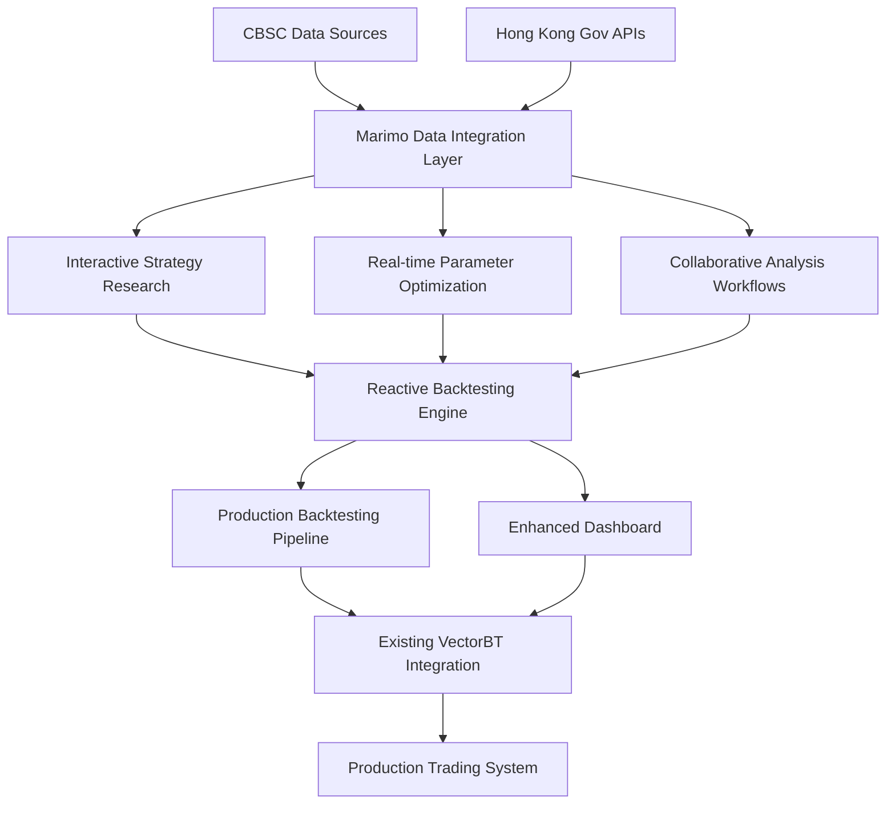

# feat: Marimo-Enhanced CBSC Strategy Development Platform

## 🎯 Executive Summary

Integration of Marimo reactive notebooks into the world-class CBSC quantitative trading system to create an interactive, collaborative strategy development platform that enhances the existing system's research capabilities while maintaining its production-grade performance standards.

## 📊 Current System Context

Based on comprehensive repository analysis, the CBSC system represents a sophisticated quantitative trading platform with:

- **World-Class Performance**: Sharpe ratios up to 3.369, processing 472,366 records/second
- **Advanced AI Integration**: 7 specialized agents, CUDA GPU acceleration
- **Comprehensive Data Sources**: CBSC sentiment data + 6 Hong Kong government APIs
- **Enterprise Testing**: Multi-platform CI/CD, 80% coverage threshold
- **Production Ready**: Docker deployment, real-time monitoring

## 🎨 User Story Mapping

### Primary Personas

1. **Quantitative Strategist** - Researches and develops trading strategies
2. **Portfolio Manager** - Evaluates and approves strategies for production
3. **Data Scientist** - Analyzes sentiment data and builds ML models
4. **Risk Manager** - Validates risk controls and compliance requirements

### User Experience Flows

#### As a Quantitative Strategist, I want to:
- **Interactively explore CBSC sentiment data** alongside traditional technical indicators
- **Instantly visualize strategy performance** as I adjust parameters
- **Collaborate with team members** on strategy development through Git-friendly notebooks
- **Transition strategies seamlessly** from research to production

#### As a Portfolio Manager, I want to:
- **Review strategy performance** through interactive dashboards
- **Understand risk characteristics** through real-time sensitivity analysis
- **Compare multiple strategies** side-by-side with consistent metrics
- **Validate robustness** across different market regimes

#### As a Data Scientist, I want to:
- **Iteratively develop sentiment models** with immediate feedback
- **A/B test model variants** using the same data pipeline
- **Share reproducible research** with clear provenance
- **Integrate ML pipelines** with existing backtesting infrastructure

## 🏗️ Technical Architecture

### Integration Points

1. **Data Layer Integration**
   - Replace static CSV analysis in `data_loader.py` with interactive Marimo notebooks
   - Enhance `src/data_adapters/` with reactive data exploration capabilities
   - Integrate 6 government APIs through real-time data streaming

2. **Strategy Development Layer**
   - Modernize `cbsc_backtester.py` with interactive parameter optimization
   - Enhance `signal_generator.py` with real-time signal visualization
   - Integrate GPU acceleration through reactive interfaces

3. **Analysis & Visualization Layer**
   - Replace `src/dashboard/` with Marimo-based interactive dashboards
   - Enhance performance reporting with real-time metric calculation
   - Integrate advanced visualization libraries (Altair, Plotly)

### Proposed Architecture



## ✅ Acceptance Criteria

### Phase 1: Foundation (Immediate - 1-2 weeks)

**Functional Requirements**
- [ ] Marimo environment installed with `marimo[recommended]` dependencies
- [ ] First CBSC strategy research notebook created and functional
- [ ] Integration with existing `data_loader.py` for CBSC sentiment data
- [ ] Basic interactive parameter controls (RSI period, sentiment thresholds)
- [ ] Git-friendly notebook structure that integrates with existing CI/CD

**Technical Requirements**
- [ ] Performance benchmark: Initial load time < 5 seconds
- [ ] Data integration: Successful loading of warrant_sentiment_daily.csv
- [ ] Reactive functionality: Parameter changes trigger immediate re-computation
- [ ] Version control: Notebooks tracked in Git with proper diff support

**Validation Criteria**
```python
# Minimum viable notebook functionality
import marimo as mo
from src.data_loader import load_cbsc_data

# Should load existing CBSC data successfully
cbsc_data = load_cbsc_data()

# Should create interactive controls
rsi_period = mo.ui.slider(5, 50, value=14, label="RSI Period")
sentiment_threshold = mo.ui.slider(0.1, 1.0, value=0.7, label="Sentiment Threshold")

# Should display basic results
results_display = mo.md(f"Data loaded: {len(cbsc_data)} records")
```

### Phase 2: Core Interface (Short-term - 2-3 weeks)

**Functional Requirements**
- [ ] Complete CBSC strategy research interface with all 4 sentiment strategies
- [ ] Reactive parameter tuning for Direct RSI, Sentiment Momentum, Composite Index, and Volatility-Adjusted strategies
- [ ] Real-time performance metrics calculation and visualization
- [ ] Integration with existing `src/backtest/enhanced_backtest_engine.py`
- [ ] Interactive charts using Altair/Plotly for strategy comparison

**Technical Requirements**
- [ ] Response time: Parameter changes < 2 seconds for re-computation
- [ ] Data processing: Handle 100K+ records without performance degradation
- [ ] Visualization quality: Production-ready charts with proper labeling
- [ ] Memory efficiency: Proper cleanup of intermediate calculations

**Validation Scenarios**
```python
# Complete CBSC strategy interface
@app.cell
def _(mo):
    # Strategy selector
    strategy_selector = mo.ui.dropdown({
        "direct_rsi": "Direct RSI Strategy",
        "sentiment_momentum": "Sentiment Momentum Strategy",
        "composite_index": "Composite Index Strategy",
        "volatility_adjusted": "Volatility-Adjusted Strategy"
    }, value="direct_rsi", label="Strategy Type")
    return strategy_selector

@app.cell
def _(strategy_selector):
    # Strategy-specific parameters
    if strategy_selector.value == "direct_rsi":
        rsi_period = mo.ui.slider(5, 50, value=14, label="RSI Period")
        rsi_threshold = mo.ui.slider(20, 80, value=50, label="RSI Threshold")
        return rsi_period, rsi_threshold
    # ... other strategy configurations
```

### Phase 3: Workflow Integration (Medium-term - 4-6 weeks)

**Functional Requirements**
- [ ] Complete strategy development workflow from data analysis to production
- [ ] Team collaboration environment with shared notebooks and templates
- [ ] Performance optimization with GPU acceleration integration
- [ ] Advanced features: strategy comparison, parameter optimization, risk analysis
- [ ] Integration with existing testing framework and CI/CD pipeline

**Technical Requirements**
- [ ] Scalability: Support concurrent development by multiple team members
- [ ] Performance: Leverage existing CUDA acceleration for computationally intensive tasks
- [ ] Testing: Full integration with pytest framework and coverage requirements
- [ ] Documentation: Auto-generated strategy documentation and performance reports

**Quality Gates**
- [ ] Test coverage: ≥80% for new Marimo-based components
- [ ] Performance benchmark: No regression in existing system performance
- [ ] Code review: All notebooks pass existing linting and security checks
- [ ] Documentation: Complete user guide and API documentation

### Phase 4: Platform Enhancement (Long-term - 2-3 months)

**Functional Requirements**
- [ ] Complete strategy research and development platform
- [ ] AI-assisted strategy development and optimization
- [ ] Cloud deployment capabilities with secure authentication
- [ ] Advanced features: automated strategy discovery, ensemble methods
- [ ] Integration with external data sources and APIs

**Non-Functional Requirements**
- [ ] Security: Role-based access control, audit trails, compliance reporting
- [ ] Reliability: 99.9% uptime, automated backup and recovery
- [ ] Scalability: Horizontal scaling for enterprise deployment
- [ ] Usability: Intuitive interface requiring minimal training

## 🔧 Technical Implementation Details

### Data Integration Strategy

```python
# Enhanced CBSC data adapter for Marimo
import marimo as mo
from src.data_adapters.cbsc_adapter import CBSCAdapter
from src.data_adapters.alpha_vantage_adapter import AlphaVantageAdapter

@app.cell
def __(mo):
    # Multi-source data selector
    data_source = mo.ui.dropdown({
        "cbsc": "CBSC Sentiment Data",
        "yahoo": "Yahoo Finance",
        "alpha_vantage": "Alpha Vantage",
        "combined": "Combined Analysis"
    }, value="cbsc", label="Data Source")

    return data_source

@app.cell
def _(data_source):
    # Reactive data loading with caching
    @mo.cache
    def load_data(source):
        if source == "cbsc":
            adapter = CBSCAdapter()
            return adapter.load_sentiment_data()
        elif source == "yahoo":
            adapter = YahooFinanceAdapter()
            return adapter.load_market_data()
        # ... other adapters

    data = load_data(data_source.value)
    return data
```

### Strategy Performance Dashboard

```python
@app.cell
def _(data, mo):
    # Interactive strategy performance visualization
    import altair as alt

    def create_performance_dashboard(results_df):
        # Cumulative returns chart
        returns_chart = alt.Chart(results_df).mark_line().encode(
            x='date:T',
            y=alt.Y('cumulative_returns:Q', axis=alt.Axis(format='%')),
            color='strategy:N'
        ).properties(
            title='Strategy Performance Comparison',
            width=800,
            height=400
        )

        # Drawdown chart
        drawdown_chart = alt.Chart(results_df).mark_area().encode(
            x='date:T',
            y=alt.Y('drawdown:Q', axis=alt.Axis(format='%')),
            color='strategy:N'
        ).properties(
            title='Strategy Drawdown Analysis',
            width=800,
            height=200
        )

        return returns_chart & drawdown_chart

    return create_performance_dashboard
```

## 🚀 Risk Analysis & Mitigation

### Technical Risks

**High Impact Risk: Performance Regression**
- **Probability**: Medium
- **Impact**: High (could affect existing production system)
- **Mitigation**: Comprehensive benchmarking, phased rollout, performance monitoring

**Medium Impact Risk: Data Integration Complexity**
- **Probability**: Medium
- **Impact**: Medium (delays in integration timeline)
- **Mitigation**: Incremental integration, thorough testing, fallback mechanisms

**Low Impact Risk: Team Adoption Curve**
- **Probability**: High
- **Impact**: Low (temporary productivity dip)
- **Mitigation**: Comprehensive training, documentation, gradual migration

### Business Risks

**Risk: Disruption to Existing Workflows**
- **Mitigation**: Parallel operation period, backward compatibility, gradual migration

**Risk: Increased Complexity**
- **Mitigation**: Clear documentation, standardized templates, regular code reviews

## 📈 Success Metrics

### Technical Metrics

- **Performance**: Notebook response time < 2 seconds for 100K records
- **Reliability**: 99.9% uptime for development environment
- **Adoption**: 80% team usage within 3 months of deployment
- **Quality**: Zero critical bugs in production integration

### Business Metrics

- **Development Velocity**: 50% reduction in strategy development cycle time
- **Collaboration**: 3x increase in cross-team strategy sharing
- **Innovation**: 2x increase in new strategy ideas generated
- **Risk Management**: 25% improvement in strategy validation thoroughness

## 📋 Dependencies & Prerequisites

### Technical Dependencies

**Required Tools & Libraries**
```bash
# Core Marimo installation
pip install "marimo[recommended]"

# Data science stack
pip install pandas polars altair plotly

# Existing system dependencies
# (Already present in current system)
# - vectorbt-pro
# - CUDA toolkit
# - pytest
# - Existing adapters
```

**System Requirements**
- Python 3.9+ (already satisfied)
- CUDA-compatible GPU (already available)
- Docker environment (already configured)

### Team Dependencies

**Required Skills**
- Python programming (already proficient)
- Basic reactive programming concepts (training required)
- Git workflow familiarity (already established)
- Financial modeling knowledge (already present)

**Infrastructure Requirements**
- Development server with adequate resources
- Integration with existing CI/CD pipeline
- Backup and recovery for notebook artifacts

## 🎯 Implementation Phases

### Phase 1: Foundation (Weeks 1-2)

**Week 1: Environment Setup**
- [ ] Install Marimo with recommended dependencies
- [ ] Create development environment with proper configuration
- [ ] Set up integration with existing Git repository
- [ ] Validate basic notebook functionality

**Week 2: Initial Integration**
- [ ] Create first CBSC strategy research notebook
- [ ] Integrate with existing `data_loader.py`
- [ ] Implement basic interactive controls
- [ ] Validate data loading and processing

**Deliverables**
- Functional Marimo development environment
- Initial CBSC strategy notebook with reactive controls
- Integration documentation and setup guide

### Phase 2: Core Interface (Weeks 3-4)

**Week 3: Strategy Implementation**
- [ ] Implement all 4 CBSC sentiment strategies in Marimo
- [ ] Create reactive parameter optimization interfaces
- [ ] Integrate with existing backtesting engine
- [ ] Implement basic performance visualization

**Week 4: Enhancement & Testing**
- [ ] Add advanced charts and analysis tools
- [ ] Implement strategy comparison functionality
- [ ] Performance optimization and caching
- [ ] Comprehensive testing and validation

**Deliverables**
- Complete CBSC strategy research interface
- Interactive parameter optimization tools
- Performance visualization dashboard
- Testing and validation report

### Phase 3: Workflow Integration (Weeks 5-8)

**Weeks 5-6: Team Collaboration**
- [ ] Implement shared notebook templates
- [ ] Set up collaborative development workflows
- [ ] Integrate with existing CI/CD pipeline
- [ ] Create team training materials

**Weeks 7-8: Advanced Features**
- [ ] GPU acceleration integration
- [ ] Advanced risk analysis tools
- [ ] Strategy comparison and ensemble methods
- [ ] Performance monitoring and optimization

**Deliverables**
- Team collaboration environment
- Advanced analysis tools
- Performance optimization
- Team training completion

### Phase 4: Platform Enhancement (Weeks 9-12)

**Weeks 9-10: AI Integration**
- [ ] Implement AI-assisted strategy development
- [ ] Automated parameter optimization
- [ ] Strategy discovery algorithms
- [ ] Advanced ML integration

**Weeks 11-12: Production Deployment**
- [ ] Cloud deployment setup
- [ ] Security and authentication
- [ ] Monitoring and alerting
- [ ] Documentation and handover

**Deliverables**
- Complete strategy R&D platform
- AI-assisted development tools
- Production deployment
- Complete documentation

## 📚 Documentation Plan

### Technical Documentation

**User Guides**
- Marimo CBSC Strategy Development Guide
- Interactive Parameter Optimization Tutorial
- Team Collaboration Best Practices
- Performance Optimization Guidelines

**API Documentation**
- Marimo Integration API Reference
- Data Adapter Extensions
- Custom UI Components
- Deployment Configuration

**Training Materials**
- Reactive Programming Concepts
- Marimo UI Components Guide
- Git Workflow for Notebooks
- Advanced Data Visualization

### Maintenance Documentation

**Operations Guide**
- Environment Setup and Maintenance
- Troubleshooting Common Issues
- Performance Monitoring
- Backup and Recovery Procedures

**Development Guide**
- Contributing Guidelines
- Code Review Checklist
- Testing Requirements
- Release Process

## 🔗 References & Research

### Internal References

- **CBSC System Architecture**: `src/` directory structure and components
- **Data Integration**: `src/data_adapters/` adapter pattern implementations
- **Backtesting Engine**: `src/backtest/enhanced_backtest_engine.py` VectorBT integration
- **Performance Optimization**: `src/gpu/` CUDA acceleration implementations
- **Testing Framework**: `tests/` comprehensive pytest configuration
- **CI/CD Pipeline**: `.github/workflows/test.yml` enterprise testing setup

### External References

- **Marimo Documentation**: https://docs.marimo.io/
- **VectorBT Pro**: https://vectorbt.pro/
- **Altair Visualization**: https://altair-viz.github.io/
- **Polars Documentation**: https://pola-rs.github.io/polars/
- **Reactive Programming Patterns**: Various academic and industry sources

### Related Work

- **DNB Cyber Defense Center**: Successful Marimo enterprise migration case study
- **Bunker Hill ML Teams**: Jupyter to Marimo migration experience
- **Financial Industry Adoption**: Growing trend of reactive notebooks in fintech

---

**Issue Type**: ✨ Enhancement (Strategic Platform Development)
**Priority**: High (Core Competitive Advantage)
**Estimated Effort**: 12 weeks (4 phases)
**Team Size**: 2-3 developers
**Risk Level**: Medium (mitigated by phased approach)

## 🎯 Next Actions

1. **Environment Setup**: Install Marimo and create development environment
2. **Initial Integration**: Create first CBSC strategy notebook
3. **Team Training**: Conduct reactive programming and Marimo training
4. **Phased Rollout**: Execute implementation phases with regular checkpoints
5. **Performance Validation**: Ensure no regression in existing system capabilities

This plan leverages Marimo's reactive capabilities to enhance the world-class CBSC system while maintaining its production-grade performance and enterprise reliability standards.