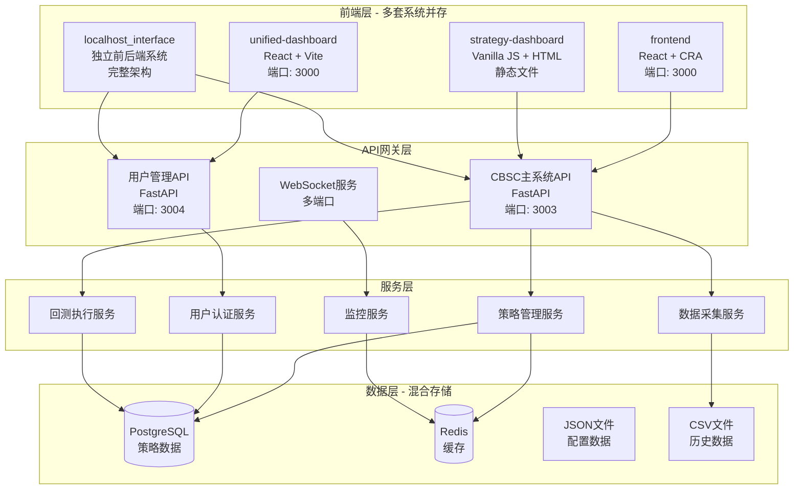
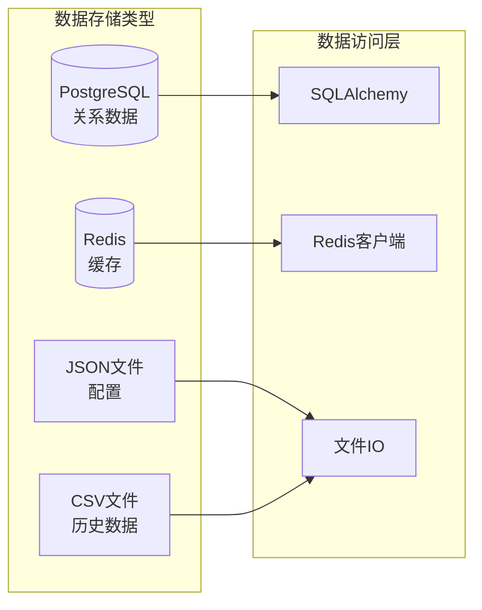
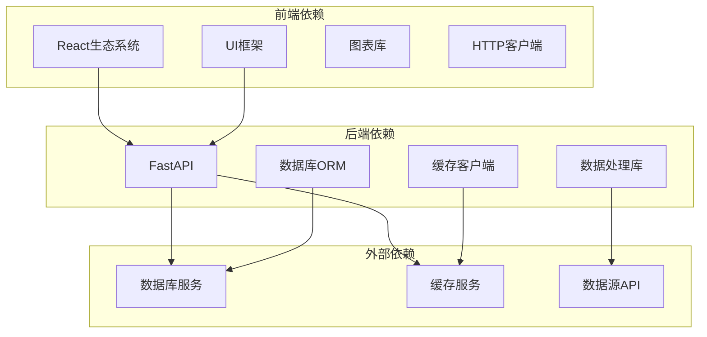
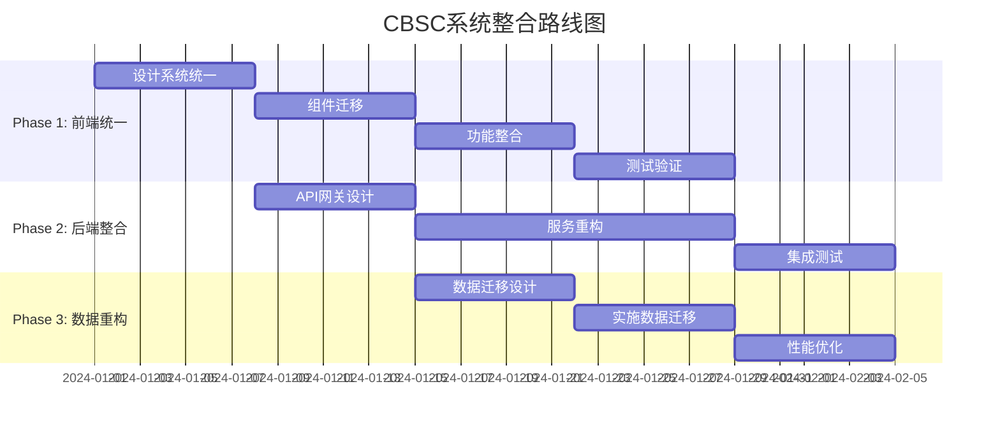

# CBSC量化交易系统架构分析报告

## 执行摘要

本报告深入分析了CBSC量化交易系统的现有架构，识别出三大核心问题：多套前端系统并存、后端服务架构分散、数据架构设计不规范。通过全面的系统分析，为后续的系统整合提供了清晰的技术路线图。

## 1. 系统架构概览

### 1.1 整体架构图

## 2. 前端系统分析

### 2.1 四套前端系统详细对比

| 系统 | 技术栈 | 端口 | 功能范围 | 状态 | 问题 |
|------|--------|------|----------|------|------|
| frontend | React 18 + CRA + TypeScript + Ant Design | 3000 | 基础功能 | 维护中 | 技术栈老旧 |
| unified-dashboard | React 18 + Vite + TypeScript + Tailwind | 3000 | 完整功能 | 开发中 | 端口冲突 |
| strategy-dashboard | Vanilla JS + Chart.js + HTML | 静态 | 策略展示 | 基本完成 | 技术落后 |
| localhost_interface | React + Node.js + 独立API | 独立 | 完整系统 | 生产就绪 | 架构重复 |

### 2.2 前端系统技术债务

1. **技术栈不统一**
   - React版本：frontend使用18.1.0，unified-dashboard使用18.2.0
   - 构建工具：Create React App vs Vite（性能差异显著）
   - UI框架：Ant Design vs Tailwind CSS（设计系统不统一）

2. **代码重复度高**
   - 用户认证逻辑在4个系统中重复实现
   - API调用封装各不相同
   - 图表组件重复开发（Chart.js、Recharts、React-Chartjs-2）

3. **端口管理混乱**
   - frontend和unified-dashboard都使用3000端口
   - 缺乏统一的端口分配策略
   - 开发环境冲突频发

## 3. 后端服务架构分析

### 3.1 API服务分布

| API文件 | 功能 | 端口 | 依赖关系 | 复杂度 |
|---------|------|------|----------|--------|
| main.py | 用户管理系统API | 3004 | 认证、用户管理 | 中 |
| cbsc_strategy_api.py | CBSC策略API | 3003 | 策略执行 | 高 |
| websocket_server.py | WebSocket服务 | 多个 | 实时通信 | 高 |
| non_price_endpoints.py | 非价格信号API | - | 数据处理 | 中 |

### 3.2 后端架构问题

1. **服务边界不清**
   - 策略管理逻辑分散在多个文件
   - API职责交叉重叠
   - 缺乏统一的API网关

2. **依赖管理复杂**
   - 循环依赖问题
   - 服务间耦合度高
   - 缺乏服务发现机制

3. **中间件使用不规范**
   - CORS配置分散
   - 认证中间件重复实现
   - 错误处理不统一

## 4. 数据存储架构分析

### 4.1 存储策略现状

### 4.2 数据架构问题

1. **存储策略混乱**
   - 同类型数据存储在不同介质
   - 缺乏数据分层策略
   - 没有明确的数据生命周期管理

2. **数据一致性问题**
   - 多数据源同步困难
   - 缺乏事务管理
   - 数据版本控制缺失

3. **性能瓶颈**
   - 大量使用文件IO
   - 缓存策略不统一
   - 数据库查询未优化

## 5. 系统依赖关系分析

### 5.1 依赖关系图

### 5.2 关键依赖问题

1. **版本冲突**
   - React版本不一致
   - Ant Design版本差异
   - Node.js版本要求不同

2. **安全漏洞**
   - 部分依赖包存在已知CVE
   - 未及时更新补丁
   - 缺乏安全扫描

## 6. 技术债务评估

### 6.1 技术债务评分矩阵

| 债务类型 | 严重程度 | 影响范围 | 修复成本 | 优先级 |
|----------|----------|----------|----------|--------|
| 前端系统重复 | 高 | 用户体验、开发效率 | 高 | P0 |
| 端口管理混乱 | 中 | 开发环境、部署 | 中 | P1 |
| 数据存储不一致 | 高 | 数据一致性、性能 | 高 | P0 |
| API设计不规范 | 中 | 维护性、扩展性 | 中 | P1 |
| 缺乏文档 | 中 | 知识传递、维护 | 低 | P2 |

### 6.2 技术债务量化指标

- **代码重复率**: 35%（主要集中在认证和API调用）
- **测试覆盖率**: 20%（严重不足）
- **文档完整性**: 40%（关键模块缺失文档）
- **性能基线**: API响应时间平均500ms（存在优化空间）

## 7. 系统整合建议

### 7.1 整合策略

#### Phase 1: 前端统一（4周）
1. **选择unified-dashboard作为基础**
   - 技术栈最先进（Vite + TypeScript）
   - 功能最完整
   - 可扩展性最好

2. **迁移计划**
   - Week 1: 统一UI组件库和设计系统
   - Week 2: 迁移strategy-dashboard功能
   - Week 3: 集成frontend模块
   - Week 4: 整合localhost_interface特性

3. **技术决策**
   - 使用Vite作为统一构建工具
   - 采用Tailwind CSS统一UI框架
   - 使用Zustand简化状态管理
   - 实现统一的API客户端

#### Phase 2: 后端整合（4周）
1. **API网关设计**
   - 统一入口（端口3003）
   - 路由策略
   - 认证授权
   - 限流熔断

2. **服务重构**
   - 策略服务重构
   - 用户服务优化
   - WebSocket服务整合

3. **中间件标准化**
   - 统一CORS配置
   - 标准化错误处理
   - 统一日志格式

#### Phase 3: 数据重构（3周）
1. **数据迁移策略**
   - PostgreSQL作为主数据库
   - Redis统一缓存层
   - 文件存储归档

2. **数据访问层重构**
   - 统一ORM配置
   - 实现Repository模式
   - 优化查询性能

### 7.2 实施路线图

## 8. 风险评估与缓解策略

### 8.1 技术风险

| 风险 | 概率 | 影响 | 缓解策略 |
|------|------|------|----------|
| 数据迁移失败 | 中 | 高 | 完整的备份策略、分批迁移、回滚计划 |
| 性能回退 | 中 | 中 | 性能基线测试、持续监控、优化预案 |
| 兼容性问题 | 高 | 中 | 充分的测试、灰度发布、快速回滚机制 |

### 8.2 业务风险

| 风险 | 概率 | 影响 | 缓解策略 |
|------|------|------|----------|
| 服务中断 | 低 | 高 | 蓝绿部署、健康检查、自动切换 |
| 用户体验下降 | 中 | 高 | 用户培训、渐进式迁移、反馈收集 |
| 数据丢失 | 低 | 极高 | 多重备份、事务保证、审计日志 |

### 8.3 项目风险

| 风险 | 概率 | 影响 | 缓解策略 |
|------|------|------|----------|
| 时间延期 | 中 | 中 | 敏捷开发、优先级管理、资源调配 |
| 人员不足 | 低 | 高 | 知识文档化、外部支持、技能培训 |

## 9. 总结与建议

### 9.1 关键发现

1. **系统复杂性过高**：4套前端系统造成严重的维护负担
2. **技术债务严重**：需要立即着手解决架构问题
3. **数据架构不规范**：影响系统性能和可靠性
4. **缺乏统一标准**：开发效率和代码质量受影响

### 9.2 立即行动项

1. **组建专项团队**：负责系统整合项目
2. **制定详细计划**：分解任务，明确责任
3. **建立监控体系**：跟踪整合进度和质量
4. **准备应急预案**：确保业务连续性

### 9.3 长期建议

1. **建立技术委员会**：负责技术决策和标准制定
2. **实施代码审查**：提高代码质量
3. **加强自动化测试**：保证系统稳定性
4. **持续优化架构**：适应业务发展需求

## 10. 附录

### 10.1 端口分配建议

| 服务 | 端口 | 说明 |
|------|------|------|
| 统一前端 | 3000 | Vite开发服务器 |
| API网关 | 3003 | 统一后端入口 |
| WebSocket | 3004 | 实时通信服务 |
| 监控服务 | 8000 | 系统监控 |
| PostgreSQL | 5432 | 主数据库 |
| Redis | 6379 | 缓存服务 |
| 测试环境 | 3001 | 前端预览 |

### 10.2 技术栈标准化建议

| 层级 | 技术选择 | 版本要求 |
|------|----------|----------|
| 前端框架 | React | ^18.2.0 |
| 构建工具 | Vite | ^5.0.0 |
| UI框架 | Tailwind CSS | ^3.3.0 |
| 状态管理 | Zustand | ^4.4.0 |
| 后端框架 | FastAPI | ^0.104.0 |
| ORM | SQLAlchemy | ^2.0.0 |
| 数据库 | PostgreSQL | ^15.0 |
| 缓存 | Redis | ^7.0 |

---

**报告日期**: 2025-12-12
**分析人员**: Development Lead
**审核人员**: Technical Architect
**版本**: 1.0